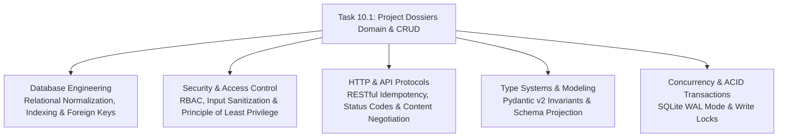

# Stage 3 CS Domain Learning: Task 10.1 — Project Dossiers Domain Model, Relational Schema & CRUD APIs

## Section 1: Domain Discovery Map

---

## Section 2: Core Computer Science Concepts

### 1. Database Engineering: 3rd Normal Form & Cascade Referential Integrity
- **Concept**: Many-to-Many junction tables (`dossier_items`) separating containers (`dossiers`) from entities (`file_records`).
- **Mathematical Invariant**: 
  Let $D$ be the set of dossiers and $F$ be the set of files. The junction $J \subseteq D \times F$ forms a bipartite graph.
  - Deleting $d \in D \implies \{(d, f) \in J\} \rightarrow \emptyset$ (`ON DELETE CASCADE`).
  - However, $f \in F$ is preserved! A Google Doc does not disappear when removed from a project dossier.
- **Physical Analogy**: Unclipping a paper from a ring binder. The paper remains intact, but it is no longer bound inside the binder.
- **Code Reference**: `app/indexer/storage.py` table definitions for `dossier_items` and `dossier_members`.

### 2. Concurrency & ACID Durability in SQLite WAL Mode
- **Concept**: SQLite Write-Ahead Logging (WAL) decouples concurrent readers from writers.
- **Mechanism**: Readers read from the database file and WAL log without acquiring table locks, while writers append changes to the WAL. Transactions (`BEGIN IMMEDIATE` / `with conn:`) guarantee atomicity when creating a dossier and its default admin member simultaneously.
- **Failure Mode without WAL**: If a background sync crawls files while a user creates a dossier, readers would encounter `sqlite3.OperationalError: database is locked`. WAL mode eliminates read-write lock contention.
- **Code Reference**: `app/indexer/storage.py` `conn.execute("PRAGMA journal_mode=WAL;")`.

### 3. Security & Access Control: Role-Based Access Control (RBAC)
- **Concept**: Assigning permission levels (`admin`, `editor`, `viewer`) to user principals for a bounded container.
  - **Admin**: Can modify metadata, add/remove members, and delete the dossier.
  - **Editor**: Can add or remove documents/sheets (`dossier_items`).
  - **Viewer**: Read-only access to dossier contents and scoped search.
- **Physical Analogy**: A corporate project room with electronic keycards. The manager has full administrative access, team contributors can bring files into the room, and auditors have viewing badges only.
- **Code Reference**: `app/indexer/models.py` `DossierRole` enum and `dossier_members` table.

### 4. RESTful API Architecture & Idempotency
- **Concept**: Selecting proper HTTP verbs and response semantics:
  - `POST /api/dossiers`: Creates resource $\rightarrow$ `201 Created` with `Location` / response entity.
  - `GET /api/dossiers`: Idempotent read $\rightarrow$ `200 OK`.
  - `PATCH /api/dossiers/{id}`: Partial update $\rightarrow$ `200 OK`.
  - `DELETE /api/dossiers/{id}`: Idempotent removal $\rightarrow$ `204 No Content`.
  - `POST /api/dossiers/{id}/items`: Adding files is idempotent via `INSERT OR IGNORE` $\rightarrow$ `200 OK`.
- **Code Reference**: `app/api/routes/dossiers.py`.
