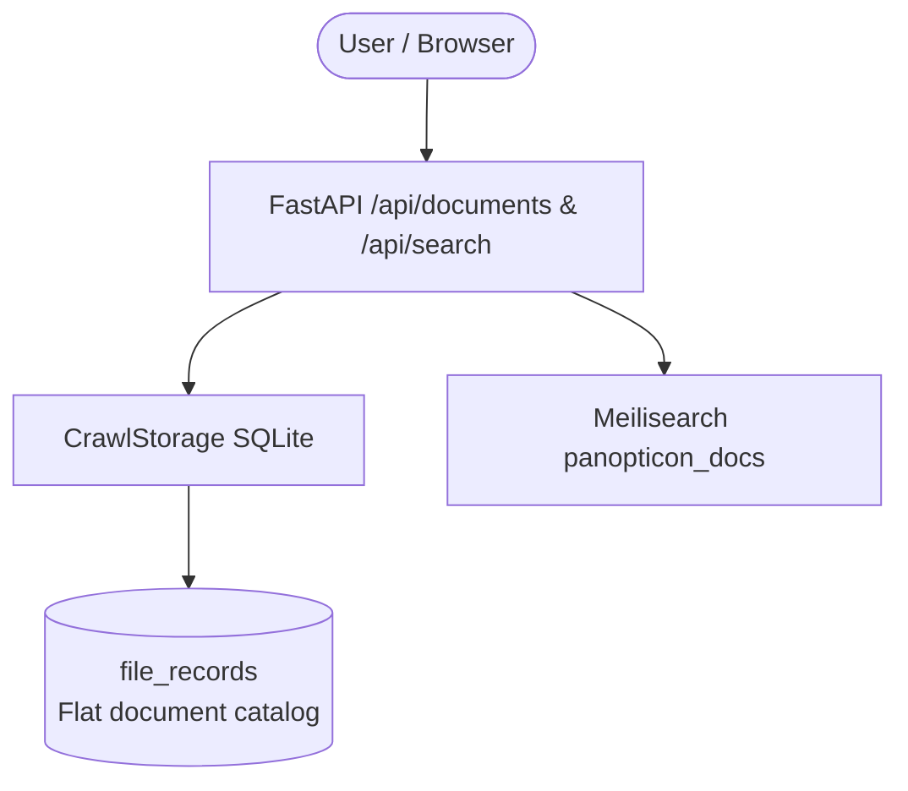
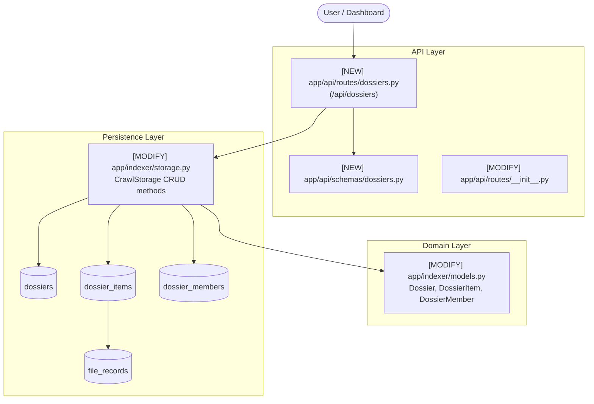
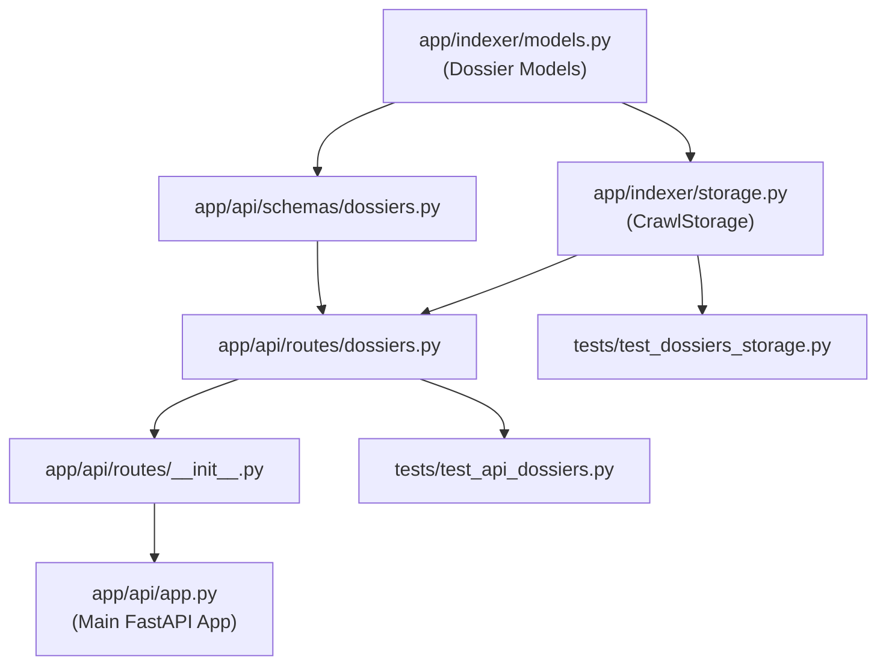

# Stage 2 Codebase Design: Task 10.1 — Project Dossiers Domain Model, Relational Schema & CRUD APIs

## Section 1: Current State Snapshot

Currently, Panopticon manages documents in a flat relational and indexed namespace:
- `file_records` in SQLite stores all crawled Google Docs and Sheets.
- `document_versions` and `document_diffs` track temporal changes for individual files.
- `document_chunks` holds semantic paragraphs for hybrid vector search.
- The `/api/documents` endpoint serves a flat directory filtered only by global attributes (file type, owner, sharing status, tags).

### Existing Architecture Diagram (Before)



---

## Section 2: Proposed State

We introduce the **Project Dossier** subsystem:
- Relational tables `dossiers`, `dossier_items`, and `dossier_members` in SQLite (`data/crawl_state.db`).
- Pydantic domain models in `app/indexer/models.py`.
- Encapsulated repository methods on `CrawlStorage` (`app/indexer/storage.py`).
- Public REST schemas in `app/api/schemas/dossiers.py`.
- REST route handlers in `app/api/routes/dossiers.py` mounted on `api_router`.

### Target Architecture Diagram (After)



---

## Section 3: File-Level Impact Analysis

#### 1. `[MODIFY] app/indexer/models.py`
- **What changes:** Add domain models:
  - `DossierRole = Literal["admin", "editor", "viewer"]`
  - `DossierStatus = Literal["active", "archived"]`
  - `Dossier(BaseModel)`
  - `DossierItem(BaseModel)`
  - `DossierMember(BaseModel)`
  - `DossierSummary(BaseModel)`
- **Why:** Provide strongly typed, validated domain models with Pydantic v2.
- **Upstream dependencies:** `pydantic`, `datetime`, `re`.
- **Downstream dependents:** `app/indexer/storage.py`, `app/api/schemas/dossiers.py`.

#### 2. `[MODIFY] app/indexer/storage.py`
- **What changes:**
  - In `init_db()`: Add `CREATE TABLE IF NOT EXISTS dossiers`, `dossier_items`, `dossier_members`, and index definitions.
  - Add repository methods:
    - `create_dossier(...) -> Dossier`
    - `get_dossier(dossier_id: str) -> Dossier | None`
    - `get_dossier_by_slug(slug: str) -> Dossier | None`
    - `list_dossiers(status: str | None, sort_by: str, limit: int, offset: int) -> tuple[list[DossierSummary], int]`
    - `update_dossier(dossier_id: str, ...) -> Dossier | None`
    - `delete_dossier(dossier_id: str) -> bool`
    - `add_dossier_items(dossier_id: str, file_ids: list[str], added_by: str | None) -> int`
    - `remove_dossier_item(dossier_id: str, file_id: str) -> bool`
    - `list_dossier_items(dossier_id: str, limit: int, offset: int) -> tuple[list[DriveFileMetadata], int]`
    - `add_dossier_member(dossier_id: str, user_email: str, role: str) -> DossierMember`
    - `remove_dossier_member(dossier_id: str, user_email: str) -> bool`
    - `list_dossier_members(dossier_id: str) -> list[DossierMember]`
- **Why:** Full ACID relational persistence and query layer for dossiers.
- **Upstream dependencies:** `sqlite3`, `app/indexer/models.py`.
- **Downstream dependents:** `app/api/routes/dossiers.py`, `tests/test_dossiers_storage.py`.

#### 3. `[NEW] app/api/schemas/dossiers.py`
- **Purpose:** Request/response DTOs for the `/api/dossiers` REST API.
- **Exports:**
  - `DossierCreateRequest`
  - `DossierUpdateRequest`
  - `DossierAddItemsRequest`
  - `DossierAddMemberRequest`
  - `DossierResponse`
  - `DossierSummaryResponse`
  - `DossierListResponse`
  - `DossierDetailResponse`
  - `DossierItemsModifiedResponse`
- **Consumers:** `app/api/routes/dossiers.py`.

#### 4. `[NEW] app/api/routes/dossiers.py`
- **Purpose:** FastAPI router exposing endpoints for Dossier lifecycle.
- **Endpoints:**
  - `POST /api/dossiers` (201 Created)
  - `GET /api/dossiers` (200 OK)
  - `GET /api/dossiers/{id}` (200 OK)
  - `PATCH /api/dossiers/{id}` (200 OK)
  - `DELETE /api/dossiers/{id}` (204 No Content)
  - `POST /api/dossiers/{id}/items` (200 OK)
  - `DELETE /api/dossiers/{id}/items/{file_id}` (200 OK)
  - `GET /api/dossiers/{id}/items` (200 OK)
  - `POST /api/dossiers/{id}/members` (200 OK)
  - `DELETE /api/dossiers/{id}/members/{email}` (200 OK)
- **Consumers:** `app/api/routes/__init__.py`.

#### 5. `[MODIFY] app/api/routes/__init__.py`
- **What changes:** Include `dossiers.router` in `api_router`.
- **Why:** Mount `/api/dossiers` endpoints on the main application router.

#### 6. `[NEW] tests/test_dossiers_storage.py`
- **Purpose:** Unit tests for SQLite storage schema, constraints, cascading deletions, and repository methods.

#### 7. `[NEW] tests/test_api_dossiers.py`
- **Purpose:** Integration tests for FastAPI endpoints verifying HTTP status codes, validation errors, and item association.

---

## Section 4: Dependency Graph / Blast Radius



### Blast Radius Assessment:
- **Core Crawl / Indexer:** Zero changes to `crawler.py`, `exporter.py`, or `sync.py`. Zero risk to existing sync runs.
- **Search Engine:** Zero changes to Meilisearch client or indices in this task (search scoping happens in Task 10.2).
- **Existing API Routes:** `/api/documents`, `/api/search`, `/api/events`, `/api/agent` remain completely untouched.
- **Database Backwards Compatibility:** `CREATE TABLE IF NOT EXISTS` ensures existing `crawl_state.db` files receive migrations without data loss.

---

## Section 5: Regression Risk Matrix

| Risk ID | Risk Description | Severity | Affected Area | Mitigation Strategy |
|---|---|---|---|---|
| **R-01** | Slug collision when creating multiple dossiers with the same name | 🟡 Medium | Storage / API | Deduplicate slugs automatically (e.g. `slug-2`, `slug-3`) or reject duplicate slugs with 409 Conflict. |
| **R-02** | Deleting a dossier accidentally deletes underlying Google Drive file records | 🔴 High | Storage | Foreign key on `dossier_items` points to `file_records(id)` with `ON DELETE CASCADE` from dossier side, ensuring files are NEVER deleted. Tested explicitly. |
| **R-03** | Adding invalid file IDs that don't exist in `file_records` | 🟡 Medium | Storage / API | Validate file IDs against `file_records` or record valid matches and return count of added files. |
| **R-04** | Untrusted input in dossier name or description | 🟡 Medium | Security | Pass strings through `sanitize_string()` to strip null bytes and control chars. |
| **R-05** | API response performance on large dossier item lists | 🟢 Low | API | Implement `limit` and `offset` pagination on `/api/dossiers/{id}/items`. |

---

## Section 6: Contract Stability Check

- **HTTP Status Codes:**
  - `POST /api/dossiers`: `201 Created`
  - `GET /api/dossiers`: `200 OK`
  - `GET /api/dossiers/{id}`: `200 OK` (or `404 Not Found`)
  - `PATCH /api/dossiers/{id}`: `200 OK` (or `404 Not Found`)
  - `DELETE /api/dossiers/{id}`: `204 No Content` (or `404 Not Found`)
  - `POST /api/dossiers/{id}/items`: `200 OK`
  - `DELETE /api/dossiers/{id}/items/{file_id}`: `200 OK` (or `404 Not Found`)
- **Backwards Compatibility:** Existing endpoints remain completely unchanged.
- **Constraints Check:**
  - Constraint 2 (Pointer-only): Dossier items return metadata pointers, not document bodies.
  - Constraint 4 (Untrusted input): Sanitization enforced on names and descriptions.
  - Constraint 6 (Auth seam): Router uses `get_current_user` dependency from `app/api/deps.py`.
  - Constraint 9 (No secrets): No credentials stored in dossiers.

---

## Section 7: Rollback Plan

If defects occur during or after implementation:
1. **Uncommitted changes:**
   ```bash
   git checkout -- app/indexer/models.py app/indexer/storage.py app/api/routes/__init__.py
   git clean -fd app/api/schemas/dossiers.py app/api/routes/dossiers.py tests/test_dossiers_storage.py tests/test_api_dossiers.py
   ```
2. **Committed changes:**
   ```bash
   git revert HEAD
   ```
3. **Database rollback:**
   Drop tables `dossier_items`, `dossier_members`, and `dossiers` safely:
   ```sql
   DROP TABLE IF EXISTS dossier_items;
   DROP TABLE IF EXISTS dossier_members;
   DROP TABLE IF EXISTS dossiers;
   ```
