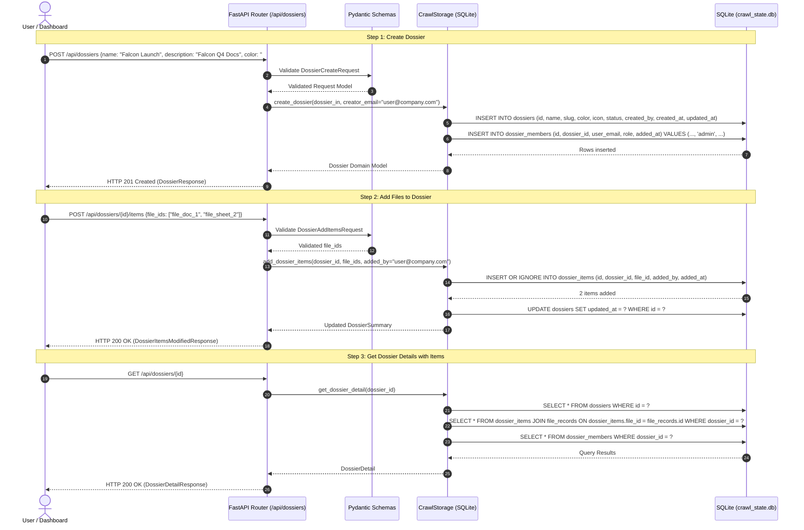
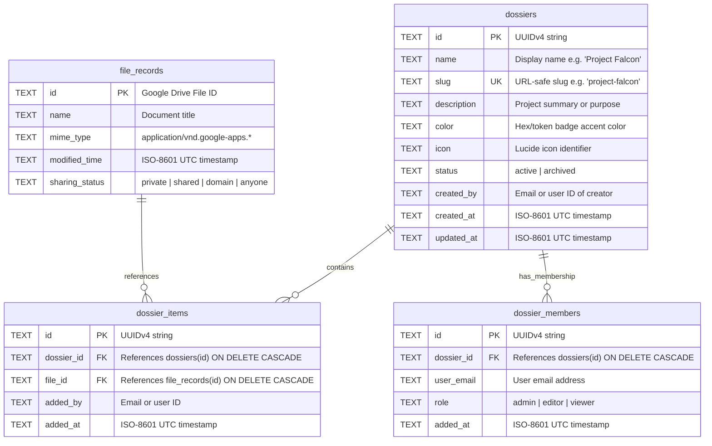

# Stage 1 Concept-to-Code Bridge: Task 10.1 — Project Dossiers Domain Model, Relational Schema & CRUD APIs

## Section 1: Visual Architecture

```mermaid
graph TD
    User([User / Browser Dashboard])
    
    subgraph FastAPI_Layer ["FastAPI REST Layer (/api/dossiers)"]
        Router["Dossiers Router\n(app/api/routes/dossiers.py)"]
        Validation["Pydantic Schemas\n(app/api/schemas/dossiers.py)"]
        AuthSeam["Auth Seam / Dependency\n(app/api/deps.py)"]
    end

    subgraph Domain_Layer ["Domain Model Layer"]
        DossierModel["Dossier\nDossierItem\nDossierMember\n(app/indexer/models.py)"]
    end

    subgraph Storage_Layer ["SQLite ACID Storage (CrawlStorage)"]
        Repo["CrawlStorage Methods\n(app/indexer/storage.py)"]
        
        subgraph SQLite_Tables ["SQLite Relational Tables"]
            T_Dossiers[("dossiers\nid, name, slug, description, ...")]
            T_Items[("dossier_items\nid, dossier_id, file_id, added_at, added_by")]
            T_Members[("dossier_members\nid, dossier_id, user_email, role, added_at")]
            T_Files[("file_records\nid, name, mime_type, ...")]
        end
    end

    User -->|POST /api/dossiers\nGET /api/dossiers\nPOST /api/dossiers/{id}/items| Router
    Router --> AuthSeam
    Router --> Validation
    Validation --> DossierModel
    Router --> Repo
    Repo --> T_Dossiers
    Repo --> T_Items
    Repo --> T_Members
    T_Items -.->|FOREIGN KEY (dossier_id)| T_Dossiers
    T_Items -.->|FOREIGN KEY (file_id)| T_Files
    T_Members -.->|FOREIGN KEY (dossier_id)| T_Dossiers
```

---

## Section 2: The Physical Analogy

> Think of Panopticon's flat document catalog as a **massive open-floor records library** containing thousands of Google Docs and Sheets scattered across shelves. Searching works, but every search rummages through the entire library without context.
>
> A **Project Dossier** is like setting up a **dedicated, classified project binder / case file in a locked cabinet**. Each binder has a cover label (*"Project Falcon Launch"*, slug, color, description) and an authorized personnel badge list (`dossier_members` with roles: Admin, Editor, Viewer). Inside the binder, you clip in references to specific files (`dossier_items`). When an engineer or an autonomous AI agent later asks questions about *"Project Falcon"*, it doesn't search the entire building; it pulls down the specific binder and searches only the documents bound inside it.

---

## Section 3: Why & What

### 1. Why are we doing this task?
- **Enterprise Project Partitioning**: In real-world enterprise environments, documents belong to specific projects, initiatives, clients, or audits. A flat global list causes noise, information leakage, and cognitive overload.
- **Context-Isolated Agentic RAG**: In upcoming Task 10.2 ("Ask Dossier"), the AI assistant needs a clear, queryable database partition to filter Meilisearch keyword and vector searches exclusively to files inside a specific Dossier, preventing cross-project hallucination.
- **Role-Based Access Control (RBAC)**: Teams need granular controls (`admin`, `editor`, `viewer`) over who can manage dossier settings, add/remove files, or view contents.

### 2. What is the concept?
A **Dossier** is a first-class relational entity representing a curated workspace container of Google Docs and Sheets with:
- **Metadata**: Unique ID (UUIDv4), display name, URL-safe slug, description, color, icon, status (`active` / `archived`), creator email, and timestamps.
- **Item Junction (`dossier_items`)**: Many-to-many junction referencing `file_records(id)` with added-by and added-at audit metadata.
- **Membership Junction (`dossier_members`)**: RBAC assignments (`admin`, `editor`, `viewer`) for authorized users.

### 3. What breaks if we skip it?
- Flat file noise: Users cannot organize documents into projects.
- Task 10.2 ("Ask Dossier") is completely blocked because there is no way to filter vector/keyword searches by project.
- Task 10.4 (Frontend Redesign) cannot render the Project Dossier Explorer workspace.

---

## Section 4: Abstraction Level Map

| Level | What Lives Here | Current Project Example | Touched by Task 10.1? |
|---|---|---|---|
| **Product / UX** | Dossier cards, item pickers, member badges | React Dashboard (Task 10.4) | ❌ (Deferred to Task 10.4) |
| **API / Transport** | REST endpoints (`/api/dossiers`), HTTP status codes, error models | `app/api/routes/dossiers.py`, `app/api/schemas/dossiers.py` | ✅ **YES** |
| **Domain** | Pydantic v2 schemas, slug sanitization, role invariants | `app/indexer/models.py` (`Dossier`, `DossierItem`, `DossierMember`) | ✅ **YES** |
| **Storage / Persistence** | SQLite tables (`dossiers`, `dossier_items`, `dossier_members`), WAL mode | `app/indexer/storage.py` (`CrawlStorage`) | ✅ **YES** |
| **Search / Engine** | Meilisearch hybrid index filters | `app/search/` (Task 10.2) | ❌ (Deferred to Task 10.2) |
| **External Services** | Google Drive API, OpenRouter API | `GoogleDriveClient`, `LLMClient` | ❌ (Not touched) |

---

## Section 5: Mermaid Diagrams

### 1. Sequence Diagram: Creating a Dossier, Adding Items, and Inspecting



### 2. Relational Entity-Relationship Diagram (ERD)



---

## Section 6: Data Flow Trace-Through

1. **Request Ingestion**:
   - Client sends HTTP request (e.g., `POST /api/dossiers`, `GET /api/dossiers`, `POST /api/dossiers/{id}/items`).
   - Router dependencies in `app/api/deps.py` verify caller identity (stubbed no-op locally per Constraint 6).
2. **Input Validation & Sanitization**:
   - Pydantic schema in `app/api/schemas/dossiers.py` enforces field lengths, validates slug characters (`^[a-z0-9-]+$`), and strips control characters via `sanitize_string()` (Constraint 4).
3. **Storage Operation (ACID Transaction)**:
   - `CrawlStorage` acquires an exclusive transaction (`with self.get_connection() as conn:`).
   - Foreign key integrity is strictly enforced (`PRAGMA foreign_keys = ON;`).
   - Cascade rules guarantee that deleting a dossier automatically prunes `dossier_items` and `dossier_members`, while never touching the underlying `file_records`.
4. **Response Serialization**:
   - Database rows are converted into Pydantic response models with ISO-8601 timestamps and serialized cleanly to JSON.

---

## Section 7: Concept-to-Code Mapping

| Conceptual Element | Physical Location in Codebase | Responsibility |
|---|---|---|
| **Domain Models** | `app/indexer/models.py` | `DossierRole`, `Dossier`, `DossierItem`, `DossierMember`, `DossierSummary` |
| **API Schemas** | `app/api/schemas/dossiers.py` | Request/Response DTOs (`DossierCreateRequest`, `DossierUpdateRequest`, `DossierAddItemsRequest`, `DossierResponse`, `DossierDetailResponse`, `DossierListResponse`) |
| **Relational Storage** | `app/indexer/storage.py` | Table schemas in `init_db()`, CRUD methods (`create_dossier`, `get_dossier`, `get_dossier_by_slug`, `list_dossiers`, `update_dossier`, `delete_dossier`, `add_dossier_items`, `remove_dossier_item`, `list_dossier_items`, `add_dossier_member`, `remove_dossier_member`) |
| **API Router** | `app/api/routes/dossiers.py` | REST endpoints mounted at `/api/dossiers` |
| **Router Aggregation** | `app/api/routes/__init__.py` | Register `dossiers_router` into `api_router` |
| **Unit & Integration Tests** | `tests/test_dossiers_storage.py`<br>`tests/test_api_dossiers.py` | Schema constraints, cascade deletions, CRUD edge cases, and HTTP response assertions |
