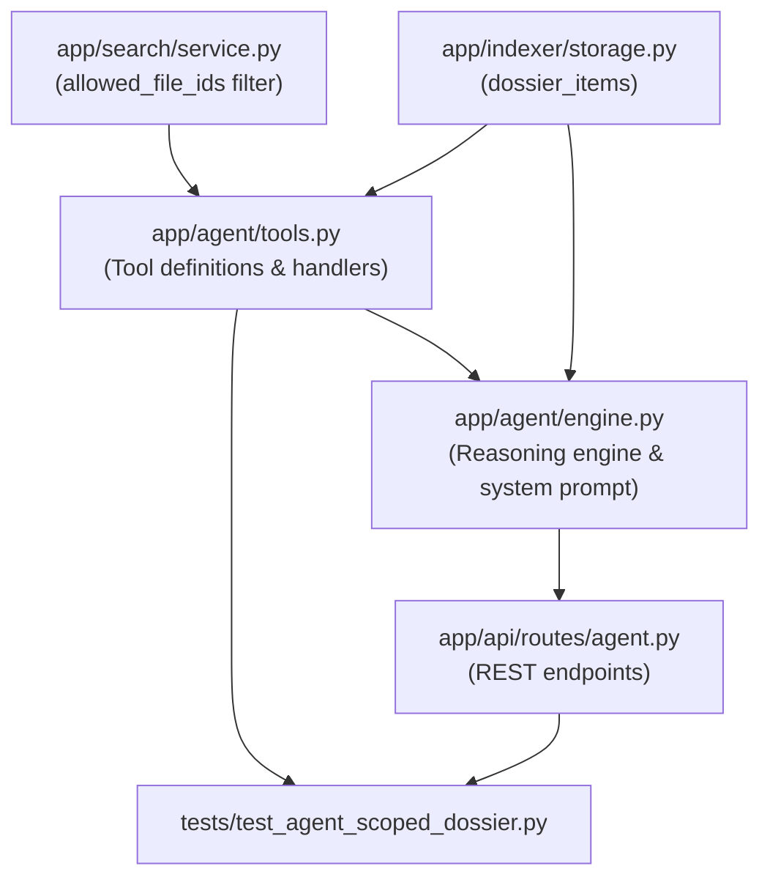

# Stage 2 Codebase Design: Task 10.2 — Project-Scoped RAG Rig & Tool Isolation ("Ask Dossier")

## Section 1: Current State Snapshot

Currently, the Agentic reasoning engine operates across the global document repository:
- `AgentToolContext` only holds `storage`, `search_service`, and `embedding_provider`.
- The 5 agent tools (`search_index`, `get_document_diff`, `get_file_metadata`, `semantic_chunk_search`, `get_document_catalog_stats`) have no concept of project boundaries or `dossier_id`.
- `SearchService.search()` and `SearchService.search_chunks()` filter only by MIME type, sharing status, project tag, and owner — with no filter parameter for specific file IDs.
- The `/api/agent/query` and `/api/agent/query/stream` endpoints accept only `prompt`, `thread_id`, and `model`.

### Architecture Before

```mermaid
graph TD
    Client[Client Request] --> API[/api/agent/query]
    API --> Engine[AgenticReasoningEngine]
    Engine --> Tools[Tools: Global Scope]
    Tools --> Search[SearchService: Global Meilisearch Index]
```

---

## Section 2: Proposed State

We introduce strict project scoping across the entire agent reasoning pipeline:
1. `SearchService`: Add `allowed_file_ids` parameter to `search()` and `search_chunks()`, generating Meilisearch filter expressions (`id IN [...]` for docs, `file_id IN [...]` for chunks), and fast-failing on empty sets.
2. `AgentToolContext`: Add `dossier_id: str | None` and `allowed_file_ids: set[str] | None`.
3. Agent Tools: Update all 5 tool JSON schemas to accept optional `dossier_id`, and update handlers to enforce boundaries.
4. `AgenticReasoningEngine`: When `dossier_id` is supplied, resolve the dossier container, populate `allowed_file_ids`, inject security context into the system prompt, and wire tool context.
5. API Endpoints: Add `dossier_id` to request schemas in `/api/agent/query` and `/api/agent/query/stream`, validating existence (404 on invalid dossier).

### Target Architecture (After)

```mermaid
graph TD
    Client[Client Request: prompt + dossier_id] --> API[/api/agent/query & stream]
    API --> Validate{Dossier Exists?}
    Validate -- No --> 404[HTTP 404 Not Found]
    Validate -- Yes --> Resolve[Resolve allowed_file_ids from dossier_items]
    Resolve --> Engine[AgenticReasoningEngine + Scoped System Prompt]
    Engine --> Tools[Tools with Dossier Security Boundary]
    Tools --> ScopedSearch[SearchService with allowed_file_ids Filter]
    ScopedSearch --> FilteredHits[Scoped Document Hits Only]
```

---

## Section 3: File-Level Impact Analysis

#### 1. `[MODIFY] app/search/service.py`
- **What changes:**
  - Update `_build_filter_expression` to accept `allowed_file_ids: list[str] | set[str] | None = None` and `id_field: str = "id"`.
  - In `search()`: accept `allowed_file_ids`. If passed as empty collection `[]`, immediately return empty `SearchResult` (0 hits) without calling Meilisearch.
  - In `search_chunks()`: accept `allowed_file_ids`. If empty collection, return 0 hits. Filter on `file_id IN [...]`.
- **Why:** Enforces Meilisearch-level boundary filtering at sub-5ms speed.

#### 2. `[MODIFY] app/agent/tools.py`
- **What changes:**
  - Update `AgentToolContext` dataclass to include `dossier_id: str | None = None` and `allowed_file_ids: set[str] | None = None`.
  - Update parameter schemas of `SEARCH_INDEX_TOOL`, `GET_DOCUMENT_DIFF_TOOL`, `GET_FILE_METADATA_TOOL`, `SEMANTIC_CHUNK_SEARCH_TOOL`, and `GET_DOCUMENT_CATALOG_STATS_TOOL` to include optional `"dossier_id"`.
  - Add helper `_resolve_allowed_files(args, ctx) -> set[str] | None`.
  - Tool handlers:
    - `_handle_search_index`: passes allowed IDs to `search()`.
    - `_handle_semantic_chunk_search`: passes allowed IDs to `search_chunks()`.
    - `_handle_get_document_diff`: verifies target `file_id` is in allowed IDs; rejects with clear message if not.
    - `_handle_get_file_metadata`: verifies target `file_id` is in allowed IDs.
    - `_handle_get_document_catalog_stats`: computes isolated file counts and tags for the dossier.

#### 3. `[MODIFY] app/agent/engine.py`
- **What changes:**
  - `AgentQueryRequest`: add `dossier_id: str | None = None`.
  - In `query()` and `query_stream()`:
    - If `dossier_id` is passed, look up dossier in `storage`.
    - Fetch all items via `storage.list_dossier_items(dossier_id, limit=1000)`.
    - Construct `allowed_file_ids = {f.id for f in files}`.
    - Inject boundary guard into system prompt instructions.
    - Pass `dossier_id` and `allowed_file_ids` into `AgentToolContext`.

#### 4. `[MODIFY] app/api/routes/agent.py`
- **What changes:**
  - Update `AgentQueryApiRequest` to accept `dossier_id: str | None = None`.
  - In route handlers for `/api/agent/query` and `/api/agent/query/stream`, check if `dossier_id` is supplied. If supplied and not found in storage, raise `HTTPException(404)`.
  - Pass `dossier_id` to engine.

#### 5. `[NEW] tests/test_agent_scoped_dossier.py`
- **Purpose:** Full integration tests verifying strict boundary isolation between Dossier A and Dossier B.

---

## Section 4: Dependency Graph / Blast Radius



### Blast Radius Assessment:
- **Zero Breaking Changes for Global Queries**: When `dossier_id` is omitted (`None`), the system continues to behave exactly as before, querying the entire catalog.
- **Backward Compatibility**: Existing chat threads and query endpoints remain 100% backward compatible.
- **Search Client Safety**: `SearchService` filter generation uses standard Meilisearch syntax (`IN ["id1", "id2"]`).

---

## Section 5: Regression Risk Matrix

| Risk ID | Risk Description | Severity | Affected Area | Mitigation Strategy |
|---|---|---|---|---|
| **R-01** | Meilisearch filter syntax error on large file ID list | 🟡 Medium | SearchService | Limit max allowed file IDs per filter clause or batch if >200 files. |
| **R-02** | Empty dossier causes search error or crash | 🟡 Medium | Agent Tools | Add early return guard: if dossier has 0 items, return empty results immediately with a friendly notice. |
| **R-03** | Agent leaks files outside dossier when user asks trick question | 🔴 High | Agent Engine | Double boundary enforcement: (1) Tool execution level blocks retrieval; (2) System prompt instructs model not to extrapolate outside container. |
| **R-04** | Invalid `dossier_id` passed to chat API | 🟢 Low | API Route | Validate existence in route handler and return clean `404 Not Found`. |

---

## Section 6: Rollback Plan

If defects occur during or after implementation:
1. **Uncommitted changes:**
   ```bash
   git checkout -- app/search/service.py app/agent/tools.py app/agent/engine.py app/api/routes/agent.py
   git clean -fd tests/test_agent_scoped_dossier.py
   ```
2. **Committed changes:**
   ```bash
   git revert HEAD
   ```
