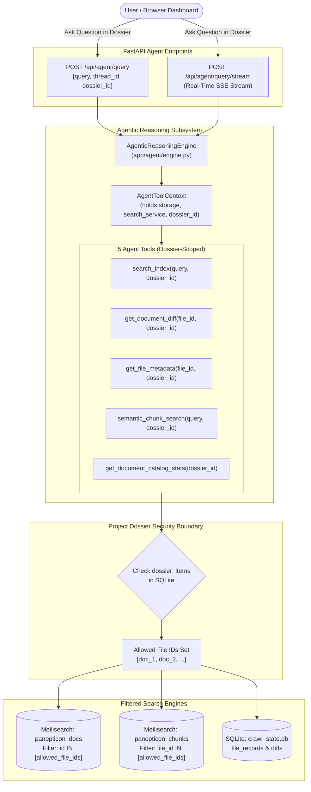
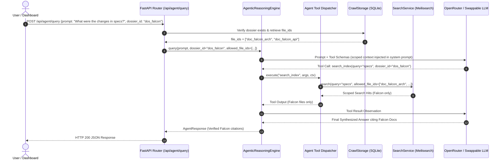
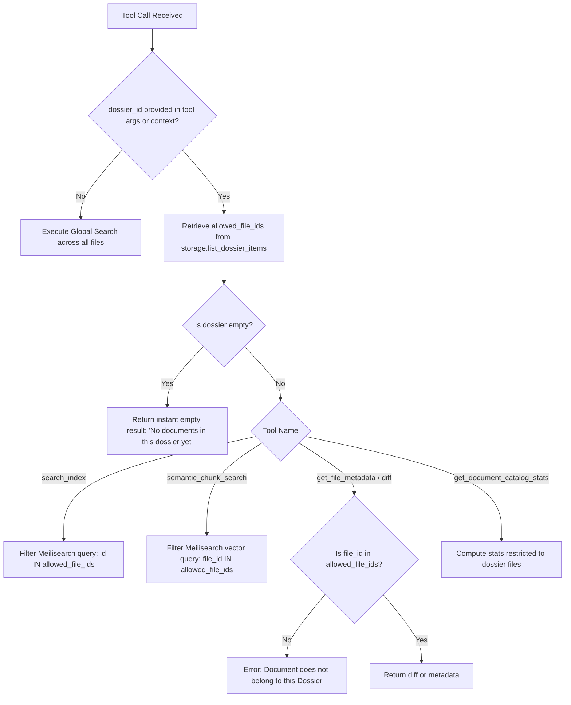

# Stage 1 Concept-to-Code Bridge: Task 10.2 — Project-Scoped RAG Rig & Tool Isolation ("Ask Dossier")

## Section 1: Visual Architecture

---

## Section 2: The Physical Analogy

> Imagine a **corporate defense research institute with multiple classified project vaults** (e.g. Vault A: *"Project Falcon"*, Vault B: *"Project Apollo"*).
>
> In the global un-scoped mode, the research assistant walks through the open public lobby and answers questions from any document on any desk.
>
> In **"Ask Dossier" mode**, the assistant is escorted into **Vault A ("Project Falcon")**. The door locks behind it. The assistant is only permitted to read the blueprints, change logs, and meeting minutes stored on Vault A's shelves. If someone asks *"What is the budget for Project Apollo?"*, the assistant immediately reports that Apollo documents do not exist inside Vault A. Cross-vault contamination, leakage, and distraction are physically impossible.

---

## Section 3: Why & What

### 1. Why are we doing this task?
- **Zero Cross-Project Hallucination**: When an engineering or product team chats with "Project Falcon", they want answers derived solely from Falcon specifications. Returning snippets from an unrelated "SmartTrade" or "Internal IT" document creates confusion and undermines trust.
- **Token Economy & Precision**: Scoping retrieval to a specific Dossier eliminates thousands of irrelevant tokens from the prompt context, dramatically boosting answer quality and speeding up reasoning latency.
- **Enterprise Multi-Project Privacy**: Prepares Panopticon for multi-tenant / multi-project workspaces where users should only query documents they have access to.

### 2. What is the concept?
**Project-Scoped RAG** is an architectural constraint that injects a `dossier_id` parameter across the entire query pipeline. All 5 agent tools (`search_index`, `get_document_diff`, `get_file_metadata`, `semantic_chunk_search`, `get_document_catalog_stats`) resolve the set of authorized `file_ids` contained in that Dossier, and constrain keyword queries, vector similarity searches, diff lookups, and repository statistics strictly to that set.

### 3. What breaks if we skip it?
- The Dossiers created in Task 10.1 remain static file folders with no intelligence or conversational capability.
- An agent answering inside a Dossier would query the global repository and hallucinate information from other projects.
- The upcoming High-Rhythm Frontend Redesign (Task 10.4) cannot deliver the "Ask Dossier" chat drawer.

---

## Section 4: Abstraction Level Map

| Level | What Lives Here | Current Project Example | Touched by Task 10.2? |
|---|---|---|---|
| **Product / UX** | "Ask Dossier" chat drawer in React | Frontend (Task 10.4) | ❌ (Deferred to 10.4) |
| **API / Transport** | `/api/agent/query`, `/api/agent/query/stream` accepting `dossier_id` | `app/api/routes/agent.py` | ✅ **YES** |
| **Agent / Reasoning** | ReAct tool loop, tool schemas, context injection | `app/agent/engine.py`, `app/agent/tools.py` | ✅ **YES** |
| **Search Engine** | Meilisearch `IN [allowed_ids]` filter expression | `app/search/service.py` | ✅ **YES** |
| **Storage / Persistence** | Querying `dossier_items` for file membership | `app/indexer/storage.py` | ✅ **YES** (uses Task 10.1 methods) |

---

## Section 5: Mermaid Diagrams

### 1. Sequence Diagram: Dossier-Scoped Agentic Query Execution

### 2. Decision Logic for Tool Execution Scoping

---

## Section 6: Data Flow Trace-Through

1. **Request Ingestion (`POST /api/agent/query` or `POST /api/agent/query/stream`)**:
   - Client passes `prompt`, optional `thread_id`, and `dossier_id` (e.g. `"dos_falcon"`).
   - Router validates that `dossier_id` exists in `CrawlStorage`. If invalid, returns `404 Not Found`.
2. **Context Setup & Allowed File Resolution**:
   - Router fetches `allowed_files, total = storage.list_dossier_items(dossier_id)`.
   - Populates `allowed_file_ids = {f.id for f in allowed_files}`.
   - Injects `dossier_id` and `allowed_file_ids` into `AgentToolContext` and system prompt.
3. **ReAct Tool Execution Loop**:
   - When the LLM calls `search_index` or `semantic_chunk_search`, the dispatcher passes `allowed_file_ids` to `SearchService`.
   - If the dossier has 0 files, the tools return a helpful notice immediately without querying Meilisearch.
   - If the LLM attempts to call `get_document_diff` or `get_file_metadata` on a file outside the dossier, the tool refuses and warns the model: `"Security restriction: Document 'xyz' does not belong to Project Dossier '...'."`
4. **Citation Verification**:
   - `CitationVerifier` checks cited document IDs against both SQLite and the dossier boundary. Citations outside the dossier are stripped.
5. **Response Delivery**:
   - Response streams tokens and verified citations with 100% boundary isolation.
