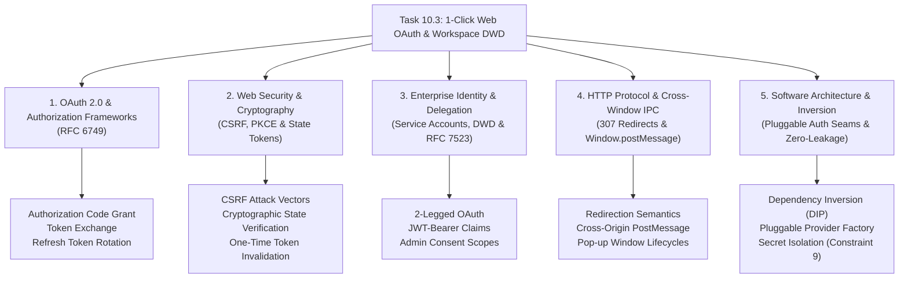

# Stage 3 CS Domain Learning: Task 10.3 — 1-Click Hosted Web OAuth 2.0 & Workspace DWD Admin Install Seam

**Task ID:** Task-10.3  
**Epic:** Epic 10 — Enterprise Workspace, Project Dossiers & Web OAuth (Phase 4)  
**Date:** 2026-09-04  

---

## 1. Domain Discovery Map



---

## 2. Domain Deep Dives

### Domain 1: OAuth 2.0 Authorization Code Grant (RFC 6749)

**What Is It (Plain English):**
OAuth 2.0 is an industry-standard delegation framework that lets an application access resources (like Google Docs) on behalf of a user without ever seeing or storing the user's Google password. The "Authorization Code Grant" splits the authorization process into two channels: an untrusted frontchannel (the user's browser) that conveys a short-lived authorization code, and a secure backchannel (server-to-server HTTPS) where the backend exchanges that code for an `access_token` and `refresh_token`.

**Physical Analogy:**
When you rent an apartment, the leasing office doesn't give you the master building key. Instead, they give you a temporary magnetic keycard (`access_token`) programmed to open only your apartment door (`scopes`). The keycard expires in 1 hour. Along with it, they give you an account passbook (`refresh_token`). When the keycard expires, your keyfob automatically contacts the leasing office to get a fresh keycard without requiring you to re-sign the lease.

**How It Works Under the Hood:**
1. **Frontchannel Request:** Panopticon sends the user to `https://accounts.google.com/o/oauth2/auth` with `client_id`, `redirect_uri`, `scope`, `response_type=code`, and `state`.
2. **User Consent:** The user authenticates with Google and grants permission for requested scopes.
3. **Frontchannel Callback:** Google issues an HTTP redirect back to `redirect_uri` with a short-lived `code` (valid for ~10 minutes, single use).
4. **Backchannel Exchange:** Panopticon's backend makes an authenticated `POST` request directly to `https://oauth2.googleapis.com/token` with `code`, `client_id`, `client_secret`, and `grant_type=authorization_code`.
5. **Token Delivery:** Google returns an `access_token` (expires in 3600 seconds) and a long-lived `refresh_token`.

---

### Domain 2: Web Security & Cross-Site Request Forgery (CSRF) Protection

**What Is It (Plain English):**
Without protection, an attacker could lure a user into clicking a link that triggers Google's OAuth callback with an authorization code belonging to the *attacker's* account, tricking the victim's application into binding to the attacker's data. To prevent this, OAuth 2.0 mandates a `state` parameter: a cryptographically random token stored on the server and verified upon callback.

**Physical Analogy:**
When you deposit a coat at a cloakroom, the attendant hands you a numbered claim ticket. When someone comes to pick up the coat, the attendant checks that the ticket number matches the log before handing it over. If someone shows up without a ticket or with an altered number, they are turned away immediately.

**How It Works Under the Hood:**
- In `app/api/routes/auth.py`, when initiating the login flow, we generate a high-entropy 256-bit token: `state = secrets.token_urlsafe(32)`.
- The token is registered in the backend memory store (`_oauth_states`).
- When Google redirects back to `/api/auth/google/callback?state=...`, the server verifies `state in _oauth_states`.
- If matched, the state is immediately consumed via `_oauth_states.discard(state)` to prevent replay attacks.
- If missing or unverified, the request is rejected with `HTTP 400 Bad Request: Invalid or expired OAuth state token`.

---

### Domain 3: Enterprise Identity & Domain-Wide Delegation (DWD / RFC 7523)

**What Is It (Plain English):**
In a corporate enterprise, having hundreds of individual employees click through OAuth consent popups is inefficient and unmanageable. Domain-Wide Delegation (DWD) allows a Google Workspace Super Administrator to authorize a Google Cloud Service Account to impersonate users across the entire organization.

**Physical Analogy:**
Instead of every employee having to sign for their own delivery packages at their desk, the company authorizes a centralized mailroom service. The mailroom has a signed corporate authorization letter from the CEO and can distribute packages to any employee's mailbox directly.

**How It Works Under the Hood:**
1. **Service Account Keypair:** A Service Account JSON key contains a private RSA key (`private_key`) and client ID.
2. **Admin Console Authorization:** An administrator enters the Service Account's numeric Client ID into Google Workspace Admin Console (`Security > API Controls > Domain-wide delegation`) and binds it to specific scopes (`https://www.googleapis.com/auth/drive.readonly`).
3. **JWT Bearer Assertion (RFC 7523):** When Panopticon crawls Drive, it signs a JSON Web Token (JWT) with its private key, specifying `iss` (service account email), `sub` (target user email to impersonate, e.g. `lead.architect@company.com`), and `scope`.
4. **Token Grant:** Google's OAuth server validates the RSA signature against the service account's public key, checks that the admin granted DWD for that scope, and issues an access token for that specific target user.

---

### Domain 4: HTTP Protocols & Cross-Window Inter-Process Communication (IPC)

**What Is It (Plain English):**
When a modern web app launches an OAuth login, it typically opens a small popup window. Once the authorization finishes on the backend, that popup must signal the original parent dashboard window that login succeeded and then close itself.

**Physical Analogy:**
Like a customer ringing a doorbell at a service window: once the clerk finishes stamping the paperwork on the other side, they buzz the customer's pager, and the customer steps away.

**How It Works Under the Hood:**
- **Redirection Semantics:** The initial request uses `HTTP 307 Temporary Redirect` which guarantees the client preserves the original HTTP request method (GET) when following the redirection to Google's consent screen.
- **HTML PostMessage Handshake:** After the callback exchanges tokens on the server, it responds with an HTML page containing:
  ```javascript
  if (window.opener) {
    window.opener.postMessage({ type: 'PANOPTICON_OAUTH_SUCCESS' }, '*');
    window.close();
  }
  ```
- The React dashboard has an event listener `window.addEventListener('message', handleAuthMessage)`. When it receives `'PANOPTICON_OAUTH_SUCCESS'`, it refreshes the auth status and triggers the search view.

---

### Domain 5: Software Architecture & The Open-Closed Principle (OCP)

**What Is It (Plain English):**
The core Panopticon search engine, indexer, and RAG agent should not know or care whether tokens were acquired via personal OAuth, environment variables, local JSON files, or enterprise DWD service accounts. The code is open for extension (adding new sources) but closed for modification.

**Physical Analogy:**
A standard wall power outlet: Whether the electricity comes from solar panels, a wind turbine, or a hydroelectric dam, any appliance with a standard two-prong plug works without needing custom rewiring.

**How It Works Under the Hood:**
- Product Constraint 1: Crawler and indexer interact exclusively with the abstract interface `DriveAuthProvider.get_credentials()`.
- Product Constraint 9: Secrets, refresh tokens, and credentials are kept strictly in local file stores or environment variables, never returned in API payloads, never stored in Meilisearch documents, and never checked into Git.
