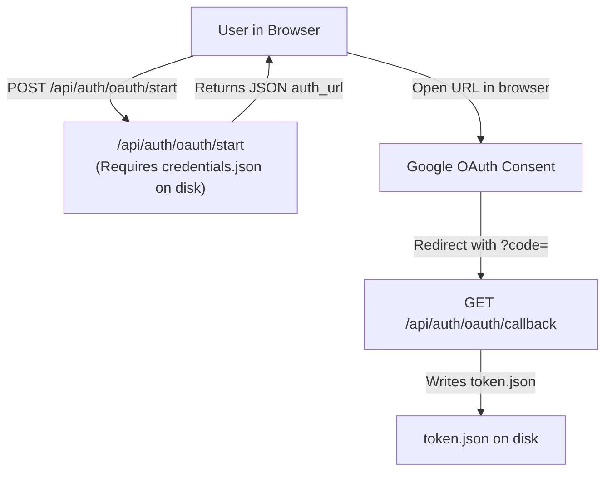
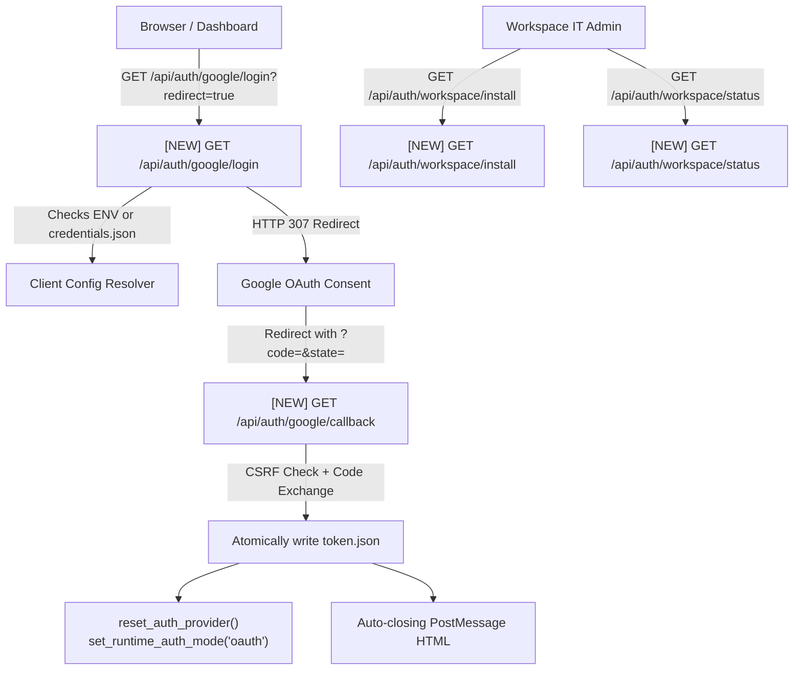
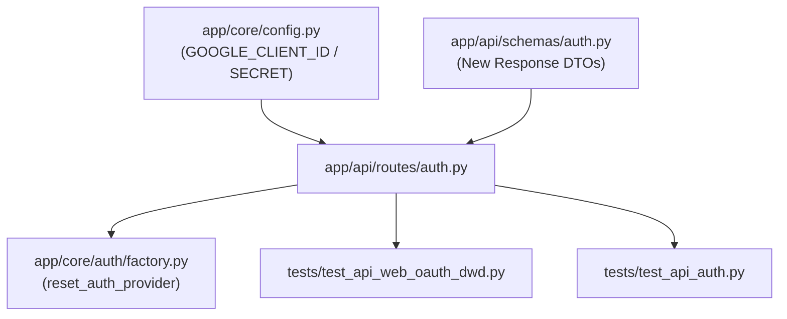

# Stage 2 Codebase Design: Task 10.3 — 1-Click Hosted Web OAuth 2.0 & Workspace DWD Admin Install Seam

**Task ID:** Task-10.3  
**Epic:** Epic 10 — Enterprise Workspace, Project Dossiers & Web OAuth (Phase 4)  
**Target Branch:** `feat/task-10.3-web-oauth-dwd`  
**Date:** 2026-09-04  

---

## 1. Current State Snapshot

Currently in Panopticon:
- `app/api/routes/auth.py` contains basic endpoints:
  - `GET /api/auth/config`: Returns file presence on disk (`client_secrets_found`, `token_cache_found`, `service_account_found`) and token expiration.
  - `POST /api/auth/config`: Hot-switches between `"oauth"` and `"service_account"`.
  - `POST /api/auth/oauth/start`: Reads `credentials.json` from disk and returns an authorization URL. Fails with 400 if `credentials.json` is missing.
  - `GET /api/auth/oauth/callback`: Receives `code`, exchanges for credentials using `Flow.from_client_secrets_file()`, and writes `token.json`.
  - `POST /api/auth/credentials/upload`: Accepts file upload of `credentials.json` or `service_account.json`.
- `app/core/config.py` holds file path settings (`GOOGLE_CLIENT_SECRETS_FILE`, `GOOGLE_TOKEN_CACHE_FILE`, `GOOGLE_SERVICE_ACCOUNT_FILE`), but lacks direct settings for `GOOGLE_CLIENT_ID`, `GOOGLE_CLIENT_SECRET`, and `GOOGLE_REDIRECT_URI`.
- There is no direct 1-click browser redirect endpoint (`GET /api/auth/google/login`) that non-technical users or browser popups can trigger without a POST pre-flight.
- There is no formal enterprise install seam or status diagnostic for Google Workspace Domain-Wide Delegation (DWD).

---

## 2. Proposed State

Task 10.3 establishes a dual-tier auth setup:
1. **1-Click Web OAuth 2.0 (`GET /api/auth/google/login`):**
   - Resolves OAuth credentials from **either** environment variables (`GOOGLE_CLIENT_ID` + `GOOGLE_CLIENT_SECRET`) **or** local `credentials.json`.
   - Generates a cryptographically random CSRF `state` token recorded in `_oauth_states`.
   - If `redirect=true` (default for browser navigation/popups), immediately issues `HTTP 307 Temporary Redirect` to Google's consent screen. If `redirect=false`, returns `GoogleLoginResponse` JSON for headless/AJAX callers.
2. **Hardened Callback Handler (`GET /api/auth/google/callback`):**
   - Validates CSRF `state` parameter; aborts with HTTP 400 if invalid.
   - Exchanges code for offline tokens using client config from ENV or file.
   - Writes `token.json` atomically and resets the provider via `reset_auth_provider()`.
   - Automatically switches active runtime auth mode to `"oauth"`.
   - Returns a stylized auto-closing HTML window that fires `postMessage({ type: 'PANOPTICON_OAUTH_SUCCESS' })` to the parent window, or JSON if `raw_json=true`.
3. **Workspace Marketplace Admin Install Seam (`/api/auth/workspace/*`):**
   - `GET /api/auth/workspace/install`: Returns the administrative manifest metadata, Service Account client ID, required scopes list, and copy-pasteable instructions for Google Workspace Admin Console.
   - `GET /api/auth/workspace/status`: Audits whether DWD credentials file exists, whether `GOOGLE_DELEGATED_USER_EMAIL` is configured, and validates connectivity.

---

## 3. File-Level Impact Analysis

### [MODIFY] `app/core/config.py`
- **What changes:** Add `GOOGLE_CLIENT_ID: str | None = None`, `GOOGLE_CLIENT_SECRET: str | None = None`, and `GOOGLE_REDIRECT_URI: str | None = None` to `Settings`.
- **Why:** Allows zero-file hosted setup via `.env` variables without requiring `credentials.json` on disk.
- **Approximate lines:** Lines 25–35.
- **Upstream dependencies:** `pydantic_settings.BaseSettings`.
- **Downstream dependents:** `app/api/routes/auth.py`.

### [MODIFY] `app/api/schemas/auth.py`
- **What changes:** Add schemas:
  - `GoogleLoginResponse` (`authorization_url`, `state`, `redirect_uri`, `client_source`).
  - `WorkspaceDWDManifestResponse` (`application_name`, `client_id`, `service_account_email`, `required_scopes`, `admin_console_url`, `setup_instructions`).
  - `WorkspaceDWDStatusResponse` (`configured`, `service_account_found`, `delegated_user_email`, `scopes_authorized`, `connectivity_status`, `message`).
- **Why:** Strongly typed Pydantic v2 contracts for the new auth endpoints.
- **Approximate lines:** Append to end of file (~40 lines).
- **Upstream dependencies:** `pydantic.BaseModel`.
- **Downstream dependents:** `app/api/routes/auth.py`.

### [MODIFY] `app/api/routes/auth.py`
- **What changes:**
  - Implement helper `_get_oauth_flow(redirect_uri: str)` that constructs `google_auth_oauthlib.flow.Flow` from either ENV variables (`GOOGLE_CLIENT_ID` + `GOOGLE_CLIENT_SECRET`) or `credentials.json`.
  - Add `GET /api/auth/google/login`: creates state, records in `_oauth_states`, returns redirect or JSON.
  - Add `GET /api/auth/google/callback`: validates state, exchanges code for tokens, writes `token.json`, hot-swaps auth mode to `oauth`, and returns HTML or JSON.
  - Add `GET /api/auth/workspace/install`: returns DWD setup manifest and instructions.
  - Add `GET /api/auth/workspace/status`: returns DWD diagnostic status.
- **Why:** Core requirement of Task 10.3.
- **Approximate lines:** ~120 lines added/updated.
- **Upstream dependencies:** `app/core/config.py`, `app/api/schemas/auth.py`, `google_auth_oauthlib.flow.Flow`.
- **Downstream dependents:** React dashboard and API consumers.

### [NEW] `tests/test_api_web_oauth_dwd.py`
- **Purpose:** Unit and integration test suite verifying the 1-click web OAuth flow and DWD admin endpoints.
- **Exports/Public API:** Pytest test functions.
- **Consumers:** Test runner.

---

## 4. Blast Radius & Dependency Graph

---

## 5. Regression Risk Assessment & Mitigation

| Component | Risk Level | Potential Regression | Mitigation Strategy |
|---|:---:|---|---|
| **Existing `/api/auth/oauth/start` & `/callback`** | 🟢 Low | Breaking legacy endpoints | Keep existing endpoints functional as aliases to the shared flow helper. |
| **Credentials File Upload** | 🟢 Low | Breaking `credentials.json` upload | Untouched. The file upload continues to work exactly as before. |
| **Token File Invalidation** | 🟢 Low | Corrupting existing `token.json` | Write atomically via temporary file or direct UTF-8 write. |
| **CSRF State Replay** | 🟡 Medium | Malicious reuse of authorization state | Set tokens are discarded immediately after first consumption (`_oauth_states.discard(state)`). |
| **Service Account DWD Diagnostics** | 🟢 Low | Exception if SA file is invalid | Handled gracefully in try/except returning structured JSON diagnostics. |

---

## 6. Rollback Plan

- **Uncommitted Changes:** `git restore . && git clean -fd`
- **Committed Changes:** `git revert HEAD`
- **Configuration Rollback:** Remove `GOOGLE_CLIENT_ID` and `GOOGLE_CLIENT_SECRET` from `.env`; system defaults back to `credentials.json` on disk.
