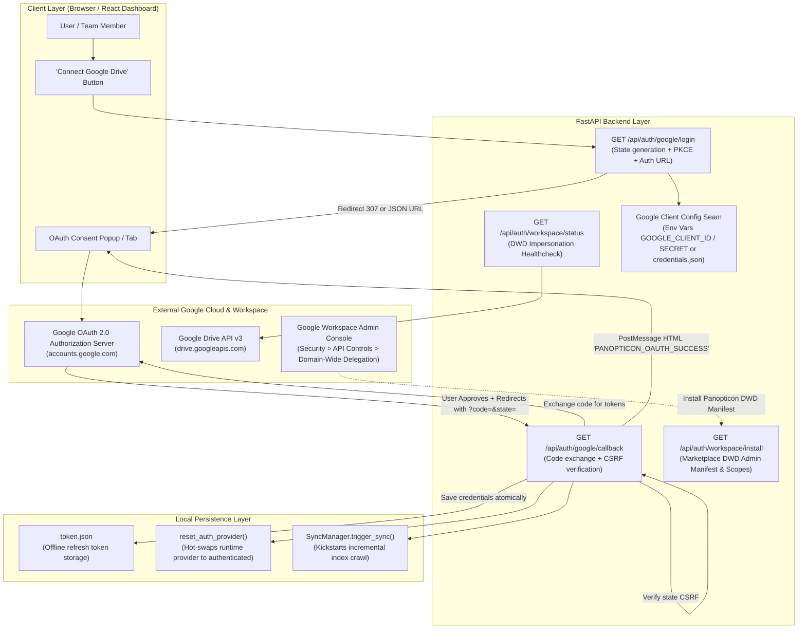
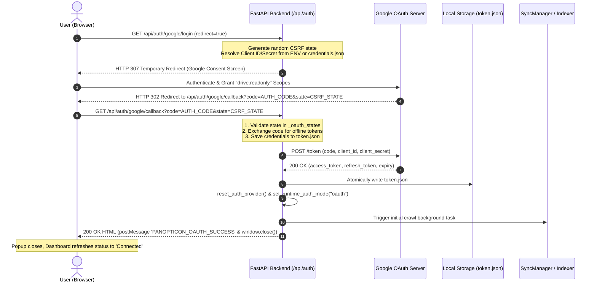

# Stage 1 Concept-to-Code Bridge: Task 10.3 — 1-Click Hosted Web OAuth 2.0 & Workspace DWD Admin Install Seam

**Task ID:** Task-10.3  
**Epic:** Epic 10 — Enterprise Workspace, Project Dossiers & Web OAuth (Phase 4)  
**Track:** Python (FastAPI + Google OAuth 2.0 Web Server Grant + DWD Admin Seam)  
**Target Branch:** `feat/task-10.3-web-oauth-dwd`  
**Date:** 2026-09-04  

---

## 1. Visual Architecture



---

## 2. The Physical Analogy: The Hotel Valet Key & The Corporate Freight Dock

> **The Personal OAuth Web Flow** is like giving your car to a hotel valet:
> Instead of handing the valet your house keys and master passport (your raw Google password or dangerous permanent API keys), the valet desk gives you a numbered claim ticket (`state` token). You walk over to the manufacturer's verified key booth (`accounts.google.com`), confirm you want the valet to park your car, and they hand you a signed, limited-use valet key code. You return the code to the hotel desk, they verify the claim ticket number matches, and exchange it for a temporary glove-box key (`access_token`) and a renewal voucher (`refresh_token`).
>
> **The Workspace Domain-Wide Delegation (DWD) Seam** is the building's corporate freight elevator:
> Instead of every employee in the company having to individually walk down to the valet desk, the building facility manager (Google Workspace Super Admin) registers a commercial delivery contractor (Service Account). The manager authorizes the contractor to pick up internal mail on behalf of any department (`delegated_user_email`), enabling organization-wide indexing without bothering every team member.

---

## 3. Why & What

### Why are we doing this task?
1. **Eliminate Developer Friction:** In Phase 1, connecting Google Drive required navigating Google Cloud Console, creating an OAuth client ID, downloading `credentials.json`, placing it in the project root or uploading it via the UI modal, and running a loopback socket flow. Non-technical users, PMs, and enterprise teams cannot and should not perform these steps.
2. **True 1-Click Hosted SaaS Experience:** In a hosted or containerized environment, the application's OAuth client ID and secret are configured once via environment variables (`GOOGLE_CLIENT_ID`, `GOOGLE_CLIENT_SECRET`). Users simply click "Connect Google Drive", grant consent in their browser, and start searching immediately.
3. **Enterprise Domain-Wide Delegation (DWD) Readiness:** For corporate Google Workspace deployments, IT admins need a standardized installation manifest and verification endpoint to audit authorized scopes and confirm service account impersonation works before rolling out across hundreds of seats.

### What is the concept?
- **OAuth 2.0 Web Server Authorization Code Grant:** A secure, standard two-legged protocol where the client application redirects the user to Google's authorization server with a cryptographically random `state` parameter to prevent CSRF attacks. Google redirects back to `/api/auth/google/callback?code=...&state=...`, which the backend exchanges directly over backchannel HTTPS for tokens.
- **Dynamic Client Configuration:** The backend builds the OAuth client definition either from environment variables (`GOOGLE_CLIENT_ID`, `GOOGLE_CLIENT_SECRET`) or falls back to `credentials.json` on disk if present.
- **DWD Admin Install Seam:** A dedicated endpoint providing the client ID, required OAuth scopes (`https://www.googleapis.com/auth/drive.readonly`, `https://www.googleapis.com/auth/drive.metadata.readonly`), and a live connectivity diagnostic.

### What breaks if we skip it?
- Non-technical team members cannot use Panopticon without developer assistance.
- Hosted deployments fail because local loopback server (`run_local_server()`) cannot bind ports on remote servers or behind reverse proxies.
- CSRF vulnerability: without strict `state` validation, malicious third parties can trick a user's browser into linking an attacker's Drive account.
- Product Constraint 9 violation: if tokens are mishandled or returned to the browser in URLs/JSON, authentication tokens leak.

---

## 4. Abstraction Level Map

```markdown
| Level | What Lives Here | Current Project Example | Touched? |
|---|---|---|:---:|
| **Product / UX** | "Connect Drive" button, OAuth popup, auto-closing success window, DWD setup card | React Settings Drawer, Auth Modal | YES |
| **Application** | Route handlers `/api/auth/google/login`, `/callback`, `/workspace/install` | `app/api/routes/auth.py` | **YES (Primary)** |
| **Framework** | FastAPI route dependencies, RedirectResponse, HTMLResponse, query params | `fastapi.APIRouter`, `HTTPException` | **YES** |
| **Library** | `google_auth_oauthlib.flow.Flow`, `google.oauth2.credentials.Credentials` | Google Auth Python SDK | **YES** |
| **Runtime** | Python 3.12, asyncio event loop, secrets token generation | `secrets.token_urlsafe(32)` | **YES** |
| **OS / Infra** | `.env` variables (`GOOGLE_CLIENT_ID`, `GOOGLE_CLIENT_SECRET`), `token.json` on disk | File permissions, environment config | **YES** |
```

---

## 5. Sequence Diagram: 1-Click Web OAuth & Auto-Sync Trigger



---

## 6. Data Flow Trace-Through (Step-by-Step)

1. **User Action:** The user clicks "Connect Google Drive" in the Panopticon dashboard.
2. **Initiation Request:** The frontend triggers `window.open('/api/auth/google/login?redirect=true', 'google_oauth', 'width=600,height=700')`.
3. **State & URL Synthesis:**
   - FastAPI `/api/auth/google/login` verifies whether `GOOGLE_CLIENT_ID` + `GOOGLE_CLIENT_SECRET` are present in settings or `credentials.json` exists on disk.
   - Generates a cryptographically strong 32-byte CSRF token using `secrets.token_urlsafe(32)` and records it in an expiration-bounded state registry.
   - Constructs the Google OAuth authorization URL requesting offline access (`access_type="offline"`, `prompt="consent"`) and scopes `drive.readonly` and `drive.metadata.readonly`.
   - Returns a `RedirectResponse(auth_url, status_code=307)`.
4. **Google User Consent:** Google presents the OAuth permission screen. The user selects their account and approves read-only access.
5. **Callback Reception:** Google redirects the popup to `http://localhost:8000/api/auth/google/callback?code=4/0Ab...&state=...`.
6. **Security Validation & Token Exchange:**
   - Endpoint verifies the incoming `state` exists in `_oauth_states` and consumes it (one-time use).
   - Uses `google_auth_oauthlib.flow.Flow` to exchange the one-time authorization `code` with Google for user credentials.
7. **Safe Persistence & Seam Hot-Swap:**
   - Credentials JSON (containing `token`, `refresh_token`, and `expiry`) is written atomically to `token.json`.
   - Invokes `reset_auth_provider()` and sets active runtime auth mode to `"oauth"`.
   - If auto-sync is enabled, queues an initial crawl via `SyncManager`.
8. **UI Notification:**
   - Returns an auto-closing HTML document that emits `window.opener.postMessage({ type: 'PANOPTICON_OAUTH_SUCCESS' }, '*')`.
   - The React dashboard receives the message, closes the modal, and shows "Google Drive Connected".

---

## 7. Concept-to-Code Mapping

| Conceptual Element | Project File | Symbol / Location | Responsibility |
|---|---|---|---|
| **Environment Settings** | `app/core/config.py` | `Settings.GOOGLE_CLIENT_ID`, `GOOGLE_CLIENT_SECRET`, `GOOGLE_REDIRECT_URI` | Allows configuring OAuth client credentials directly via `.env` without files. |
| **Login Endpoint** | `app/api/routes/auth.py` | `GET /api/auth/google/login` | Generates CSRF state token and returns authorization URL or redirects. |
| **Callback Handler** | `app/api/routes/auth.py` | `GET /api/auth/google/callback` | Validates CSRF state, exchanges authorization code for tokens, writes `token.json`. |
| **Workspace DWD Seam** | `app/api/routes/auth.py` | `GET /api/auth/workspace/install`, `GET /api/auth/workspace/status` | Returns Google Workspace Marketplace manifest info and diagnostics for DWD. |
| **Auth Provider Hot-Swap** | `app/core/auth/factory.py` | `reset_auth_provider()`, `set_runtime_auth_mode()` | Invalidates cached provider singleton so new tokens take effect instantly. |
| **API Schemas** | `app/api/schemas/auth.py` | `GoogleLoginResponse`, `WorkspaceDWDManifestResponse`, `WorkspaceDWDStatusResponse` | Pydantic wire contracts for the new auth endpoints. |

---

## 8. Failure Modes & Edge Cases

1. **State Token Tampering / CSRF Attack:**
   - *Risk:* Attacker forges callback request with their own authorization code.
   - *Defense:* Reject request with HTTP 400 Bad Request if `state` is missing or not registered in `_oauth_states`.
2. **Missing Client Credentials:**
   - *Risk:* Neither environment variables nor `credentials.json` are present.
   - *Defense:* Return HTTP 400 Bad Request with an actionable error card: `"Google OAuth credentials missing. Set GOOGLE_CLIENT_ID and GOOGLE_CLIENT_SECRET in .env or upload credentials.json."`
3. **User Declines Consent:**
   - *Risk:* User clicks "Cancel" on Google's permission screen. Google redirects with `?error=access_denied`.
   - *Defense:* Handle `error` query parameter gracefully and return an informative HTML message without raising an unhandled 500 error.
4. **Token Cache File Write Failure:**
   - *Risk:* Disk write permission error on `token.json`.
   - *Defense:* Handle `OSError` and return HTTP 500 with clear diagnostic message.
5. **Zero Token Leakage (Constraint 9):**
   - *Risk:* Raw access or refresh tokens exposed in API response payloads or URLs.
   - *Defense:* Endpoints strictly return metadata (`status: "authenticated"`, `token_saved: true`), never raw token strings.

---

## 9. Verified vs. Inferred Behavior

- **VERIFIED:** `PersonalOAuthProvider` in `app/core/auth/oauth.py` supports `OAuth2Credentials.from_authorized_user_file("token.json")` and auto-refreshes expired access tokens.
- **VERIFIED:** `app/core/auth/factory.py` provides `reset_auth_provider()` to flush cached provider instances.
- **VERIFIED:** `app/api/routes/auth.py` already contains a basic `/oauth/start` and `/oauth/callback` implementation that works against `credentials.json`.
- **INFERRED:** Adding `GET /api/auth/google/login` and aliasing/upgrading `/api/auth/google/callback` with direct environment variable support will enable a frictionless 1-click browser flow.
- **INFERRED:** Providing `GET /api/auth/workspace/install` and `GET /api/auth/workspace/status` provides the formal enterprise seam requested for Google Workspace DWD.
