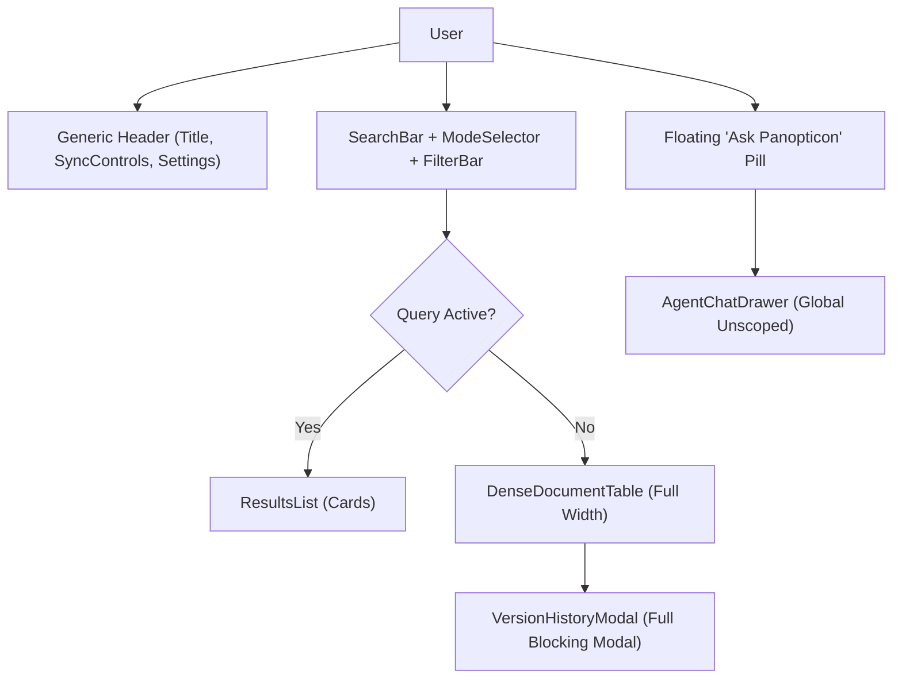
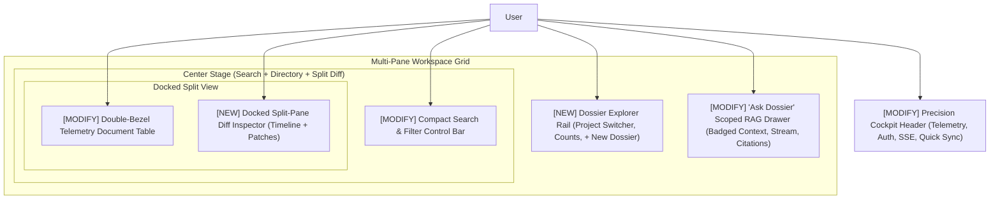
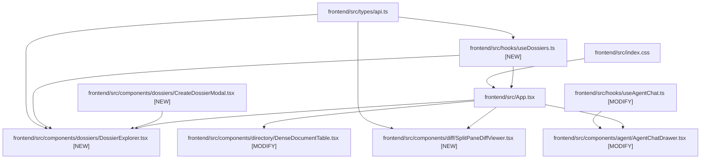

# Stage 2 Design: Task 10.4 — Complete High-Rhythm Frontend Redesign

**Task ID:** Task-10.4  
**Epic:** Epic 10 — Enterprise Workspace, Project Dossiers & Web OAuth  
**Git Branch:** `feat/task-10.4-high-rhythm-frontend`  
**Date:** 2026-09-04  
**Taste Engine Configuration:**  
`DESIGN_VARIANCE: 6` | `MOTION_INTENSITY: 5` | `VISUAL_DENSITY: 8` | `AESTHETIC: Industrial Minimalist Cockpit`  

---

## 1. Current State Snapshot

Currently, the React dashboard (`frontend/src/App.tsx`) is a vertical single-pane layout rendered with generic dark purple backgrounds (`#090514`, `#8B5CF6`) and standard button styles. 

### Limitations of Current Architecture:
1. **Zero Dossier Representation:** Project dossiers created via `/api/dossiers` are completely invisible to the frontend. There is no UI to switch projects or create dossiers.
2. **Global Unscoped AI:** The agent chat drawer (`AgentChatDrawer.tsx`) can only send queries without `dossier_id`, losing the scoped RAG tool isolation built in Task 10.2.
3. **Modal Diff Friction:** Viewing diffs opens `VersionHistoryModal`, hiding the table context and requiring repeated opening/closing to inspect multiple files.
4. **Generic AI Aesthetic:** Purple gradients and basic elevation fail the "anti-slop" agency-tier design mandate.

---

## 2. Proposed State

We introduce a **High-Rhythm Multi-Pane Workspace** rooted in `high-end-visual-design` and `industrial-brutalist-ui`:

### Key Architectural Improvements:
1. **Dossier Rail (`DossierExplorer`):** Horizontal project pill selector with badges, quick "+ New Dossier" modal, and immediate scope switching.
2. **Context-Aware Scoped RAG:** Selecting a dossier automatically scopes the "Ask Dossier" AI drawer (`dossier_id`), displaying an active container pill and isolating citation retrieval.
3. **Split-Pane Diff Inspector (`SplitPaneDiffViewer`):** Replaces the blocking modal with a docked split-pane view that opens side-by-side or below the document list, preserving context.
4. **Double-Bezel & Haptic Styling:** Applied across all cards and panels (`border border-white/10 bg-black/40 ring-1 ring-white/5`), desaturated monochromatic dark palette with precise emerald telemetry accents.

---

## 3. File-Level Impact Analysis

### 3.1 `[MODIFY]` `frontend/src/types/api.ts`
- **What changes:** Add TypeScript interfaces matching the backend Dossier schemas from `app/api/schemas/dossiers.py`:
  - `DossierSummary`: `id, name, slug, description, color, icon, status, item_count, member_count, created_by, created_at, updated_at`.
  - `DossierDetail`: Complete dossier response with member list and file list.
  - `DossierCreatePayload`: `name, slug, description, color, icon, initial_file_ids`.
- **Why:** Full typing safety for Dossier APIs across hooks and components.
- **Lines/Symbols:** Add ~40 lines of typed interfaces.

### 3.2 `[NEW]` `frontend/src/hooks/useDossiers.ts`
- **Purpose:** Custom React hook managing Dossier state, fetching from `/api/dossiers`, tracking `activeDossier: DossierSummary | null`, creating new dossiers (`POST /api/dossiers`), and fetching dossier file items (`GET /api/dossiers/{id}/items`).
- **Exports:** `useDossiers()` returning `{ dossiers, activeDossier, setActiveDossier, loading, error, refreshDossiers, createDossier, activeDossierFiles }`.
- **Consumers:** `App.tsx`, `DossierExplorer.tsx`, `AgentChatDrawer.tsx`.

### 3.3 `[NEW]` `frontend/src/components/dossiers/DossierExplorer.tsx`
- **Purpose:** High-rhythm project rail presenting "All Documents" alongside active Project Dossiers, displaying file counters, accent badges, and a "+ New Project" button.
- **Exports:** `DossierExplorer` component.
- **Consumers:** `App.tsx`.

### 3.4 `[NEW]` `frontend/src/components/dossiers/CreateDossierModal.tsx`
- **Purpose:** Clean, double-bezel modal allowing users to create a project dossier with name, description, color, and optional initial file IDs.
- **Exports:** `CreateDossierModal` component.
- **Consumers:** `DossierExplorer.tsx`.

### 3.5 `[NEW]` `frontend/src/components/diff/SplitPaneDiffViewer.tsx`
- **Purpose:** Docked split-pane inspector that mounts beside or below the document table when a file's diff or version history is inspected. Shows version timeline pills, OpenRouter AI change summaries, and unified line diff patches (`+` green, `-` red).
- **Exports:** `SplitPaneDiffViewer` component.
- **Consumers:** `App.tsx`.

### 3.6 `[MODIFY]` `frontend/src/hooks/useAgentChat.ts`
- **What changes:** Add optional `dossierId: string | null` parameter to `useAgentChat(dossierId?: string | null)` and pass `dossier_id` in the body payload to `POST /api/agent/query/stream`.
- **Why:** Wires the frontend chat drawer directly into Task 10.2's container-scoped RAG engine.
- **Consumers:** `AgentChatDrawer.tsx`.

### 3.7 `[MODIFY]` `frontend/src/components/agent/AgentChatDrawer.tsx`
- **What changes:** Add active dossier badge ("Scoped to: {dossier.name}"), clear container scope indicator, and support switching scopes or asking globally.
- **Why:** Gives the user clear situational awareness of whether the agent is searching all documents or just the active dossier.

### 3.8 `[MODIFY]` `frontend/src/components/directory/DenseDocumentTable.tsx`
- **What changes:** Apply Double-Bezel styling, refine typography to monospace tabular figures for sizes and dates, add an inline "Inspect Diff" button, and add visual indicators when filtering by dossier.
- **Why:** Upgrades document browsing from a generic table into a high-density cockpit view.

### 3.9 `[MODIFY]` `frontend/src/index.css`
- **What changes:** Replace generic purple palette (`#8B5CF6`, `#090514`) with dark industrial neutral variables (`--color-bg-canvas: #0a0b0e`, `--color-bg-surface: #12151c`, `--color-accent: #10b981`, hairline borders `--color-border: #242936`), custom spring ease curves, and double-bezel utilities.
- **Why:** Eliminates AI template aesthetic and establishes bespoke high-end agency styling.

### 3.10 `[MODIFY]` `frontend/src/App.tsx`
- **What changes:** Refactor layout to integrate `DossierExplorer`, docked `SplitPaneDiffViewer`, active dossier filtering, and the redesigned cockpit command header.
- **Why:** Central conductor orchestrating the multi-pane desktop experience.

---

## 4. Blast Radius & Dependency Graph

---

## 5. Regression Risk Assessment

| Risk Description | Severity | Likelihood | Mitigation Strategy |
|---|---|---|---|
| **Dossier Filter Incompatibility:** If a dossier has 0 files, the document table might crash or show misleading states. | 🟢 Low | Low | Handled via explicit empty state ("No documents in this dossier yet — add files or switch to All Documents"). |
| **Split-Pane Layout Overflow:** On smaller screens, split view might squeeze columns. | 🟡 Medium | Medium | Implement responsive media queries: docked right side on 1440px+ screens; docked bottom or slide-over drawer on <1200px viewports. |
| **Agent Chat Disconnect:** Passing non-existent `dossier_id` could trigger 404 from backend. | 🟢 Low | Low | Only pass `activeDossier.id` when `activeDossier` is non-null and valid. |
| **Color Contrast & Readability:** Changing CSS variables might affect contrast. | 🟢 Low | Low | Strict adherence to WCAG AAA contrast ratios using dark charcoal bases (`#0a0b0e`) and bright white text (`#f8fafc`). |

---

## 6. Rollback Plan

If regression occurs:
- Uncommitted edits: `git checkout -- frontend/src/`
- Committed changes: `git reset --hard HEAD~1` (on `feat/task-10.4-high-rhythm-frontend`)
