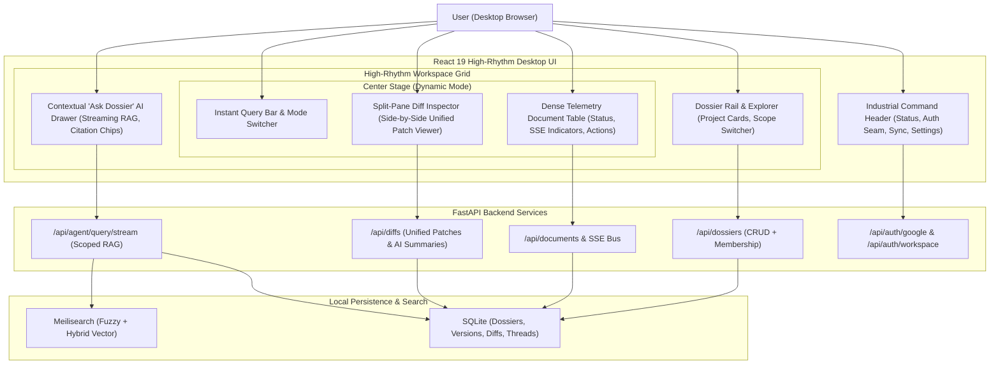
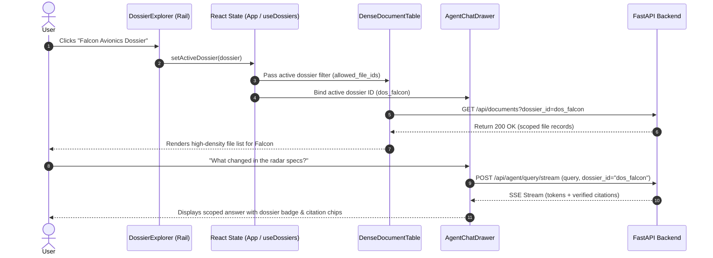

# Stage 1 Understanding: Task 10.4 — Complete High-Rhythm Frontend Redesign

**Task ID:** Task-10.4  
**Epic:** Epic 10 — Enterprise Workspace, Project Dossiers & Web OAuth  
**Git Branch:** `feat/task-10.4-high-rhythm-frontend`  
**Date:** 2026-09-04  
**Taste-Skill Design Read:**  
*"Reading this as: High-density desktop intelligence application for engineers, research teams, and executives, with an industrial-minimalist cockpit language (Linear + Teenage Engineering feel), leaning toward deep charcoal/OLED surfaces, double-bezel nested containers, monospace telemetry, and instant fluid navigation."*  
**Dials:** `DESIGN_VARIANCE: 6` | `MOTION_INTENSITY: 5` | `VISUAL_DENSITY: 8`  

---

## 1. Visual Architecture

---

## 2. The Physical Analogy

> Navigating documents across Google Drive without a Dossier-aware desktop application is like searching for mission blueprints across a warehouse floor littered with hundreds of unorganized folders. 
> 
> Task 10.4 converts Panopticon into an **Aviation Cockpit & Research Lab**: the left rail functions as a **Project Dossier Rack** where folders are categorized into active missions; the center console provides **High-Density Telemetry Gauges** showing real-time file updates and version comparisons; and the right side acts as an on-call **Flight Specialist ("Ask Dossier")** who reads only the documents relevant to that specific mission drawer.

---

## 3. Why & What

### 3.1 Why Are We Doing This Task?
1. **Dossier Disconnect:** Tasks 10.1 (Project Dossiers API) and 10.2 (Project-Scoped RAG) were built on the backend, but the frontend still lacks UI to browse dossiers, assign documents, or trigger scoped AI questions.
2. **Eliminate Generic "AI Slop":** The current interface relies on generic purple gradients (`#8B5CF6`), flat borders, and generic modals that make the application feel like a boilerplate template rather than a high-end desktop data tool.
3. **Split-Pane Workflow Efficiency:** Opening full-screen modals to inspect document version diffs interrupts browsing. A split-pane or inline inspector enables users to glance at unified diffs and AI change summaries while maintaining table context.
4. **Desktop High-Rhythm Navigation:** Power users require keyboard navigation, instant filtering, tabular figures, and dense typography without unnecessary padding waste.

### 3.2 What Is The Concept?
- **Anti-Slop Design Direction:** Driven by `design-taste-frontend` and `high-end-visual-design`:
  - **Double-Bezel Architecture (Doppelrand):** Major panels use outer shells (`border border-white/10 bg-black/20 p-1.5 rounded-xl`) containing inner cores (`bg-zinc-900/60 ring-1 ring-white/5 rounded-lg`), simulating precision-machined hardware.
  - **OLED/Dark Charcoal Palette:** Replaces generic purple with deep neutral canvas (`#0b0d11`), elevated panels (`#13161d`), subtle border hairlines (`#242936`), and a single deliberate accent (emerald or ice blue).
  - **Monospace Telemetry:** Monospace typography for file sizes, timestamps, version numbers, and hash IDs (`font-mono text-xs tabular-nums`).
- **Dossier Explorer:** Dedicated project workspace allowing users to switch between "All Documents" and specific Project Dossiers, viewing dossier document counts, member roles, and metadata.
- **Split-Pane Diff Inspector:** Replaces the disruptive modal with a docked split-pane inspector showing colorized diff patches (`+` green, `-` red) and OpenRouter AI change summaries.
- **Scoped "Ask Dossier" AI Drawer:** Automatically injects the active `dossier_id` into real-time SSE streaming queries, rendering interactive citation chips and thread histories.

### 3.3 What Breaks If We Skip It?
- Users cannot access any of the Epic 10 Dossier features from the UI.
- The UI retains an amateur, low-density template look that undermines enterprise credibility.
- RAG queries remain globally broad rather than container-isolated.

---

## 4. Abstraction Level Map

| Level | What Lives Here | Current Project Elements | Touched by Task 10.4? |
|---|---|---|---|
| **Product / UX** | Dossier workspace, high-density document table, split-pane diff viewer, scoped chat drawer | `Dashboard`, `DossierExplorer`, `DenseDocumentTable`, `SplitPaneDiffViewer`, `AgentChatDrawer` | **YES (Primary focus)** |
| **Application State** | Active dossier state, documents query, search filters, SSE live listeners, chat threads | `useDossiers.ts`, `useDocuments.ts`, `useAgentChat.ts`, `useSearch.ts` | **YES** |
| **Framework / Primitives**| React 19 hooks, Tailwind CSS utility classes, keyboard event listeners | `frontend/src/index.css`, Tailwind config, React 19 state | **YES** |
| **HTTP / Transport** | REST fetch requests, SSE EventSource streaming | `/api/dossiers`, `/api/documents`, `/api/diffs`, `/api/agent/query/stream` | Indirect (Consumption) |
| **Backend / DB** | FastAPI routes, SQLite database, Meilisearch index | `app/api/routes/*`, `app/indexer/storage.py`, Meilisearch | No (Preserved) |

---

## 5. Data Flow Diagram: Dossier Selection & Scoped Telemetry

---

## 6. Concept-to-Code Mapping

| Design Requirement | Implementation Target in Codebase | Concrete Technique / Pattern |
|---|---|---|
| **Dossier Data Types** | `frontend/src/types/api.ts` | Add `DossierSummary`, `DossierDetail`, `DossierCreatePayload` matching backend `app/api/schemas/dossiers.py`. |
| **Dossier Hook** | `frontend/src/hooks/useDossiers.ts` (NEW) | SWR/fetch state managing dossier list, active selection, creation, and item membership queries. |
| **Dossier Explorer Rail** | `frontend/src/components/dossiers/DossierExplorer.tsx` (NEW) | Horizontal or collapsible rail with project cards, badge counts, quick switch, and "+ New Project" modal. |
| **Double-Bezel Surfaces** | `frontend/src/index.css` & component wrappers | Outer ring (`border border-white/10 bg-black/40 rounded-2xl p-1`) + inner surface (`bg-zinc-900/80 ring-1 ring-white/5 rounded-xl`). |
| **Split-Pane Diff Inspector** | `frontend/src/components/diff/SplitPaneDiffViewer.tsx` (NEW) | Docked right/bottom split view showing version timelines, line-by-line patch coloring, and AI summaries. |
| **Scoped Agent Chat** | `frontend/src/hooks/useAgentChat.ts` & `AgentChatDrawer.tsx` | Inject `dossierId` parameter into `/api/agent/query/stream` body and display "Scoped to: {DossierName}" header badge. |
| **Industrial Navigation Header** | `frontend/src/components/navigation/Header.tsx` (NEW / Refactored) | High-contrast telemetry bar with system status, live SSE pulse, Google OAuth connect status, and quick sync. |

---

## 7. Verified vs. Inferred Behavior

- **VERIFIED:** Backend `/api/dossiers` endpoints exist and support listing, creating, reading, updating, and associating files (`app/api/routes/dossiers.py`).
- **VERIFIED:** Backend `/api/agent/query/stream` accepts `dossier_id` and restricts tool execution to member files (`tests/test_agent_scoped_dossier.py`).
- **VERIFIED:** Backend `/api/diffs/files/{file_id}/versions` and `/api/diffs/files/{file_id}/diffs` provide version histories and text patches (`app/api/routes/diffs.py`).
- **VERIFIED:** Zero unsolicited test runners (`pytest`, `npm test`) or `git push` commands may be run by the agent.
- **INFERRED:** The frontend currently runs React 19 with Tailwind 3.4, so pure Tailwind classes and CSS variables can be composed without adding extra heavyweight UI libraries.
