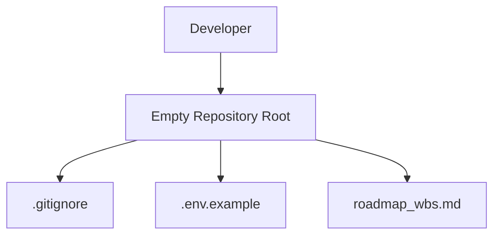
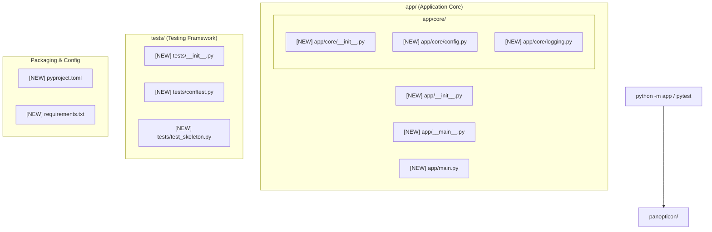
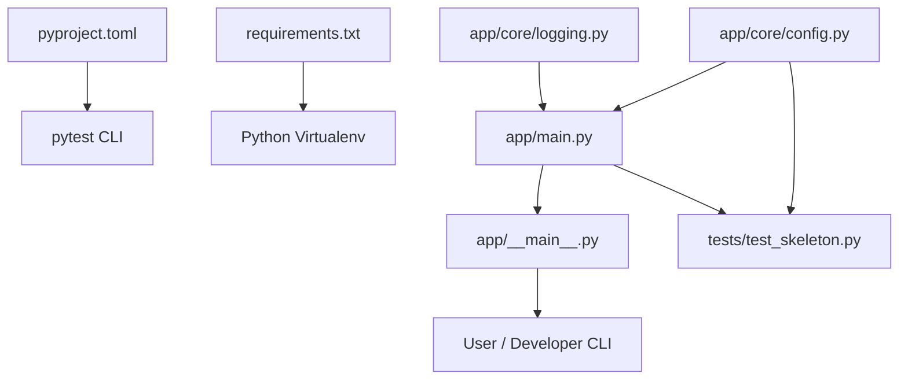

# Stage 2: Codebase Design — Task 1.1 Python Project Skeleton

**Task ID:** Task 1.1  
**Task Name:** Set up Python project skeleton  
**Epic:** Epic 1 — Foundation & Swappable Auth  
**Artifact Date:** 2026-08-27  

---

## 1. Current State Snapshot

- **Repository state:** Greenfield initialized with `.git`, `.gitignore`, `.env.example`, `roadmap_wbs.md`, and `.agents/`.
- **Existing source files:** Zero Python source files.
- **Before Architecture:**

---

## 2. Proposed State

- **Target Architecture:** Standard Python package with clean separation of core settings, logging, module entrypoint, and automated test suite.
- **After Architecture:**

---

## 3. File-Level Impact Analysis

### 3.1 New Files `[NEW]`

#### `[NEW]` `pyproject.toml`
- **Purpose:** Modern Python build system specification and tool configurations (pytest, ruff).
- **Exports:** Project metadata (`panopticon`), dependencies, pytest configuration (`pythonpath = ["."]`).
- **Consumers:** `pip`, `pytest`, IDE linters.

#### `[NEW]` `requirements.txt`
- **Purpose:** Direct pip-installable requirements manifest with development tools.
- **Dependencies:** Standard library friendly, `pydantic-settings`, `python-dotenv`, `google-api-python-client`, `google-auth-oauthlib`, `google-auth-httplib2`, `meilisearch`, `fastapi`, `uvicorn`, `pytest`, `pytest-asyncio`, `httpx`.
- **Consumers:** Virtual environment installer (`pip install -r requirements.txt`).

#### `[NEW]` `app/__init__.py`
- **Purpose:** Application package root marker with package version.
- **Exports:** `__version__ = "0.1.0"`.

#### `[NEW]` `app/__main__.py`
- **Purpose:** Enables running `python -m app` from CLI.
- **Exports:** Invokes `app.main.main()`.

#### `[NEW]` `app/main.py`
- **Purpose:** CLI application entrypoint, diagnostic self-check, and initialization reporting.
- **Exports:** `main() -> int`, `get_app_info() -> dict`.

#### `[NEW]` `app/core/__init__.py`
- **Purpose:** Core module namespace marker.

#### `[NEW]` `app/core/config.py`
- **Purpose:** Typed application settings loaded from environment or `.env` with safe defaults.
- **Exports:** `Settings` dataclass / Pydantic model, `get_settings() -> Settings`.

#### `[NEW]` `app/core/logging.py`
- **Purpose:** Central structured logging setup with standardized format.
- **Exports:** `setup_logging(log_level: str = "INFO") -> None`, `get_logger(name: str) -> logging.Logger`.

#### `[NEW]` `tests/__init__.py`
- **Purpose:** Tests package marker.

#### `[NEW]` `tests/conftest.py`
- **Purpose:** Global pytest fixtures and test environment setup.
- **Exports:** `test_settings` fixture.

#### `[NEW]` `tests/test_skeleton.py`
- **Purpose:** Smoke verification test suite.
- **Exports:** `test_package_imports()`, `test_settings_load()`, `test_main_entrypoint()`.

---

## 4. Blast Radius & Dependency Graph

---

## 5. Regression & Risk Assessment

| Risk Item | Severity | Probability | Mitigation Strategy |
| :--- | :---: | :---: | :--- |
| Import resolution failure on Windows (`python -m app`) | 🟢 Low | Low | Set `pythonpath = ["."]` in `pyproject.toml` and standard relative packaging. |
| Missing optional `.env` file crashes application | 🟢 Low | Low | Provide comprehensive defaults in `app/core/config.py` matching `.env.example`. |
| Dependency bloat / version conflict | 🟢 Low | Low | Use standard platform primitives first; pin minimum compatible versions in `requirements.txt`. |

---

## 6. Rollback Plan

- **Uncommitted changes:** `git restore .` and `git clean -fd`
- **Committed branch rollback:** `git checkout main && git branch -D feat/task-1.1-python-skeleton`

---

## 7. Verification Test Strategy (Stage 4 Target)

1. **CLI Execution Check:** Run `python -m app` and verify 0 exit code with diagnostic banner output.
2. **Settings Unit Test:** Verify `get_settings()` returns configured values without error.
3. **Automated Pytest Suite:** Run `pytest tests/test_skeleton.py -v` ensuring 100% test pass.
