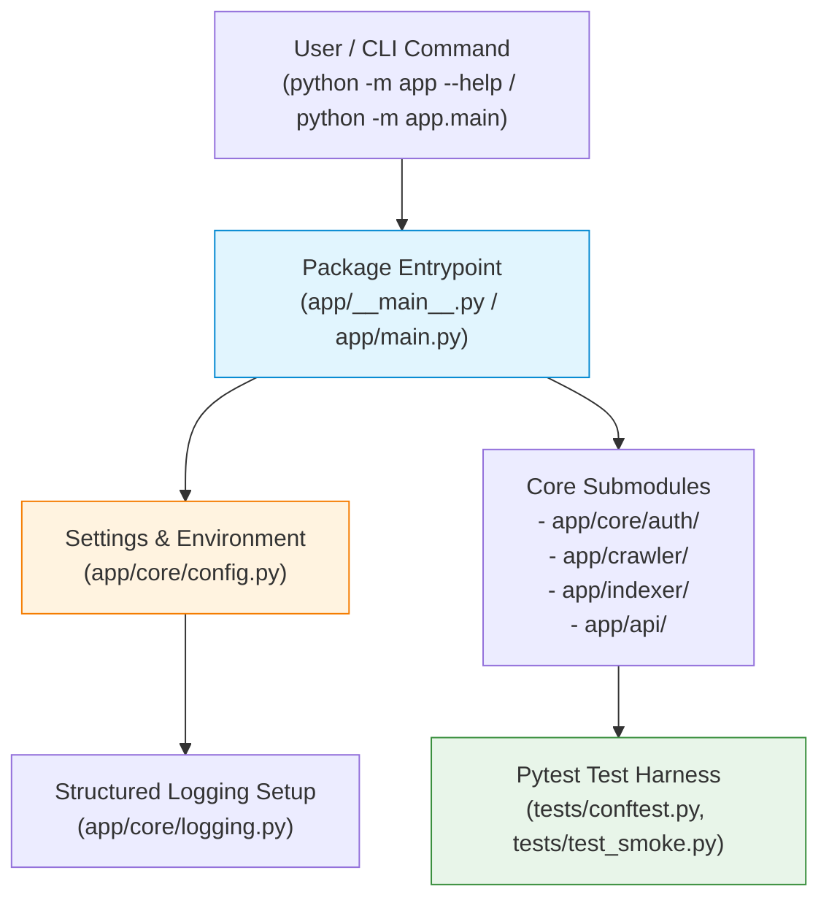
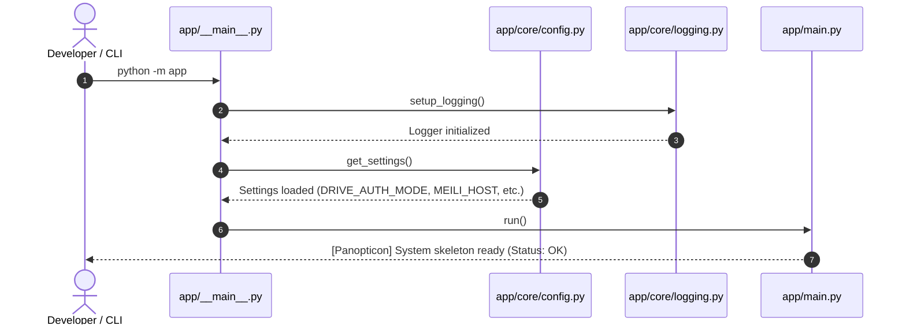
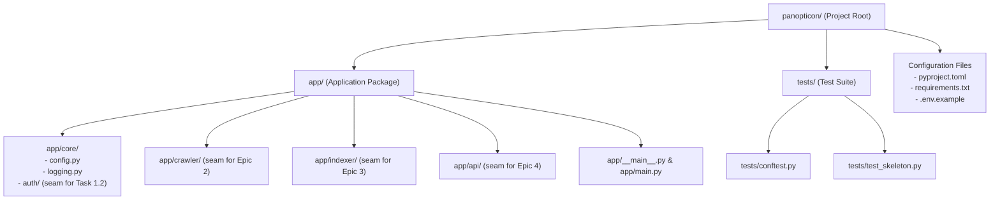

# Stage 1: Conceptual Understanding — Task 1.1 Python Project Skeleton

**Task ID:** Task 1.1  
**Task Name:** Set up Python project skeleton  
**Epic:** Epic 1 — Foundation & Swappable Auth  
**Target File Structure:** `app/`, `tests/`, `pyproject.toml`, `requirements.txt`, entrypoint module  

---

## 1. Visual Architecture

---

## 2. The Physical Analogy

> Setting up a Python project skeleton is like **building the steel frame, electrical conduit channels, and blueprint zoning of a new workshop before bringing in heavy machinery**.
> If you start throwing tools and parts on a dirt floor without designated storage racks, standard voltage outlets, and room labels, you quickly end up with tangled cords, lost tools, and dangerous short circuits. 
> The project skeleton provides standardized layout zones (`app/core/`, `app/crawler/`, `app/indexer/`, `app/api/`), a unified tool catalog (`pyproject.toml` / `requirements.txt`), and a main electrical switchboard (`__main__.py`) so every downstream tool (auth, crawler, search engine, API) plugs in seamlessly.

---

## 3. Why & What

### Why Are We Doing This Task?
Before writing Google Drive crawler logic, Meilisearch indexing, or FastAPI routes, the project needs an unambiguous, executable package layout. Without standard modular packaging:
- Python import paths become fragile and prone to `ModuleNotFoundError` or circular dependency traps.
- Dependencies drift between developers and environments.
- Testing frameworks cannot locate packages reliably.

### What is the Concept?
A standard modern Python package skeleton utilizing standard `src`/`app` layout, `pyproject.toml` configuration, structured logging, environment configuration loader, and an executable module entrypoint (`python -m app`).

### What Breaks If We Skip It?
1. **Import Chaos:** Ad-hoc scripts run from different working directories will fail on relative imports (e.g. `from core.auth import ...`).
2. **Environment Contamination:** Lack of standard dependency definitions leads to "works on my machine" failures.
3. **Untestable Code:** Tests cannot cleanly import application modules without manual `sys.path` hacks.

---

## 4. Abstraction Level Map

| Level | What Lives Here | Current Task 1.1 Implementation |
| :--- | :--- | :--- |
| **Product / CLI Experience** | User entry point & command line invocations | `python -m app` executing main entrypoint with `--help` and status reporting |
| **Application Layer** | Core application scaffolding & configuration | `app/core/config.py` loading `.env` properties safely |
| **Framework Layer** | Entrypoint & logging bootstrapping | `app/__main__.py` and `app/main.py` entrypoint routing |
| **Library Layer** | Packaging, typecheck, and test tools | `pyproject.toml`, `requirements.txt`, `pytest`, `ruff` |
| **Runtime Layer** | Python 3.10+ execution environment | Standard library `importlib`, `pathlib`, `os`, `sys` |
| **OS / Infrastructure** | File system paths & working directories | Cross-platform directory layout (Windows/Linux compatible) |

---

## 5. Mermaid Diagrams

### 5.1 Application Bootstrapping Sequence

### 5.2 Package Directory & Boundary Map

---

## 6. Data Flow Trace-Through

1. **Invocation:** Developer runs `python -m app` from the repository root.
2. **Package Resolution:** Python's module loader resolves `app/__main__.py`.
3. **Environment Inspection:** `app/core/config.py` safely reads environment variables (defaulting to safe local development values from `.env.example`).
4. **Diagnostic Verification:** The entrypoint verifies that core directories (`data/`, `logs/`) can be resolved or created.
5. **Output Confirmation:** The application prints structured initialization metadata confirming the skeleton is healthy.
6. **Test Verification:** `pytest tests/` runs `tests/test_skeleton.py` which validates package imports, configuration loading, and entrypoint execution with 100% pass rate.

---

## 7. Cognitive-to-Code Mapping

| Conceptual Need | Concrete Code Location | Responsibility |
| :--- | :--- | :--- |
| Single package entrypoint | `app/__main__.py` & `app/main.py` | Allows clean `python -m app` execution from anywhere |
| Centralized typed configuration | `app/core/config.py` | Type-safe settings with `.env` loading and zero hardcoded secrets |
| Unified log formatting | `app/core/logging.py` | Consistent console & file logging across all modules |
| Isolated domain modules | `app/crawler/`, `app/indexer/`, `app/api/` | Clean domain boundaries preventing spaghetti dependencies |
| Automated test suite | `tests/conftest.py` & `tests/test_skeleton.py` | Pytest fixtures and smoke verification tests |
