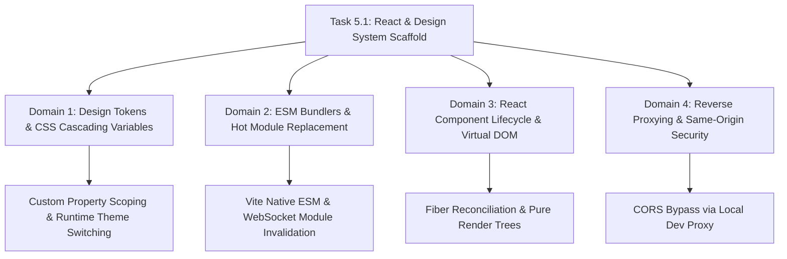

# Stage 3: CS Domain Learning — Task 5.1: Scaffold React App & Design System Foundation

## 1. Domain Discovery Map



---

## 2. Domain Deep Dives

### Domain 1: Design Tokens & CSS Custom Property Cascade

**What Is It (Plain English):**
Design tokens are standardized name-value pairs (like `--color-primary: #2563EB`) that store visual design decisions in a platform-agnostic format. When transformed into CSS Custom Properties (CSS variables), the browser's rendering engine evaluates these variables at runtime following standard CSS inheritance and cascade rules.

**Physical Analogy:**
Design tokens are like standard paint swatches in a hardware store. Instead of asking painters to mix red and blue paint on every job site (which results in random shades), the builder gives everyone a standard swatch card code ("Blue 600"). If the client decides to switch to a night-time lighting scheme, you don't repaint the building; you simply flip on a filter lens that re-maps the swatch values.

**How It Works Under the Hood:**
```markdown
| Layer | What Happens | Resource / Constraint |
|---|---|---|
| **Authoring** | JSON tokens define primitive and semantic palettes | `design-system/tokens.json` |
| **Compilation** | Tokens emitted into `:root` and `[data-theme='dark']` CSS rules | `src/styles/tokens.css` |
| **CSS OM Tree** | Browser parses variables into the CSS Object Model | Fast O(1) variable lookup |
| **Cascade Resolution**| Computed styles inherit down the DOM tree; theme swaps invalidate computed styles | GPU/Layout repaint only; zero JavaScript re-computation |
```

**Where It Manifests in This Codebase:**
- `design-system/tokens.json` — Canonical design token definitions.
- `frontend/src/styles/tokens.css` — CSS Custom Properties mapping.

**Common Misconceptions:**
1. ❌ *"CSS variables cause performance drops during scrolling."* → ✅ **Reality:** CSS variables have negligible runtime overhead; only mutations to root variables trigger a computed style recalculation.
2. ❌ *"Sass variables ($primary) are the same as CSS custom properties (--primary)."* → ✅ **Reality:** Sass variables are compiled away at build time and cannot change dynamically at runtime (e.g. for instant Dark Mode).

---

### Domain 2: Modern ESM Module Bundlers & Hot Module Replacement (HMR)

**What Is It (Plain English):**
Traditional web bundlers (like Webpack) bundle every JavaScript file into large chunk files before starting the development server. Vite uses native browser ES Modules (`import`/`export`), serving individual files on demand. When you edit a file, only that specific module is invalidated and sent over a WebSocket connection, updating the running page in milliseconds without a full page reload.

**Physical Analogy:**
Traditional bundling is like printing an entire 500-page book before you can read a single line. Modern ESM is like reading a digital document where each chapter loads only when you scroll to it, and correcting a typo instantly updates that single sentence without reprinting the book.

**How It Works Under the Hood:**
```markdown
| Step | Mechanism | Latency |
|---|---|---|
| 1. Server Start | Vite initializes HTTP server without pre-bundling | <150ms |
| 2. File Request | Browser asks for `main.tsx` via HTTP `GET` | Instant |
| 3. On-Demand Transpile | esbuild transpiles TypeScript/JSX to browser-standard JS | ~5-10ms |
| 4. Code Edit | File watcher triggers WebSocket `update` payload | <20ms |
| 5. Module Replacement | React Fast Refresh swaps the component function without losing UI state | Seamless |
```

**Where It Manifests in This Codebase:**
- `frontend/vite.config.ts` — Bundler and development server proxy configuration.

---

### Domain 3: React Virtual DOM Reconciliation & Component Trees

**What Is It (Plain English):**
React builds an in-memory tree representation of the user interface (the Virtual DOM). When application state changes (such as receiving a search response), React constructs a new Virtual DOM tree, performs a diffing algorithm (Reconciliation) against the previous tree, and calculates the minimal set of real DOM operations required to update the screen.

**Physical Analogy:**
Imagine an editor making revisions to an article. Instead of discarding the whole printing press and starting from scratch for every minor typo, the editor marks only the changed words with a red pen and replaces just those specific character blocks on the printing plate.

**Where It Manifests in This Codebase:**
- `frontend/src/App.tsx` & `frontend/src/components/` — Functional component trees.

---

### Domain 4: Reverse Proxying & Same-Origin Security (CORS)

**What Is It (Plain English):**
Web browsers enforce the Same-Origin Policy: a frontend running on `http://localhost:5173` cannot make AJAX requests to `http://localhost:8000` unless the backend sends CORS headers. Vite's development proxy solves this by intercepting `/api/*` requests in Node.js and forwarding them to `http://127.0.0.1:8000` on the server side, bypassing browser CORS restrictions entirely during development.

**Physical Analogy:**
A student living in a dorm isn't allowed to receive packages directly from an outside carrier at their door. Instead, the front desk receptionist (Vite proxy) accepts the package from the courier (FastAPI) and places it into the student's mail slot, keeping the interaction completely secure and frictionless.

---

## 3. Cross-Domain Connections

| Concept A | Concept B | Connection |
|---|---|---|
| CSS Custom Properties | React State (`theme`) | React toggles `data-theme="dark"` on `<html>`, triggering instant CSS variable cascade swap. |
| Vite Dev Proxy | FastAPI Endpoints | Frontend makes clean relative calls (`fetch('/api/system/status')`), maintaining identical paths in dev and prod. |
| TypeScript Types | Pydantic Schemas | `src/types/api.ts` mirrors FastAPI Pydantic models, guaranteeing compile-time API safety. |

---

## 4. Concept Evolution Timeline

| Level | Beginner Understanding | Advanced / Production Understanding |
|---|---|---|
| **Styling** | Put hex colors directly in CSS classes | Abstract into multi-tier semantic design tokens with runtime CSS custom properties |
| **Tooling** | Bundle the entire app before previewing | Serve unbundled ESM natively with instant on-demand transpile and WebSocket HMR |
| **API Wiring** | Hardcode `http://localhost:8000` in fetch calls | Use reverse proxies to maintain clean relative paths and zero CORS friction |

---

## 5. Vocabulary Reference

| Term | Definition | Codebase Example |
|---|---|---|
| **Design Token** | Platform-agnostic design decision (color, space, type) | `tokens.json` |
| **CSS Custom Property** | Native CSS variable (`var(--color-primary)`) | `src/styles/tokens.css` |
| **HMR** | Hot Module Replacement without reloading the page | Vite React Plugin |
| **Reconciliation** | React's algorithm for computing minimal real DOM mutations | React 19 Fiber Engine |
| **Reverse Proxy** | Server that intercepts requests and forwards to another server | `vite.config.ts` `server.proxy` |

---

## 6. "What If" Scenarios

### Q1: What if the FastAPI backend is offline when the frontend loads?
**Answer:** The frontend's `fetch('/api/system/status')` call fails gracefully (catches error). The `SystemStatusPill` component transitions to an amber/rose disconnected state showing *"Engine Disconnected — Start FastAPI server"* without crashing the dashboard.

### Q2: What if a developer introduces a hardcoded `#3B82F6` hex color in a component?
**Answer:** The Vermeer self-audit regex scan flags the raw hex code as a lint violation. The developer must replace it with a semantic token utility (e.g. `bg-primary` or `var(--color-primary)`).

### Q3: What if we switch between Light and Dark mode?
**Answer:** The `data-theme` attribute on `document.documentElement` changes between `"light"` and `"dark"`. The browser immediately re-evaluates the CSS custom properties in `tokens.css`, repainting the entire UI in <16ms with zero component re-mounts.

### Q4: What if an API field is added to FastAPI's response?
**Answer:** The TypeScript interface in `src/types/api.ts` is updated. TypeScript's strict compiler verifies all components using that interface, preventing runtime `undefined` property access bugs.

---

## 7. Further Reading
- **W3C Design Tokens Community Group Specification**: [Design Tokens Format Module](https://design-tokens.github.io/community-group/format/)
- **Vite Official Documentation**: [Why Vite & Native ESM](https://vitejs.dev/guide/why.html)
- **MDN Web Docs**: [Using CSS Custom Properties](https://developer.mozilla.org/en-US/docs/Web/CSS/Using_CSS_custom_properties)
