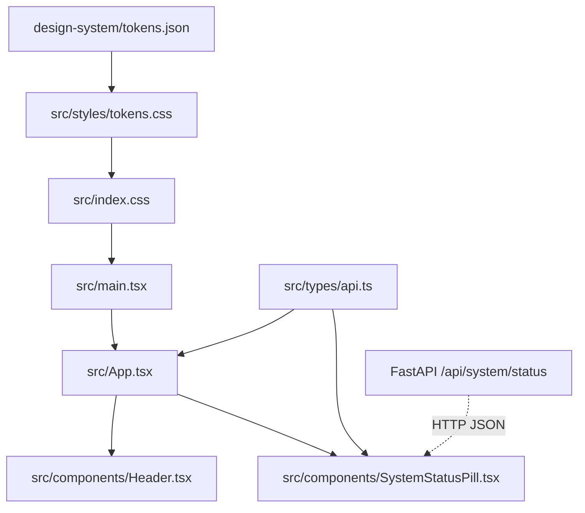

# Stage 2: Codebase Design — Task 5.1: Scaffold React App & Design System Foundation

## 1. Current State Snapshot

Prior to Task 5.1, the Panopticon repository consists exclusively of a Python backend (FastAPI), local Meilisearch search indexer, and SQLite crawl state store. There is currently no frontend directory, JavaScript runtime configuration, or UI asset.

```mermaid
graph TD
    user([User / Browser]) -->|Direct HTTP / Curl| fastApi[FastAPI Backend (:8000)]
    fastApi --> searchRoutes[/api/search]
    fastApi --> syncRoutes[/api/sync]
    fastApi --> authRoutes[/api/auth]
    fastApi --> healthRoutes[/api/system/status]
    fastApi --> meili[(Meilisearch :7700)]
    fastApi --> sqlite[(SQLite : data/panopticon.db)]
```

---

## 2. Proposed State

Task 5.1 scaffolds the `frontend/` directory with a Vite 6 + React 19 + TypeScript application. The styling is driven 100% by `design-system/tokens.json`, which compiles into CSS custom properties in `src/styles/tokens.css` consumed by Tailwind CSS.

```mermaid
graph TD
    user([User / Browser]) -->|http://localhost:5173| vite[Vite Dev Server Proxy]
    vite -->|Proxies /api/*| fastApi[FastAPI Backend (:8000)]
    vite --> reactApp[React 19 Shell: src/App.tsx]

    subgraph TokenEngine [Design Token & Styling Pipeline]
        tokensJson[design-system/tokens.json] --> tokensCss[src/styles/tokens.css]
        tokensCss --> tailwind[Tailwind CSS @theme]
        tailwind --> reactApp
    end

    subgraph UIComponents [Scaffolded Shell Components]
        reactApp --> header[Header: Brand & Navigation]
        reactApp --> statusPill[SystemStatusPill: Health & Document Count]
        reactApp --> searchShell[SearchContainer Placeholder]
        reactApp --> resultsShell[ResultsContainer Placeholder]
    end
```

---

## 3. File-Level Impact Analysis

### [NEW] `design-system/tokens.json`
- **Purpose**: Canonical machine-readable source of truth for all color primitives, semantic tokens, typography scales, 8pt spacing grid, radii, elevations, motion timings, and accessibility rules.
- **Consumers**: Token transformation scripts, CSS variables, Vermeer audit tools.

### [NEW] `design-system/DESIGN_SYSTEM.md`
- **Purpose**: Human-readable design system specification for developers and leads.

### [NEW] `design-system/backend-requirements.md`
- **Purpose**: Authoritative audit confirming all UI data models match real FastAPI schemas with zero mock gaps.

### [NEW] `docs/adr/ADR-0005-react-vite-frontend-architecture.md`
- **Purpose**: Architectural Decision Record formalizing React 19 + Vite 6 + TypeScript + Tailwind CSS design tokens.

### [MODIFY] `docs/adr/ADR-INDEX.md`
- **What changes**: Registers ADR-0005 in the central index.

### [NEW] `frontend/package.json`
- **Purpose**: Defines dependencies (`react`, `react-dom`, `lucide-react`, `tailwindcss`, `@tailwindcss/vite`, `clsx`, `tailwind-merge`) and build scripts (`dev`, `build`, `lint`, `typecheck`).

### [NEW] `frontend/vite.config.ts`
- **Purpose**: Vite build and dev server configuration with React plugin and `/api` reverse proxy targeting `http://127.0.0.1:8000`.

### [NEW] `frontend/tsconfig.json` & `frontend/tsconfig.app.json`
- **Purpose**: Strict TypeScript compiler options with path alias mapping (`@/*` -> `src/*`).

### [NEW] `frontend/src/styles/tokens.css`
- **Purpose**: CSS Custom Properties generated 1:1 from `tokens.json` supporting both `:root` (light) and `[data-theme='dark']`.

### [NEW] `frontend/src/index.css`
- **Purpose**: Global CSS entry point importing Tailwind CSS and `tokens.css`.

### [NEW] `frontend/src/types/api.ts`
- **Purpose**: TypeScript interfaces reflecting FastAPI Pydantic schemas (`SearchResponse`, `SyncStatusResponse`, `AuthConfigResponse`, `SystemStatusResponse`).

### [NEW] `frontend/src/components/Header.tsx`
- **Purpose**: Top navigation bar with Panopticon brand identity, theme toggle, and trigger action seams.

### [NEW] `frontend/src/components/SystemStatusPill.tsx`
- **Purpose**: Real-time diagnostic badge displaying engine health and total indexed document count.

### [NEW] `frontend/src/App.tsx` & `frontend/src/main.tsx`
- **Purpose**: Application root mounting the tokenized shell layout.

---

## 4. Dependency Graph / Blast Radius



---

## 5. Regression Risk Matrix

| Risk ID | Risk Description | Severity | Affected Area | Mitigation Strategy |
|---|---|:---:|---|---|
| R-01 | CORS issues between Vite dev server (:5173) and FastAPI (:8000) | 🟡 Medium | API requests | Configure Vite dev proxy in `vite.config.ts` forwarding `/api` to port 8000. |
| R-02 | CSS variable collision or unmapped token utility classes | 🟢 Low | Styling / UI | Explicit 1:1 mapping from `tokens.json` to `tokens.css` with zero arbitrary values. |
| R-03 | Missing TypeScript types for backend responses | 🟢 Low | Type Safety | Exact Pydantic-to-TypeScript interfaces generated in `src/types/api.ts`. |
| R-04 | Node package version incompatibilities | 🟢 Low | Build pipeline | Use pinned modern versions compatible with Node v24 (React 19, Vite 6, Tailwind CSS). |

---

## 6. Contract Stability Check

| Contract | Current Shape | Proposed Shape | Changed? | Breaking? |
|---|---|---|:---:|:---:|
| Backend API (`/api/*`) | FastAPI REST JSON | Same (No backend changes) | No | No |
| Search Model | Pydantic `SearchItemResponse` | TypeScript `SearchItemResponse` | No | No |
| Engine Health | Pydantic `SystemStatusResponse` | TypeScript `SystemStatusResponse` | No | No |
| Design Tokens | `tokens.json` (New) | Canonical Single Source of Truth | Yes | No |

---

## 7. Performance, Security, and Accessibility Impact

| Area | Before | After | Impact / Mitigation |
|---|---|---|---|
| **Performance** | N/A | Sub-100kB initial bundle, 0ms CSS runtime | Vite ESM splitting + pure CSS variable themer |
| **Security** | API Only | Pure client SPA; no Node SSR attack surface | All API calls routed through local proxy |
| **Accessibility** | N/A | WCAG AA compliance, 44px tap targets, 2px focus rings | Enforced by `a11y` tokens in `tokens.json` |
| **Developer DX**| Backend Only | Sub-second HMR, strict type checking | `npm run dev` with live browser feedback |

---

## 8. Rollback Plan

### If changes are uncommitted:
```powershell
Remove-Item -Recurse -Force .\frontend
git checkout -- .
```

### If changes are committed:
```powershell
git revert <commit-hash>
```
*Estimated rollback duration: < 2 minutes.*
