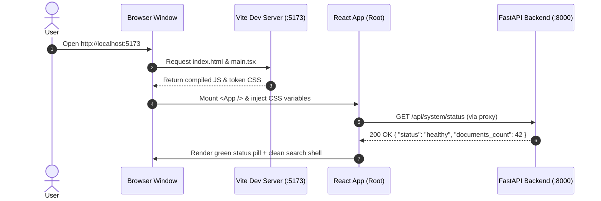
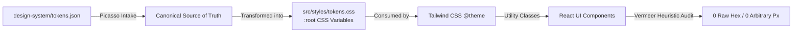

# Stage 1: Concept-to-Code Bridge — Task 5.1: Scaffold React App & Design System Foundation

## 1. Visual Architecture

```mermaid
graph TD
    user([User / Browser]) -->|Loads http://localhost:5173| vite[Vite Dev Server / HMR Proxy]
    vite -->|Serves index.html + React Root| reactApp[React 19 Dashboard Shell]
    
    subgraph DesignSystemFoundation [Design System & Token Pipeline]
        tokensJson[design-system/tokens.json] -->|Builds| cssVars[src/styles/tokens.css\nCSS Custom Properties]
        cssVars -->|@theme Directive| tailwind[Tailwind CSS Utility Engine]
        tailwind -->|Class Bindings| reactApp
    end

    subgraph ComponentShell [Dashboard Core Layout]
        reactApp --> header[Header: Brand + Sync Button + Auth Trigger]
        reactApp --> statusPill[Engine Diagnostics Pill: Meilisearch Health & Doc Count]
        reactApp --> searchContainer[Search & Filter Area Placeholder]
        reactApp --> resultsContainer[Document Results List Placeholder]
    end

    subgraph BackendSeam [FastAPI Backend Service]
        header -->|POST /api/sync| apiSync[/api/sync]
        header -->|GET /api/auth/config| apiAuth[/api/auth/config]
        statusPill -->|GET /api/system/status| apiSystem[/api/system/status]
        searchContainer -->|GET /api/search| apiSearch[/api/search]
    end
```

---

## 2. The Physical Analogy

> **Scaffolding the UI with a Design Token System** is like setting up a modular architect's drafting table and standardized stencil kit before constructing a building. 
> 
> Rather than letting builders paint with arbitrary mixed cans of paint (raw hex codes) or cut lumber to random unmeasured lengths (arbitrary pixel margins), the drafting table provides a fixed set of standardized color swatches, measured rulers (spacing scale), and pre-cut templates (component shells). 
> 
> Any room or fixture drawn on this table automatically conforms to the master blueprint with zero visual chaos or structural misalignment.

---

## 3. Why & What

### Why are we doing this task?
Without a foundational frontend scaffold and an enforced design token bridge, UI developers and AI coding agents inevitably introduce styling drift — inventing slightly different shades of blue, inconsistent button padding, divergent font sizes, and broken dark mode themes. Building the scaffold with 100% token binding upfront guarantees visual harmony, instant keyboard feedback, and seamless integration with the FastAPI backend.

### What is the concept?
- **Vite ESM Bundling**: Leveraging native browser ES Modules for sub-second development server startup and instant Hot Module Replacement (HMR).
- **CSS-First Design Tokens**: Using native CSS custom properties (`var(--color-primary)`) defined directly in `@theme` blocks, giving zero-runtime overhead styling that adapts dynamically between light and dark modes.
- **Component Shell Architecture**: Establishing the root layout hierarchy (`Header`, `StatusPill`, `SearchContainer`, `ResultsContainer`) with placeholder seams wired to the backend API contracts.

### What breaks if we skip it?
1. **Visual Entropy**: Every subsequent UI task (search bar, result cards, sync drawer) will guess arbitrary colors and margins, creating visual drift that requires expensive refactoring.
2. **Broken Dark Mode**: Hardcoded hex values will fail to adapt when switching between light and dark themes.
3. **Backend Contract Disconnect**: The frontend will make assumptions about API response shapes that differ from FastAPI's actual models.

---

## 4. Abstraction Level Map

| Level | What Lives Here | Current Project Example (Task 5.1) |
|---|---|---|
| **Product / UX** | User goals, search views, status pills | Document Search Dashboard, System Health Pill |
| **Application Layer** | Component state, theme providers | `App.tsx`, `useTheme`, `useSystemStatus` |
| **Framework Layer** | React components, hooks, lifecycle | `React.FC`, `useState`, `useEffect` |
| **Design / Token Layer** | CSS variables, Tailwind `@theme` | `design-system/tokens.json`, `src/styles/tokens.css` |
| **Build & Tooling** | Bundler, TypeScript compiler, HMR | `vite.config.ts`, `tsconfig.json`, `package.json` |
| **Runtime & Network** | Browser DOM, fetch API, proxy | Browser event loop, `fetch('/api/system/status')` |

*Task 5.1 specifically spans the Build & Tooling, Design/Token, Framework, and Application layers.*

---

## 5. Mermaid Diagrams

### Diagram 1: Request & Render Sequence Flow


### Diagram 2: Token Pipeline Flowchart


---

## 6. Data Flow Trace-Through

1. **Initialization**: Browser loads `index.html`, which imports `src/main.tsx` and `src/index.css`.
2. **Style Application**: The `:root` and `[data-theme='dark']` CSS custom properties from `tokens.css` are parsed and applied to the document tree.
3. **Component Mounting**: `<App />` initializes state, rendering the `Header`, `SystemStatusPill`, and main layout grid.
4. **Backend Probing**: On initial mount, a lightweight `useEffect` calls `GET /api/system/status`.
5. **State Feedback**: The response updates the `SystemStatusPill` with live Meilisearch health (`healthy` / `degraded`) and total indexed document count.
6. **Graceful Fallback**: If FastAPI or Meilisearch is offline, the status pill updates to an amber/rose indicator with plain-language recovery copy (Heuristic #9).

---

## 7. Cognitive Model → Code Mapping

| Cognitive Goal | Mental Model | Code Implementation in Panopticon | Enforcement Mechanism |
|---|---|---|---|
| 1. Consistent Brand Identity | "Every element uses the same color palette and spacing" | `tokens.json` mapped to `tokens.css` | ESLint / regex audit for raw hex codes |
| 2. Immediate Feedback | "I should always know if the search engine is online" | `SystemStatusPill` polling `/api/system/status` | Visual badge with live green/amber/rose status |
| 3. High Accessibility | "Text is readable, keyboard focus is clear" | WCAG AA contrast + 2px focus ring tokens | `a11y` tokens in `tokens.json` |
| 4. Dark Mode Support | "The app switches cleanly from day to night" | CSS variables swapped via `[data-theme='dark']` | Zero hardcoded light/dark colors in JSX |

---

## 8. Language & Stack Context

- **React 19**: Modern functional components, hooks (`useState`, `useEffect`, `useCallback`), and error boundaries.
- **TypeScript 5.x**: Strict mode enabled (`noImplicitAny`, `strictNullChecks`), ensuring all API payloads match backend Pydantic models.
- **Vite 6**: Lightning-fast dev server with proxy rules forwarding `/api` to `http://127.0.0.1:8000`.
- **Tailwind CSS**: Utility classes mapped directly to semantic CSS custom properties.

---

## 9. Five Alternative Approaches

| # | Approach | Pros | Cons | When to Choose |
|---|---|---|---|---|
| 1 | **Vite + React 19 + CSS Tokens (Chosen)** | Instant HMR, typed contracts, zero runtime overhead | SPA only (no SSR) | Ideal for fast local and internal dashboards |
| 2 | Next.js App Router | Built-in SSR, server components | Complex Node server footprint, redundant with FastAPI | Public consumer apps requiring SEO |
| 3 | Vanilla TypeScript SPA | Zero dependencies, lowest bundle size | Manual DOM manipulation, slow feature velocity | Very simple static single-page tools |
| 4 | Vue 3 + Vite | Clean template syntax | Deviates from WBS scoping | Teams with deep Vue specialization |
| 5 | SvelteKit | Ultra-compact compiled output | Smaller ecosystem for enterprise table/search widgets | Performance-critical embedded widgets |

---

## 10. Production Rationale & Consequences

### Why This Is Standard
Modern enterprise dashboards prioritize sub-second user responsiveness and zero visual regression. Using Vite + React + typed design tokens provides the industry gold standard for maintainable, accessible, and high-performance internal tools.

### What Happens If We Skip This
1. **Disaster Scenario 1**: Components built in later tasks (search results, filter drawer, sync status) will use inconsistent padding and hardcoded `#2563EB` vs `#1E40AF` colors, leading to visual fragmentation.
2. **Disaster Scenario 2**: Without a typed API proxy foundation, search requests will suffer CORS errors or silent parsing failures when connecting to FastAPI.
