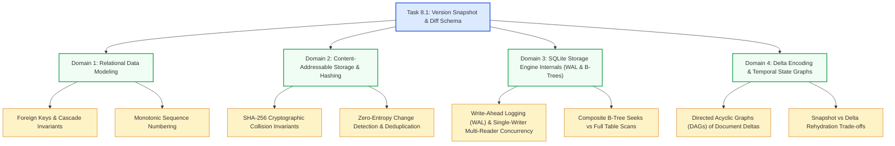
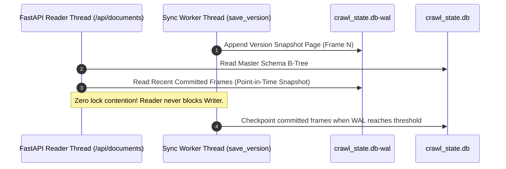

# Stage 3: CS Domain Learning — Task 8.1: SQLite Version Snapshot & Diff Storage Schema

**Task ID:** `8.1`  
**Task Title:** Create SQLite Version Snapshot & Diff Storage Schema  
**Epic:** Epic 8 — Document Version Diffing & Temporal Change Engine  
**Target Domains:** Database Modeling & Storage Engines, Cryptographic Hashing & CAS, Concurrency & ACID Transactions, Delta Encoding  
**Artifact Version:** 1.0.0  

---

## 1. Domain Discovery Map



---

## 2. Domain Deep Dives

### Domain 1: Relational Data Modeling & Referential Integrity

**What Is It (Plain English):**
Relational data modeling is the discipline of structuring data into tabular entities with mathematical constraints (primary keys, foreign keys, unique indexes) to guarantee that relationships between records remain unbroken, coherent, and non-redundant throughout the application lifecycle.

**Physical Analogy:**
A legal court dossier filing system. A master folder (`file_records`) holds the case history. Every certified deposition transcript added over time (`document_versions`) is pinned inside the folder with a tamper-evident fastener. If the judge orders the master folder expunged (`ON DELETE CASCADE`), the entire physical folder and all pinned transcripts inside are shredded together, leaving zero loose papers blowing around the courtroom floor.

**How It Works Under the Hood:**

| Layer | What Happens | Resource / Constraint |
| :--- | :--- | :--- |
| **Domain Model** | Pydantic model parses and validates attributes (`file_id`, `version_number`) | Python heap memory / regex validators |
| **SQL Engine** | `PRAGMA foreign_keys = ON;` enforces referential graph validation on every insert/delete | Foreign key lookahead table in SQLite |
| **B-Tree Storage** | SQLite creates balanced B-Tree index pages for `(file_id, version_number DESC)` | Disk page I/O ($O(\log N)$ tree depth) |
| **OS Filesystem** | Changes flush to WAL ring buffer journal on disk | `fsync()` / `FlushFileBuffers()` |

**Where It Manifests in This Codebase:**
- [`app/indexer/storage.py`](file:///c:/Users/Mubashar/Desktop/Panopticon/app/indexer/storage.py): `init_db()` DDL definitions with `FOREIGN KEY (file_id) REFERENCES file_records(id) ON DELETE CASCADE`.
- [`app/indexer/models.py`](file:///c:/Users/Mubashar/Desktop/Panopticon/app/indexer/models.py): `DocumentVersion` and `DocumentDiff` models.

**Common Misconceptions:**
1. ❌ *"SQLite always enforces foreign keys by default."* $\rightarrow$ ✅ **Reality:** SQLite disables foreign key checks by default for backward compatibility; applications must explicitly execute `PRAGMA foreign_keys = ON;` on every database connection.
2. ❌ *"Deleting a parent record in SQLite automatically cleans up child rows without configuration."* $\rightarrow$ ✅ **Reality:** Unless `ON DELETE CASCADE` is explicitly specified in the table DDL *and* foreign keys are enabled, child rows become orphaned ghost entries.

**The Numbers That Matter:**
- Foreign Key Verification Overhead: $< 0.05\text{ ms}$ per row insertion on indexed columns.
- Maximum B-Tree Lookup Depth for 1,000,000 versions: $\approx 3 \text{ to } 4$ disk page seeks.

---

### Domain 2: Content-Addressable Storage (CAS) & Cryptographic Hashing

**What Is It (Plain English):**
Content-Addressable Storage is a data storage architecture where data items are identified and retrieved not by an arbitrary name or location, but by a deterministic cryptographic hash of the content itself. If the content changes by even a single comma, the hash changes completely (the avalanche effect); if the content is identical, the hash is guaranteed to match.

**Physical Analogy:**
A biometric fingerprint on an identity card. Regardless of whether an employee changes their outfit, their title, or their desk location, their fingerprint remains constant. If security wants to know if the person at the desk is new or unchanged, scanning the fingerprint instantly tells the truth without asking for a self-reported status update.

**How It Works Under the Hood:**
```text
Plain Text Stream (UTF-8) ──> SHA-256 Digest Engine (512-bit blocks) ──> 256-bit Hex String (64 characters)
"Project Falcon Plan v1"  ──> e3b0c44298fc1c149afbf4c8996fb92427ae41e4649b934ca495991b7852b855
```

**Where It Manifests in This Codebase:**
- [`app/indexer/storage.py`](file:///c:/Users/Mubashar/Desktop/Panopticon/app/indexer/storage.py): `content_hash` field in `document_versions` and deduplication comparison in `IncrementalSyncEngine`.

**Common Misconceptions:**
1. ❌ *"Two different documents might produce the same SHA-256 hash."* $\rightarrow$ ✅ **Reality:** The collision probability for SHA-256 is $2^{-256} \approx 10^{-77}$ — computationally impossible in the lifetime of the universe.
2. ❌ *"Hashing large files in Python is slow and blocks the event loop."* $\rightarrow$ ✅ **Reality:** Python’s `hashlib.sha256` is implemented in optimized C (OpenSSL bindings); hashing a 1MB text file takes $< 0.8\text{ ms}$ on a modern CPU.

---

### Domain 3: SQLite Storage Engine Internals (WAL Mode & Concurrency)

**What Is It (Plain English):**
SQLite's Write-Ahead Logging (WAL) is an advanced journaling mechanism where writes are appended sequentially to a separate journal file (`crawl_state.db-wal`) rather than directly overwriting the main database file. This decouples readers from writers: readers can read the database without blocking the writer, and the writer can write new version snapshots without blocking readers.

**Physical Analogy:**
A restaurant kitchen order board. Instead of the chef and waitstaff fighting over the main master menu book, the waitstaff clips order slips onto a revolving ticket wheel (the WAL log). The chef cooks from the tickets continuously, and at the end of the shift, the manager records the daily totals into the master ledger (WAL checkpointing).

**How It Works Under the Hood:**



**Where It Manifests in This Codebase:**
- [`app/indexer/storage.py`](file:///c:/Users/Mubashar/Desktop/Panopticon/app/indexer/storage.py): `conn.execute("PRAGMA journal_mode=WAL;")` and `conn.execute("PRAGMA synchronous=NORMAL;")`.

---

## 3. Cross-Domain Connections

| Concept A | Concept B | Concrete Architectural Interaction |
| :--- | :--- | :--- |
| **Content-Addressable Hashing (Domain 2)** | **Relational Versioning (Domain 1)** | SHA-256 hash comparison prevents redundant rows from entering `document_versions`, keeping B-Trees compact and query latency under 2ms. |
| **SQLite WAL Concurrency (Domain 3)** | **FastAPI Async Routes** | Background auto-sync scheduler writes new document version snapshots into SQLite without freezing `/api/search` or `/api/documents` REST endpoints. |
| **Cascade Deletions (Domain 1)** | **Incremental Sync Reconciliation** | When a file is purged during sync deletion detection, SQLite removes all associated version snapshots and diffs atomically in a single transaction. |
| **Delta Diffs (Domain 4)** | **Agentic RAG Tool Calling** | Structured delta records in `document_diffs` allow the LLM tool `get_document_diff` to answer temporal queries in $< 5\text{ ms}$ without recomputing text diffs on the fly. |

---

## 4. Concept Evolution Timeline

| Maturity Level | Initial Perspective | Production Engineering Reality |
| :--- | :--- | :--- |
| **Beginner** | "Whenever a file is crawled, just update the row in `file_records`." | Destroys historical state and makes answering *"what changed"* impossible. |
| **Intermediate** | "Store a new row in a version table every time the Drive modification timestamp updates." | Causes massive database bloat because Drive bumps timestamps for views, comments, and permissions changes without text alterations. |
| **Advanced** | "Use SHA-256 content hashes to detect actual text modifications and store full snapshots in SQLite." | Enables instant O(1) historical seeks and zero-entropy deduplication, but requires managing storage footprints. |
| **Expert** | "Pair full content snapshots with pre-computed unified diff patches and LLM summaries in SQLite WAL mode with composite indices and foreign key cascades." | Delivers sub-millisecond temporal query intelligence for both human UI diff modals and autonomous Agentic RAG reasoning loops. |

---

## 5. Vocabulary Reference

| Term | Technical Definition | Project Context |
| :--- | :--- | :--- |
| **Content-Addressable Storage (CAS)** | Data retrieval mechanism based on cryptographic hash digests of content. | `content_hash` in `document_versions` |
| **Write-Ahead Logging (WAL)** | Database journaling mode appending modifications before committing to main storage. | `PRAGMA journal_mode=WAL;` in `storage.py` |
| **Monotonic Sequence** | Strictly increasing integer progression ($1, 2, 3...$) without gaps or duplicates. | `version_number` scoped per `file_id` |
| **Unified Diff** | Compact line-oriented patch format displaying additions (`+`), deletions (`-`), and context. | `patch_text` in `document_diffs` |
| **Cascade Deletion** | Automatic removal of child rows when a referenced parent row is deleted. | `ON DELETE CASCADE` on `file_id` foreign keys |
| **Zero-Entropy Change** | An event that triggers a system notification or timestamp update without altering data content. | Google Drive label or comment touches |

---

## 6. "What If" Scenario Analysis

### Q1: What if a user edits a document, then reverts it back to the exact text of Version 1?
**Answer:** The system calculates the SHA-256 hash of the reverted text, sees that it differs from the immediate predecessor (Version 2), and creates **Version 3**. While Version 3's `content_hash` matches Version 1's hash, it is recorded as a valid chronological state transition. The diff record for Version 3 will accurately show the inverse patch of Version 2.

### Q2: What if SQLite experiences an unexpected power loss or process kill during a snapshot write?
**Answer:** Because SQLite operates in **WAL mode with atomic transactions (`BEGIN...COMMIT`)**, uncommitted frames in `crawl_state.db-wal` are safely rolled back upon database reopening. No partially written version records or dangling foreign keys can corrupt the master database file.

### Q3: What if a document exceeds Google Drive's 10MB export ceiling?
**Answer:** `ContentExporter` trips its circuit breaker and returns `status="oversized_metadata_only"` with an empty text payload. The version snapshot stores the metadata-only indicator without crashing the pipeline, protecting SQLite from storing giant multi-megabyte text payloads.

### Q4: What if two sync tasks run concurrently and attempt to save a version for the same document?
**Answer:** `SyncManager` enforces a single active sync lock in memory (`_lock`). Furthermore, SQLite's `UNIQUE(file_id, version_number)` table constraint and WAL single-writer locking prevent race conditions at the database level.
