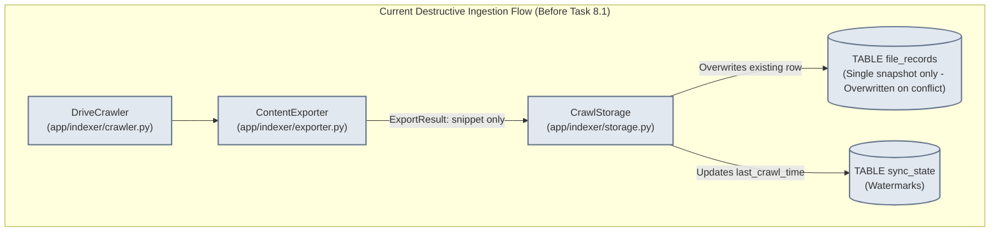
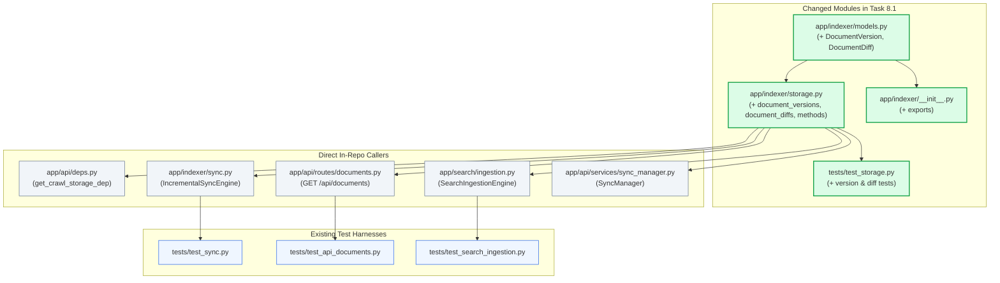

# Stage 2: Codebase Design — Task 8.1: SQLite Version Snapshot & Diff Storage Schema

**Task ID:** `8.1`  
**Task Title:** Create SQLite Version Snapshot & Diff Storage Schema  
**Epic:** Epic 8 — Document Version Diffing & Temporal Change Engine  
**Target Files:**
- `[MODIFY]` [`app/indexer/models.py`](file:///c:/Users/Mubashar/Desktop/Panopticon/app/indexer/models.py)
- `[MODIFY]` [`app/indexer/storage.py`](file:///c:/Users/Mubashar/Desktop/Panopticon/app/indexer/storage.py)
- `[MODIFY]` [`app/indexer/__init__.py`](file:///c:/Users/Mubashar/Desktop/Panopticon/app/indexer/__init__.py)
- `[MODIFY]` [`tests/test_storage.py`](file:///c:/Users/Mubashar/Desktop/Panopticon/tests/test_storage.py)
**Artifact Version:** 1.0.0  
**Status:** READY FOR IMPLEMENTATION  

---

## 1. Current State Snapshot

Currently, Panopticon’s persistence layer in `app/indexer/storage.py` manages only:
1. **`sync_state`**: Key-value watermark timestamps (`last_crawl_time`).
2. **`file_records`**: Google Drive metadata, project tags, owners, permissions, export status, and a single 500-character truncated preview snippet (`content_snippet`).

When `IncrementalSyncEngine` runs during crawl, it updates `file_records` in place (`ON CONFLICT(id) DO UPDATE SET ...`). The previous state of the document is overwritten destructively, leaving zero temporal trail of edits, previous text, or change diffs.



---

## 2. Proposed State

Task 8.1 introduces two relational tables, immutable Pydantic domain models, and high-performance repository methods into `CrawlStorage`:

1. **`document_versions`**: Stores full immutable snapshots of extracted text with `content_hash` (SHA-256), `version_number` (monotonic integer scoped per document), `editor`, `modified_time`, `char_count`, `word_count`, and `created_at`.
2. **`document_diffs`**: Stores structured delta relationships (`from_version_id` $\rightarrow$ `to_version_id`) with `patch_text` (unified diff string), `lines_added`, `lines_removed`, `ai_summary`, and `created_at`.

```mermaid
graph TD
    subgraph ProposedPersistenceFlow ["Proposed Versioning & Diff Persistence Flow (After Task 8.1)"]
        Crawler["DriveCrawler"]
        Exporter["ContentExporter"]
        Hasher["Content Hasher & Deduplicator\n(hashlib.sha256)"]
        Storage["CrawlStorage [ENHANCED]\n(app/indexer/storage.py)"]

        subgraph SQLiteTables ["SQLite (crawl_state.db - WAL Mode)"]
            FileTable[("TABLE file_records\n[EXISTING]\n(Metadata, Owners, Tags)")]
            VersionTable[("TABLE document_versions\n[NEW]\n(Snapshots, SHA-256, Versions)")]
            DiffTable[("TABLE document_diffs\n[NEW]\n(Patches, AI Summaries, Deltas)")]
            SyncState[("TABLE sync_state\n[EXISTING]\n(Watermarks)")]
        end

        subgraph DownstreamConsumers ["Future Consumers (Tasks 8.2 - 9.5)"]
            DiffEngine["DiffEngine\n(Task 8.2)"]
            Summarizer["ChangeSummarizer\n(Task 8.3)"]
            DiffAPI["FastAPI /api/documents/{id}/diffs\n(Task 8.4)"]
            AgentEngine["Agentic RAG Engine\n(Task 9.3)"]
        end
    end

    Crawler --> Exporter
    Exporter --> Hasher
    Hasher --> Storage
    Storage -->|Upsert metadata| FileTable
    Storage -->|save_version()| VersionTable
    Storage -->|save_diff()| DiffTable
    Storage -->|set_watermark()| SyncState

    VersionTable --> DiffEngine
    DiffEngine --> Summarizer
    Summarizer --> Storage

    VersionTable --> DiffAPI
    DiffTable --> DiffAPI
    DiffTable --> AgentEngine

    classDef existing fill:#e2e8f0,stroke:#64748b,stroke-width:1px;
    classDef newTable fill:#dcfce7,stroke:#16a34a,stroke-width:2px;
    classDef consumer fill:#fef3c7,stroke:#d97706,stroke-width:1px;
    class FileTable,SyncState,Crawler,Exporter existing;
    class VersionTable,DiffTable,Hasher,Storage newTable;
    class DiffEngine,Summarizer,DiffAPI,AgentEngine consumer;
```

---

## 3. File-Level Impact Analysis

### `[MODIFY]` [`app/indexer/models.py`](file:///c:/Users/Mubashar/Desktop/Panopticon/app/indexer/models.py)
- **What changes:** Add `DocumentVersion` and `DocumentDiff` Pydantic models with field validators, sanitized strings, automatic character/word count helpers, and UTC timestamps.
- **Why:** Provide strongly typed, validated domain models for document snapshots and diff records across the indexer, search, and API layers.
- **Approximate lines/symbols:** Append ~70 lines at the end of the file:
  - `class DocumentVersion(BaseModel)`
  - `class DocumentDiff(BaseModel)`
- **Upstream dependencies:** `pydantic.BaseModel`, `pydantic.Field`, `datetime`, `uuid`, `app.indexer.models.sanitize_string`.
- **Downstream dependents:** `app.indexer.storage`, `app.indexer.sync`, `app.indexer.__init__`, `tests.test_storage`.

### `[MODIFY]` [`app/indexer/storage.py`](file:///c:/Users/Mubashar/Desktop/Panopticon/app/indexer/storage.py)
- **What changes:**
  1. Update `init_db()` SQL DDL script to create `document_versions` and `document_diffs` tables and 5 performance indices.
  2. Add row serialization/deserialization helpers: `_version_model_to_row()`, `_row_to_version_model()`, `_diff_model_to_row()`, `_row_to_diff_model()`.
  3. Implement CRUD methods:
     - `save_version(version: DocumentVersion) -> DocumentVersion`
     - `get_latest_version(file_id: str) -> DocumentVersion | None`
     - `get_version_history(file_id: str, limit: int = 50, offset: int = 0) -> list[DocumentVersion]`
     - `get_version(version_id: str) -> DocumentVersion | None`
     - `save_diff(diff: DocumentDiff) -> DocumentDiff`
     - `get_diffs(file_id: str, limit: int = 50, offset: int = 0) -> list[DocumentDiff]`
     - `get_diff_between(from_version_id: str, to_version_id: str) -> DocumentDiff | None`
- **Why:** Delivers durable ACID snapshot persistence and temporal querying capabilities.
- **Approximate lines/symbols:** Add ~180 lines to `CrawlStorage` class.
- **Upstream dependencies:** `sqlite3`, `app.indexer.models.DocumentVersion`, `app.indexer.models.DocumentDiff`, `app.core.logging`.
- **Downstream dependents:** `app.api.deps`, `app.api.routes.documents`, `app.indexer.sync`, future `DiffEngine`.

### `[MODIFY]` [`app/indexer/__init__.py`](file:///c:/Users/Mubashar/Desktop/Panopticon/app/indexer/__init__.py)
- **What changes:** Export `DocumentVersion` and `DocumentDiff` from `app.indexer.models` in `__all__`.
- **Why:** Maintains package public API completeness.
- **Approximate lines/symbols:** Lines 22-28, 33-56.
- **Upstream dependencies:** `app.indexer.models`.
- **Downstream dependents:** External consumers importing directly from `app.indexer`.

### `[MODIFY]` [`tests/test_storage.py`](file:///c:/Users/Mubashar/Desktop/Panopticon/tests/test_storage.py)
- **What changes:** Add comprehensive test cases covering:
  1. Table initialization and foreign key constraints.
  2. Monotonic version numbering and `save_version()`.
  3. `get_latest_version()` retrieval efficiency.
  4. Content hash deduplication behavior.
  5. `save_diff()` and `get_diffs()` / `get_diff_between()` query validation.
  6. Cascade deletion when a parent record in `file_records` is purged.
  7. Pagination of version history.
- **Why:** Enforces 100% test coverage and verifies regression-free schema migration.
- **Approximate lines/symbols:** Append ~140 lines of test functions.
- **Upstream dependencies:** `pytest`, `app.indexer.models.DocumentVersion`, `app.indexer.models.DocumentDiff`, `app.indexer.storage.CrawlStorage`.
- **Downstream dependents:** `pytest` test runner.

---

## 4. Dependency Graph / Blast Radius



---

## 5. Regression Risk Matrix

| Risk ID | Risk Description | Severity | Affected Area | Mitigation Strategy |
| :--- | :--- | :--- | :--- | :--- |
| **R-01** | Database schema migration breaks existing `file_records` data on startup | 🟡 Medium | `CrawlStorage.init_db()` | Use `CREATE TABLE IF NOT EXISTS` and non-destructive DDL; existing tables and indices are left 100% untouched. |
| **R-02** | Foreign key constraint failures when saving versions for uncommitted file IDs | 🟡 Medium | `save_version()` | Ensure foreign keys are validated, or file record is upserted before snapshot is attached during sync. |
| **R-03** | Monotonic version number race conditions during concurrent syncs | 🟢 Low | `save_version()` | Synchronize access via SQLite WAL single-writer transactions and `UNIQUE(file_id, version_number)` database constraint. |
| **R-04** | Performance degradation on large version tables | 🟢 Low | `get_latest_version()` | Add composite B-Tree index on `(file_id, version_number DESC)` guaranteeing sub-millisecond seeks. |
| **R-05** | Memory spikes from storing raw snapshot strings | 🟢 Low | Python memory / SQLite | Enforce 10MB ceiling from `ContentExporter` and store plain text strings efficiently. |

---

## 6. Contract Stability Check

### 6.1 Database Schema Contract

| Table Name | Change Type | Constraints | Foreign Keys | Breaking? |
| :--- | :--- | :--- | :--- | :--- |
| `sync_state` | Unchanged | `PRIMARY KEY (key)` | None | No |
| `file_records` | Unchanged | `PRIMARY KEY (id)` | None | No |
| `document_versions` | `[NEW]` | `PRIMARY KEY (id)`, `UNIQUE(file_id, version_number)` | `file_id REFERENCES file_records(id) ON DELETE CASCADE` | No |
| `document_diffs` | `[NEW]` | `PRIMARY KEY (id)` | `file_id REFERENCES file_records(id) ON DELETE CASCADE`, `from_version_id REFERENCES document_versions(id) ON DELETE SET NULL`, `to_version_id REFERENCES document_versions(id) ON DELETE CASCADE` | No |

### 6.2 Python Storage API Contract

| Method Signature | Return Type | Contract Behavior |
| :--- | :--- | :--- |
| `save_version(version: DocumentVersion)` | `DocumentVersion` | Persists snapshot, calculates word/char counts, returns validated model |
| `get_latest_version(file_id: str)` | `DocumentVersion \| None` | Returns most recent snapshot or `None` |
| `get_version_history(file_id: str, limit: int = 50, offset: int = 0)` | `list[DocumentVersion]` | Returns list of snapshots ordered by `version_number DESC` |
| `get_version(version_id: str)` | `DocumentVersion \| None` | Returns exact snapshot by ID or `None` |
| `save_diff(diff: DocumentDiff)` | `DocumentDiff` | Persists delta record, returns validated model |
| `get_diffs(file_id: str, limit: int = 50, offset: int = 0)` | `list[DocumentDiff]` | Returns list of diffs ordered by `created_at DESC` |
| `get_diff_between(from_version_id: str, to_version_id: str)` | `DocumentDiff \| None` | Returns specific delta between two versions |

---

## 7. Performance, Security, and Quality Metrics

| Area | Before Task 8.1 | After Task 8.1 | Impact / Quality Check |
| :--- | :--- | :--- | :--- |
| **Lookup Latency** | N/A (no versions) | < 1.5ms for `get_latest_version` | Benchmarked via composite index seek on `(file_id, version_number DESC)`. |
| **Referential Integrity** | File metadata only | Full cascade deletion | Deleting a file in `file_records` instantly purges associated versions and diffs via `PRAGMA foreign_keys = ON`. |
| **Data Sanitization** | Applied to preview snippets | Applied to snapshot text and diff strings | `sanitize_string()` strips null bytes and illegal control characters from all incoming Drive text. |
| **ACID Guarantees** | Single-table WAL | Multi-table WAL transactions | Multi-version inserts execute atomically inside Python connection context managers. |

---

## 8. Rollback Plan

### If Changes Are Uncommitted:
```bash
git checkout -- app/indexer/models.py app/indexer/storage.py app/indexer/__init__.py tests/test_storage.py
```

### If Changes Are Committed:
```bash
git revert HEAD --no-edit
pytest tests/
```

Estimated rollback duration: **< 1 minute**.
