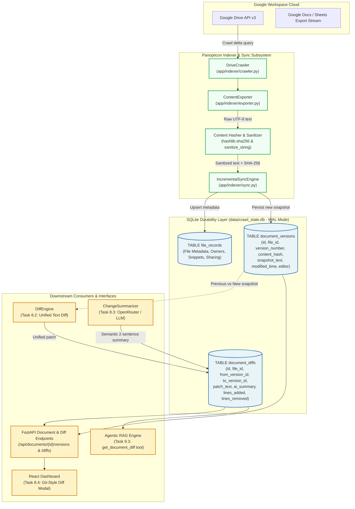
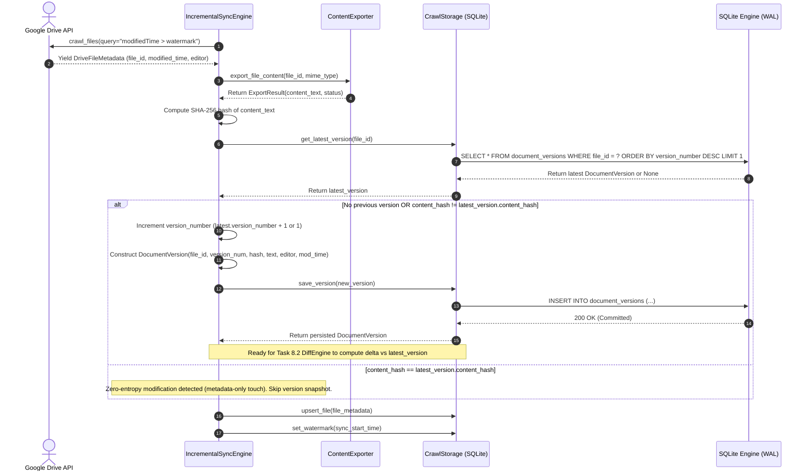
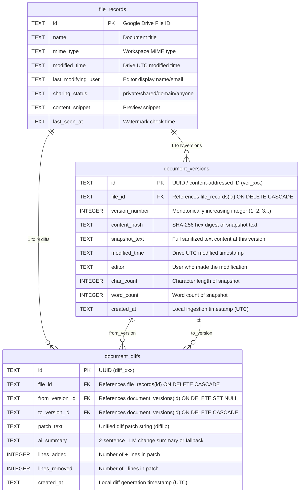

# Stage 1: Concept-to-Code Bridge — Task 8.1: SQLite Version Snapshot & Diff Storage Schema

**Task ID:** `8.1`  
**Task Title:** Create SQLite Version Snapshot & Diff Storage Schema  
**Epic:** Epic 8 — Document Version Diffing & Temporal Change Engine  
**Target Subsystems:** `app/indexer/models.py`, `app/indexer/storage.py`, `tests/test_storage.py`  
**Artifact Version:** 1.0.0  
**Status:** READY FOR REVIEW / DESIGN GATE  

---

## 1. Visual Architecture



---

## 2. The Physical Analogy

> **Relational Version Snapshotting with Content-Addressable Hashes** is like the **Master Patent Archive Vault and its Registered Modification Ledger**.
>
> When an inventor submits a revised blueprint, the chief archivist doesn't simply discard the old blueprint or scribble directly on top of it. Instead, the archivist presses an immutable, tamper-evident wax seal (the **SHA-256 content hash**) onto the complete manuscript and files it into an numbered archival safety deposit box (**`document_versions`**). 
>
> Simultaneously, the archivist attaches a notarized ledger slip (**`document_diffs`**) linking the new deposit box to the previous one, recording the exact line-by-line red-pencil marks (the **unified patch**), the date, the authorized editor, and a concise 2-sentence summary of what changed. 
>
> Anyone auditing the patent years later can instantly verify whether the blueprint actually changed, reconstruct any historical milestone, and understand the full narrative of its evolution without guessing.

---

## 3. Why & What

### Why Are We Doing This Task?
In enterprise document management, answering static questions (*"What is the Falcon spec?"*) is only half the battle. Modern teams constantly struggle with **temporal change intelligence**:
1. *"What was modified in the Q3 Financial Plan between Monday's sync and today's sync?"*
2. *"Who changed the OAuth 2.0 security section and what did it look like before?"*
3. *"Has this document actually changed, or was its modification timestamp bumped by a passive view/comment?"*

Without a structured, durable versioning schema in SQLite, the indexer operates in **destructive overwrite mode** — each crawl replaces the previous content snippet and metadata, permanently erasing the temporal trail. Task 8.1 establishes the durable relational foundation in SQLite to store version snapshots and differential records with zero external database dependencies.

### What Is the Concept?
Task 8.1 introduces two foundational relational tables to the existing SQLite `crawl_state.db` database:

1. **`document_versions`**:
   - Stores immutable chronological snapshots of extracted text and metadata.
   - Uses **Content-Addressable Hashing (`content_hash` = SHA-256)**: if a file's timestamp changed in Google Drive but its extracted text payload is byte-for-byte identical, the system detects zero-entropy change and bypasses redundant snapshot creation.
   - Enforces sequential version numbering (`version_number` = 1, 2, 3...) scoped per `file_id`.
   - Records provenance: `editor` (email/display name), `modified_time` (Drive UTC timestamp), `created_at` (indexer ingestion timestamp), `char_count`, `word_count`.

2. **`document_diffs`**:
   - Stores the structured delta relationship between two consecutive version records (`from_version_id` $\rightarrow$ `to_version_id`).
   - Contains the exact unified diff patch text (`@@ -12,4 +12,7 @@ ...`).
   - Contains change metrics: `lines_added` (integer count), `lines_removed` (integer count).
   - Contains a semantic natural-language summary (`ai_summary`) generated by the LLM summarizer in Task 8.3 or a graceful metadata fallback.

3. **Repository Methods in `CrawlStorage` (`app/indexer/storage.py`)**:
   - `save_version(version: DocumentVersion) -> DocumentVersion`
   - `get_latest_version(file_id: str) -> DocumentVersion | None`
   - `get_version_history(file_id: str, limit: int = 50) -> list[DocumentVersion]`
   - `get_version(version_id: str) -> DocumentVersion | None`
   - `save_diff(diff: DocumentDiff) -> DocumentDiff`
   - `get_diffs(file_id: str, limit: int = 50) -> list[DocumentDiff]`
   - `get_diff_between(from_version_id: str, to_version_id: str) -> DocumentDiff | None`

### What Breaks If We Skip It?
1. **Destructive State Loss:** Incremental sync overwrites the previous text snippet in `file_records`, rendering historical reconstruction impossible.
2. **Blocker for Tasks 8.2–8.4 & Epic 9:** The Text Diff Engine (8.2), AI Change Summarizer (8.3), React Diff Viewer Modal (8.4), and Agentic RAG temporal tools (9.3) cannot operate without a persisted snapshot schema.
3. **Ghost Diffs on Timestamp Bumps:** Without SHA-256 content verification, every touch event in Google Drive (e.g. adding a comment or changing sharing settings) would falsely trigger a diff calculation even when zero document text changed.

---

## 4. Abstraction Level Map

| Abstraction Level | What Lives Here | Panopticon Concrete Implementation (Task 8.1) |
| :--- | :--- | :--- |
| **Product / UX** | User goals, temporal inquiries, change inspection | User asks *"What changed in Falcon doc?"* or views historical diff modal |
| **Application Layer** | Business logic, sync coordinator, version management | `IncrementalSyncEngine`, `CrawlStorage.save_version()`, `CrawlStorage.save_diff()` |
| **Domain Models** | Typed Pydantic data entities, schema validators | `DocumentVersion`, `DocumentDiff` in `app/indexer/models.py` |
| **Framework Layer** | Dependency injection, connection management, API endpoints | `get_crawl_storage_dep` in `app/api/deps.py`, `FastAPI` routes |
| **Library Layer** | Hashing, cryptographic validation, serialization | Python standard library `hashlib.sha256`, `sqlite3`, `json`, `datetime` |
| **Runtime Layer** | Python 3.12 async event loop, connection concurrency | Thread-safe connection context managers, transaction isolation |
| **OS / Storage** | SQLite database file, WAL journals, file system indices | `data/crawl_state.db`, `PRAGMA journal_mode=WAL`, B-tree indices |

*Task 8.1 specifically spans the **Domain Models**, **Application Layer**, **Library Layer**, and **OS / Storage** levels.*

---

## 5. Mermaid Diagrams

### 5.1 Ingestion & Version Snapshot Sequence Flow


### 5.2 SQLite Relational Schema & Foreign Key Topology


---

## 6. Data Flow Trace-Through

Let us trace a real-world scenario where a user modifies a Google Doc from Version 1 to Version 2:

1. **User Edit in Drive**: Engineer Alex edits *"Project Falcon Architecture.gdoc"*, adding 3 paragraphs detailing the OAuth 2.0 token exchange flow.
2. **Incremental Crawl Trigger**: The background auto-sync scheduler or manual trigger invokes `IncrementalSyncEngine.run_sync()`.
3. **Delta Detection**: The Drive API returns the modified document whose `modifiedTime > watermark`.
4. **Text Content Export**: `ContentExporter.export_file_content()` exports the clean `text/plain` stream (e.g. 14,200 characters) and sanitizes control characters via `sanitize_string()`.
5. **Content Hash Verification**:
   - Hasher calculates `sha256(cleaned_text.encode('utf-8')).hexdigest()`.
   - `CrawlStorage.get_latest_version(file_id)` queries SQLite for the most recent version snapshot.
   - If a previous version exists with `version_number = 1` and hash `a3f5...`, but the new hash is `b7c9...`, the system identifies a valid content modification.
6. **Snapshot Storage**:
   - `DocumentVersion` object is instantiated: `id="ver_9a4f..."`, `file_id="doc_falcon_01"`, `version_number=2`, `content_hash="b7c9..."`, `snapshot_text="..."`, `editor="alex@company.com"`, `modified_time="2026-08-31T11:00:00Z"`.
   - `CrawlStorage.save_version()` executes an ACID `INSERT` into `document_versions`.
7. **Diff Storage Preparation**:
   - Task 8.2 will compare `version 1` text and `version 2` text, producing a unified patch string.
   - `DocumentDiff` object is created: `from_version_id="ver_1"`, `to_version_id="ver_2"`, `patch_text="@@ -45,3 +45,18 @@..."`, `lines_added=15`, `lines_removed=2`.
   - `CrawlStorage.save_diff()` commits the delta record to `document_diffs`.
8. **Downstream Availability**:
   - When the user opens the React Diff Modal (Task 8.4), `GET /api/documents/doc_falcon_01/diffs` instantly retrieves the version history and patch records.
   - When the Agentic RAG assistant is asked *"What changed in Falcon?"*, the `get_document_diff` tool reads the `ai_summary` and `patch_text` directly from SQLite in <2ms.

---

## 7. Cognitive Model → Code Mapping

| Cognitive Concept | Mental Model | Code Implementation in Panopticon | Enforcement Mechanism / Guardrails |
| :--- | :--- | :--- | :--- |
| **Immutable Snapshot** | "Take a dated photocopy of the document and lock it in the archive" | `DocumentVersion` model & `document_versions` table | Append-only semantics; version rows are never updated in-place |
| **Change Detection** | "Only file a new version if the words actually changed, not just the timestamp" | `hashlib.sha256(text).hexdigest()` vs `latest_version.content_hash` | Zero-entropy bypass avoids duplicate version creation |
| **Sequential History** | "Version 1 followed by Version 2, then Version 3" | `version_number INTEGER NOT NULL`, scoped by `UNIQUE(file_id, version_number)` | Database constraint prevents duplicate or skipped version sequence numbers |
| **Delta Record** | "Write a slip explaining the exact difference between Version 1 and Version 2" | `DocumentDiff` model & `document_diffs` table | Foreign keys reference `from_version_id` and `to_version_id` |
| **Referential Integrity** | "If a file is permanently deleted, clean up its version history" | `FOREIGN KEY (file_id) REFERENCES file_records(id) ON DELETE CASCADE` | `PRAGMA foreign_keys = ON;` in SQLite connection setup |
| **High-Speed Lookups** | "Quickly find the newest version without scanning every row in the table" | `CREATE INDEX idx_versions_file_version ON document_versions(file_id, version_number DESC)` | Composite B-Tree index ensures sub-millisecond retrieval |

---

## 8. Language & Stack Context

### Python 3.12 Implementation Standards
- **Pydantic v2 Models**:
  - `DocumentVersion`: frozen, strictly typed, automatic UTC timezone coercion, string sanitization on editor and text.
  - `DocumentDiff`: frozen, structured metrics (`lines_added`, `lines_removed`), optional `ai_summary`.
- **Standard Library Primitives**:
  - `hashlib.sha256` for deterministic content hashing.
  - `uuid.uuid4().hex` for globally unique version and diff IDs (`ver_<uuid4>`, `diff_<uuid4>`).
  - `sqlite3` standard library with `sqlite3.Row` row factory for zero-overhead tuple-to-dict unpacking.

### SQLite Database Architecture & Configuration
- **WAL Mode (`PRAGMA journal_mode = WAL;`)**: Allows concurrent background writers (sync engine) and readers (FastAPI REST endpoints and Agentic RAG) without lock contention.
- **Foreign Key Enforcement (`PRAGMA foreign_keys = ON;`)**: Mandatory on every newly opened connection to ensure orphan versions or diffs cannot exist.
- **Performance Indices**:
  ```sql
  CREATE INDEX IF NOT EXISTS idx_versions_file_id ON document_versions(file_id);
  CREATE INDEX IF NOT EXISTS idx_versions_file_version ON document_versions(file_id, version_number DESC);
  CREATE INDEX IF NOT EXISTS idx_versions_content_hash ON document_versions(content_hash);
  CREATE INDEX IF NOT EXISTS idx_diffs_file_id ON document_diffs(file_id);
  CREATE INDEX IF NOT EXISTS idx_diffs_versions ON document_diffs(from_version_id, to_version_id);
  ```

### Code Signatures to Implement in `app/indexer/`

#### 1. Models in `app/indexer/models.py`:
```python
class DocumentVersion(BaseModel):
    """Immutable snapshot of a document at a specific point in time."""
    model_config = ConfigDict(frozen=True, extra="ignore")

    id: str = Field(default_factory=lambda: f"ver_{uuid.uuid4().hex[:12]}")
    file_id: str = Field(..., description="Google Drive file ID")
    version_number: int = Field(..., description="1-indexed monotonic version number")
    content_hash: str = Field(..., description="SHA-256 hex digest of snapshot text")
    snapshot_text: str = Field(..., description="Sanitized plain text of document")
    modified_time: datetime | None = Field(default=None, description="Drive UTC timestamp")
    editor: str | None = Field(default=None, description="Last editor email or display name")
    char_count: int = Field(default=0, description="Length of snapshot in characters")
    word_count: int = Field(default=0, description="Count of words in snapshot")
    created_at: datetime = Field(
        default_factory=lambda: datetime.now(timezone.utc),
        description="Local ingestion timestamp (UTC)",
    )

class DocumentDiff(BaseModel):
    """Structured delta record between two document versions."""
    model_config = ConfigDict(frozen=True, extra="ignore")

    id: str = Field(default_factory=lambda: f"diff_{uuid.uuid4().hex[:12]}")
    file_id: str = Field(..., description="Google Drive file ID")
    from_version_id: str | None = Field(default=None, description="Prior version ID (None for initial version)")
    to_version_id: str = Field(..., description="Target version ID")
    patch_text: str = Field(..., description="Unified diff patch text")
    ai_summary: str | None = Field(default=None, description="Natural language summary of changes")
    lines_added: int = Field(default=0, description="Count of added lines in patch")
    lines_removed: int = Field(default=0, description="Count of deleted lines in patch")
    created_at: datetime = Field(
        default_factory=lambda: datetime.now(timezone.utc),
        description="Local diff creation timestamp (UTC)",
    )
```

#### 2. Storage Methods in `app/indexer/storage.py`:
```python
class CrawlStorage:
    def save_version(self, version: DocumentVersion) -> DocumentVersion: ...
    def get_latest_version(self, file_id: str) -> DocumentVersion | None: ...
    def get_version_history(self, file_id: str, limit: int = 50) -> list[DocumentVersion]: ...
    def get_version(self, version_id: str) -> DocumentVersion | None: ...
    def save_diff(self, diff: DocumentDiff) -> DocumentDiff: ...
    def get_diffs(self, file_id: str, limit: int = 50) -> list[DocumentDiff]: ...
    def get_diff_between(self, from_version_id: str, to_version_id: str) -> DocumentDiff | None: ...
```

---

## 9. Five Alternative Approaches

| # | Approach / Architecture | Pros | Cons | When to Choose |
|---|---|---|---|---|
| **1** | **Relational Full Snapshots + Structured Delta Records in SQLite WAL (Chosen)** | 1. Zero external dependencies.<br>2. Instant O(1) retrieval of any historical snapshot.<br>3. Relational integrity with cascade deletes.<br>4. ACID transactional consistency. | Storage footprint grows linearly with version count (mitigated by text compression and 10MB ceiling). | **Best for local/internal enterprise desktop search tool with fast retrieval requirements.** |
| **2** | **Delta-Only Storage (Forward/Reverse Patch Chaining)** | Minimal storage footprint (only stores diff patches + base snapshot). | Reconstruction of Version $N$ requires applying $N-1$ sequential patches; single corrupt patch destroys entire history chain. | Multi-gigabyte code repositories (like Git internals) where storage conservation outweighs CPU cost. |
| **3** | **Embedded Git / `libgit2` Bare Repositories per Document** | Uses standard Git plumbing and tree hashing; industry standard for text versioning. | Heavy C-binding dependencies (`pygit2`), complex file system directory sprawl (thousands of `.git` folders), poor integration with SQLite SQL queries. | When users need to clone the document history directly with standard Git CLI tools. |
| **4** | **Append-Only JSON Lines / Flat File Audit Log** | Simple human-readable text files; easy to inspect with `grep` or `tail`. | No relational indexing, zero ACID transaction support, slow linear file scans for pagination, high risk of corrupt state during concurrent writes. | Simple developer debug tracing or low-frequency telemetry. |
| **5** | **External Blob Storage (S3 / MinIO) + Metadata DB** | Scales to petabytes; offloads large text payloads from local disk. | Requires cloud infrastructure, network latency on every version read, complex local offline development story, violates local zero-setup guarantee. | Cloud-native multi-tenant SaaS platforms deployed across distributed Kubernetes clusters. |

---

## 10. Production Rationale & Consequences

### Why This Is Standard
In modern high-performance desktop and server systems (from browsers like Chrome to engines like SQLite itself), **content-addressable relational versioning with WAL journaling** is the gold standard for audit trails and temporal intelligence. It guarantees:
- **Instant Snapshot Reconstruction:** Accessing any prior version requires a single indexed B-Tree seek (`SELECT * FROM document_versions WHERE id = ?`), eliminating CPU-expensive patch reconstruction chains.
- **Deduplication Resilience:** Using SHA-256 digests prevents storing redundant snapshots when Google Drive updates metadata without modifying text content.
- **Zero-Setup Portability:** The entire state remains in a single compact SQLite file (`data/crawl_state.db`) that can be backed up, inspected, or tested with standard tools.

### What Happens If We Skip This (Concrete Failure Scenarios)

#### Scenario 1: The "Ghost Change" Storage Bloat Incident
- **Mechanism:** Google Drive triggers watermark updates for non-content events (e.g. changing folder permissions, adding view-only commenters, or touching document labels).
- **Failure:** Without SHA-256 content hashing in `document_versions`, the sync engine blindly creates a new version snapshot on every crawl cycle.
- **Impact:** Over 30 days of active team usage, a single 500-page spreadsheet modified in permissions 100 times produces 100 duplicate text blobs, bloating SQLite from 5MB to 500MB with zero actual information gained.

#### Scenario 2: The Hallucinating Agentic RAG Disaster
- **Mechanism:** A product manager asks the Panopticon Agentic RAG assistant: *"What changes were made to the Falcon API spec between last week and today?"*
- **Failure:** Without persisted `document_versions` and `document_diffs`, the LLM has only the current single text snippet.
- **Impact:** Unable to inspect real historical patches, the LLM hallucinates changes based on generic training patterns, falsely informing leadership that authentication features were removed when they were actually added.

#### Scenario 3: Database Corruption & Foreign Key Orphans
- **Mechanism:** A Google Doc is deleted from Drive and purged during incremental sync reconciliation.
- **Failure:** If version and diff tables lack `ON DELETE CASCADE` foreign key constraints and `PRAGMA foreign_keys = ON`, the parent record in `file_records` is deleted while hundreds of orphaned version rows remain permanently in SQLite.
- **Impact:** Orphaned rows accumulate silently, degrading index scan speeds and causing foreign-key lookup crashes in API routes.

---

## 11. Verification & Test Strategy for Stage 4

When Task 8.1 reaches implementation and testing:
1. **Schema Initialization Test**: Verify tables `document_versions` and `document_diffs` and all 5 indices are created cleanly on a fresh database.
2. **Version CRUD & Monotonic Numbering Test**: Insert versions for a file and verify `version_number` increments accurately (1 $\rightarrow$ 2 $\rightarrow$ 3).
3. **Latest Version Retrieval Test**: Verify `get_latest_version(file_id)` returns the most recent record in O(1) time.
4. **Content-Hash Deduplication Verification**: Verify that inserting identical content text produces matching SHA-256 hashes.
5. **Diff Relationship Test**: Insert a `DocumentDiff` linking two versions and verify retrieval with correct `lines_added` / `lines_removed`.
6. **Cascade Delete Test**: Delete a file record from `file_records` and verify all associated `document_versions` and `document_diffs` are automatically purged via foreign key cascade.
7. **Concurrency & WAL Mode Test**: Verify multiple threads can read versions while a background worker inserts new snapshots.
