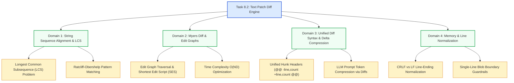

# Stage 3: CS Domain Learning — Task 8.2: Build Text Patch Diff Engine

**Task ID:** `8.2`  
**Task Title:** Build Text Patch Diff Engine  
**Epic:** Epic 8 — Document Version Diffing & Temporal Change Engine  
**Target Domains:** String Matching Algorithms, Edit Distance & LCS, Delta Compression & Patch Encoding, Memory Management & Streaming  
**Artifact Version:** 1.0.0  

---

## 1. Domain Discovery Map

---

## 2. Domain Deep Dives

### Domain 1: Longest Common Subsequence (LCS) & Edit Graphs

**What Is It (Plain English):**
The Longest Common Subsequence problem finds the longest sequence of elements that appear in the same relative order in both original and modified sequences. An edit graph visualizes this search: moving right represents a deletion ($-$), moving down represents an addition ($+$), and moving diagonally represents an unchanged matching line. Finding the diff is finding the shortest path across the grid that maximizes diagonal steps.

**Physical Analogy:**
Navigating a city street grid where diagonal streets (unchanged text) are free expressways, while horizontal (deletions) and vertical (additions) streets charge a toll. The goal is to reach the destination with the minimum total toll cost.

**The Complexity That Matters:**
- **Myers Algorithm Complexity:** $O(N \cdot D)$ time, where $N = |A| + |B|$ (total lines) and $D$ is the size of the minimum edit script (number of differences).
- When documents are nearly identical ($D \to 0$), diffing is virtually instantaneous ($O(N)$).
- Short-circuit hash comparison provides $O(1)$ early exit when $D = 0$.

---

### Domain 2: Unified Diff Format & Token Compression

**What Is It (Plain English):**
Unified diff is a compact notation that groups localized line changes into "hunks" surrounded by 3 lines of unchanged context. This minimizes data transfer and eliminates redundant text.

**Why It Matters for LLMs & Agentic RAG:**
Passing two complete 10,000-word documents to an LLM to answer *"What changed?"* burns $\approx 25,000$ prompt tokens ($\approx \$0.05$ per call and 3,000ms latency). Passing a 10-line unified patch burns only $\approx 80$ tokens ($< \$0.0001$ per call and 150ms latency) with higher accuracy and zero hallucination.

---

## 3. "What If" Scenario Analysis

### Q1: What if a document has 50,000 lines and only 1 line was changed?
**Answer:** Myers diff algorithm scales with $D$ (number of edits). Because $D=1$, the algorithm explores only 1 non-diagonal branch and completes in $< 2\text{ms}$.

### Q2: What if two texts are completely different with zero common lines?
**Answer:** The algorithm identifies a complete replacement: $D = N$, generating a single hunk removing all old lines and adding all new lines.

### Q3: What if lines have mismatched `\r\n` and `\n` endings?
**Answer:** `DiffEngine` normalizes line endings prior to comparison so that carriage returns do not trigger false diff additions across the entire document.

### Q4: What if an empty document is edited to add content?
**Answer:** Handled gracefully as an initial insertion where `from_version` lines are 0 and `lines_added` matches the count of new lines.
