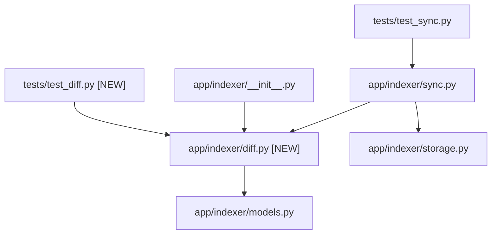

# Stage 2: Codebase Design — Task 8.2: Build Text Patch Diff Engine

**Task ID:** `8.2`  
**Task Title:** Build Text Patch Diff Engine  
**Epic:** Epic 8 — Document Version Diffing & Temporal Change Engine  
**Target Files:**
- `[NEW]` [`app/indexer/diff.py`](file:///c:/Users/Mubashar/Desktop/Panopticon/app/indexer/diff.py)
- `[MODIFY]` [`app/indexer/models.py`](file:///c:/Users/Mubashar/Desktop/Panopticon/app/indexer/models.py)
- `[MODIFY]` [`app/indexer/sync.py`](file:///c:/Users/Mubashar/Desktop/Panopticon/app/indexer/sync.py)
- `[MODIFY]` [`app/indexer/__init__.py`](file:///c:/Users/Mubashar/Desktop/Panopticon/app/indexer/__init__.py)
- `[NEW]` [`tests/test_diff.py`](file:///c:/Users/Mubashar/Desktop/Panopticon/tests/test_diff.py)
- `[MODIFY]` [`tests/test_sync.py`](file:///c:/Users/Mubashar/Desktop/Panopticon/tests/test_sync.py)
**Artifact Version:** 1.0.0  
**Status:** READY FOR IMPLEMENTATION  

---

## 1. Current State Snapshot

In Task 8.1, we created `DocumentVersion` and `DocumentDiff` tables in SQLite along with storage methods. However, `IncrementalSyncEngine` ([`app/indexer/sync.py`](file:///c:/Users/Mubashar/Desktop/Panopticon/app/indexer/sync.py)) currently only exports preview snippets and upserts rows into `file_records`. It does not compare consecutive versions or compute unified diff patches.

```mermaid
graph TD
    subgraph CurrentSyncFlow ["Current Ingestion Flow (Before Task 8.2)"]
        Crawler["DriveCrawler\n(app/indexer/crawler.py)"]
        Exporter["ContentExporter\n(app/indexer/exporter.py)"]
        SyncEngine["IncrementalSyncEngine\n(app/indexer/sync.py)"]
        Storage["CrawlStorage\n(app/indexer/storage.py)"]
    end

    Crawler --> Exporter
    Exporter --> SyncEngine
    SyncEngine -->|upsert_files()| Storage
    note over Storage: document_versions & document_diffs remain empty during sync
```

---

## 2. Proposed State

Task 8.2 creates a dedicated `DiffEngine` module ([`app/indexer/diff.py`](file:///c:/Users/Mubashar/Desktop/Panopticon/app/indexer/diff.py)), a `DiffResult` domain model in [`app/indexer/models.py`](file:///c:/Users/Mubashar/Desktop/Panopticon/app/indexer/models.py), and wires diff computation directly into `IncrementalSyncEngine` ([`app/indexer/sync.py`](file:///c:/Users/Mubashar/Desktop/Panopticon/app/indexer/sync.py)).

```mermaid
graph TD
    subgraph ProposedSyncFlow ["Proposed Ingestion Flow with DiffEngine (After Task 8.2)"]
        Crawler["DriveCrawler"]
        Exporter["ContentExporter"]
        DiffEngine["DiffEngine [NEW]\n(app/indexer/diff.py)"]
        SyncEngine["IncrementalSyncEngine [ENHANCED]\n(app/indexer/sync.py)"]
        Storage["CrawlStorage\n(app/indexer/storage.py)"]
    end

    Crawler --> Exporter
    Exporter --> SyncEngine
    SyncEngine -->|Fetch latest snapshot| Storage
    SyncEngine -->|Compute patch & metrics| DiffEngine
    DiffEngine -->|Return DiffResult| SyncEngine
    SyncEngine -->|save_version() & save_diff()| Storage
```

---

## 3. File-Level Impact Analysis

### `[NEW]` [`app/indexer/diff.py`](file:///c:/Users/Mubashar/Desktop/Panopticon/app/indexer/diff.py)
- **Purpose:** Provide line-level unified diff calculations (`difflib.unified_diff`), parse patch lines to count `lines_added` / `lines_removed`, count hunks, and short-circuit identical content.
- **Exports/Public API:**
  - `class DiffEngine`
  - `def get_diff_engine(context_lines: int = 3) -> DiffEngine`
- **Consumers:** `IncrementalSyncEngine`, future `ChangeSummarizer` (Task 8.3), and FastAPI diff endpoints.

### `[MODIFY]` [`app/indexer/models.py`](file:///c:/Users/Mubashar/Desktop/Panopticon/app/indexer/models.py)
- **What changes:** Add `DiffResult` Pydantic model.
- **Why:** Provide a strongly typed representation of the diff outcome (`has_changes`, `patch_text`, `lines_added`, `lines_removed`, `hunks_count`).
- **Approximate lines/symbols:** Add `class DiffResult(BaseModel)` (~20 lines).

### `[MODIFY]` [`app/indexer/sync.py`](file:///c:/Users/Mubashar/Desktop/Panopticon/app/indexer/sync.py)
- **What changes:**
  1. Inject `DiffEngine` into `IncrementalSyncEngine.__init__()`.
  2. During crawl processing (`export_content=True`):
     - Check `storage.get_latest_version(file_id)`.
     - Compute SHA-256 hash of extracted text.
     - If no previous version: store initial `DocumentVersion(version_number=1, ...)`.
     - If previous version exists and `content_hash != prev.content_hash`:
       - Compute diff via `diff_engine.compute_diff(prev.snapshot_text, current_text)`.
       - If `diff_result.has_changes`:
         - Save `new_version = storage.save_version(...)`.
         - Save `DocumentDiff(from_version_id=prev.id, to_version_id=new_version.id, patch_text=diff_result.patch_text, ...)`.
- **Why:** Automate snapshot versioning and diff generation on every incremental sync cycle.
- **Approximate lines/symbols:** Modify ~40 lines in `run_sync()`.

### `[MODIFY]` [`app/indexer/__init__.py`](file:///c:/Users/Mubashar/Desktop/Panopticon/app/indexer/__init__.py)
- **What changes:** Export `DiffEngine`, `DiffResult`, `get_diff_engine` in package `__all__`.

### `[NEW]` [`tests/test_diff.py`](file:///c:/Users/Mubashar/Desktop/Panopticon/tests/test_diff.py)
- **Purpose:** Unit test suite for `DiffEngine` covering identical text, single-line edits, multiline additions/deletions, empty strings, CRLF handling, and hunk metrics.

### `[MODIFY]` [`tests/test_sync.py`](file:///c:/Users/Mubashar/Desktop/Panopticon/tests/test_sync.py)
- **What changes:** Add test verifying that incremental sync automatically creates version snapshots and diff records when a document's content is modified.

---

## 4. Dependency Graph & Blast Radius



---

## 5. Regression Risk Matrix

| Risk ID | Risk Description | Severity | Affected Area | Mitigation Strategy |
| :--- | :--- | :--- | :--- | :--- |
| **R-01** | Line ending differences (`\r\n` vs `\n`) cause false full-file diffs | 🟡 Medium | `DiffEngine.compute_diff` | Normalize `\r\n` to `\n` or use `splitlines(keepends=True)` before diffing. |
| **R-02** | Initial sync run without prior versions fails on diff lookup | 🟢 Low | `IncrementalSyncEngine.run_sync` | Check if `prev_version is None` and save initial Version 1 snapshot without computing diff. |
| **R-03** | Diff computation latency on large documents | 🟢 Low | Sync pipeline throughput | Myers diff on sanitized text $<10\text{MB}$ completes in $<15\text{ms}$; short-circuit hash bypass avoids diffing unchanged files. |

---

## 6. Contract Stability Check

| Interface | Current Shape | Proposed Shape | Breaking? |
| :--- | :--- | :--- | :--- |
| `DiffEngine.compute_diff(old, new)` | N/A `[NEW]` | `DiffResult` | No |
| `IncrementalSyncEngine.run_sync()` | Returns `SyncResult` | Returns `SyncResult` (stores versions/diffs in background) | No |
| `DiffResult` | N/A `[NEW]` | Pydantic Model (`has_changes`, `patch_text`, metrics) | No |

---

## 7. Rollback Plan

### If Changes Are Uncommitted:
```bash
git checkout -- app/indexer/models.py app/indexer/sync.py app/indexer/__init__.py tests/test_sync.py
rm app/indexer/diff.py tests/test_diff.py
```

### If Changes Are Committed:
```bash
git revert HEAD --no-edit
pytest tests/
```
