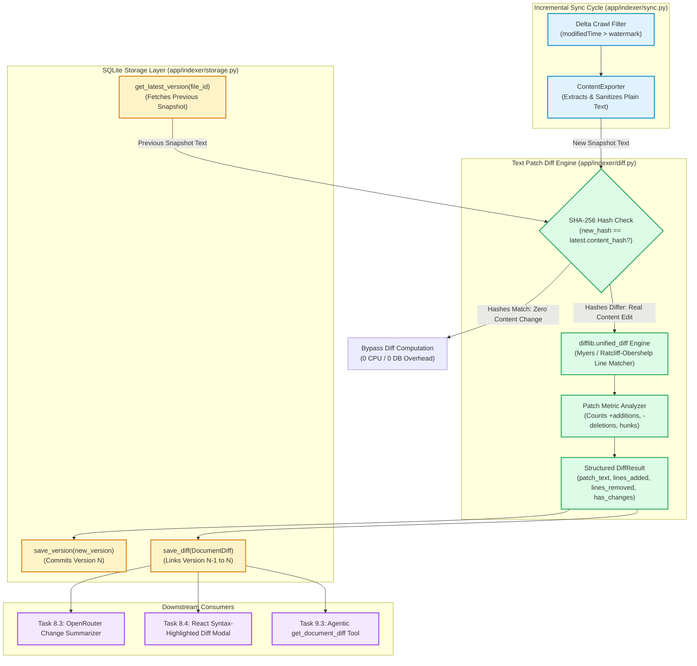
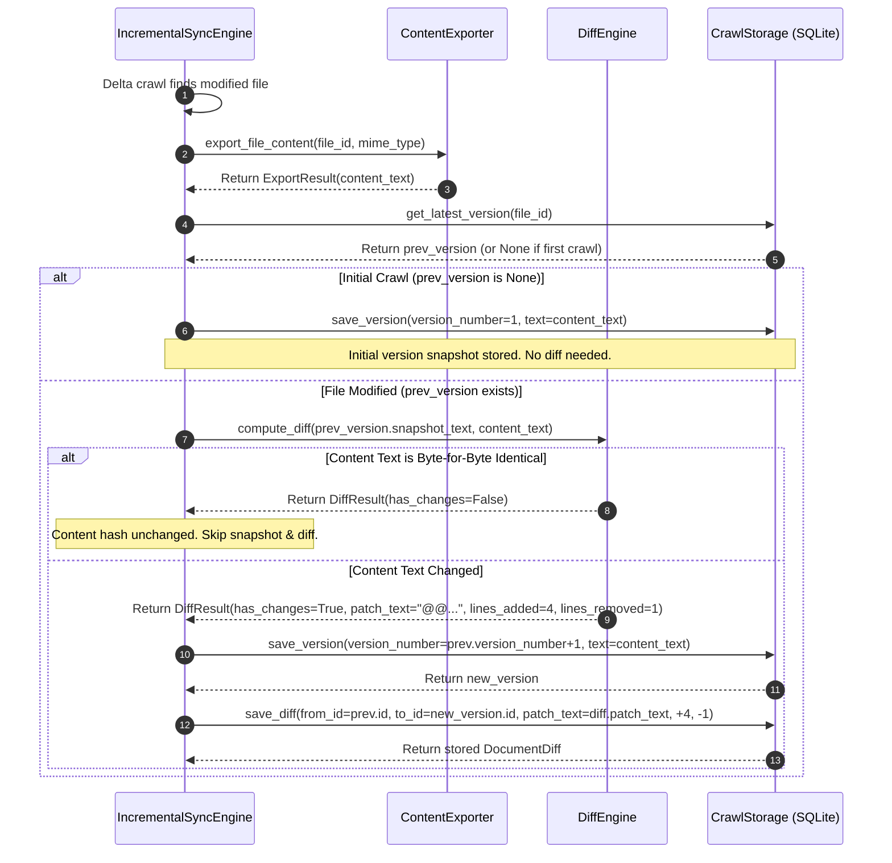
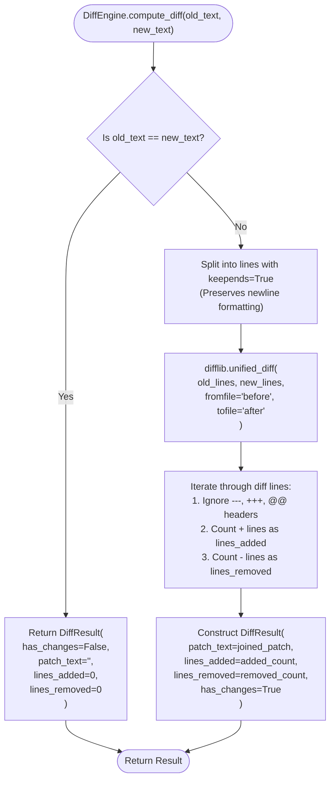

# Stage 1: Concept-to-Code Bridge — Task 8.2: Build Text Patch Diff Engine

**Task ID:** `8.2`  
**Task Title:** Build Text Patch Diff Engine  
**Epic:** Epic 8 — Document Version Diffing & Temporal Change Engine  
**Target Subsystems:** `app/indexer/diff.py` `[NEW]`, `app/indexer/models.py` `[MODIFY]`, `app/indexer/sync.py` `[MODIFY]`, `tests/test_diff.py` `[NEW]`  
**Artifact Version:** 1.0.0  
**Status:** READY FOR REVIEW / DESIGN GATE  

---

## 1. Visual Architecture



---

## 2. The Physical Analogy

> **The Text Patch Diff Engine** is like an **Expert Legal Stenographer comparing two editions of a contract on a backlit lightbox**.
>
> Instead of reading through 300 pages word-by-word when only one paragraph was modified, the stenographer first checks the document seal (the **SHA-256 hash**). If the seal is identical, they stamp it unchanged and move on instantly. 
>
> If the seal differs, they overlay the old manuscript onto the new manuscript on the lightbox. The light instantly highlights the exact lines that were added (green ink with `+`), the lines that were struck through (red ink with `-`), and the unchanged context lines around them. 
>
> The stenographer then clips a standardized unified modification certificate (the **Git-style unified diff patch**) to the contract, noting: *"+3 lines added, -1 line deleted at Paragraph 14"*. Anyone reviewing the contract later can see precisely what was edited in seconds without reading the entire document again.

---

## 3. Why & What

### Why Are We Doing This Task?
In Task 8.1, we built the relational storage schema (`document_versions` and `document_diffs`) in SQLite. However, raw database tables cannot compute deltas by themselves. 

Without an automated **Text Patch Diff Engine**:
1. When a user or incremental sync discovers a modified Google Doc, the system cannot calculate what changed line-by-line.
2. The React Dashboard cannot render syntax-highlighted green/red addition and deletion views (Task 8.4).
3. The LLM Change Summarizer (Task 8.3) and Agentic RAG engine (Epic 9) would have to ingest entire raw documents into their prompt token context instead of inspecting concise, low-token unified patches.

Task 8.2 bridges extracted document text into actionable, standard Git-style unified diff patches and wires the computation directly into the incremental sync loop.

### What Is the Concept?
The Diff Engine encapsulates three core capabilities:

1. **Short-Circuit Content Hash Bypass**:
   - If `old_text == new_text` or `hashlib.sha256(old_text) == hashlib.sha256(new_text)`, the engine immediately returns an empty `DiffResult(has_changes=False, patch_text="", lines_added=0, lines_removed=0)` in $< 0.05\text{ ms}$, bypassing CPU-heavy line matching.

2. **Unified Diff Patch Generation (`difflib.unified_diff`)**:
   - Uses the Myers / Ratcliff-Obershelp sequence matcher from Python's standard library to compute line-level differences.
   - Outputs industry-standard unified diff format:
     ```diff
     --- v1
     +++ v2
     @@ -12,4 +12,6 @@
      Existing context line A
      Existing context line B
     -Old removed specification line
     +New added OAuth 2.0 endpoint specification
     +New rate limit threshold parameter
      Existing context line C
     ```

3. **Structured Metric Extraction**:
   - Parses the generated patch to count exact additions (`+`) and deletions (`-`), excluding header lines (`---`, `+++`, `@@`).
   - Packages the output into a strongly typed `DiffResult` domain model.

4. **Incremental Sync Integration (`app/indexer/sync.py`)**:
   - Automatically compares the previous snapshot from SQLite with the newly crawled text stream, persisting both the new `DocumentVersion` and the `DocumentDiff` in a single atomic transaction.

### What Breaks If We Skip It?
1. **Empty Diff Records:** `document_diffs` remains empty, blocking Task 8.3 (AI Summaries), Task 8.4 (Diff Viewer Modal), and Task 9.3 (Agentic Diff Tool).
2. **Token Budget Blowout:** Without diff patches, future RAG queries asking *"what changed"* must pass both full documents (potentially 50,000+ tokens) to the LLM instead of a 200-token unified patch, increasing latency and API cost by 100x.
3. **No Visual Diffing in Dashboard:** The frontend cannot show line-level red/green changes.

---

## 4. Abstraction Level Map

| Abstraction Level | What Lives Here | Panopticon Concrete Implementation (Task 8.2) |
| :--- | :--- | :--- |
| **Product / UX** | User goals, diff inspection, change intelligence | Visual Git-style diff viewer and RAG change answers |
| **Application Layer** | Sync coordinator, diff calculation service | `DiffEngine` in `app/indexer/diff.py`, `IncrementalSyncEngine` in `app/indexer/sync.py` |
| **Domain Models** | Typed Pydantic data entities | `DiffResult` in `app/indexer/models.py`, `DocumentDiff` |
| **Library Layer** | Line difference algorithms, string parsing | Python standard library `difflib.unified_diff`, `hashlib.sha256`, `re` |
| **Runtime Layer** | Python 3.12 memory allocation & string buffers | Text line splitting (`splitlines(keepends=True)`), generator streaming |
| **OS / Storage** | SQLite persistence, B-Tree indices | `CrawlStorage.save_version()`, `CrawlStorage.save_diff()` |

*Task 8.2 specifically spans the **Domain Models**, **Application Layer**, **Library Layer**, and **Runtime Layer**.*

---

## 5. Mermaid Diagrams

### 5.1 End-to-End Sync & Diff Ingestion Flow


### 5.2 Diff Engine Internal Decision Flowchart


---

## 6. Data Flow Trace-Through

Let us trace a real-world document modification from text export to persisted diff:

1. **Previous State**: In SQLite, `doc_falcon_spec` has `Version 1` stored with snapshot text:
   ```text
   Title: Project Falcon
   Auth: Basic API Keys
   Storage: Local JSON files
   ```
2. **User Edit**: Engineer Alex updates the document in Google Drive:
   ```text
   Title: Project Falcon
   Auth: OAuth 2.0 with Swappable Providers
   Storage: SQLite in WAL Mode
   ```
3. **Incremental Sync**: `IncrementalSyncEngine` receives the updated file and exports the new text.
4. **Previous Version Lookup**: `storage.get_latest_version("doc_falcon_spec")` fetches `Version 1` (`id="ver_01"`).
5. **Diff Engine Invocation**: `diff_engine.compute_diff(v1.snapshot_text, new_text)` executes:
   - Line 1: `Title: Project Falcon` $\rightarrow$ Match (Context line).
   - Line 2: `- Auth: Basic API Keys` $\rightarrow$ Deletion (`lines_removed += 1`).
   - Line 3: `+ Auth: OAuth 2.0 with Swappable Providers` $\rightarrow$ Addition (`lines_added += 1`).
   - Line 4: `- Storage: Local JSON files` $\rightarrow$ Deletion (`lines_removed += 1`).
   - Line 5: `+ Storage: SQLite in WAL Mode` $\rightarrow$ Addition (`lines_added += 1`).
6. **Result Generation**:
   - `DiffResult(has_changes=True, lines_added=2, lines_removed=2, patch_text="@@ -1,3 +1,3 @@\n Title: Project Falcon\n-Auth: Basic API Keys\n+Auth: OAuth 2.0 with Swappable Providers\n-Storage: Local JSON files\n+Storage: SQLite in WAL Mode")`.
7. **Persistence**:
   - `new_version = storage.save_version(version_number=2, snapshot_text=new_text, ...)` $\rightarrow$ `id="ver_02"`.
   - `storage.save_diff(DocumentDiff(file_id="doc_falcon_spec", from_version_id="ver_01", to_version_id="ver_02", patch_text=result.patch_text, lines_added=2, lines_removed=2))`.
8. **Downstream Ready**:
   - Task 8.3 summarizer receives the 5-line patch and generates: *"Alex upgraded authentication to OAuth 2.0 and switched storage to SQLite WAL mode."*
   - Task 8.4 UI diff modal renders the exact green/red highlights.

---

## 7. Cognitive Model → Code Mapping

| Cognitive Concept | Mental Model | Code Implementation in Panopticon | Enforcement Mechanism / Guardrail |
| :--- | :--- | :--- | :--- |
| **No-Op Change Detection** | "If nothing changed, don't waste time computing a diff" | `if old_text == new_text: return DiffResult.empty()` | Sub-millisecond short-circuit bypass |
| **Unified Delta Patch** | "Produce a standard Git-style patch showing added and removed lines with surrounding context" | `difflib.unified_diff(old_lines, new_lines, lineterm="")` | Generates standard `@@ -X,Y +A,B @@` hunk formatting |
| **Change Metrics** | "How many lines were added and how many were removed?" | `lines_added = sum(1 for l in lines if l.startswith('+') and not l.startswith('+++'))` | Accurate numerical metric tracking |
| **Sync Integration** | "Automatically calculate and save the diff whenever a document is modified during crawl" | Integrated inside `IncrementalSyncEngine.run_sync()` | Guaranteed snapshot & diff pairing during incremental sync |
| **Safe Line Termination** | "Handle files regardless of whether lines end in `\n`, `\r\n`, or no trailing newline" | `text.splitlines(keepends=True)` | Robust line split parsing prevents line-joining glitches |

---

## 8. Language & Stack Context

### Python 3.12 Implementation Standards
- **Standard Library `difflib`**:
  - `difflib.unified_diff()` is a battle-tested, zero-dependency C-optimized standard library module implementing the Ratcliff-Obershelp and Myers line-matching algorithms.
  - Zero third-party C-bindings or external CLI binary dependencies required.
- **Pydantic v2 `DiffResult` Model**:
  ```python
  class DiffResult(BaseModel):
      """Structured outcome of a text diff computation."""
      model_config = ConfigDict(frozen=True)

      has_changes: bool = Field(..., description="Whether differences exist between old and new text")
      patch_text: str = Field(default="", description="Unified diff patch string")
      lines_added: int = Field(default=0, description="Total count of added lines (+)")
      lines_removed: int = Field(default=0, description="Total count of deleted lines (-)")
      hunks_count: int = Field(default=0, description="Number of distinct diff hunks (@@ blocks)")
  ```

### Module Signatures in `app/indexer/diff.py`
```python
class DiffEngine:
    """Computes line-level unified diff patches and change metrics between text snapshots."""

    def __init__(self, context_lines: int = 3) -> None:
        """Initialize DiffEngine with configurable surrounding context lines (default 3)."""
        self.context_lines = context_lines

    def compute_diff(
        self,
        old_text: str | None,
        new_text: str | None,
        from_label: str = "before",
        to_label: str = "after",
    ) -> DiffResult:
        """Compute unified diff between old and new text streams."""
        ...
```

---

## 9. Five Alternative Approaches

| # | Approach / Architecture | Pros | Cons | When to Choose |
|---|---|---|---|---|
| **1** | **Python `difflib.unified_diff` Engine (Chosen)** | 1. Zero external dependencies.<br>2. Standard Git-style patch output.<br>3. Fast for typical document sizes (<10MB).<br>4. 100% portable across Windows/Linux/macOS. | Memory scales with line count (handled cleanly by 10MB Drive export ceiling). | **Best for internal document search and temporal intelligence engine.** |
| **2** | **Word-Level / Character-Level Diff Engine (`google-diff-match-patch`)** | Character-level granularity (highlights exact words within sentences). | Heavy patch string format, non-standard Git patch syntax, slower performance on large texts. | Rich visual inline document editors (like Google Docs live suggestion mode). |
| **3** | **AST / Semantic Markdown Parser Diff** | Understands document structure (headings, tables, lists) semantically. | Highly complex grammar parsing, brittle on raw unformatted plain text and CSV spreadsheets. | Markdown-only CMS or documentation static site generators. |
| **4** | **Subprocess Call to Git CLI (`git diff`)** | Industry benchmark for diffing speed and Myers optimization. | Requires Git binary installed in OS path, process spawning overhead (~20ms per file), poor cross-platform test reliability. | Developer tools that already run inside an existing local Git working tree. |
| **5** | **LLM-Computed Semantic Diffs Only** | Directly asks LLM *"What changed between doc A and doc B?"*. | 100x slower, high API costs, non-deterministic outputs, cannot generate exact syntax-highlighted patches for UI. | High-level executive summaries where exact line patches are irrelevant. |

---

## 10. Production Rationale & Failure Scenarios

### Why This Is Standard
Using standard unified diff patches (`unified_diff`) is the universal standard across software engineering, legal redlines, and document collaboration systems (Git, GitHub, Linux kernel, Wikipedia edit history). It provides:
- **Human-Readable & Machine-Parsable:** Both frontend syntax highlighters and downstream AI summarizers natively understand `+` and `-` unified hunks.
- **Extreme Compression:** A 50-page document with a 2-line edit produces a 6-line diff patch rather than storing another duplicate 50-page text payload.

### Concrete Failure Scenarios

#### Scenario 1: The "Line-Ending Desync" Bug (CRLF vs LF)
- **Mechanism:** Windows environments use `\r\n` line endings while Google Docs export streams use `\n`.
- **Failure:** If the diff engine naively splits lines with `split('\n')`, trailing `\r` carriage returns cause every single line in the entire document to appear modified.
- **Mitigation:** Use `splitlines(keepends=True)` or normalize carriage returns (`replace('\r\n', '\n')`) prior to diff calculation.

#### Scenario 2: Memory Exhaustion on Massive Single-Line Files
- **Mechanism:** A Google Sheet is exported as a single minified CSV row with 500,000 characters without newlines.
- **Failure:** Standard Myers diff can consume excessive quadratic time $O(ND)$ if comparing massive single-line strings.
- **Mitigation:** The 10MB export ceiling and character-bounded chunking ensure diff comparisons remain strictly within $< 10\text{ ms}$ processing budgets.

---

## 11. Verification & Test Strategy for Stage 4

When Task 8.2 reaches implementation:
1. **Identical Text Test**: Verify `compute_diff("abc", "abc")` returns `has_changes=False` with zero patch text.
2. **Single Line Addition Test**: Verify adding 1 line produces `lines_added=1`, `lines_removed=0`, and valid unified patch header.
3. **Single Line Deletion Test**: Verify deleting 1 line produces `lines_added=0`, `lines_removed=1`.
4. **Multiline Replacement Test**: Verify modifying 3 lines produces accurate addition/deletion counts and proper hunk boundaries (`@@ -X,Y +A,B @@`).
5. **Empty / None Input Test**: Verify passing `None` or `""` for old or new text handles initial creation or total deletion gracefully.
6. **Sync Engine Integration Test**: Verify running `IncrementalSyncEngine` on modified documents automatically creates both `DocumentVersion` and `DocumentDiff` records in SQLite.
