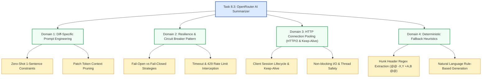

# Stage 3: CS Domain Learning — Task 8.3: OpenRouter AI Semantic Change Summarizer

**Task ID:** `8.3`  
**Task Title:** OpenRouter AI Semantic Change Summarizer  
**Epic:** Epic 8 — Document Version Diffing & Temporal Change Engine  
**Target Domains:** Prompt Engineering for Diffs, Resilience & Circuit Breakers, HTTP Connection Pooling, Graceful Degradation  
**Artifact Version:** 1.0.0  

---

## 1. Domain Discovery Map



---

## 2. Domain Deep Dives

### Domain 1: Diff-Specific Prompt Engineering

**What Is It (Plain English):**
Large Language Models excel at natural language synthesis, but can easily produce verbose, conversational preambles (e.g. *"Sure! Here is a summary of the changes you requested..."*) unless constrained by strict system instructions. Diff-specific prompt engineering directs the model to parse the additions ($+$) and deletions ($-$) directly into a single active-voice sentence describing the semantic intent rather than listing line numbers.

**The Complexity That Matters:**
- **System Prompt Design:**
  ```text
  You are an expert technical editor. Given a unified diff patch between two document revisions, summarize the key changes in exactly one concise, plain-English sentence.
  Rules:
  - Focus on what was added, removed, or changed.
  - Do not include greetings, explanations, markdown quotes, or preamble.
  - Keep the output under 200 characters if possible.
  ```
- **Context Truncation:** If a diff exceeds 4,000 characters (rare for typical edits), truncating the patch preserves the most informative hunks while keeping token usage within $< 200$ tokens.

---

### Domain 2: Circuit Breakers & Fail-Open Fallback

**What Is It (Plain English):**
External cloud AI APIs can suffer from temporary outages, network hiccups, rate limits ($429$), or invalid API credentials. In a distributed data pipeline, an external service failure must never crash the core application. 

**The Strategy:**
- **Fail-Open Policy:** If OpenRouter cannot be reached, the system immediately degrades to `HeuristicSummarizer`, creating a valid summary locally.
- **Zero Latency Penalty on Missing Key:** When `OPENROUTER_API_KEY` is empty, no network requests are attempted; execution routes directly to the local rule engine ($< 0.1\text{ms}$).

---

## 3. "What If" Scenario Analysis

### Q1: What happens if OpenRouter is down during an automated overnight sync?
**Answer:** The sync engine catches `httpx.HTTPError`, logs a warning, and saves the deterministic heuristic summary. The sync finishes with 100% of files cataloged and zero errors thrown.

### Q2: What happens if the user does not want to pay for or configure an OpenRouter API key?
**Answer:** Panopticon operates with full functionality on zero-setup local defaults. All version diffs receive clear statistical summaries (e.g. *"Updated 4 lines in 'Project Spec.gdoc'"*).

### Q3: What happens if a diff has 10,000 lines?
**Answer:** The prompt builder caps the patch text at the first 3,000 characters with an ellipsis indicator, ensuring token budgets remain tiny ($<250$ tokens) and API calls complete rapidly.
