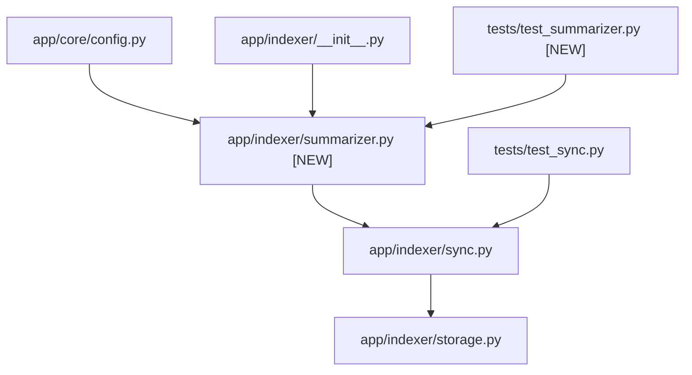

# Stage 2: Codebase Design — Task 8.3: OpenRouter AI Semantic Change Summarizer

**Task ID:** `8.3`  
**Task Title:** OpenRouter AI Semantic Change Summarizer  
**Epic:** Epic 8 — Document Version Diffing & Temporal Change Engine  
**Target Files:**
- `[NEW]` [`app/indexer/summarizer.py`](file:///c:/Users/Mubashar/Desktop/Panopticon/app/indexer/summarizer.py)
- `[MODIFY]` [`app/core/config.py`](file:///c:/Users/Mubashar/Desktop/Panopticon/app/core/config.py)
- `[MODIFY]` [`app/indexer/sync.py`](file:///c:/Users/Mubashar/Desktop/Panopticon/app/indexer/sync.py)
- `[MODIFY]` [`app/indexer/__init__.py`](file:///c:/Users/Mubashar/Desktop/Panopticon/app/indexer/__init__.py)
- `[NEW]` [`tests/test_summarizer.py`](file:///c:/Users/Mubashar/Desktop/Panopticon/tests/test_summarizer.py)
- `[MODIFY]` [`tests/test_sync.py`](file:///c:/Users/Mubashar/Desktop/Panopticon/tests/test_sync.py)
**Artifact Version:** 1.0.0  
**Status:** READY FOR IMPLEMENTATION  

---

## 1. Current State Snapshot

In Task 8.2, `IncrementalSyncEngine` computes `diff_res = self.diff_engine.compute_diff(...)` and saves a `DocumentDiff` in SQLite, but `DocumentDiff.ai_summary` is currently populated with `None` or omitted because no summarizer service was wired into the sync pipeline.

```mermaid
graph TD
    subgraph CurrentSyncFlow ["Current Diff Flow (Before Task 8.3)"]
        DiffEngine["DiffEngine\n(app/indexer/diff.py)"]
        SyncEngine["IncrementalSyncEngine\n(app/indexer/sync.py)"]
        Storage["CrawlStorage\n(app/indexer/storage.py)"]
    end

    DiffEngine -->|DiffResult(patch_text)| SyncEngine
    SyncEngine -->|save_diff(patch_text, ai_summary=None)| Storage
```

---

## 2. Proposed State

Task 8.3 creates `ChangeSummarizer` protocol and implementations (`OpenRouterSummarizer` and `HeuristicSummarizer`) in `app/indexer/summarizer.py`, and injects the summarizer into `IncrementalSyncEngine` to populate `DocumentDiff.ai_summary` automatically.

```mermaid
graph TD
    subgraph ProposedSyncFlow ["Proposed Diff Flow with Summarizer (After Task 8.3)"]
        DiffEngine["DiffEngine"]
        Summarizer["ChangeSummarizer\n(app/indexer/summarizer.py)"]
        SyncEngine["IncrementalSyncEngine\n(app/indexer/sync.py)"]
        Storage["CrawlStorage\n(app/indexer/storage.py)"]
    end

    DiffEngine -->|DiffResult| SyncEngine
    SyncEngine -->|summarize_diff(patch, name, editor)| Summarizer
    Summarizer -->|1-sentence summary| SyncEngine
    SyncEngine -->|save_diff(patch_text, ai_summary)| Storage
```

---

## 3. File-Level Impact Analysis

### `[NEW]` [`app/indexer/summarizer.py`](file:///c:/Users/Mubashar/Desktop/Panopticon/app/indexer/summarizer.py)
- **Purpose:** Define `ChangeSummarizer` protocol, `HeuristicSummarizer` (zero-setup local fallback), `OpenRouterSummarizer` (REST API client via `httpx`), and `get_change_summarizer()` factory.
- **Exports:**
  - `class ChangeSummarizer(Protocol)`
  - `class HeuristicSummarizer`
  - `class OpenRouterSummarizer`
  - `def get_change_summarizer() -> ChangeSummarizer`

### `[MODIFY]` [`app/core/config.py`](file:///c:/Users/Mubashar/Desktop/Panopticon/app/core/config.py)
- **What changes:** Add `OPENROUTER_API_KEY`, `OPENROUTER_MODEL`, and `OPENROUTER_BASE_URL` settings.
- **Why:** Centralize configuration with default values (`OPENROUTER_MODEL="openai/gpt-4o-mini"`, `OPENROUTER_BASE_URL="https://openrouter.ai/api/v1"`).

### `[MODIFY]` [`app/indexer/sync.py`](file:///c:/Users/Mubashar/Desktop/Panopticon/app/indexer/sync.py)
- **What changes:**
  1. Accept optional `summarizer: ChangeSummarizer | None = None` in `__init__()`.
  2. When saving a diff in `run_sync()`, compute `ai_summary = self.summarizer.summarize_diff(diff_res.patch_text, file_to_save.name, raw_file.last_modifying_user)`.
  3. Pass `ai_summary` to `DocumentDiff`.

### `[MODIFY]` [`app/indexer/__init__.py`](file:///c:/Users/Mubashar/Desktop/Panopticon/app/indexer/__init__.py)
- **What changes:** Export summarizer symbols in `__all__`.

### `[NEW]` [`tests/test_summarizer.py`](file:///c:/Users/Mubashar/Desktop/Panopticon/tests/test_summarizer.py)
- **Purpose:** Unit tests for heuristic generation, OpenRouter API requests (with mocked HTTP responses), error/timeout fallback handling, and factory instantiation.

### `[MODIFY]` [`tests/test_sync.py`](file:///c:/Users/Mubashar/Desktop/Panopticon/tests/test_sync.py)
- **What changes:** Verify `ai_summary` is populated during incremental sync runs.

---

## 4. Dependency Graph & Blast Radius



---

## 5. Regression Risk Matrix

| Risk ID | Risk Description | Severity | Affected Area | Mitigation Strategy |
| :--- | :--- | :--- | :--- | :--- |
| **R-01** | OpenRouter network latency slows down sync cycle | 🟡 Medium | `IncrementalSyncEngine.run_sync` | Set short HTTP client timeout (5.0s) and fallback immediately to heuristic summary on timeout. |
| **R-02** | Invalid / missing API key causes sync exceptions | 🟢 Low | `OpenRouterSummarizer` | Auto-detect empty key and route to `HeuristicSummarizer`; catch all `httpx.HTTPError` with fallback. |
| **R-03** | LLM returns verbose or non-compliant text | 🟢 Low | Summary display in UI | Sanitize response with single-sentence extraction and string length bounds (300 chars max). |

---

## 6. Contract Stability Check

| Interface | Current Shape | Proposed Shape | Breaking? |
| :--- | :--- | :--- | :--- |
| `ChangeSummarizer.summarize_diff()` | N/A `[NEW]` | `(patch_text, file_name, editor) -> str` | No |
| `DocumentDiff.ai_summary` | `str | None` | `str | None` (populated with summary) | No |
| `IncrementalSyncEngine.__init__()` | `(crawler, exporter, storage, diff_engine)` | `(crawler, exporter, storage, diff_engine, summarizer=None)` | No (default backward-compatible) |

---

## 7. Rollback Plan

### If Changes Are Uncommitted:
```bash
git checkout -- app/core/config.py app/indexer/sync.py app/indexer/__init__.py tests/test_sync.py
rm app/indexer/summarizer.py tests/test_summarizer.py
```

### If Changes Are Committed:
```bash
git revert HEAD --no-edit
pytest tests/
```
