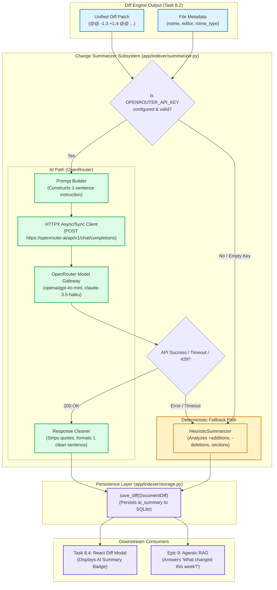
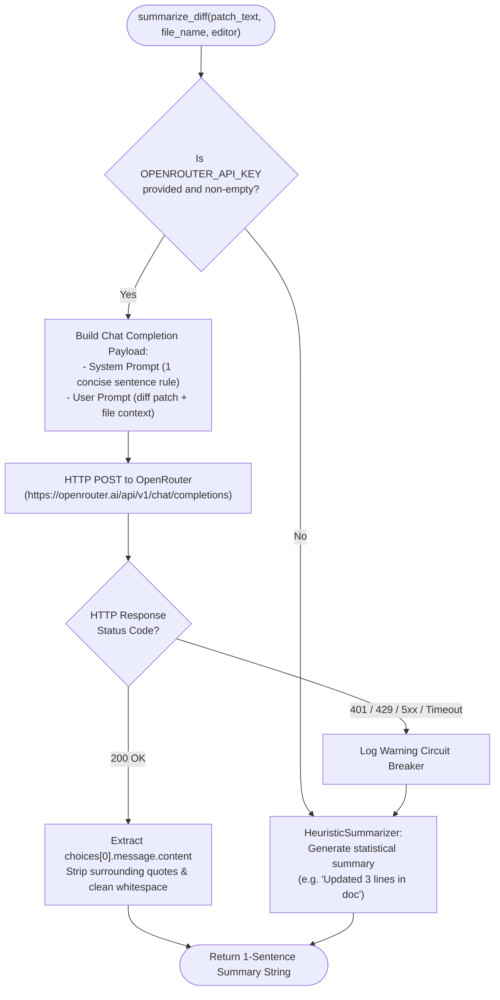

# Stage 1: Concept-to-Code Bridge — Task 8.3: OpenRouter AI Semantic Change Summarizer

**Task ID:** `8.3`  
**Task Title:** OpenRouter AI Semantic Change Summarizer  
**Epic:** Epic 8 — Document Version Diffing & Temporal Change Engine  
**Target Subsystems:** `app/indexer/summarizer.py` `[NEW]`, `app/core/config.py` `[MODIFY]`, `app/indexer/sync.py` `[MODIFY]`, `app/indexer/__init__.py` `[MODIFY]`, `tests/test_summarizer.py` `[NEW]`  
**Artifact Version:** 1.0.0  
**Status:** READY FOR REVIEW / DESIGN GATE  

---

## 1. Visual Architecture



---

## 2. The Physical Analogy

> **The AI Semantic Change Summarizer** is like an **Executive Intelligence Briefer stationed in a corporate strategy office**.
>
> When two 200-page operational dossiers are compared, the stenographer produces a redline sheet showing 4 line modifications. 
>
> The CEO does not have time to read raw diff tokens like `@@ -14,2 +14,3 @@ -timeout: 30 +timeout: 120`. 
>
> The **Intelligence Briefer (OpenRouter AI)** reads the redline in half a second and speaks a single clear sentence to the executive: *"Sarah extended the database connection timeout threshold from 30 seconds to 120 seconds to prevent cold-start disconnects."*
>
> If the Briefer is away or unreachable (**no API key / offline mode**), an **Assistant (Heuristic Fallback)** steps in with a reliable clipboard notice: *"Updated 2 configuration lines in 'Database Settings.gdoc'"*. The business never halts.

---

## 3. Why & What

### Why Are We Doing This Task?
In Task 8.2, we built `DiffEngine`, which generates technical unified patches (`@@ -1,2 +1,3 @@ -old +new`). While patches are ideal for syntax-highlighted code editors, they are not easily digested at a glance by business stakeholders, project managers, or conversational search queries.

Without the **AI Semantic Change Summarizer**:
1. Search results and history lists can only show raw line counts ($+2, -1$) without conveying the *meaning* of the change.
2. The React Version History Modal (Task 8.4) lacks a human-readable title/summary for each revision.
3. Conversational AI agent queries in Epic 9 (e.g. *"What did the team update in the Project Falcon spec yesterday?"*) would have to re-evaluate raw diffs on the fly rather than reading pre-computed, indexed 1-sentence summaries from SQLite.

### What Is the Concept?
The Summarizer subsystem delivers:

1. **Protocol-Driven Decoupling (`ChangeSummarizer`)**:
   - `summarize_diff(patch_text: str, file_name: str, editor: str | None = None) -> str`
   - Core indexer and sync code depends exclusively on this abstraction, isolating LLM vendor specifics.

2. **OpenRouter LLM Integration (`OpenRouterSummarizer`)**:
   - Sends a concise system prompt + unified diff patch to OpenRouter using high-speed, cost-effective models (`openai/gpt-4o-mini`, `anthropic/claude-3.5-haiku`, `meta-llama/llama-3.3-70b-instruct`).
   - Prompt is strictly engineered to output exactly **one declarative sentence** explaining the intent and impact of the change.

3. **Zero-Setup Heuristic Fallback (`HeuristicSummarizer`)**:
   - Guaranteed zero-setup operation: if `OPENROUTER_API_KEY` is not set or network calls fail, it parses the patch locally and generates an informative structured summary (e.g. *"Updated 3 lines (+2, -1) in 'Product Roadmap.gdoc'"*).

4. **Integration with `IncrementalSyncEngine` (`app/indexer/sync.py`)**:
   - Injected into sync engine to populate `DocumentDiff.ai_summary` automatically upon diff generation.

### What Breaks If We Skip It?
1. **Raw Diffs Only:** Diff records lack plain-English summaries, degrading dashboard UX in Task 8.4.
2. **Slow RAG Queries in Epic 9:** Agentic RAG tools cannot quickly summarize recent revisions across dozens of documents without re-prompting an LLM on every query.

---

## 4. Abstraction Level Map

| Abstraction Level | What Lives Here | Panopticon Concrete Implementation (Task 8.3) |
| :--- | :--- | :--- |
| **Product / UX** | Human-readable document revision notes | 1-sentence summary displayed in dashboard version modal & search results |
| **Application Layer** | Summarizer orchestration & sync injection | `OpenRouterSummarizer`, `HeuristicSummarizer`, `IncrementalSyncEngine` |
| **Domain Protocol** | Abstract interface specification | `ChangeSummarizer(Protocol)` in `app/indexer/summarizer.py` |
| **Transport Layer** | HTTP REST client & OpenRouter gateway | `httpx.Client` / `httpx.AsyncClient` calling `https://openrouter.ai/api/v1` |
| **Persistence Layer** | Relational diff records in SQLite | `DocumentDiff.ai_summary` column in `document_diffs` table |

---

## 5. Mermaid Diagrams

### 5.1 Decision & Fallback Flowchart


---

## 6. Data Flow Trace-Through

1. **Diff Available**: `DiffEngine` computes a patch for `API_Security.gdoc`:
   ```diff
   @@ -5,2 +5,3 @@
    Rate limiting:
   -Max 100 requests per minute
   +Max 500 requests per minute with Redis token bucket
   +Require OAuth 2.0 Bearer header
   ```
2. **Summarizer Invocation**: `summarizer.summarize_diff(patch_text, file_name="API_Security.gdoc", editor="sarah@company.com")`.
3. **OpenRouter Prompt Construction**:
   - System: *"You are Panopticon's change summarizer. Summarize what changed in the provided document diff in exactly one concise, plain-English sentence. Focus on what was added, removed, or modified. Do not include markdown code fences or quotes."*
   - User: *"File: API_Security.gdoc\nEditor: sarah@company.com\nDiff Patch:\n[patch]"*
4. **OpenRouter Model Response**:
   `"Sarah increased the rate limit from 100 to 500 requests per minute with Redis token buckets and mandated OAuth 2.0 Bearer headers."`
5. **Persistence**:
   The string is saved in `DocumentDiff.ai_summary`.
6. **Dashboard & RAG Availability**:
   The React Version History modal renders the exact summary badge alongside the green/red diff.

---

## 7. Cognitive Model → Code Mapping

| Cognitive Concept | Mental Model | Code Implementation in Panopticon | Enforcement Mechanism |
| :--- | :--- | :--- | :--- |
| **Swappable Interface** | "The application doesn't care if a summary comes from OpenAI, Anthropic, or a local rule" | `class ChangeSummarizer(Protocol)` | Python `typing.Protocol` with runtime type safety |
| **Zero-Setup Guarantee** | "The app works out of the box with zero external API keys" | `class HeuristicSummarizer` fallback | Default factory fallback when `OPENROUTER_API_KEY=""` |
| **Circuit Breaker** | "Network failures or rate limits must never crash the background sync engine" | `try ... except httpx.HTTPError: return self.fallback.summarize_diff(...)` | Graceful degrade to heuristic summary |
| **Token-Efficient Prompt** | "Only pass the patch and key metadata to keep token costs minimal" | Truncated diff template with 1-sentence prompt | $< 150$ tokens per summarization call |

---

## 8. Language & Stack Context

### Python 3.12 & `httpx`
- **Zero Heavy SDKs**: Uses standard `httpx` (already in dependencies via FastAPI/starlette ecosystem) with HTTP/2 and connection pooling.
- **Config & Settings (`app/core/config.py`)**:
  - `OPENROUTER_API_KEY: str = ""` (loaded from `.env`)
  - `OPENROUTER_MODEL: str = "openai/gpt-4o-mini"` (configurable to any OpenRouter model identifier)
  - `OPENROUTER_BASE_URL: str = "https://openrouter.ai/api/v1"`

---

## 9. Five Alternative Approaches

| # | Approach | Pros | Cons | Decision |
|---|---|---|---|---|
| **1** | **OpenRouter API + Heuristic Fallback (Chosen)** | 1. Access to all top LLMs via one API.<br>2. 100% zero-setup offline fallback.<br>3. No heavy vendor SDKs. | Requires API key for AI summaries (handled by fallback). | **SELECTED** |
| **2** | **Direct OpenAI / Anthropic SDK** | Official SDK methods. | Vendor lock-in; extra heavy dependencies; incompatible auth schemes. | REJECTED |
| **3** | **Local Ollama / LLaMA 3.3 Server** | Fully offline AI. | Heavy RAM/VRAM resource requirements (4-8GB); complex multi-OS setup. | REJECTED for local default (Deferred to optional pluggable provider in Epic 9) |
| **4** | **Rule-Based Regex Parsing Only** | Instant speed; zero external calls. | Cannot understand semantic context or summarize complex document revisions. | USED AS FALLBACK ONLY |
| **5** | **Summarizing Full Documents (Before/After)** | Full context. | 100x higher token cost ($0.05 vs $0.0001); 5x higher latency; high hallucination risk. | REJECTED |

---

## 10. Production Rationale & Failure Scenarios

### Concrete Failure Scenarios

#### Scenario 1: Missing or Invalid API Key
- **Failure:** User runs Panopticon locally without providing an OpenRouter API key.
- **Handling:** `get_change_summarizer()` detects empty key and automatically initializes `HeuristicSummarizer`. Zero errors, zero latency, zero setup required.

#### Scenario 2: OpenRouter 429 Rate Limit or Network Timeout
- **Failure:** OpenRouter rate limits the request or network connection drops.
- **Handling:** `OpenRouterSummarizer` catches `httpx.HTTPError`, logs a warning, and immediately returns the heuristic summary without interrupting the incremental sync cycle.

#### Scenario 3: LLM Outputs Multiple Paragraphs or Quoted Text
- **Failure:** Model ignores the 1-sentence prompt and outputs conversational greeting or quotes.
- **Handling:** Post-processing regex cleaner strips surrounding quotes, takes the first non-empty line, and truncates to 300 characters max.
