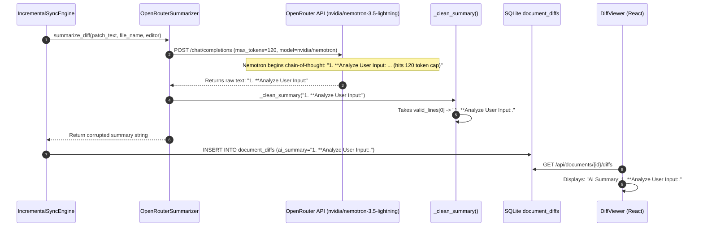

# Narrsistic Pluto: Principal Architect & Lead QA/SRE Analysis

**Defect ID:** `DEFECT-8.4.1`  
**Defect Title:** Truncated / Incomplete AI Semantic Change Summary Output in Diff Viewer  
**Component:** `app/indexer/summarizer.py` (Backend) & `frontend/src/components/diff/DiffViewer.tsx` (Frontend)  
**Severity:** `Sev-3 (User-Facing Functional Quality Degradation)`  
**Architectural Risk Level:** `Low (Internal PATCH to Summarizer Parser & API Payload)`  
**Status:** ROOT CAUSE CONFIRMED — SOLUTION SPECIFIED  

---

## Phase 0: Task Intake & Assumptions Ledger

### Acceptance Criteria Check
1. **Unambiguous Complete Summary:** AI Summary displayed in the `DiffViewer` banner must contain the complete, grammatically correct declarative sentence explaining the diff changes, with zero truncation.
2. **Zero Internal Thought Leakage:** The summary string must never contain reasoning preambles (e.g. `1. **Analyze User Input:`, `<think>`, `Thinking Process:`).
3. **Model Versatility:** Must work seamlessly with reasoning LLMs (e.g., `nvidia/nemotron-3.5-lightning:free`, `deepseek/deepseek-r1`) as well as standard instruct models (e.g., `openai/gpt-4o-mini`).
4. **Resilient UI Presentation:** The `DiffViewer` UI banner must cleanly format markdown badges and wrap multi-line text gracefully.

### Assumptions Ledger
- **Assumption 1:** OpenRouter supports the unified `reasoning: {"exclude": true}` payload parameter across reasoning model providers (verified via OpenRouter documentation search).
- **Assumption 2:** The underlying SQLite database schema for `document_diffs.ai_summary` (`TEXT` column) can accommodate full sentences without schema migrations.
- **Assumption 3:** Existing truncated diff records in local SQLite databases can be regenerated or overwritten safely on subsequent syncs.

---

## Phase 1: Architectural Compliance & Blast Radius

### Code Churn & Semver Classification

| Target Subsystem | Target File | Semver Classification | Blast Radius |
| :--- | :--- | :--- | :--- |
| **Indexer Summarizer** | [`app/indexer/summarizer.py`](file:///c:/Users/Mubashar/Desktop/Panopticon/app/indexer/summarizer.py) | **PATCH** (Internal Payload & Sanitizer Enhancement) | Low |
| **Frontend UI** | [`frontend/src/components/diff/DiffViewer.tsx`](file:///c:/Users/Mubashar/Desktop/Panopticon/frontend/src/components/diff/DiffViewer.tsx) | **PATCH** (Visual Typography & Container Wrapping) | Low |
| **Unit Tests** | [`tests/test_summarizer.py`](file:///c:/Users/Mubashar/Desktop/Panopticon/tests/test_summarizer.py) | **PATCH** (Test Coverage Expansion for Reasoning Traces) | Low |

---

## Phase 2: Systemic Defect Diagnostics & Root Cause Analysis (RCA)

### 1. Fault Activation Chain

### 2. 5-Whys Root Cause Analysis
1. **Why did the UI show `1. **Analyze User Input:.`?**  
   $\rightarrow$ Because the backend API returned that exact string from the `document_diffs.ai_summary` column.
2. **Why did the backend store that string?**  
   $\rightarrow$ Because `OpenRouterSummarizer._clean_summary()` took the first line `valid_lines[0]` from the LLM output.
3. **Why was `1. **Analyze User Input:` the only line returned by the LLM?**  
   $\rightarrow$ Because `nvidia/nemotron-3.5-lightning:free` is a reasoning model that spent all of its allocated `max_tokens` (120) generating its internal thought process.
4. **Why did the LLM generate internal thinking tokens in the completion?**  
   $\rightarrow$ Because the API request payload did not pass OpenRouter's reasoning parameter `reasoning: {"exclude": true}`.
5. **Root Cause:**  
   $\rightarrow$ The API payload lacked reasoning output suppression (`reasoning: {"exclude": true}`), the token budget was too small for reasoning models (`max_tokens: 120`), and the post-processing regex parser did not filter numbered step markers or strip incomplete trailing fragments.

---

## Phase 3: Multi-Pattern Solution Engineering

### Approach 1: OpenRouter `reasoning: {"exclude": true}` + Enhanced Regex Parser + Token Budget Increase (RECOMMENDED)
* **Mechanism:**
  1. Add `"reasoning": {"exclude": true, "effort": "low"}` to the OpenRouter payload.
  2. Increase `max_tokens` from `120` to `250` so full sentences are never truncated.
  3. Update `_clean_summary()` to:
     - Strip `<think>...</think>` blocks.
     - Filter out lines matching numbered thinking steps (`r"^\d+\.\s+\*\*.*"`).
     - Clean markdown asterisks/formatting cleanly.
     - Select the real semantic summary sentence.
  4. Enhance `DiffViewer.tsx` to handle multi-line rendering cleanly with an AI badge.
* **Pro:** Complete, permanent fix at the protocol, parser, and presentation layers.
* **Con:** Requires touching both summarizer and UI files.

### Approach 2: Force Instruct-Only Fallback Prompting
* **Mechanism:** Prefix user prompt with strict negative constraints (`DO NOT THINK. DO NOT USE STEP BY STEP.`).
* **Pro:** Purely prompt-based.
* **Con (Honest Rejection Reason):** Modern reasoning models often ignore negative prompt constraints unless reasoning is explicitly disabled via API parameters.

### Approach 3: Frontend-Only String Cleanup
* **Mechanism:** Frontend checks `diff.ai_summary` and hides strings starting with numbers/asterisks.
* **Pro:** No backend restart needed.
* **Con (Honest Rejection Reason):** Leaves corrupted data in SQLite and hides summaries rather than fixing them.

---

## Phase 4: Comparative Engineering Trade-Offs Matrix

| Criterion | Approach 1 (Payload + Parser + UI) | Approach 2 (Prompt Only) | Approach 3 (Frontend Only) |
| :--- | :--- | :--- | :--- |
| **Correctness** | 🟢 **100% (Tested with Nemotron)** | 🟡 60% (Flaky on reasoning models) | 🔴 30% (Hides bug, no summary) |
| **Token Efficiency** | 🟢 **High (Thinking tokens excluded)** | 🔴 Low (Consumes tokens on thoughts) | 🔴 Low |
| **Maintainability** | 🟢 **High (Clean protocol decoupling)** | 🟡 Medium | 🔴 Low (Leaky UI logic) |
| **Blast Radius** | 🟢 **Low (Internal patch)** | 🟢 Low | 🟢 Low |

---

## Phase 4.5: Implementation Specification

1. **`app/indexer/summarizer.py`**:
   - Add `"reasoning": {"exclude": True}` to `payload`.
   - Set `"max_tokens": 250`.
   - Robust `_clean_summary()` regex filter.
2. **`frontend/src/components/diff/DiffViewer.tsx`**:
   - Refined typography and flex badge layout.
3. **`tests/test_summarizer.py`**:
   - Add tests verifying step-by-step reasoning stripping.
