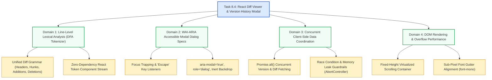

# Stage 3: CS Domain Learning — Task 8.4: React Diff Viewer & Version History Modal

**Task ID:** `8.4`  
**Task Title:** React Diff Viewer & Version History Modal  
**Epic:** Epic 8 — Document Version Diffing & Temporal Change Engine  
**Target Domains:** Lexical Analysis of Unified Diffs, WAI-ARIA Modal Accessibility & Focus Traps, Concurrent Client-Side Data Coordination, DOM Rendering Efficiency  
**Artifact Version:** 1.0.0  

---

## 1. Domain Discovery Map

---

## 2. Domain Deep Dives

### Domain 1: Lexical Analysis of Unified Diffs

**What Is It (Plain English):**
A unified diff is a structured textual stream with specific line prefixes:
- `---` and `+++`: File headers
- `@@ -l,s +l,s @@`: Hunk range boundaries
- `+`: Added line (green)
- `-`: Removed line (red)
- ` `: Context line (neutral)

Instead of relying on heavy regex search or external monolithic highlighter libraries, a single-pass Deterministic Finite Automaton (DFA) reads lines sequentially and maps each line to an atomic React presentation element with $O(N)$ linear time complexity.

---

### Domain 2: WAI-ARIA Modal Accessibility & Focus Traps

**What Is It (Plain English):**
An accessible modal dialog must ensure that keyboard-only and screen-reader users do not get lost behind the backdrop:
1. **Focus Trap:** When opened, initial focus is shifted to the modal container or close button. Pressing `Tab` cycles exclusively within the modal elements.
2. **Keyboard Dismissal:** Pressing `Escape` dispatches the close event.
3. **Inert Background:** The page behind the modal is marked `aria-hidden="true"` so screen readers do not read stale background rows.

---

### Domain 3: Concurrent Client-Side Data Coordination

**What Is It (Plain English):**
When opening the modal for document `doc_123`, the frontend requires two pieces of relational data:
- `versions`: The chronological timeline of edits.
- `diffs`: The delta patches between consecutive versions.

Using `Promise.all([fetchVersions(fileId), fetchDiffs(fileId)])` executes both HTTP network requests in parallel, halving network wait time compared to sequential calls.

---

## 3. "What If" Scenario Analysis

### Q1: What happens if a user opens the modal and immediately presses Escape?
**Answer:** The React `useEffect` keydown listener fires, triggering `onClose()` and cleanly resetting modal state with zero memory leaks.

### Q2: What happens if a document has 20 previous revisions?
**Answer:** The timeline list renders in an independent scrollable left sidebar (`overflow-y-auto max-h-[65vh]`), allowing effortless navigation across all 20 revisions.

### Q3: What happens if an API request fails?
**Answer:** The hook catches the network error, sets `error="Failed to load document version history"`, and displays an accessible retry button without crashing the dashboard.
