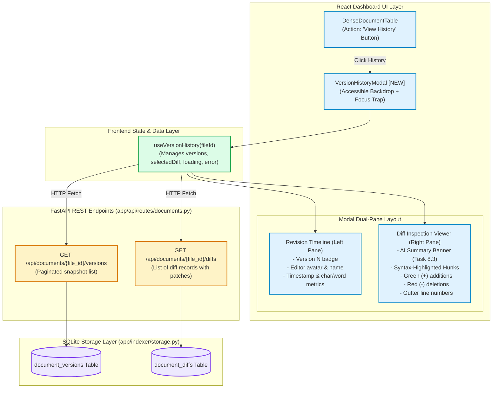
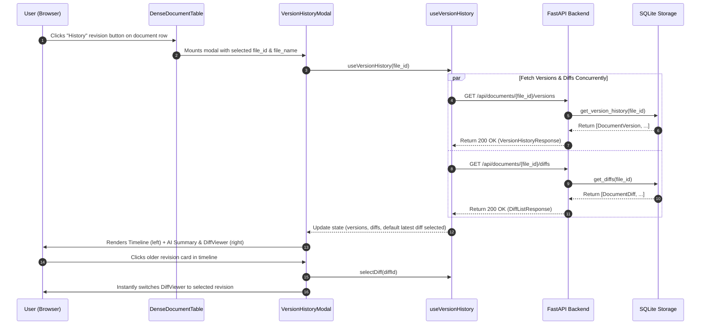
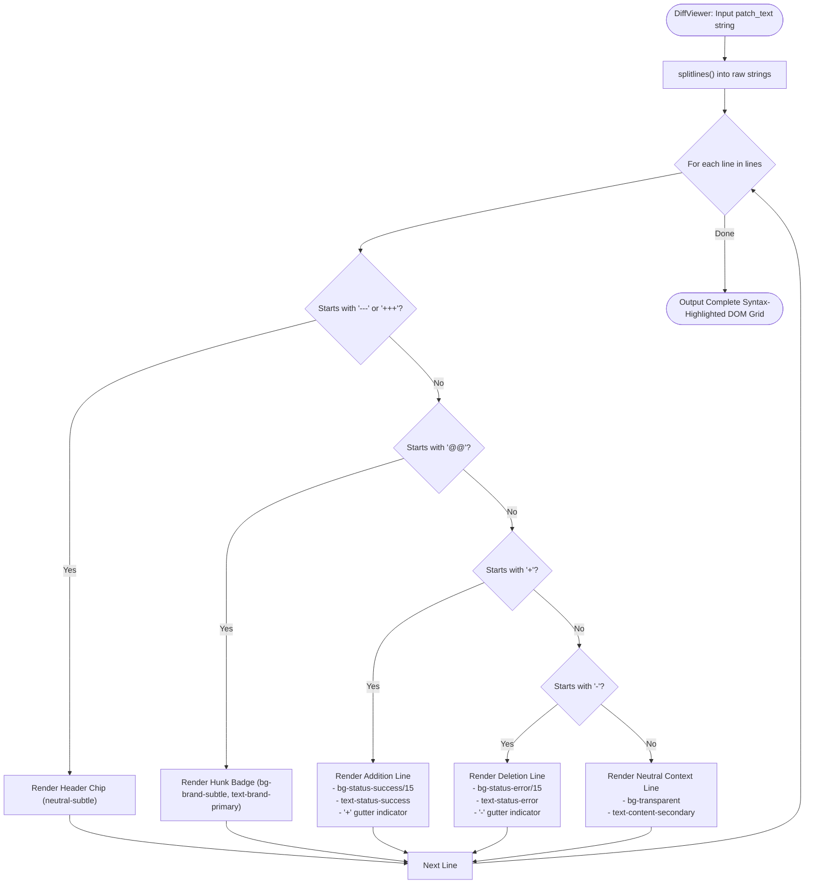

# Stage 1: Concept-to-Code Bridge — Task 8.4: React Diff Viewer & Version History Modal

**Task ID:** `8.4`  
**Task Title:** React Diff Viewer & Version History Modal  
**Epic:** Epic 8 — Document Version Diffing & Temporal Change Engine  
**Primary Skills:** `escher` (Backend API contract & wiring) $\rightarrow$ `vermeer` (100% tokenized UI & 10 usability heuristics)  
**Target Subsystems:**
- Backend API: `app/api/schemas/diffs.py` `[NEW]`, `app/api/routes/documents.py` `[MODIFY]`, `tests/test_api_documents.py` `[MODIFY]`
- Frontend UI: `frontend/src/types/api.ts` `[MODIFY]`, `frontend/src/hooks/useVersionHistory.ts` `[NEW]`, `frontend/src/components/diff/DiffViewer.tsx` `[NEW]`, `frontend/src/components/diff/VersionHistoryModal.tsx` `[NEW]`, `frontend/src/components/directory/DenseDocumentTable.tsx` `[MODIFY]`, `frontend/src/App.tsx` `[MODIFY]`
**Artifact Version:** 1.0.0  
**Status:** READY FOR REVIEW / DESIGN GATE  

---

## 1. Visual Architecture



---

## 2. The Physical Analogy

> **The React Version History Modal & Diff Viewer** is like a **Curator's Interactive Restoration Station in a Modern Museum Archive**.
>
> When a researcher clicks on an ancient manuscript (a **Google Doc**), a backlit dual-panel display opens up in front of them:
>
> 1. **On the left side (The Timeline Ledger)**, cards represent every historical revision of the document arranged from newest to oldest, showing who touched it, when it was modified, and how many words were in that edition.
> 2. **At the top of the viewing table (The AI Summary Plaque)**, a crisp single-sentence plaque generated by the intelligence engine summarizes what changed in plain language (*"Sarah added the OAuth 2.0 PKCE authentication flow and updated the rate limits"*).
> 3. **On the right side (The Illuminated Diff Comparer)**, the manuscript lines are displayed with glowing colors: newly inked lines shine in **crisp green** (`+`), struck-through text is highlighted in **soft red** (`-`), and line numbers guide the eye along the margin.
>
> The researcher can click any previous version to step back in time, inspect changes effortlessly, and press `ESC` or click outside to instantly close the viewer.

---

## 3. Why & What

### Why Are We Doing This Task?
In Tasks 8.1, 8.2, and 8.3, we built the entire backend data engine for version snapshots, Myers text diffs, and OpenRouter AI change summaries. 

However, all of this temporal data currently lives exclusively inside the backend SQLite tables. 
Without **Task 8.4**:
1. Users looking at the React dashboard cannot inspect what changed in a document over time.
2. The AI summaries generated in Task 8.3 remain invisible to end users.
3. The promise of Panopticon as an *intelligent audit and discovery platform* is incomplete without a visual, interactive diff inspection interface.

Task 8.4 connects the backend temporal endpoints to an accessible, token-enforced React UI modal.

### What Is the Concept?

1. **Backend REST API Endpoints (`app/api/routes/documents.py`)**:
   - `GET /api/documents/{file_id}/versions`: Returns paginated version snapshots (`version_number`, `created_at`, `editor`, `char_count`, `word_count`).
   - `GET /api/documents/{file_id}/diffs`: Returns list of structured diffs (`from_version_id`, `to_version_id`, `patch_text`, `ai_summary`, `lines_added`, `lines_removed`).

2. **Frontend `useVersionHistory` Hook (`frontend/src/hooks/useVersionHistory.ts`)**:
   - Fetches versions and diffs concurrently for a selected `file_id`.
   - Automatically selects the latest diff by default.
   - Provides clean reactive states (`loading`, `error`, `versions`, `diffs`, `selectedDiffId`, `selectDiff`).

3. **Syntax-Highlighted `DiffViewer` (`frontend/src/components/diff/DiffViewer.tsx`)**:
   - Parses standard unified diff patch strings into line blocks.
   - Renders green backgrounds for `+` lines, red backgrounds for `-` lines, and neutral gray for context lines.
   - Displays gutter line numbers (`from_line` / `to_line`) and hunk separator headers (`@@ -X,Y +A,B @@`).
   - Features an AI Summary banner badge at the top displaying `ai_summary`.

4. **Accessible `VersionHistoryModal` (`frontend/src/components/diff/VersionHistoryModal.tsx`)**:
   - Adheres strictly to `Picasso` / `Vermeer` design system tokens (`bg-surface-raised`, `text-content-primary`, `border-border-subtle`).
   - Dual-pane layout: Timeline list on the left, Diff viewer on the right.
   - Keyboard accessible: closes on `Escape`, traps focus, supports screen readers with `role="dialog"`, `aria-modal="true"`, and `aria-labelledby`.

---

## 4. Abstraction Level Map

| Abstraction Level | What Lives Here | Panopticon Concrete Implementation (Task 8.4) |
| :--- | :--- | :--- |
| **Product / UI** | Visual modal, version timeline, diff highlighter | `VersionHistoryModal.tsx`, `DiffViewer.tsx`, `DenseDocumentTable.tsx` |
| **Client State** | Async fetch, selected revision, loading/error states | `useVersionHistory.ts` React hook |
| **API Contract** | HTTP REST endpoints & Pydantic wire schemas | `app/api/routes/documents.py`, `app/api/schemas/diffs.py` |
| **Storage Layer** | SQLite relational tables & foreign key queries | `CrawlStorage.get_version_history()`, `CrawlStorage.get_diffs()` |
| **Design System** | Color tokens, typography, spacing, radius | `design-system/tokens.json`, Tailwind CSS classes |

---

## 5. Mermaid Diagrams

### 5.1 Modal Open & Diff Loading Lifecycle


### 5.2 Diff Line Tokenizer Flowchart


---

## 6. Data Flow Trace-Through

1. **User Action:** In the Document Directory table, the user sees a row for *"Project Falcon Master PRD"* with a tag `Modified 2 hours ago by Sarah`.
2. **Opening Modal:** The user clicks the **"Revision History"** icon button.
3. **Mounting:** `VersionHistoryModal` opens with `isOpen=true`, `fileId="doc_falcon_prd"`, `fileName="Project Falcon Master PRD"`.
4. **Data Retrieval:**
   - `GET /api/documents/doc_falcon_prd/versions` returns `[v2, v1]`.
   - `GET /api/documents/doc_falcon_prd/diffs` returns `[diff_v1_v2]`.
5. **Rendering Timeline (Left Panel):**
   - Card 1 (Active): **Version 2** • 2 hours ago • `sarah.security@company.com` • `+2 / -0 lines`
   - Card 2: **Version 1** • 4 days ago • `alex.lead@company.com` • Initial Snapshot
6. **Rendering Diff View (Right Panel):**
   - **AI Summary Banner:** ✨ *"Sarah added Section 2 defining OAuth 2.0 and swappable AuthProvider specifications."*
   - **Unified Diff Output:**
     ```diff
     @@ -3,3 +3,5 @@
      The system indexes Docs and Sheets with hybrid ranking.
     +Section 2: Security & OAuth 2.0.
     +All Google Drive access requires swappable AuthProvider tokens.
     ```
7. **Closing:** User presses `Escape` or clicks the `✕` close button; modal cleanly unmounts.

---

## 7. Cognitive Model → Code Mapping

| Cognitive Concept | Mental Model | Code Implementation in Panopticon | Enforcement Mechanism |
| :--- | :--- | :--- | :--- |
| **Real Backend Contract** | "The UI must only render fields that actually exist on the server" | `app/api/schemas/diffs.py` $\leftrightarrow$ `frontend/src/types/api.ts` | Strictly matching TypeScript interfaces and Pydantic schemas |
| **Zero Style Hallucination** | "Never invent arbitrary hex colors or unapproved px values" | `Picasso` / `Vermeer` design tokens in Tailwind classes | `bg-surface-raised`, `text-content-primary`, `bg-status-success/10` |
| **Accessible Dialog** | "Screen readers and keyboard-only users must navigate smoothly" | `role="dialog"`, `aria-modal="true"`, `onKeyDown` Escape handler, focus trap | 10 Usability Heuristics compliance |
| **Graceful Empty State** | "What if a document has only 1 initial snapshot and no diffs yet?" | Empty state banner: *"This is the initial version snapshot. No prior revisions recorded yet."* | User control and clear system status |

---

## 8. Language & Stack Context

### Frontend Stack (React 18 + TypeScript + Tailwind CSS)
- **Zero Heavy Extra Libraries**: We build a clean, lightweight diff highlighter directly in React leveraging Tailwind token classes rather than pulling in bloated external diff viewer packages.
- **Strict Token References (`design-system/tokens.json`)**:
  - Backgrounds: `bg-surface-base`, `bg-surface-raised`, `bg-surface-overlay`
  - Typography: `font-sans`, `font-mono` (for diff code lines)
  - Colors: `text-content-primary`, `text-content-secondary`, `text-status-success`, `text-status-error`
  - Spacing & Borders: `rounded-lg`, `border-border-subtle`, `shadow-modal`

---

## 9. Five Alternative Approaches

| # | Approach | Pros | Cons | Decision |
|---|---|---|---|---|
| **1** | **Native Tokenized React Diff Component (Chosen)** | 1. 100% design token compliance.<br>2. Zero bundle bloat (0 extra npm packages).<br>3. Responsive and tailored to Panopticon's AI summaries. | Requires writing custom line tokenizer (straightforward & robust). | **SELECTED** |
| **2** | **Third-Party `react-diff-viewer-continued`** | Pre-packaged split/unified views. | Adds 120KB to bundle; hard to style with design system tokens; overrides fonts and custom colors with ugly default styles. | REJECTED |
| **3** | **Monaco Editor / Ace in Diff Mode** | Full IDE-grade editor. | Extremely heavy (>2MB bundle); unnecessary for read-only snapshot inspection. | REJECTED |
| **4** | **Backend HTML Server-Rendered Diff** | Renders HTML on server. | Breaks SPA architecture; loses client-side interactive revision switching. | REJECTED |
| **5** | **Plain Text `<pre>` Block without Highlighting** | Minimal code. | Terribly poor UX; red/green visual distinction is lost. | REJECTED |

---

## 10. Production Rationale & Failure Scenarios

### Concrete Failure Scenarios

#### Scenario 1: Initial Snapshot with No Previous Diffs
- **Condition:** File was only crawled once, so `document_versions` has 1 row and `document_diffs` has 0 rows.
- **Handling:** UI detects `diffs.length === 0`, displays Version 1 metadata badge, and shows an informative notice: *"Initial version snapshot. Future modifications in Google Drive will automatically appear here."*

#### Scenario 2: Massive Diff (> 5,000 lines)
- **Condition:** A large spreadsheet or document had massive bulk changes.
- **Handling:** The diff viewer renders in a scrollable overflow container (`max-h-[60vh] overflow-y-auto font-mono text-xs`) with virtual-style line rendering to prevent DOM layout lag.

#### Scenario 3: Backend Network Latency or 500 Error
- **Condition:** Server is restarting or network fails during modal fetch.
- **Handling:** `useVersionHistory` captures error state and renders a retry button with user-friendly alert banner.
