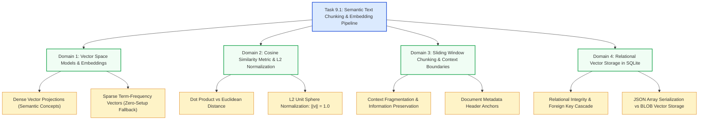

# Stage 3: CS Domain Learning — Task 9.1: Semantic Text Chunking & Embedding Pipeline

**Task ID:** `9.1`  
**Task Title:** Implement Semantic Text Chunking & Local Embeddings Pipeline  
**Epic:** Epic 9 — Agentic RAG Intelligence & OpenRouter Provider Seam  
**Target Domains:** High-Dimensional Vector Spaces, Cosine Similarity Mathematics, Sliding Window Tokenization, Dense vs Sparse Vector Representations  
**Artifact Version:** 1.0.0  

---

## 1. Domain Discovery Map

---

## 2. Mathematical Deep Dive: Cosine Similarity

### 2.1 The Mathematical Formulation
Given two vectors $A, B \in \mathbb{R}^D$ where $D$ is the embedding dimension:

$$\text{Cosine Similarity}(A, B) = \cos(\theta) = \frac{A \cdot B}{\|A\|_2 \|B\|_2} = \frac{\sum_{i=1}^D A_i B_i}{\sqrt{\sum_{i=1}^D A_i^2} \sqrt{\sum_{i=1}^D B_i^2}}$$

### 2.2 Why Cosine Similarity Over Euclidean Distance ($L_2$ Distance)?
In semantic search and document retrieval:
1. **Magnitude Invariance:** Euclidean distance is sensitive to text length (longer passages produce larger vector magnitudes). Cosine similarity measures the **angle** between the two concepts rather than their magnitude, meaning a short query and a detailed paragraph discussing the same concept will have a high cosine similarity ($\approx 1.0$).
2. **L2 Unit Normalization Optimization:**
   If vectors $A$ and $B$ are pre-normalized such that $\|A\|_2 = 1.0$ and $\|B\|_2 = 1.0$, then:
   $$\text{Cosine Similarity}(A, B) = A \cdot B = \sum_{i=1}^D A_i B_i$$
   This reduces vector comparison from an expensive square-root computation to a pure linear dot product $O(D)$!

---

## 3. Sliding Window Chunking & Context Preservation

### 3.1 The Boundary Problem
When slicing a document arbitrarily by character or token limits, sentences get cleaved across boundaries:
- *Chunk 1 End:* "The authentication system enforces OAuth 2.0 PKCE for all client applications, which"
- *Chunk 2 Start:* "prevents authorization code interception attacks by malicious actors."

If a user asks *"How does the system prevent code interception?"*, Chunk 1 lacks the answer and Chunk 2 lacks the subject ("OAuth 2.0 PKCE").

### 3.2 The Sliding Window Solution
By introducing an **overlap buffer** ($O = 200$ characters) and respecting paragraph breaks (`\n\n`), the end of Chunk 1 overlaps with the beginning of Chunk 2:
- Chunk 1 retains the full thought.
- Chunk 2 starts with the context of the previous sentence.
- Adding the **metadata header** (`[Document: Title | Section: Heading]`) guarantees the LLM knows the origin even when inspecting an isolated passage.

---

## 4. "What If" Scenario Analysis

### Q1: What if a document has no paragraph breaks (e.g. a huge continuous raw log or table)?
**Answer:** The chunker falls back to sentence boundary detection (`. ` / `? ` / `! `), and if no sentences exist, cleanly slices at word spaces to prevent infinite loops.

### Q2: What if two different documents have identical section titles (e.g. `# Overview`)?
**Answer:** The chunk metadata anchor prepends both the document name and file ID, preventing collision and ensuring unambiguous citation resolution in Stage 9.4.

### Q3: What if the user is running Panopticon on an air-gapped machine with no internet?
**Answer:** `DeterministicHashEmbeddingProvider` computes an L2-normalized 128-dimensional term-frequency vector locally using standard library hashing, ensuring vector search still functions completely offline.
