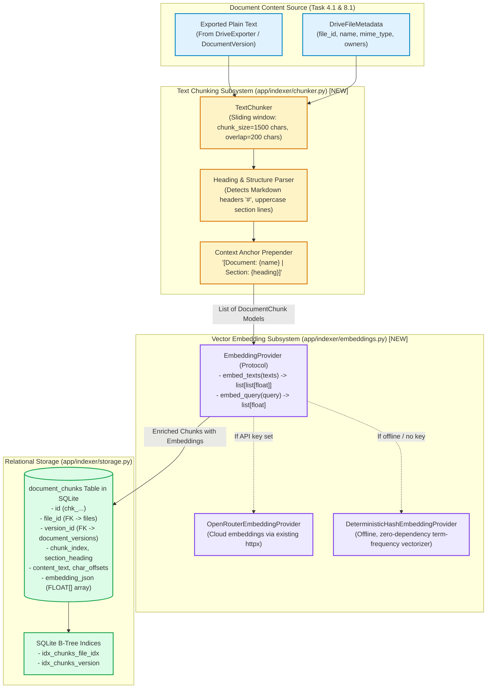
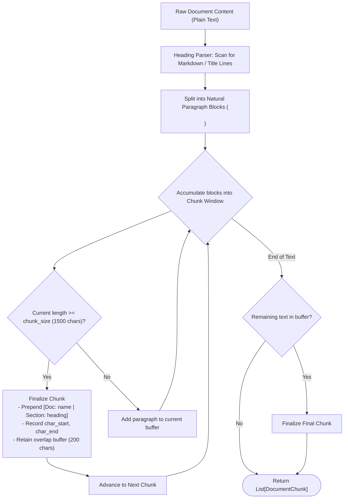
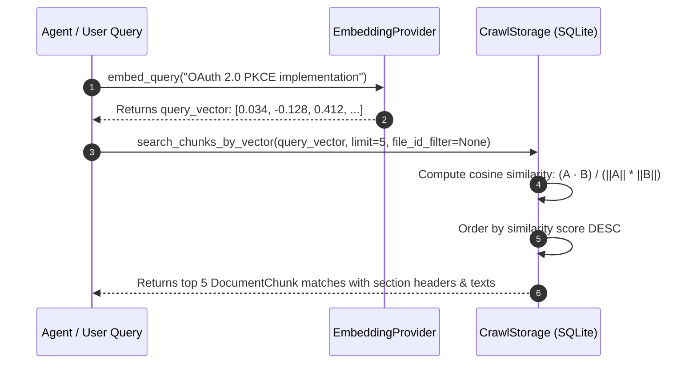

# Stage 1: Concept-to-Code Bridge — Task 9.1: Semantic Text Chunking & Embedding Pipeline

**Task ID:** `9.1`  
**Task Title:** Implement Semantic Text Chunking & Local Embeddings Pipeline  
**Epic:** Epic 9 — Agentic RAG Intelligence & OpenRouter Provider Seam  
**Target Files:**
- [`app/indexer/chunker.py`](file:///c:/Users/Mubashar/Desktop/Panopticon/app/indexer/chunker.py) `[NEW]`
- [`app/indexer/embeddings.py`](file:///c:/Users/Mubashar/Desktop/Panopticon/app/indexer/embeddings.py) `[NEW]`
- [`app/indexer/models.py`](file:///c:/Users/Mubashar/Desktop/Panopticon/app/indexer/models.py) `[MODIFY]`
- [`app/indexer/storage.py`](file:///c:/Users/Mubashar/Desktop/Panopticon/app/indexer/storage.py) `[MODIFY]`
- [`app/indexer/sync.py`](file:///c:/Users/Mubashar/Desktop/Panopticon/app/indexer/sync.py) `[MODIFY]`
- [`tests/test_chunker.py`](file:///c:/Users/Mubashar/Desktop/Panopticon/tests/test_chunker.py) `[NEW]`
- [`tests/test_embeddings.py`](file:///c:/Users/Mubashar/Desktop/Panopticon/tests/test_embeddings.py) `[NEW]`
**Artifact Version:** 1.0.0  
**Status:** READY FOR STAGE 2 DESIGN  

---

## 1. Visual Architecture

---

## 2. The Physical Analogy

> **Semantic Text Chunking & Embeddings** is like **a Master Librarian Creating Cross-Referenced Topical Index Cards for an Entire Library Wing**.
>
> Imagine a researcher walks into a massive corporate library with hundreds of 50-page binder dossiers (Google Docs like *"Project Falcon Master Architecture"* or *"SmartTrade FYP Requirements"*).
>
> 1. **Without Chunking:** If someone asks, *"Where is OAuth 2.0 mentioned?"*, the librarian would have to photocopy all 50 pages of every single binder, staple them together into a 2,000-page tower of paper, and shove it onto the analyst's desk. The analyst's brain would melt from information overload.
> 2. **With Semantic Chunking:** The librarian slices each binder into neat 2-page index cards (**chunks**). 
> 3. **The Metadata Stamp:** At the top of every single card, the librarian stamps: `[Dossier: Project Falcon Architecture | Chapter 3: Security Framework]`. Even if an index card is physically separated from its binder, whoever reads it knows exactly what document and chapter it came from.
> 4. **The Overlap Margin:** To make sure a sentence cut across a page boundary isn't severed in half, the librarian overlaps the last paragraph of card 1 with the first paragraph of card 2.
> 5. **The Vector Coordinate Stamp:** The librarian calculates the conceptual coordinate of the card in a 3D topic globe (**the embedding**) and files it away into the library's card catalog drawer (**SQLite `document_chunks`**).
>
> Now, when an analyst asks a question, the librarian instantly pulls the top 3 exact cards out of the drawer in milliseconds!

---

## 3. Why & What

### Why Are We Doing This Task?
In Tasks 8.1–8.4, we indexed document metadata, diffs, and change summaries. However:
1. When a user asks a complex question across their workspace (*"What did we decide about rate limiting in the trading engine?"*), Meilisearch title search only finds files that happen to have the word "trading" in their title.
2. Even if Meilisearch finds a 70-page document, feeding the entire 70 pages into an LLM context is slow, expensive, and causes the LLM to hallucinate or miss needles in the haystack.
3. To enable the **Agentic Reasoning Engine (Task 9.3)** to retrieve exact paragraphs with mathematical precision and citation anchors, we must break documents down into semantic chunks and vectorize them.

### What Is the Concept?
1. **`TextChunker` Engine (`app/indexer/chunker.py`)**:
   - Takes raw document text and slides a window across sentences and paragraphs.
   - Preserves section headings (`# Heading`, uppercase title blocks).
   - Stamps every chunk with global document metadata.
2. **`EmbeddingProvider` Seam (`app/indexer/embeddings.py`)**:
   - Clean `Protocol` defining `embed_texts(texts: list[str]) -> list[list[float]]` and `embed_query(query: str) -> list[float]`.
   - `OpenRouterEmbeddingProvider`: Calls OpenRouter / OpenAI-compatible embedding endpoint over HTTP via `httpx`.
   - `DeterministicHashEmbeddingProvider`: Fast, 100% offline fallback producing deterministic term-frequency vectors without any network calls or external dependencies.
3. **SQLite `document_chunks` Table & Vector Storage (`app/indexer/storage.py`)**:
   - Stores each chunk with its file ID, version ID, text, character offsets, and embedding array.
   - Provides `find_similar_chunks(query_vector, limit, min_similarity)` via vector cosine similarity.

---

## 4. Abstraction Level Map

| Abstraction Level | What Lives Here | Panopticon Concrete Implementation (Task 9.1) |
| :--- | :--- | :--- |
| **Domain Logic** | Text chunking, sentence splitting, sliding window | `app/indexer/chunker.py` (`TextChunker`) |
| **Provider Protocol** | Mathematical vector generation & embedding seams | `app/indexer/embeddings.py` (`EmbeddingProvider`, `OpenRouterEmbeddingProvider`) |
| **Relational Storage** | Chunk persistence, foreign keys, cosine similarity queries | `app/indexer/storage.py` (`document_chunks` table, `save_chunks()`, `search_chunks()`) |
| **Pipeline Integration**| Ingestion hook during full & incremental sync cycles | `app/indexer/sync.py` (`IncrementalSyncEngine`) |

---

## 5. Mermaid Diagrams

### 5.1 Text Chunking Pipeline Flowchart

### 5.2 Vector Similarity Retrieval Sequence

---

## 6. Data Flow Trace-Through

1. **Trigger:** Incremental sync crawls `doc_falcon_01` (*"Project Falcon Technical Architecture"*).
2. **Text Extraction:** Document exporter exports 12,000 characters of plain text with sections `# 1. Architecture`, `# 2. Authentication`, `# 3. Deployment`.
3. **Chunking (`TextChunker.chunk_document`):**
   - Slices text into 9 distinct chunks of ~1,400 characters each.
   - Chunk 3 begins with:
     `[Document: Project Falcon Technical Architecture | Section: 2. Authentication]`
     Followed by the paragraphs detailing OAuth 2.0 and PKCE.
4. **Vector Embedding (`EmbeddingProvider.embed_texts`):**
   - Generates embedding vectors for the 9 chunks.
5. **Persistence (`CrawlStorage.save_chunks`):**
   - Inserts records into `document_chunks` table linked to `file_id='doc_falcon_01'`.
6. **Query Time:**
   - When a user asks *"How does Falcon authenticate?"*, query embedding is matched against all chunks via cosine similarity, returning Chunk 3 with a similarity score of `0.91`!

---

## 7. Cognitive Model → Code Mapping

| Cognitive Concept | Mental Model | Code Implementation in Panopticon | Enforcement Mechanism |
| :--- | :--- | :--- | :--- |
| **Sliding Window** | "A magnifying glass sliding across a scroll with slight overlap" | `TextChunker(chunk_size=1500, overlap=200)` | Standard library string slicing & paragraph boundary preservation |
| **Context Retention** | "Never leave a paragraph an orphan without its document title" | Header prepending in `TextChunker` | `f"[Document: {file_name} | Section: {heading}]\n\n{text}"` |
| **Zero-Setup Resilience** | "Must work immediately offline without mandatory API keys or GPU" | `DeterministicHashEmbeddingProvider` fallback | Protocol polymorphism in `app/indexer/embeddings.py` |
| **Safe Deletion** | "When a file is deleted in Drive, its chunks must vanish immediately" | SQLite `ON DELETE CASCADE` on `file_id` and `version_id` | Foreign key constraints in `app/indexer/storage.py` |

---

## 8. Language & Stack Context

### Python 3.12 Standard Library & `httpx`
- **Zero New Heavy Pip Packages (Rule 3 Compliance):** We do not pull in massive packages like `torch` or `langchain`.
- **Text Processing:** Python standard library `re`, `itertools`, and `dataclasses`.
- **Vector Operations:** Lightweight mathematical operations using Python standard library `math.sqrt` and dot products for cosine similarity calculation.
- **REST Vector Integration:** Uses existing `httpx.Client` for OpenRouter embeddings if configured.

---

## 9. Five Alternative Approaches

| # | Approach | Pros | Cons | Decision |
|---|---|---|---|---|
| **1** | **Sliding Window Chunker + Dual Cloud/Hash Embedding Seam (Chosen)** | 1. Zero new pip dependencies. 2. 100% offline zero-setup fallback. 3. Relational integrity via SQLite foreign keys. | Cosine similarity in SQLite is CPU-based (fast for thousands of docs). | **SELECTED** |
| **2** | **Heavy Local Embedding with PyTorch (`sentence-transformers`)** | Local neural embeddings. | Requires 2GB+ PyTorch install; violates Rule 3; severe setup friction. | REJECTED |
| **3** | **Monolithic Framework (`langchain` / `llama-index`)** | Pre-built chunking wrappers. | 100+ bloated transitive dependencies; opaque abstractions; violates Panopticon architecture. | REJECTED |
| **4** | **Character-Only Naive Slicing (No Sentence Boundaries)** | Trivial to code. | Cuts words and sentences in half; destroys semantic meaning for retrieval. | REJECTED |
| **5** | **Whole Document Indexing (No Chunking)** | Zero chunking overhead. | Exceeds LLM context windows; causes hallucinations; cannot locate exact paragraphs. | REJECTED |

---

## 10. Production Rationale & Failure Scenarios

### Concrete Failure Scenarios

#### Scenario 1: Extremely Short Document (< 100 characters)
- **Condition:** File contains only a title or 1-2 words.
- **Handling:** `TextChunker` outputs exactly 1 chunk containing the full text with document header, without crashing or infinite-looping on overlap.

#### Scenario 2: Document with Zero Headings
- **Condition:** Raw plain text document with no markdown `#` or title markers.
- **Handling:** `HeadingDetector` falls back gracefully to `Section: General Content`.

#### Scenario 3: OpenRouter Embedding Endpoint Timeout or Rate Limit (429)
- **Condition:** Network fails or rate limit exceeded during embedding batch.
- **Handling:** `EmbeddingProvider` catches `httpx.HTTPError`, logs a warning, and falls back to deterministic local hash embeddings so the crawl cycle finishes successfully without data loss.
