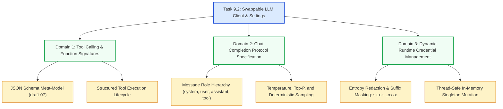

# Stage 3: CS Domain Learning — Task 9.2: Swappable LLM Client & Settings Configuration

**Task ID:** `9.2`  
**Task Title:** Build OpenRouter / Swappable LLM Client & Settings Configuration  
**Epic:** Epic 9 — Agentic RAG Intelligence & OpenRouter Provider Seam  
**Target Domains:** Tool/Function Calling Protocol Specifications, JSON Schema Meta-Modeling, Secure Credential Masking Algorithms, OpenAI-Compatible API Architectures  
**Artifact Version:** 1.0.0  

---

## 1. Domain Concept Map



---

## 2. Tool / Function Calling Protocol Specification

### 2.1 The Wire Protocol
Modern LLMs are fine-tuned to emit special control tokens when a prompt matches an available function signature. The industry-standard OpenAI schema format is:

```json
{
  "type": "function",
  "function": {
    "name": "search_index",
    "description": "Search the local Meilisearch index for documents matching query.",
    "parameters": {
      "type": "object",
      "properties": {
        "query": {
          "type": "string",
          "description": "Keywords to search for"
        },
        "limit": {
          "type": "integer",
          "description": "Max results to return",
          "default": 10
        }
      },
      "required": ["query"]
    }
  }
}
```

### 2.2 The Execution Loop
When the LLM decides to call a tool:
1. It does **not** return text content; it returns `finish_reason: "tool_calls"`.
2. It emits a unique `id` (e.g. `call_abc123`) and stringified JSON `arguments`: `{"query": "Falcon authentication"}`.
3. The client executes the function locally and appends a message with role `"tool"`, matching `tool_call_id: "call_abc123"`.
4. The LLM reads the tool output and synthesizes the final human-facing answer.

---

## 3. Secret Redaction & Masking Algorithm

To fulfill Panopticon **Constraint 9** (No secret leakage), API keys returned over REST or logged must never reveal full credential entropy.

### 3.1 Masking Logic
A standard OpenRouter key follows: `sk-or-v1-[64 hex chars]`.
- If key length $\le 10$: return `"***"`
- If key length $> 10$: preserve prefix (`sk-or-v1-`) and suffix (last 4 characters), replacing the high-entropy middle bytes with `***`:
  $$\text{Masked}(K) = K[0:8] + \text{"***"} + K[-4:]$$
  Example: `sk-or-v1-a81107e5...6c136` $\rightarrow$ `sk-or-v1-***c136`.

---

## 4. "What If" Scenario Analysis

### Q1: What if a user switches the model to an unsupported vendor string?
**Answer:** The `/api/settings/llm/test` probe validates the model against OpenRouter with a minimal 1-token request before committing the update, giving immediate visual feedback.

### Q2: What if OpenRouter is completely down or the user is working offline?
**Answer:** The client architecture provides a clean `MockLLMClient` and heuristic fallbacks so unit tests and local operation remain 100% stable without external network reliance.
