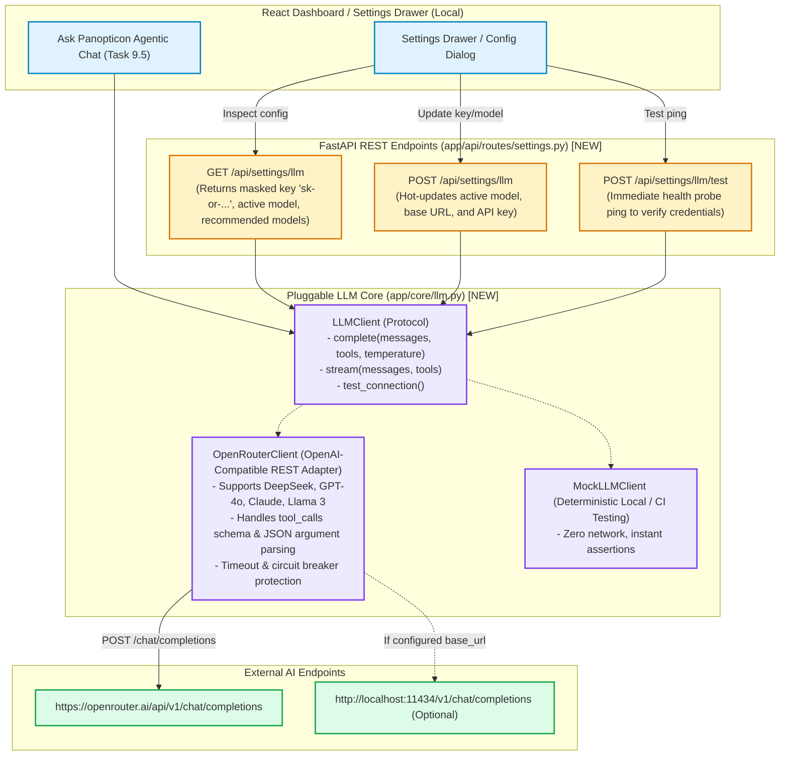
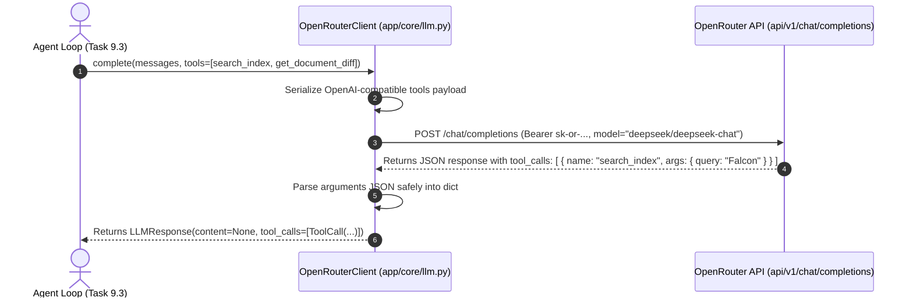
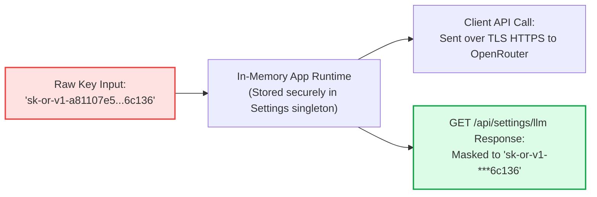

# Stage 1: Concept-to-Code Bridge — Task 9.2: Swappable LLM Client & Settings Configuration

**Task ID:** `9.2`  
**Task Title:** Build OpenRouter / Swappable LLM Client & Settings Configuration  
**Epic:** Epic 9 — Agentic RAG Intelligence & OpenRouter Provider Seam  
**Target Files:**
- [`app/core/llm.py`](file:///c:/Users/Mubashar/Desktop/Panopticon/app/core/llm.py) `[NEW]`
- [`app/api/schemas/llm.py`](file:///c:/Users/Mubashar/Desktop/Panopticon/app/api/schemas/llm.py) `[NEW]`
- [`app/api/routes/settings.py`](file:///c:/Users/Mubashar/Desktop/Panopticon/app/api/routes/settings.py) `[NEW]`
- [`app/api/router.py`](file:///c:/Users/Mubashar/Desktop/Panopticon/app/api/router.py) `[MODIFY]`
- [`tests/test_llm_client.py`](file:///c:/Users/Mubashar/Desktop/Panopticon/tests/test_llm_client.py) `[NEW]`
- [`tests/test_api_settings.py`](file:///c:/Users/Mubashar/Desktop/Panopticon/tests/test_api_settings.py) `[NEW]`
**Artifact Version:** 1.0.0  
**Status:** READY FOR STAGE 2 DESIGN  

---

## 1. Visual Architecture

---

## 2. The Physical Analogy

> **The Swappable LLM Client** is like **a Universal Diplomatic Translator in an International Command Center**.
>
> Imagine an intelligence command center (Panopticon) that needs to consult expert strategic advisors (LLMs) to analyze military dossiers.
>
> 1. **Without an Abstraction Seam:** If the command center only knew how to speak to one specific French general (e.g. hardcoding the proprietary Anthropic SDK), the entire headquarters would grind to a halt if the French general was unavailable, or if the commander wanted to consult a Japanese strategist (DeepSeek) or a Swiss logician (GPT-4o).
> 2. **With the Universal Diplomatic Protocol (`LLMClient`):** The headquarters assigns an accredited Diplomatic Attache. The attache speaks standard diplomatic protocol (**OpenAI-compatible chat completion format**).
> 3. **The Secure Radio Frequency (`/api/settings/llm`):** The commander can walk up to the control console at any time, twist the radio dial to a new frequency, plug in a new encrypted security key, and instantly switch from DeepSeek to Claude without powering down the bunker!
> 4. **The Security Blindfold (Masking):** The security key is never spoken out loud or printed on public briefing boards (`sk-or-v1-***06c136`). Only the encrypted transponder holds the full secret.

---

## 3. Why & What

### Why Are We Doing This Task?
1. **Prerequisite for Agentic Reasoning (Task 9.3):** The autonomous Agent loop in Task 9.3 requires an LLM engine capable of **Function/Tool Calling** (deciding when to invoke `search_index`, `get_document_diff`, or `semantic_chunk_search`).
2. **Freedom of Model Choice:** Users have different preferences: some prefer ultra-fast, cheap models (`deepseek/deepseek-chat`, `google/gemini-2.0-flash`), while others demand top-tier reasoning (`anthropic/claude-3.5-sonnet`, `openai/gpt-4o`). Panopticon must never be locked to a single vendor.
3. **In-UI Hot Configuration:** Users should never have to open terminal windows or edit raw `.env` text files just to change an API key or switch models. A clean REST settings seam allows the React frontend to configure AI credentials live.
4. **Security & Zero Secret Leakage (Constraint 9):** API keys must be strictly masked (`sk-or-v1-...xxxx`) on read paths and protected from accidental exposure.

### What Is the Concept?
1. **`LLMClient` Protocol (`app/core/llm.py`)**:
   - `complete(messages: list[LLMMessage], tools: list[ToolDefinition] | None = None, temperature: float = 0.1) -> LLMResponse`
   - `test_connection() -> tuple[bool, str]`
2. **Structured Message & Tool Abstractions**:
   - `LLMMessage(role="system"|"user"|"assistant"|"tool", content=..., tool_calls=..., tool_call_id=...)`
   - `ToolDefinition(name="...", description="...", parameters={...})`
   - `ToolCall(id="...", name="...", arguments={...})`
3. **FastAPI Settings Router (`app/api/routes/settings.py`)**:
   - `GET /api/settings/llm`: Returns active model, masked key, provider URL, and recommended models.
   - `POST /api/settings/llm`: Dynamically updates runtime model, base URL, and key.
   - `POST /api/settings/llm/test`: Performs a live 1-token test probe to verify authentication.

---

## 4. Abstraction Level Map

| Abstraction Level | What Lives Here | Panopticon Concrete Implementation (Task 9.2) |
| :--- | :--- | :--- |
| **Domain Protocol** | Abstract LLM interface, tool schemas, message types | `app/core/llm.py` (`LLMClient`, `LLMMessage`, `ToolCall`) |
| **REST Adapter** | HTTP request serialization, OpenRouter gateway mapping | `app/core/llm.py` (`OpenRouterClient`) |
| **Wire Contracts** | Pydantic request/response schemas, API key masking | `app/api/schemas/llm.py` (`LLMSettingsResponse`, `LLMSettingsUpdate`) |
| **API Endpoints** | Dynamic settings management & health test probes | `app/api/routes/settings.py` (`/api/settings/llm*`) |

---

## 5. Sequence Diagram: Tool-Calling Completion Flow

---

## 6. Security Architecture: Zero Secret Leakage (Constraint 9)

---

## 7. Five Alternative Approaches

| # | Approach | Pros | Cons | Decision |
|---|---|---|---|---|
| **1** | **OpenAI-Compatible REST Client via `httpx` (Chosen)** | 1. Zero new pip dependencies. 2. Works with OpenRouter, OpenAI, Local Ollama, vLLM. 3. Native tool-calling support. 4. Live runtime re-configuration. | Requires manual payload JSON serialization (straightforward with Pydantic). | **SELECTED** |
| **2** | **Official `openai` Python SDK** | Pre-built types and streaming helpers. | Adds heavy third-party package; locks into SDK update cycles; violates Rule 3 (Zero Silent Ingestion). | REJECTED |
| **3** | **`langchain-core` / `litellm`** | Many provider abstractions. | 50+ transitive dependencies; high cognitive debt; leaky abstractions. | REJECTED |
| **4** | **Static `.env`-Only Configuration (No REST Endpoint)** | Trivial to implement. | Poor UX; requires editing disk files and restarting server every time a user wants to test a new model. | REJECTED |
| **5** | **Direct Vendor SDKs (`anthropic`, `google-generativeai`)** | Vendor-specific features. | Fragmented code; 3 different client abstractions; high maintenance burden. | REJECTED |

---

## 8. Production Failure Scenarios

1. **Scenario 1: User Enters an Invalid / Expired API Key**
   - **Handling:** `POST /api/settings/llm/test` makes a lightweight test call. If OpenRouter returns 401 Unauthorized, the endpoint catches `httpx.HTTPStatusError` and returns `success=False, error="Invalid OpenRouter API Key (HTTP 401)"` without crashing the application.
2. **Scenario 2: Model Outage or Invalid Model ID**
   - **Handling:** If a requested model does not exist or is deprecated, OpenRouter returns 404 or 400. The client intercepts the error and returns a clean descriptive error message suggesting available models.
3. **Scenario 3: Corrupted Tool Arguments JSON**
   - **Handling:** Some LLMs output malformed JSON in `tool_calls.arguments`. The client safely wraps `json.loads` in a try/except, logging a warning and capturing raw string arguments rather than raising an uncaught `JSONDecodeError`.
