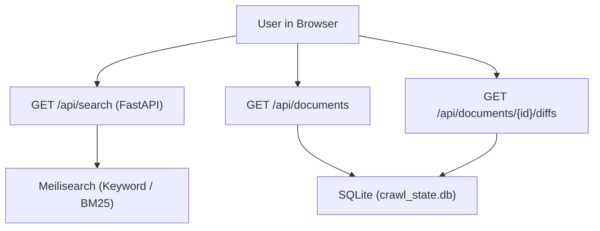

# Stage 2: Codebase Design — Task 9.3: Agentic Tool-Calling Reasoning Engine

**Task ID:** `9.3`  
**Task Title:** Build the Agentic Tool-Calling Reasoning Engine  
**Epic:** Epic 9 — Agentic RAG Intelligence & OpenRouter Provider Seam  
**Target Files:**
- `[NEW]` [`app/agent/__init__.py`](file:///c:/Users/Mubashar/Desktop/Panopticon/app/agent/__init__.py)
- `[NEW]` [`app/agent/tools.py`](file:///c:/Users/Mubashar/Desktop/Panopticon/app/agent/tools.py)
- `[NEW]` [`app/agent/engine.py`](file:///c:/Users/Mubashar/Desktop/Panopticon/app/agent/engine.py)
- `[NEW]` [`app/api/schemas/agent.py`](file:///c:/Users/Mubashar/Desktop/Panopticon/app/api/schemas/agent.py)
- `[NEW]` [`app/api/routes/agent.py`](file:///c:/Users/Mubashar/Desktop/Panopticon/app/api/routes/agent.py)
- `[MODIFY]` [`app/api/routes/__init__.py`](file:///c:/Users/Mubashar/Desktop/Panopticon/app/api/routes/__init__.py)
- `[NEW]` [`tests/test_agent_tools.py`](file:///c:/Users/Mubashar/Desktop/Panopticon/tests/test_agent_tools.py)
- `[NEW]` [`tests/test_agent_engine.py`](file:///c:/Users/Mubashar/Desktop/Panopticon/tests/test_agent_engine.py)
- `[NEW]` [`tests/test_api_agent.py`](file:///c:/Users/Mubashar/Desktop/Panopticon/tests/test_api_agent.py)
**Artifact Version:** 1.0.0  
**Status:** READY FOR IMPLEMENTATION  

---

## 1. Current State Snapshot (Before)


- **Limitation:** The user must manually execute keyword searches, click individual documents, open diff modals, and synthesize conclusions by reading multiple tabs. There is no automated agent capable of multi-step forensic queries (*"What was modified in the Falcon auth spec?"*).

---

## 2. Proposed State (After)

```mermaid
graph TD
    User["User in Browser"] --> AgentEndpoint["POST /api/agent/query [NEW]"]
    AgentEndpoint --> Engine["AgenticReasoningEngine [NEW]"]
    
    Engine <-->|Thought / Tool Calls| LLM["LLMClient (app/core/llm.py)"]
    
    Engine --> Dispatcher["execute_tool (app/agent/tools.py) [NEW]"]
    
    Dispatcher --> Tool1["search_index -> Meilisearch / SQLite"]
    Dispatcher --> Tool2["get_document_diff -> SQLite diff engine"]
    Dispatcher --> Tool3["get_file_metadata -> SQLite metadata"]
    Dispatcher --> Tool4["semantic_chunk_search -> SQLite vectors"]

    Dispatcher -->>|Tool Observations| Engine
    Engine -->>|Final Synthesized Answer| AgentEndpoint
```

---

## 3. File-Level Impact Analysis

### `[NEW]` [`app/agent/tools.py`](file:///c:/Users/Mubashar/Desktop/Panopticon/app/agent/tools.py)
- **Purpose:** Declares the 4 canonical `ToolDefinition` schemas and the execution dispatcher `execute_tool()`.
- **Public API:**
  - `PANOPTICON_TOOLS: list[ToolDefinition]`
  - `class AgentToolContext`: Container injecting `storage: CrawlStorage`, `search_service: SearchService | None`, `embedding_provider: EmbeddingProvider | None`.
  - `execute_tool(name: str, arguments: dict[str, Any], context: AgentToolContext) -> str`: Routes calls to concrete Python functions with error catching and 2,500-character context bounding.
- **Consumers:** `app/agent/engine.py`.

### `[NEW]` [`app/agent/engine.py`](file:///c:/Users/Mubashar/Desktop/Panopticon/app/agent/engine.py)
- **Purpose:** Core ReAct agent execution state machine.
- **Public API:**
  - `class AgentStepTrace(BaseModel)`: Records intermediate tool usage (`step`, `tool_name`, `arguments`, `output_summary`).
  - `class AgentRunResult(BaseModel)`: Final response (`answer`, `steps_taken`, `tools_used`, `trace`, `model`, `latency_ms`).
  - `class AgenticReasoningEngine`:
    - `run(query: str, user_instructions: str | None = None) -> AgentRunResult`.
- **Safeguards:** `MAX_STEPS = 5` circuit breaker. If step budget is reached, a forced synthesis prompt is injected to prevent infinite execution.

### `[NEW]` [`app/api/schemas/agent.py`](file:///c:/Users/Mubashar/Desktop/Panopticon/app/api/schemas/agent.py)
- **Purpose:** Pydantic models for REST request and response contracts.
- **Public API:**
  - `AgentQueryRequest`: `query: str`, `model: str | None = None`.
  - `AgentStepTraceItem`: Serialized step trace for UI visualization.
  - `AgentQueryResponse`: `answer`, `steps_taken`, `tools_used`, `trace`, `model`, `latency_ms`.

### `[NEW]` [`app/api/routes/agent.py`](file:///c:/Users/Mubashar/Desktop/Panopticon/app/api/routes/agent.py)
- **Purpose:** REST API endpoint exposing the agent to the frontend.
- **Public API:**
  - `POST /api/agent/query`: Accepts `AgentQueryRequest`, executes `AgenticReasoningEngine`, and returns `AgentQueryResponse`.

### `[MODIFY]` [`app/api/routes/__init__.py`](file:///c:/Users/Mubashar/Desktop/Panopticon/app/api/routes/__init__.py)
- **Purpose:** Register and mount `agent_router` under `/api/agent`.

---

## 4. Regression Risk Matrix

| Risk ID | Risk Description | Severity | Affected Area | Mitigation Strategy |
| :--- | :--- | :--- | :--- | :--- |
| **R-01** | LLM enters infinite tool loop on vague queries | 🔴 High | `engine.py` | Hard loop ceiling `MAX_STEPS = 5`. Forced termination on step 5. |
| **R-02** | Massive tool outputs blow past context token limits | 🟡 Med | `tools.py` | String truncation at 2,500 characters per tool result. |
| **R-03** | Invalid or missing tool arguments from LLM | 🟡 Med | `tools.py` | Safe parameter extraction; returns clear error message in `role="tool"` so LLM self-corrects. |
| **R-04** | LLM tries to call unknown tool name | 🟢 Low | `tools.py` | Dispatcher returns `"Unknown tool '{name}'. Available tools: [...]"`. |

---

## 5. Rollback Plan

### If Changes Are Uncommitted:
```bash
git checkout -- app/api/routes/__init__.py
rm -rf app/agent app/api/schemas/agent.py app/api/routes/agent.py tests/test_agent_*.py tests/test_api_agent.py
```

### If Changes Are Committed:
```bash
git revert HEAD --no-edit
pytest tests/
```
