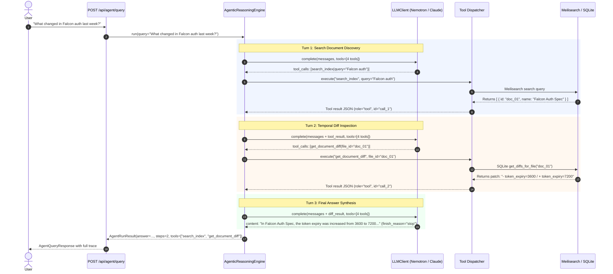
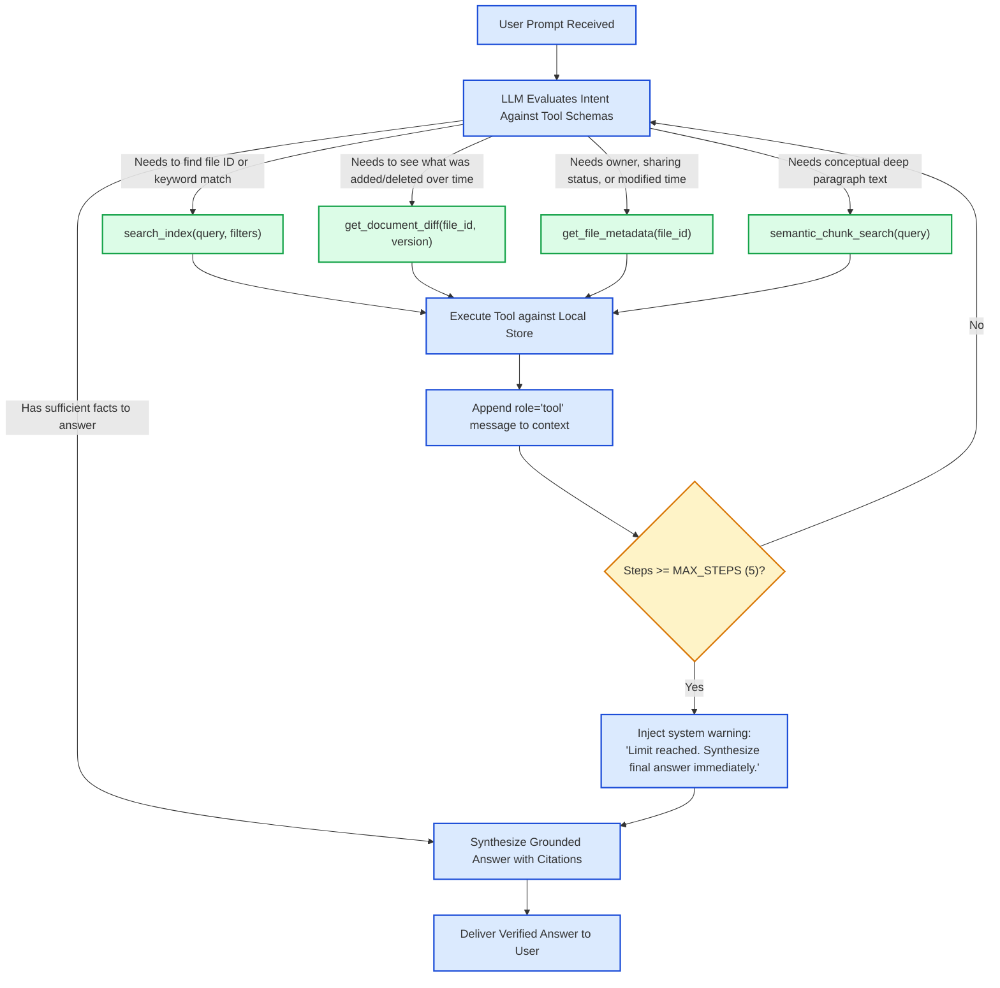

# Stage 1: Concept-to-Code Bridge — Task 9.3: Agentic Tool-Calling Reasoning Engine

**Task ID:** `9.3`  
**Task Title:** Build the Agentic Tool-Calling Reasoning Engine  
**Epic:** Epic 9 — Agentic RAG Intelligence & OpenRouter Provider Seam  
**Target Files:**
- [`app/agent/tools.py`](file:///c:/Users/Mubashar/Desktop/Panopticon/app/agent/tools.py) `[NEW]`
- [`app/agent/engine.py`](file:///c:/Users/Mubashar/Desktop/Panopticon/app/agent/engine.py) `[NEW]`
- [`app/api/schemas/agent.py`](file:///c:/Users/Mubashar/Desktop/Panopticon/app/api/schemas/agent.py) `[NEW]`
- [`app/api/routes/agent.py`](file:///c:/Users/Mubashar/Desktop/Panopticon/app/api/routes/agent.py) `[NEW]`
- [`app/api/routes/__init__.py`](file:///c:/Users/Mubashar/Desktop/Panopticon/app/api/routes/__init__.py) `[MODIFY]`
- [`tests/test_agent_tools.py`](file:///c:/Users/Mubashar/Desktop/Panopticon/tests/test_agent_tools.py) `[NEW]`
- [`tests/test_agent_engine.py`](file:///c:/Users/Mubashar/Desktop/Panopticon/tests/test_agent_engine.py) `[NEW]`
- [`tests/test_api_agent.py`](file:///c:/Users/Mubashar/Desktop/Panopticon/tests/test_api_agent.py) `[NEW]`
**Artifact Version:** 1.0.0  
**Status:** READY FOR STAGE 3 CS CONCEPTS  

---

## 1. Visual Architecture

```mermaid
graph TD
    subgraph ClientLayer ["Client / Chat Drawer (React Dashboard)"]
        UserPrompt["User Prompt: 'Did Alice change the OAuth rate limit in Falcon?'"]
        AgentUI["Agent Execution Workspace (Thought Badges & Citations)"]
    end

    subgraph APILayer ["FastAPI REST Layer (app/api/routes/agent.py) [NEW]"]
        AgentEndpoint["POST /api/agent/query"]
    end

    subgraph AgenticCore ["Agentic Reasoning Engine (app/agent/engine.py) [NEW]"]
        ReActLoop["Autonomous ReAct Loop (Max 5 Steps)\nThought -> Action -> Observation -> Synthesis"]
        PromptBuilder["System Prompt & Constitutional Guardrails"]
        StepLimiter["Circuit Breaker (MAX_STEPS = 5)"]
    end

    subgraph ToolSubsystem ["Tool Registry & Dispatcher (app/agent/tools.py) [NEW]"]
        ToolRegistry["Tool Dispatcher (execute_tool)"]
        Tool1["search_index(query, filters)\n[Meilisearch BM25 / Tag Match]"]
        Tool2["get_document_diff(file_id, version)\n[SQLite Text Patch Engine]"]
        Tool3["get_file_metadata(file_id)\n[SQLite Owners / Modified Date]"]
        Tool4["semantic_chunk_search(query, limit)\n[Dense Vector Chunks]"]
    end

    subgraph StorageAndLLM ["Infrastructure & Models"]
        LLMProvider["OpenRouter / Swappable LLMClient\n(Minimax, Nemotron Ultra, Claude, GPT-4o)"]
        MeiliDB[("Local Meilisearch (Port 7700)")]
        SQLiteDB[("SQLite Storage (crawl_state.db)")]
    end

    UserPrompt --> AgentEndpoint
    AgentEndpoint --> ReActLoop
    ReActLoop --> PromptBuilder
    ReActLoop --> StepLimiter

    ReActLoop <-->|1. Emit tool_calls| LLMProvider
    ReActLoop -->|2. Dispatch tool calls| ToolRegistry

    ToolRegistry --> Tool1 --> MeiliDB
    ToolRegistry --> Tool2 --> SQLiteDB
    ToolRegistry --> Tool3 --> SQLiteDB
    ToolRegistry --> Tool4 --> SQLiteDB

    ToolRegistry -->>|3. Tool Observation (role='tool')| ReActLoop
    ReActLoop -->>|4. Final Synthesized Answer| AgentEndpoint
    AgentEndpoint -->> AgentUI

    classDef client fill:#e0f2fe,stroke:#0284c7,stroke-width:2px;
    classDef api fill:#fef3c7,stroke:#d97706,stroke-width:2px;
    classDef core fill:#ede9fe,stroke:#7c3aed,stroke-width:2px;
    classDef tool fill:#dcfce7,stroke:#16a34a,stroke-width:2px;
    classDef storage fill:#f1f5f9,stroke:#475569,stroke-width:2px;
    class UserPrompt,AgentUI client;
    class AgentEndpoint api;
    class ReActLoop,PromptBuilder,StepLimiter core;
    class ToolRegistry,Tool1,Tool2,Tool3,Tool4 tool;
    class LLMProvider,MeiliDB,SQLiteDB storage;
```

---

## 2. The Physical Analogy

> **The Agentic Reasoning Engine** is like a **Senior Forensic Investigator with 4 Specialized Field Research Assistants**.
>
> When a client walks into the detective agency and asks: *"Did Alice change the OAuth rate limits in Project Falcon last week?"*:
>
> 1. **The Investigator Doesn't Guess:** A naive assistant might hallucinate an answer based on vague memory. The Senior Investigator knows they cannot testify in court without verified evidence.
> 2. **Formulating the Plan (Thought):** The detective reasons: *"First, I don't know the exact file ID for Project Falcon's auth doc. I need to consult the master catalog."*
> 3. **Dispatching Assistant 1 (Action):** The detective hands an inquiry slip to Assistant 1: `search_index(query="Falcon OAuth")`. Assistant 1 runs to the filing room (Meilisearch) and returns with Document ID `doc_falcon_01`.
> 4. **Evaluating the Evidence (Observation):** The detective inspects the slip: *"Good. Now I see that `doc_falcon_01` was modified on Tuesday. Let me see the exact text changes."*
> 5. **Dispatching Assistant 2 (Action):** The detective orders Assistant 2: `get_document_diff(file_id="doc_falcon_01")`. Assistant 2 checks the version archives (SQLite diff engine) and returns the red/green patch showing: `- rate_limit = 60 / + rate_limit = 100`.
> 6. **The Final Report (Synthesis):** The detective now has verified, undeniable ground truth. They write the final briefing to the client, citing the document name, date, and exact line change.
> 7. **The Deadbolt Timer (Circuit Breaker):** If an assistant gets confused and starts searching in an endless loop, the chief deputy steps in after 5 steps and says: *"Stop searching, synthesize the best answer you have with current evidence."*

---

## 3. Why & What

### Why Are We Doing This Task?
1. **From Dumb Search to Autonomous Intelligence:** Simple keyword search forces the human to open 5 documents and read 20 pages to answer a single question. The Agentic Reasoning Engine answers complex cross-document questions autonomously (*"Compare the auth policies of Falcon vs SmartTrade"*).
2. **Temporal Intelligence:** Standard RAG only knows what a document says *right now*. Panopticon's agent is uniquely equipped with `get_document_diff`, allowing it to answer temporal questions (*"What was removed from the PRD between v1 and v2?"*).
3. **Product Constraint 2 & 3 Compliance:** The agent operates **strictly against local Meilisearch and SQLite indices**. It never calls live Google Drive APIs during reasoning, ensuring sub-second local retrieval and zero cloud egress.
4. **Prerequisite for the Chat UI (Task 9.5):** The React chat workspace requires this backend reasoning engine to stream thought steps and deliver grounded answers.

### What Is the Concept?
1. **The 4 Canonical Tools**:
   - `search_index`: High-speed Meilisearch keyword & tag retrieval.
   - `get_document_diff`: Unified text patch retrieval between recorded versions.
   - `get_file_metadata`: File ownership, sharing privacy status, and modification timestamps.
   - `semantic_chunk_search`: Vector similarity chunk retrieval for conceptual questions.
2. **The ReAct Execution Loop (`AgenticReasoningEngine`)**:
   - A multi-turn conversation loop:
     $$\text{Prompt} \rightarrow \text{LLM Thought} \rightarrow \text{Tool Calls} \rightarrow \text{Tool Execution} \rightarrow \text{LLM Observation} \rightarrow \text{Final Answer}$$
   - Bounded by `MAX_STEPS = 5`.
3. **Groundedness & Truthfulness System Prompt**:
   - Explicit instructions forbidding hallucinated URLs and requiring direct attribution to returned tool outputs.

---

## 4. Abstraction Level Map

| Level | What Lives Here | Panopticon Concrete Implementation (Task 9.3) |
| :--- | :--- | :--- |
| **Product/User Experience** | Ask Panopticon chat drawer, thought badges, citations | React Chat Workspace (Task 9.5) calling `/api/agent/query` |
| **Application Layer** | Agent reasoning loop, tool dispatcher, step limits | `app/agent/engine.py`, `app/agent/tools.py` |
| **REST Contract** | Request/response wire models, execution traces | `app/api/schemas/agent.py`, `app/api/routes/agent.py` |
| **Domain Services** | Search index, diff engine, chunk store | `app/indexer/storage.py`, `app/search/service.py` |
| **LLM Provider Seam** | OpenAI-compatible tool-calling client | `app/core/llm.py` (`OpenRouterClient`, `MockLLMClient`) |
| **Persistence / Cache** | Inverted index, SQLite version diffs | Meilisearch (`panopticon_docs`), SQLite (`crawl_state.db`) |

---

## 5. Sequence Diagram: Multi-Step Forensic Query



---

## 6. Decision Flowchart: Autonomous Tool Selection



---

## 7. Data Flow Trace-Through

1. **User Request:** Frontend posts `{"query": "Who owns the budget spreadsheet for Falcon?"}` to `POST /api/agent/query`.
2. **Context Assembly:** `AgenticReasoningEngine` builds initial prompt:
   - `role="system"`: Grounding instructions, citation rules, formatting guidelines.
   - `role="user"`: `"Who owns the budget spreadsheet for Falcon?"`.
3. **Step 1:** LLM decides to search for the spreadsheet:
   - Emits `tool_calls: [search_index(query="Falcon budget")]`.
4. **Execution 1:** Engine dispatches to Meilisearch client:
   - Finds file `sheet_002`, name `"Falcon Q3 Budget Allocations"`.
   - Returns tool observation: `[{"id": "sheet_002", "name": "Falcon Q3 Budget Allocations", "owners": ["finance@company.com"]}]`.
5. **Step 2:** LLM inspects the result:
   - All necessary facts are present (owner is `finance@company.com`).
   - Emits final completion: `"The Falcon budget spreadsheet ('Falcon Q3 Budget Allocations') is owned by finance@company.com."`.
6. **Delivery:** API formats response with `steps_taken: 1`, `tools_used: ["search_index"]`, and full step trace.

---

## 8. Cognitive Model → Code Mapping

| Cognitive Stage | Mental Model | Code Concept in Panopticon | Enforcement / Guardrail |
| :--- | :--- | :--- | :--- |
| **1. Intent Recognition** | "I need to know which document this refers to" | `search_index` tool call | JSON Schema validation prevents invalid search filters |
| **2. Temporal Comparison** | "I need to know what changed between versions" | `get_document_diff` tool call | Connects to SQLite version diff engine built in Task 8.2 |
| **3. Grounded Perception** | "I must base my answer only on retrieved facts" | `role="tool"` message insertion | System prompt explicitly forbids fabricating document links |
| **4. Patience & Limits** | "Don't search in circles forever" | `MAX_STEPS = 5` circuit breaker | Loop terminates automatically if step counter reaches 5 |

---

## 9. Five Alternative Architectures Evaluated

| # | Architecture Pattern | Pros | Cons | Decision |
|---|---|---|---|---|
| **1** | **Direct ReAct Tool-Calling Loop via `LLMClient` (Chosen)** | 1. Zero heavy framework dependencies.<br>2. Full control over step recursion and error recovery.<br>3. Fast, transparent debugging.<br>4. Native JSON tool schema integration. | Must implement step recursion manually (straightforward ~60 lines). | **SELECTED** |
| **2** | **LangChain `AgentExecutor`** | Pre-built agent loops. | Bloated dependency graph (100+ packages); high risk of breaking changes; violates Rule 3. | REJECTED |
| **3** | **LlamaIndex QueryEngine** | Good document indices. | Black-box routing; hard to inspect intermediate tool calls in UI. | REJECTED |
| **4** | **Single-Shot RAG (No Tools / Pure Context Dump)** | Simpler implementation. | Cannot handle multi-step reasoning (e.g. search doc $\rightarrow$ get diff); dumps irrelevant docs into context. | REJECTED |
| **5** | **Multi-Agent Swarm (Planner + Coder + Reviewer)** | Highly modular. | Massive latency overhead (10-30 seconds per query); excessive API costs; unnecessary for a document search tool. | REJECTED |

---

## 10. Production Rationale & Consequences

### Why This Is Standard:
The **ReAct pattern (Reasoning + Acting)** combined with **OpenAI-compatible Tool Calling** is the gold standard for enterprise RAG in 2025/2026. Instead of overwhelming the LLM with 50 pages of irrelevant documents on every prompt, the model queries specifically for what it needs, keeping token costs down, latency low, and answers verifiable.

### What Happens If We Skip This:
1. **Failure Scenario 1: Hallucination & Phantom Edits**  
   Without tool calling, if a user asks *"What did Alice change in the Falcon spec?"*, a standard LLM will fabricate plausible-sounding bullet points based on generic knowledge. A team might make architectural or financial decisions based on fake information.
2. **Failure Scenario 2: Context Window Choking & Excessive Costs**  
   Without an agentic tool loop that prunes search spaces, the only alternative is dumping entire document archives into the prompt. A single prompt could consume 100,000 tokens, costing dollars per query and slowing response times to 45 seconds.
