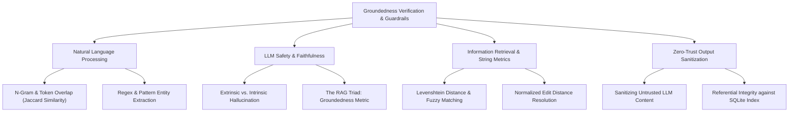

# Stage 3: Computer Science Domain Concepts — Task 9.4: Citation Verification & Hallucination Guard

**Task ID:** `9.4`  
**Task Title:** Implement Citation Verification & Hallucination Guard  
**Epic:** Epic 9 — Agentic RAG Intelligence & OpenRouter Provider Seam  
**Branch:** `feat/task-9.4-citation-verification`  
**Artifact Version:** 1.0.0  
**Status:** DRAFT  

---

## 1. Domain Discovery Map




---

## 2. Deep-Dive CS Domains

### 2.1 LLM Safety: Intrinsic vs. Extrinsic Hallucination & The RAG Triad

In Retrieval-Augmented Generation (RAG), hallucinations are categorized into two fundamental computer science classes:

1. **Intrinsic Hallucination:** The model's generated text directly contradicts the retrieved context.
   - *Example:* The retrieved chunk says *"Rate limit was set to 120 rpm"*, but the model states *"The rate limit was reduced to 30 rpm."*
2. **Extrinsic Hallucination:** The model's generated text makes assertions or cites sources that cannot be verified from the retrieved context (neither confirmed nor contradicted).
   - *Example:* The model claims *"As documented in doc_auth_v2_spec, Alice approved the change."* (Neither `doc_auth_v2_spec` nor Alice was in the retrieved search hits).

#### The RAG Triad
Evaluated in modern AI safety literature (TruLens, Ragas), RAG systems are governed by three mathematical relationships:

$$\text{RAG Triad} = \{\text{Context Relevance}, \text{Groundedness}, \text{Answer Relevance}\}$$

- **Context Relevance:** Does the search tool retrieve information relevant to the user query?
- **Answer Relevance:** Does the final answer address the user query?
- **Groundedness (Faithfulness):** Is every statement in the answer mathematically grounded in the retrieved context?

Task 9.4 focuses on **Groundedness Verification**.

---

### 2.2 String Metrics & Information Retrieval: Levenshtein Distance & Token Jaccard

When an LLM cites a document title, it rarely outputs the exact string matching `DriveFileMetadata.name` character-for-character. It might capitalize differently, omit prefixes, or append qualifiers (e.g. *"Falcon Architecture Document"* vs *"Falcon Architecture"*).

#### 1. Normalized Levenshtein Edit Distance
Given two strings $s_1$ and $s_2$ of lengths $m$ and $n$, the Levenshtein distance $D(s_1, s_2)$ is the minimum number of single-character edits (insertions, deletions, substitutions) required to transform $s_1$ into $s_2$.

$$\text{Normalized Similarity}(s_1, s_2) = 1.0 - \frac{D(s_1, s_2)}{\max(m, n)}$$

A threshold of $\ge 0.85$ allows resolving minor title variations without false positives.

#### 2. Token Jaccard Similarity for Quote Grounding
When checking if an excerpt or quote in the LLM's answer is grounded in the retrieved chunks or diff patches:

$$J(A, B) = \frac{|A \cap B|}{|A \cup B|}$$

where $A$ is the set of normalized word tokens from the cited passage, and $B$ is the set of tokens from the retrieved document text. If $J(A, B)$ or the substring containment is high, the citation is confirmed **grounded**.

---

### 2.3 Software Architecture: Deterministic Guardrails vs. Generative Reflection

In agentic engineering, there are two competing approaches to hallucination detection:

| Property | Generative Self-Reflection (LLM Critic) | Deterministic Code Guardrail (Our Approach) |
| :--- | :--- | :--- |
| **Mechanism** | Call another LLM prompt: *"Check if this answer is true"* | Python algorithm cross-referencing SQLite primary keys |
| **Latency** | $+1,500\text{ms} - 3,000\text{ms}$ | $< 5\text{ms}$ |
| **Cost** | Additional API tokens per query | **$0.00** (Pure local computation) |
| **Determinism** | Probabilistic (Critic can also hallucinate) | **100% Deterministic** (File ID either exists in DB or not) |
| **Attack Resilience**| Vulnerable to jailbreaks & prompt injection | Immune to prompt injection |

Panopticon chooses the **Deterministic Code Guardrail** pattern for citation verification.

---

### 2.4 Security & Data Integrity: Untrusted LLM Sanitization

Product Constraint 4 in `AGENTS.md` mandates:
> *"Crawled content and metadata must be treated as untrusted input (sanitize before indexing)."*

Equally true is the corollary: **LLM output is untrusted output**.
If the LLM outputs a markdown link:
```markdown
[Project Plan](https://malicious-phishing-link.com/auth)
```
The Citation Guard ensures that any link claiming to be a Google Drive resource MUST conform to canonical Google Drive URI formats (`https://docs.google.com/...`) AND resolve to a verified `file_id` in SQLite. Any unauthorized external URLs are stripped or replaced with safe text.

---

## 3. Project Codebase Grounding

| Concept | Implementation in Panopticon |
| :--- | :--- |
| **Referential Lookup** | `CrawlStorage.get_file(file_id)` in [`app/indexer/storage.py`](file:///c:/Users/Mubashar/Desktop/Panopticon/app/indexer/storage.py) |
| **Patch / Diff Grounding** | `CrawlStorage.get_diffs(file_id)` in [`app/indexer/storage.py`](file:///c:/Users/Mubashar/Desktop/Panopticon/app/indexer/storage.py) |
| **Trace Inspection** | `AgentRunResult.trace` in [`app/agent/engine.py`](file:///c:/Users/Mubashar/Desktop/Panopticon/app/agent/engine.py) |
| **Verification Logic** | `CitationVerifier` in [`app/agent/citations.py`](file:///c:/Users/Mubashar/Desktop/Panopticon/app/agent/citations.py) `[NEW]` |
| **Wire Schemas** | `AgentQueryResponse.citations` in [`app/api/schemas/agent.py`](file:///c:/Users/Mubashar/Desktop/Panopticon/app/api/schemas/agent.py) |

---

## 4. Key Takeaways & Mental Model Summary

1. **Never trust an LLM to generate valid URLs or real entity IDs:** The model generates tokens based on probabilistic next-token prediction, not relational foreign key constraints.
2. **Deterministic verification is orders of magnitude faster and cheaper than generative reflection:** A SQLite key lookup takes 0.2ms; an LLM critic call takes 2,000ms.
3. **Multi-layer validation guarantees safety:** Extract candidate IDs $\rightarrow$ verify primary key existence in SQLite $\rightarrow$ fuzzy-match titles against execution trace $\rightarrow$ compute token overlap on excerpts $\rightarrow$ sanitize raw markdown output.
