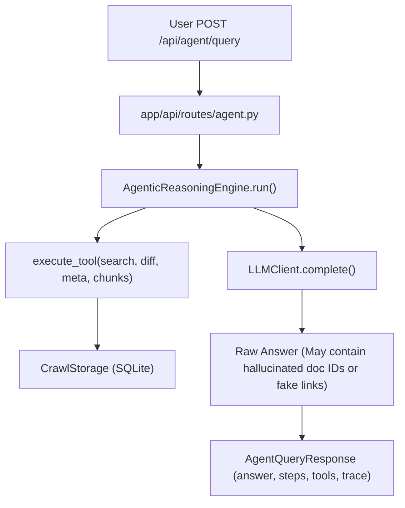
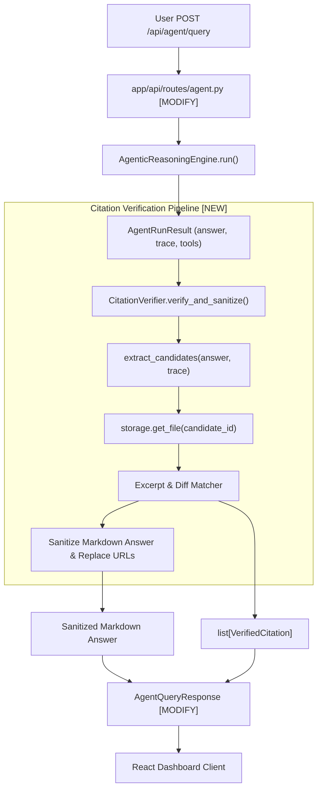
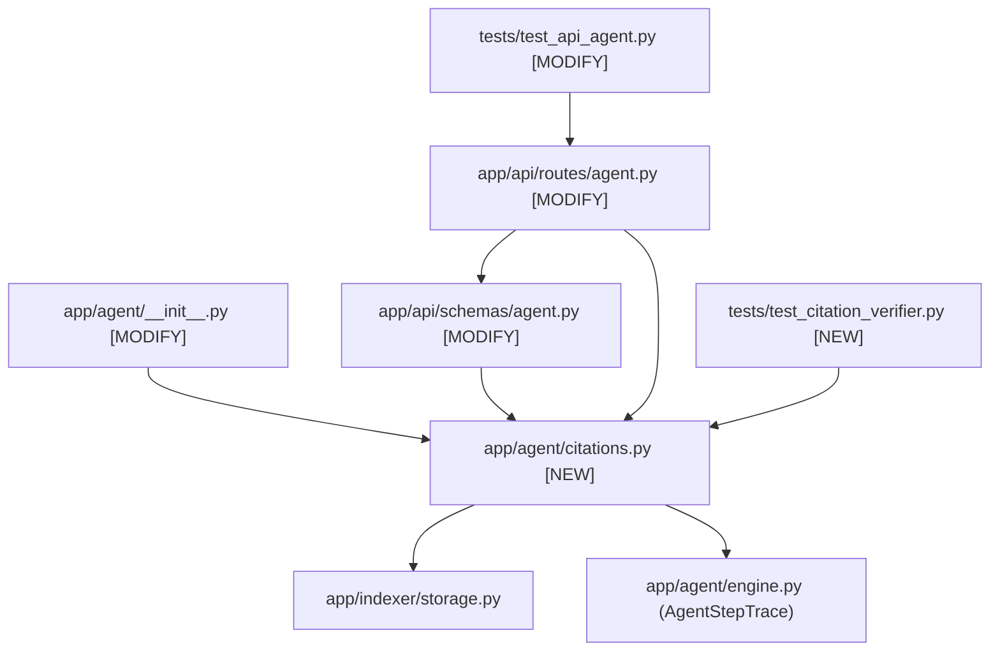

# Stage 2: Codebase Design — Task 9.4: Citation Verification & Hallucination Guard

**Task ID:** `9.4`  
**Task Title:** Implement Citation Verification & Hallucination Guard  
**Epic:** Epic 9 — Agentic RAG Intelligence & OpenRouter Provider Seam  
**Branch:** `feat/task-9.4-citation-verification`  
**Artifact Version:** 1.0.0  
**Status:** DESIGN APPROVED (READY FOR IMPLEMENTATION)  

---

## 1. Current State Snapshot

In Task 9.3, the `AgenticReasoningEngine` and `POST /api/agent/query` route were implemented.



### Current Limitations:
- The raw text generated by the LLM is passed directly into `AgentQueryResponse.answer`.
- If the LLM generates a synthetic Google Drive URL (`https://docs.google.com/document/d/fake_123/edit`) or cites an imaginary file name, the backend does not detect or flag it.
- The React frontend has no structured list of citations and would have to parse raw markdown with regex in the browser.

---

## 2. Proposed Target Architecture



---

## 3. File-Level Impact Analysis

### 3.1 `[NEW]` [`app/agent/citations.py`](file:///c:/Users/Mubashar/Desktop/Panopticon/app/agent/citations.py)
- **Role:** Core domain models and verification service.
- **Classes / Functions:**
  - `VerifiedCitation(BaseModel)`:
    - `file_id: str`
    - `document_name: str`
    - `web_view_link: str`
    - `mime_type: str`
    - `matched_snippet: str | None = None`
    - `confidence_score: float` (0.0 to 1.0)
    - `verification_status: Literal["verified", "unverified", "hallucination_flagged"]`
  - `CitationCandidate(NamedTuple)`:
    - `raw_reference: str`
    - `inferred_id: str | None`
    - `inferred_title: str | None`
    - `inferred_url: str | None`
  - `CitationVerifier`:
    - `extract_candidates(text: str, trace: list[AgentStepTrace]) -> list[CitationCandidate]`
    - `verify_and_sanitize(text: str, trace: list[AgentStepTrace], storage: CrawlStorage) -> tuple[str, list[VerifiedCitation]]`
    - `_score_groundedness(excerpt: str, file_id: str, storage: CrawlStorage) -> float`

### 3.2 `[MODIFY]` [`app/agent/__init__.py`](file:///c:/Users/Mubashar/Desktop/Panopticon/app/agent/__init__.py)
- Export `CitationVerifier` and `VerifiedCitation`.

### 3.3 `[MODIFY]` [`app/api/schemas/agent.py`](file:///c:/Users/Mubashar/Desktop/Panopticon/app/api/schemas/agent.py)
- Add `VerifiedCitationItem(BaseModel)` wire schema.
- Add `citations: list[VerifiedCitationItem] = Field(default_factory=list)` to `AgentQueryResponse`.

### 3.4 `[MODIFY]` [`app/api/routes/agent.py`](file:///c:/Users/Mubashar/Desktop/Panopticon/app/api/routes/agent.py)
- Call `CitationVerifier.verify_and_sanitize(result.answer, result.trace, storage)` after engine execution.
- Populate `citations` in `AgentQueryResponse`.

### 3.5 `[NEW]` [`tests/test_citation_verifier.py`](file:///c:/Users/Mubashar/Desktop/Panopticon/tests/test_citation_verifier.py)
- 7 comprehensive unit tests for extraction, database resolution, hallucination detection, URL replacement, and confidence scoring.

### 3.6 `[MODIFY]` [`tests/test_api_agent.py`](file:///c:/Users/Mubashar/Desktop/Panopticon/tests/test_api_agent.py)
- Update integration test assertion to verify `citations` array is present and populated in response payload.

---

## 4. Blast Radius & Dependency Graph



- **Blast Radius:** Strictly contained to `app/agent` and `app/api/routes/agent.py`. No changes to crawler, Meilisearch, or SQLite schema.

---

## 5. Regression Risk Assessment

| Risk Description | Severity | Mitigation Strategy |
| :--- | :--- | :--- |
| **False Positive Hallucination Flagging:** The LLM mentions a real document using an abbreviation or nickname (e.g. *"Falcon Spec"* instead of *"Project Falcon Technical Specification"*), causing it to be incorrectly marked as hallucinated. | 🟡 Medium | Implement 2-stage resolution: first check exact file ID, then check case-insensitive substring and fuzzy title matching against both SQLite and files retrieved in the execution trace. |
| **Markdown Corrupted During URL Replacement:** Replacing a hallucinated URL breaks markdown syntax. | 🟢 Low | Use atomic regex replacement matching standard markdown link syntax `\[(.*?)\]\((.*?)\)`. |
| **Performance Overhead on Large Traces:** Scanning multiple diffs for token overlap could introduce latency. | 🟢 Low | Limit excerpt search to the top 3 chunks and recent version patch text; token comparison operates in < 5ms in pure Python. |

---

## 6. Rollback Plan

- If any unexpected defect emerges during implementation or verification:
  ```powershell
  git checkout main
  git branch -D feat/task-9.4-citation-verification
  ```
- Since all changes are isolated in the new `app/agent/citations.py` module and a single response field in `agent.py`, reverting leaves existing endpoints 100% operational.
