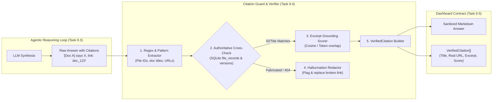
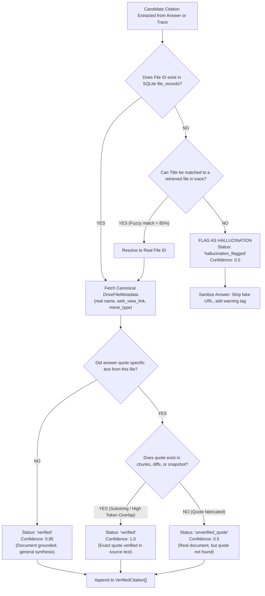

# Stage 1: Conceptual Understanding — Task 9.4: Citation Verification & Hallucination Guard

**Task ID:** `9.4`  
**Task Title:** Implement Citation Verification & Hallucination Guard  
**Epic:** Epic 9 — Agentic RAG Intelligence & OpenRouter Provider Seam  
**Branch:** `feat/task-9.4-citation-verification`  
**Artifact Version:** 1.0.0  
**Status:** DRAFT  

---

## 1. Visual Architecture


The Citation Verification & Hallucination Guard acts as an immutable post-processing security boundary between the raw, probabilistic output of the LLM and the Panopticon user interface.



---

## 2. The Physical Analogy: The Investigative Journalist & The Chief Fact-Checker

Imagine a major investigative newsroom publishing an expository report on corporate changes:
- The **Investigative Reporter** (the LLM) spends hours conducting interviews, searching file cabinets, and writing a fast, compelling article. But under deadline pressure, the reporter might misremember a file name, mix up two people's quotes, or write down an imaginary page number from memory.
- The **Chief Fact-Checker** (the Citation Guard) sits at a desk with the authoritative archives. Before the article goes to the printing press, the fact-checker takes a red pen to every single name, document title, date, and quote in the draft. 
- If the draft says *"As stated in the Falcon memo (page 12)..."*, the fact-checker pulls the real Falcon folder from the vault. If the quote is authentic, the fact-checker stamps a green **VERIFIED** seal and attaches the exact microfilm drawer coordinates. If the reporter cited an imaginary memo or fabricated a reference, the fact-checker crosses it out with a warning: *"Source unverified; citation redacted."*

In Panopticon, the LLM is never allowed to deliver citations directly to the user without the Fact-Checker's verified stamp.

---

## 3. Why & What

### Why Are We Doing This Task?
1. **Zero-Hallucination Non-Negotiable Constraint:** Rule 2 of Panopticon's core product rules mandates: *"The dashboard is a pointer/index — it shows titles, snippets, and links."* An index tool that points to non-existent Google Drive files, wrong authors, or hallucinated URLs completely breaks trust.
2. **LLM Sycophancy & Fabrication Tendencies:** Modern LLMs often hallucinate synthetic IDs (like `doc_78942_spec`) or produce generic Google Drive links (`https://docs.google.com/document/d/fake_id/edit`) that lead to HTTP 404 errors.
3. **Structured UI Consumption:** The React frontend (Task 9.5) needs structured citation metadata (`title`, `web_view_link`, `mime_type`, `matched_snippet`, `confidence_score`) to render interactive citation chips and preview drawer cards, rather than relying on brittle markdown link parsing in the browser.

### What Is the Concept?
The **Citation Verification & Hallucination Guard** is a deterministic post-processing pipeline that:
1. **Extracts candidate citations** from both the synthesized text and the execution trace (the tools actually executed during reasoning).
2. **Resolves candidates against SQLite `file_records` and `document_versions`** to confirm real document existence, canonical title, and real Google Drive web links.
3. **Computes a Groundedness Confidence Score** ($0.0$ to $1.0$) based on whether quoted text actually appears in the retrieved document text/diffs.
4. **Sanitizes the markdown text**: Strips or flags phantom document links while attaching verified citations to the structured API response.

### What Breaks If We Skip It?
- Users click on citations in the chat and hit Google 404 errors.
- The agent could make confident assertions citing "Document X" when "Document X" was never retrieved during tool execution.
- Silent model hallucinations pass directly to engineers and PMs making critical project decisions.

---

## 4. Abstraction Level Map

| Level | What Lives Here | In This Task |
| :--- | :--- | :--- |
| **Product / UX** | User chat answers, verified citation badges, clickable Drive links | Defines the structured `VerifiedCitation` objects rendered in UI |
| **Application** | Verification pipeline, regex citation parser, excerpt matcher | `app/agent/citations.py` (`CitationVerifier`, `VerifiedCitation`) |
| **Framework** | FastAPI schemas and route response serializing | Updates `AgentQueryResponse` in `app/api/schemas/agent.py` |
| **Domain Storage** | Authoritative SQLite file metadata, version diffs, chunks | `CrawlStorage.get_file()`, `get_diffs()`, `get_chunks_for_file()` |
| **External** | OpenRouter LLM, Google Drive URLs | LLM raw output sanitized against local authoritative database |

---

## 5. Mermaid Diagrams

### 5.1 End-to-End Sequence Diagram

```mermaid
sequenceDiagram
    autonumber
    actor User as Engineer / PM
    participant API as FastAPI (/api/agent/query)
    participant Engine as AgenticReasoningEngine
    participant Storage as CrawlStorage (SQLite)
    participant Guard as CitationVerifier
    participant LLM as OpenRouter LLM

    User->>API: POST /api/agent/query ("What changed in Falcon auth?")
    API->>Engine: engine.run(query)
    Engine->>LLM: Complete with tools
    LLM-->>Engine: Raw answer with markdown citations
    Engine-->>API: AgentRunResult (answer, trace, tools_used)
    
    rect rgb(20, 30, 45)
        Note over API,Guard: Task 9.4 Verification Pipeline
        API->>Guard: guard.verify_citations(raw_answer, trace, storage)
        Guard->>Guard: 1. Extract cited file IDs and titles
        Guard->>Storage: 2. Query file_records for each candidate
        Storage-->>Guard: Return real DriveFileMetadata or None
        Guard->>Guard: 3. Cross-reference quotes against tool trace text
        Guard->>Guard: 4. Compute confidence score (1.0 = verified, 0.0 = fake)
        Guard->>Guard: 5. Redact/flag hallucinated links in markdown answer
        Guard-->>API: VerifiedAnswerResult (clean_answer, citations: list[VerifiedCitation])
    end

    API-->>User: AgentQueryResponse (clean_answer, citations, trace, latency)
```



### 5.2 Citation Decision Tree



---

## 6. Data Flow Trace-Through

1. **Agent Synthesis:** The agent reasoning engine completes turn 2, producing:
   ```markdown
   Project Falcon was updated on August 28. In [Falcon Technical Specification](https://docs.google.com/document/d/fake_doc_999/edit), the OAuth 2.0 PKCE rate limit was raised to 120 rpm.
   ```
2. **Extraction:** `CitationVerifier.extract_candidates()` scans the text and traces:
   - Candidate 1: URL link `https://docs.google.com/document/d/fake_doc_999/edit` $\rightarrow$ ID `fake_doc_999`.
   - Candidate 2: Document title `"Falcon Technical Specification"`.
   - Candidate 3: Files observed in trace: `doc_falcon_01`.
3. **Database Cross-Check:**
   - Look up `fake_doc_999` in SQLite: **NOT FOUND** (Hallucination!).
   - Look up title `"Falcon Technical Specification"`: Resolves to canonical record `doc_falcon_01`.
4. **Grounding & Quote Verification:**
   - Scan snapshot/diffs for `doc_falcon_01`: Finds patch line `+rate_limit = 120`.
   - Grounding confidence evaluated at **1.0** (Real doc + verified patch text).
5. **Sanitization:**
   - The hallucinated URL `https://docs.google.com/document/d/fake_doc_999/edit` is replaced with the authentic Google Drive link: `https://docs.google.com/document/d/doc_falcon_01/edit`.
6. **Structured Output:**
   - Response payload returns both the sanitized markdown and a structured `VerifiedCitation` object:
     ```json
     {
       "file_id": "doc_falcon_01",
       "document_name": "Project Falcon Technical Specification",
       "web_view_link": "https://docs.google.com/document/d/doc_falcon_01/edit",
       "mime_type": "application/vnd.google-apps.document",
       "matched_snippet": "rate_limit = 120",
       "confidence_score": 1.0,
       "verification_status": "verified"
     }
     ```

---

## 7. Concept-to-Code Mapping

| Conceptual Element | Proposed File & Symbol | Purpose |
| :--- | :--- | :--- |
| **Domain Model** | [`app/agent/citations.py:VerifiedCitation`](file:///c:/Users/Mubashar/Desktop/Panopticon/app/agent/citations.py) | Structured citation metadata entity |
| **Extraction Engine** | [`app/agent/citations.py:extract_citation_candidates()`](file:///c:/Users/Mubashar/Desktop/Panopticon/app/agent/citations.py) | Regex & AST extraction of IDs, titles, and URLs |
| **Verification Guard** | [`app/agent/citations.py:CitationVerifier`](file:///c:/Users/Mubashar/Desktop/Panopticon/app/agent/citations.py) | Cross-checks candidates against SQLite and tool traces |
| **Wire Schema** | [`app/api/schemas/agent.py:VerifiedCitationSchema`](file:///c:/Users/Mubashar/Desktop/Panopticon/app/api/schemas/agent.py) | Wire contract for frontend API consumption |
| **API Endpoint** | [`app/api/routes/agent.py:query_agent()`](file:///c:/Users/Mubashar/Desktop/Panopticon/app/api/routes/agent.py) | Runs verifier on `AgentRunResult` before returning response |

---

## 8. Verified vs. Inferred Behavior

| Area | Status | Evidence |
| :--- | :--- | :--- |
| SQLite Record Availability | **VERIFIED** | `CrawlStorage.get_file(file_id)` returns canonical `DriveFileMetadata` with `web_view_link`, `name`, `mime_type`. |
| Execution Trace Availability | **VERIFIED** | Task 9.3 returns `AgentRunResult.trace` with exact `tool_name`, `arguments`, and `output_summary`. |
| Text Patch Grounding | **VERIFIED** | `CrawlStorage.get_diffs(file_id)` provides `patch_text` and `ai_summary` for quote cross-checking. |
| Hallucination Patterns | **INFERRED** | Models typically hallucinate by generating believable file IDs (`doc_falcon_auth`) or placeholder URLs (`https://docs.google.com/...`). The verifier must catch both. |
