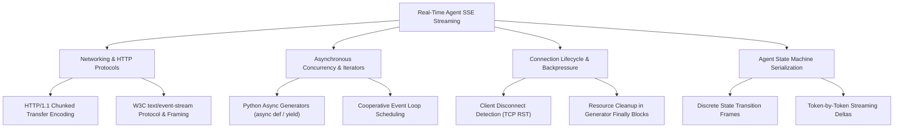

# Stage 3: Computer Science Domain Concepts — Task 9.4b: Real-Time Server-Sent Events (SSE) Agent Streaming

**Task ID:** `9.4b`  
**Task Title:** Implement Real-Time Server-Sent Events (SSE) Agent Streaming Endpoint (`POST /api/agent/query/stream`)  
**Epic:** Epic 9 — Agentic RAG Intelligence & OpenRouter Provider Seam  
**Branch:** `feat/task-9.4b-sse-agent-streaming`  
**Artifact Version:** 1.0.0  
**Status:** DRAFT  

---

## 1. Domain Discovery Map




---

## 2. Deep-Dive CS Domains

### 2.1 Networking & Protocols: HTTP Chunked Transfer & Server-Sent Events

In standard HTTP requests, the server must calculate the exact payload size upfront and send a `Content-Length: <N>` header. In an agentic reasoning loop, the server cannot know how many tokens or tool steps the agent will take in advance.

#### 1. Chunked Transfer Encoding
Under HTTP/1.1, the server omits `Content-Length` and specifies `Transfer-Encoding: chunked`.
The server streams chunks where each chunk is prefixed by its byte length in hexadecimal:
```http
HTTP/1.1 200 OK
Content-Type: text/event-stream
Transfer-Encoding: chunked
Connection: keep-alive

1e
event: step_start
data: {"step": 1}

2f
event: tool_call
data: {"tool": "search_index"}

0
```

#### 2. W3C Server-Sent Events Framing
SSE is a unidirectional, text-based streaming protocol specified by the W3C.
Key framing rules:
- Lines start with a field name (`event:`, `data:`, `id:`, `retry:`).
- Data lines end with a single newline `\n`.
- A complete event boundary is delimited by **two consecutive newlines** (`\n\n`).
- Without the trailing `\n\n`, the browser's buffer will not dispatch the event to JavaScript listeners!

---

### 2.2 Python Language Internals: Asynchronous Generators & Cooperative Scheduling

In Python 3.12, an asynchronous generator function (`async def`) implements both `__aiter__()` and `__anext__()`.

```python
async def agent_stream() -> AsyncIterator[str]:
    yield "event: start\ndata: {}\n\n"
    await asyncio.sleep(0)  # Yields control back to the asyncio event loop
    yield "event: done\ndata: {}\n\n"
```

#### Why Cooperative Scheduling Matters
If a tool or LLM client performs blocking synchronous network calls (`httpx.Client.post()`), it starves the ASGI event loop thread, blocking all other incoming HTTP requests.
By using asynchronous streaming generators (`AsyncIterator[str]`) and yielding between steps, the ASGI server (Uvicorn / FastAPI) can interleave packets, flush TCP buffers immediately to the client socket, and process other requests concurrently.

---

### 2.3 Connection Lifecycle & Socket Teardown

A common failure mode in streaming APIs is the **Zombie Task Leak**:
- A user starts an agent query, then closes their browser tab or navigates away.
- If the server does not detect this, the agent continues calling external LLMs, running searches, and consuming money and compute for an abandoned socket.

#### Disconnection Detection
FastAPI exposes `await request.is_disconnected()`.
In our streaming generator, before each reasoning turn:
```python
if await request.is_disconnected():
    logger.info("Client disconnected; halting agentic reasoning.")
    break
```
Any resources opened in `try ... finally` blocks are reliably cleaned up when the generator exits.

---

### 2.4 Agent State Machine Serialization

The agent loop transition states are mapped into formal discrete event types:

$$\Sigma = \{\text{step\_start}, \text{tool\_call}, \text{tool\_result}, \text{token}, \text{citations}, \text{done}, \text{error}\}$$

This state decomposition decouples the backend execution logic from the UI rendering layer:
- The backend emits pure events.
- The React frontend maintains a reducer that updates state badges, expands tool cards, or appends streaming text tokens reactively.

---

## 3. Project Codebase Grounding

| Concept | Implementation in Panopticon |
| :--- | :--- |
| **SSE Event Bus & Serialization** | `app/api/services/event_bus.py:SyncEvent.to_sse_format()` |
| **Streaming ASGI Response** | `app/api/routes/events.py:subscribe_live_events()` |
| **Agent Streaming Generator** | `app/agent/engine.py:AgenticReasoningEngine.run_stream()` `[NEW]` |
| **Streaming Route** | `app/api/routes/agent.py:stream_agent_query()` `[NEW]` |

---

## 4. Key Takeaways & Mental Model Summary

1. **SSE is lightweight and HTTP-native:** Unlike WebSockets, SSE requires no custom handshake, works over standard HTTP proxies, and integrates seamlessly with HTTP authentication headers.
2. **Double-newline delimiter is invariant:** Every event frame MUST end with `\n\n`.
3. **Guard against zombie execution:** Always check `request.is_disconnected()` to terminate expensive LLM reasoning when the user navigates away.
