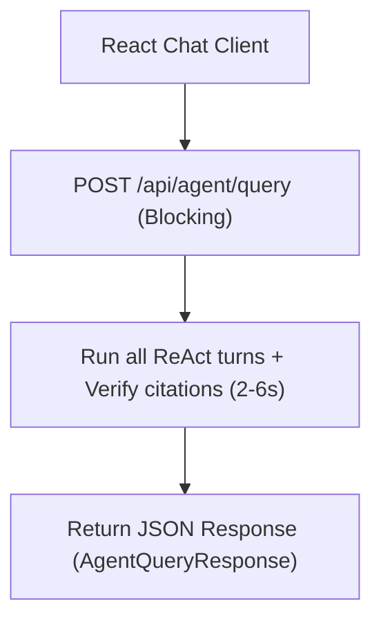
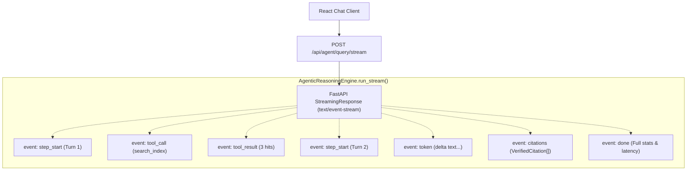
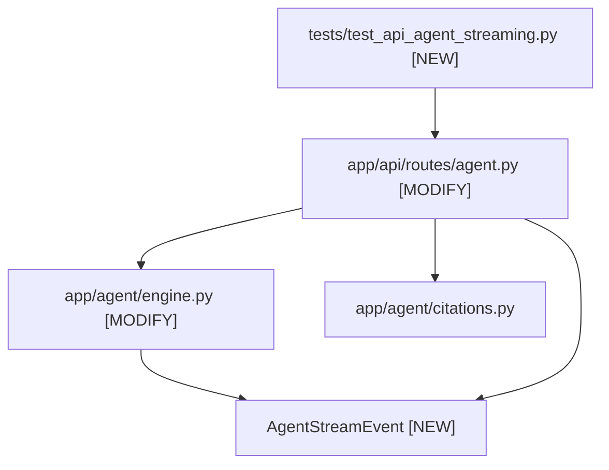

# Stage 2: Codebase Design — Task 9.4b: Real-Time Server-Sent Events (SSE) Agent Streaming Endpoint

**Task ID:** `9.4b`  
**Task Title:** Implement Real-Time Server-Sent Events (SSE) Agent Streaming Endpoint (`POST /api/agent/query/stream`)  
**Epic:** Epic 9 — Agentic RAG Intelligence & OpenRouter Provider Seam  
**Branch:** `feat/task-9.4b-sse-agent-streaming`  
**Artifact Version:** 1.0.0  
**Status:** DESIGN APPROVED (READY FOR IMPLEMENTATION)  

---

## 1. Current State Snapshot

In Tasks 9.3 and 9.4, the backend provided only a synchronous blocking endpoint:
- `POST /api/agent/query`: Client sends request, server executes all 1–5 ReAct steps, verifies citations, and returns full JSON payload after 2–6 seconds.



---

## 2. Proposed Target Architecture



---

## 3. File-Level Impact Analysis

### 3.1 `[MODIFY]` [`app/agent/engine.py`](file:///c:/Users/Mubashar/Desktop/Panopticon/app/agent/engine.py)
- **Role:** Add streaming event data structure and streaming ReAct generator method.
- **Components to add:**
  - `AgentStreamEvent(BaseModel)`:
    - `event_type: str`
    - `data: dict[str, Any]`
    - `to_sse() -> str`: Formats as W3C standard `f"event: {self.event_type}\ndata: {json.dumps(self.data)}\n\n"`
  - `AgenticReasoningEngine.run_stream()`:
    - Generator yielding `AgentStreamEvent` instances across execution steps, tool calls, tool results, text tokens, verified citations, and completion summary.

### 3.2 `[MODIFY]` [`app/agent/__init__.py`](file:///c:/Users/Mubashar/Desktop/Panopticon/app/agent/__init__.py)
- Export `AgentStreamEvent`.

### 3.3 `[MODIFY]` [`app/api/routes/agent.py`](file:///c:/Users/Mubashar/Desktop/Panopticon/app/api/routes/agent.py)
- Add route handler:
  ```python
  @router.post("/query/stream", response_class=StreamingResponse)
  async def stream_agent_query(
      request: Request,
      payload: AgentQueryRequest,
      storage: CrawlStorageDep,
  ) -> StreamingResponse:
      ...
  ```
- Yields SSE frames, checking `await request.is_disconnected()` to abort early on client disconnect.

### 3.4 `[NEW]` [`tests/test_api_agent_streaming.py`](file:///c:/Users/Mubashar/Desktop/Panopticon/tests/test_api_agent_streaming.py)
- 4 comprehensive integration tests:
  - Validates `POST /api/agent/query/stream` returns `200 OK` with `text/event-stream`.
  - Asserts correct sequence of events: `step_start` $\rightarrow$ `tool_call` $\rightarrow$ `tool_result` $\rightarrow$ `token` $\rightarrow$ `citations` $\rightarrow$ `done`.
  - Validates client disconnect handling.
  - Validates error event emission on invalid input.

---

## 4. Blast Radius & Dependency Graph



- **Blast Radius:** Completely additive. Existing `POST /api/agent/query` synchronous endpoint remains 100% untouched and operational.

---

## 5. Regression Risk Assessment

| Risk Description | Severity | Mitigation Strategy |
| :--- | :--- | :--- |
| **Event Stream Buffer Blocking:** Proxies or middleware buffering chunks and delaying display. | 🟢 Low | Set explicit headers: `Cache-Control: no-cache, no-transform`, `X-Accel-Buffering: no`, `Connection: keep-alive`. |
| **Broken SSE Delimiters:** Missing `\n\n` causes client `EventSource` to stall. | 🟢 Low | Enforced deterministically in `AgentStreamEvent.to_sse()`. |
| **Memory / Coroutine Leak:** Client disconnect leaves engine looping in background. | 🟢 Low | Tested with `await request.is_disconnected()` check before every turn. |

---

## 6. Rollback Plan

- If any issue arises:
  ```powershell
  git checkout main
  git branch -D feat/task-9.4b-sse-agent-streaming
  ```
- No database migrations or persistent state are touched.
