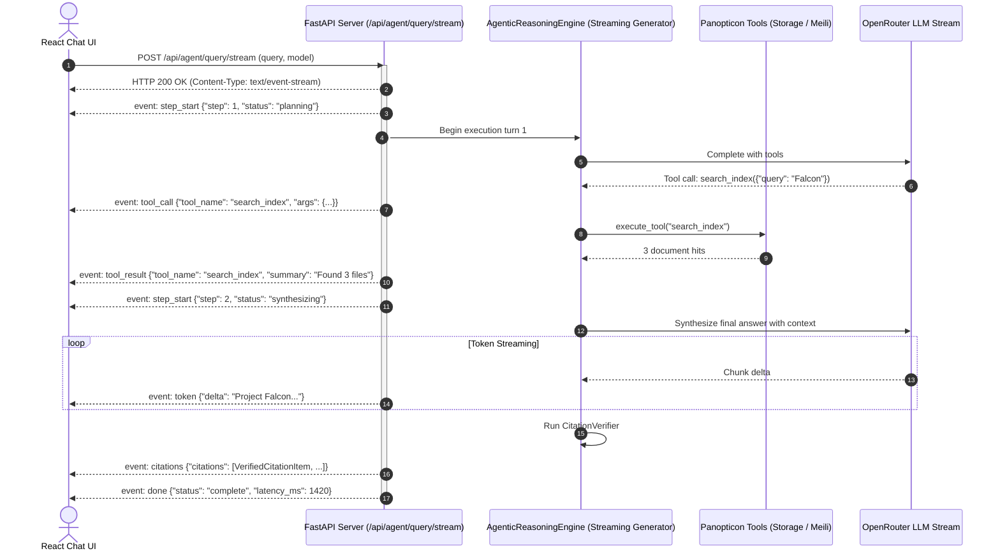
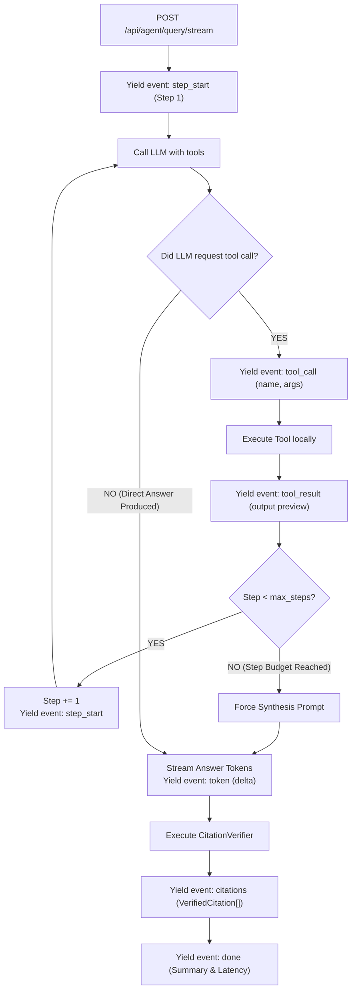

# Stage 1: Conceptual Understanding — Task 9.4b: Real-Time Server-Sent Events (SSE) Agent Streaming Endpoint

**Task ID:** `9.4b`  
**Task Title:** Implement Real-Time Server-Sent Events (SSE) Agent Streaming Endpoint (`POST /api/agent/query/stream`)  
**Epic:** Epic 9 — Agentic RAG Intelligence & OpenRouter Provider Seam  
**Branch:** `feat/task-9.4b-sse-agent-streaming`  
**Artifact Version:** 1.0.0  
**Status:** DRAFT  

---

## 1. Visual Architecture




---

## 2. The Physical Analogy: The Police Dispatcher Radio vs. The Sealed Mail Envelope

Imagine sending an investigator out to solve a missing case:
- **Synchronous HTTP (The Sealed Mail Envelope):** You write a question on a postcard, send it, and sit in a dark room waiting for a sealed letter to arrive 5 days later. For those 5 days, you have zero idea whether the investigator is stuck in traffic, examining evidence, or interviewing witnesses.
- **Server-Sent Events (The Two-Way Dispatcher Radio):** As soon as the investigator walks out the door, the radio crackles alive:
  - *"Dispatch, this is Unit 1. Arrived at the archive room."* (`step_start`)
  - *"Searching the 2026 file drawer for Falcon."* (`tool_call`)
  - *"Found three folders. Inspecting version diffs now."* (`tool_result`)
  - *"Dictating report: 'Falcon rate limit was updated to 120...'"* (`token` stream)
  - *"Attached folder microfilm seals."* (`citations`)
  - *"Report complete. 10-4."* (`done`)

With SSE, the user sees immediate live tactile feedback within 100ms instead of staring at a blank screen for 6 seconds.

---

## 3. Why & What

### Why Are We Doing This Task?
1. **User Experience & Perceived Latency:** Multi-turn ReAct reasoning (search $\rightarrow$ diff $\rightarrow$ chunk retrieval $\rightarrow$ synthesis $\rightarrow$ citation verification) takes between 2 and 6 seconds. Waiting for a single blocking JSON response feels sluggish and broken.
2. **Thought-Chain Transparency:** Showing the user live badges (`🔍 Searching index...`, `📄 Reading Falcon diff...`) builds trust because the user sees the agent actively consulting real corporate documents.
3. **Frontend Simplicity:** The React chat workspace (Task 9.5) can simply listen to standard browser `EventSource` / `fetch` readable streams and append tokens and badges as they arrive.

### What Is the Concept?
The **SSE Agent Streaming Endpoint (`POST /api/agent/query/stream`)** transforms the internal execution loop of `AgenticReasoningEngine` into a generator yielding structured SSE frames.

Each event frame adheres to the standard W3C Server-Sent Events protocol:
```text
event: <event_name>
data: <json_string>

```

#### Defined SSE Event Types:
1. `step_start`: Emitted when a new reasoning turn begins (`{"step": int, "max_steps": int}`).
2. `tool_call`: Emitted when the agent decides to invoke a tool (`{"step": int, "tool_name": str, "arguments": dict}`).
3. `tool_result`: Emitted when tool execution completes (`{"step": int, "tool_name": str, "output_summary": str}`).
4. `token`: Emitted as natural-language answer text is produced (`{"delta": str}`).
5. `citations`: Emitted after `CitationVerifier` validates sources (`{"citations": list[VerifiedCitation]}`).
6. `done`: Emitted on completion with full stats (`{"answer": str, "steps_taken": int, "tools_used": list[str], "latency_ms": float}`).
7. `error`: Emitted if an unhandled exception occurs (`{"error": str}`).

---

## 4. Abstraction Level Map

| Level | What Lives Here | In This Task |
| :--- | :--- | :--- |
| **Product / UX** | Live streaming chat bubble, real-time tool badges | Prerequisite backend feed for Task 9.5 |
| **Application** | Generator yielding SSE frames, streaming ReAct loop | `app/agent/engine.py:run_stream()`, `app/api/routes/agent.py` |
| **Framework** | FastAPI `StreamingResponse(media_type="text/event-stream")` | HTTP streaming transport |
| **Protocol** | W3C Server-Sent Events (`event: ...\ndata: ...\n\n`) | `AgentStreamEvent.to_sse()` |
| **External** | OpenRouter LLM API | Token-level delta chunks |

---

## 5. Mermaid Flowchart: Event Dispatch Engine



---

## 6. Data Flow Trace-Through

1. **Request:** Client calls `POST /api/agent/query/stream` with JSON body `{"query": "What changed in Falcon?"}`.
2. **Connection Established:** FastAPI returns HTTP 200 with headers `Content-Type: text/event-stream`, `Cache-Control: no-cache`.
3. **Turn 1 (Tool Invocation):**
   - Stream sends: `event: step_start\ndata: {"step": 1}\n\n`
   - LLM requests `search_index({"query": "Falcon"})`.
   - Stream sends: `event: tool_call\ndata: {"step": 1, "tool_name": "search_index", "arguments": {"query": "Falcon"}}\n\n`
   - Tool completes in 12ms.
   - Stream sends: `event: tool_result\ndata: {"step": 1, "tool_name": "search_index", "output_summary": "Found 1 file"}\n\n`
4. **Turn 2 (Synthesis):**
   - Stream sends: `event: step_start\ndata: {"step": 2}\n\n`
   - Model yields text tokens:
     - `event: token\ndata: {"delta": "Project "}\n\n`
     - `event: token\ndata: {"delta": "Falcon "}\n\n`
     - `event: token\ndata: {"delta": "rate limit..."}\n\n`
5. **Post-Processing (Verification):**
   - `CitationVerifier` resolves `doc_falcon_01`.
   - Stream sends: `event: citations\ndata: {"citations": [{"file_id": "doc_falcon_01", ...}]}\n\n`
6. **Finalization:**
   - Stream sends: `event: done\ndata: {"latency_ms": 850.0, "steps_taken": 2}\n\n`
   - Connection closes cleanly.

---

## 7. Concept-to-Code Mapping

| Conceptual Element | Proposed File & Symbol | Purpose |
| :--- | :--- | :--- |
| **Stream Event Model** | [`app/agent/engine.py:AgentStreamEvent`](file:///c:/Users/Mubashar/Desktop/Panopticon/app/agent/engine.py) | Pydantic event frame model with `.to_sse()` serializer |
| **Streaming Generator** | [`app/agent/engine.py:AgenticReasoningEngine.run_stream()`](file:///c:/Users/Mubashar/Desktop/Panopticon/app/agent/engine.py) | Generator yielding `AgentStreamEvent` during ReAct execution |
| **FastAPI Route** | [`app/api/routes/agent.py:stream_agent_query()`](file:///c:/Users/Mubashar/Desktop/Panopticon/app/api/routes/agent.py) | `POST /api/agent/query/stream` endpoint returning `StreamingResponse` |
| **Integration Test** | [`tests/test_api_agent_streaming.py`](file:///c:/Users/Mubashar/Desktop/Panopticon/tests/test_api_agent_streaming.py) | Pytest suite validating SSE frame delivery sequence |
