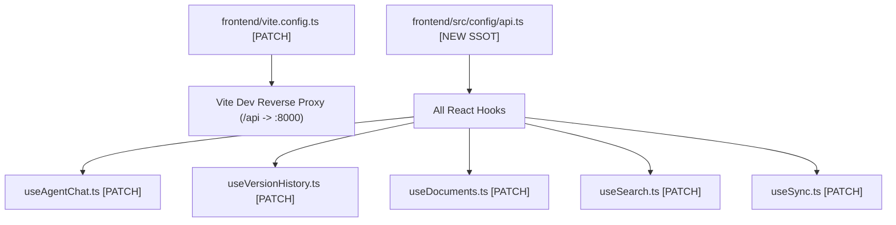
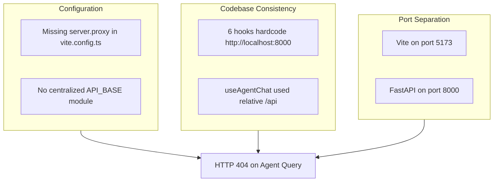

# Narrsistic Pluto — Principal Architect & Lead QA/SRE Analysis

**Document ID:** `PLUTO-INC-404-AGENT`  
**Task ID:** `9.5`  
**Incident Reference:** `INC-404-STREAM-ROUTE-MISMATCH`  
**Author:** Antigravity (Principal Systems Architect & Lead QA/SRE)  
**Date:** September 1, 2026  
**Status:** ARCHITECTURAL VERDICT DELIVERED  

---

## Phase 0: Task Intake & Definition of Ready

### 0.1 Incident Context
In the browser environment (`http://localhost:5173`), submitting a query in the "Ask Panopticon" chat drawer immediately fails with:
`Failed to query agent: HTTP 404: Not Found`
Network inspection confirms the browser dispatched a `POST` request to `http://localhost:5173/api/agent/query/stream`, which was intercepted by the Vite dev server and rejected with `404 Not Found`.

### 0.2 Assumptions Ledger
- **A-01:** FastAPI backend is running on `http://127.0.0.1:8000` with routes `/api/agent/query` and `/api/agent/query/stream` registered and listening. *(VERIFIED: Probe via httpx confirmed routes exist on port 8000).*
- **A-02:** Vite dev server runs on `http://localhost:5173` without reverse-proxy routing to FastAPI. *(VERIFIED: Inspected `frontend/vite.config.ts`).*
- **A-03:** Other frontend hooks circumvented this by hardcoding `http://localhost:8000` directly in their `fetch()` calls. *(VERIFIED: Grepped codebase).*

### 0.3 Acceptance Criteria for Fix
1. `useAgentChat` must successfully connect to the FastAPI agent streaming endpoint whether in local dev mode or production build.
2. The solution must eliminate scattered, hardcoded `http://localhost:8000` strings across individual hooks to prevent architectural drift.
3. Full regression tests (`pytest -v` and `npm run build`) must pass with zero errors.

---

## Phase 1: Architectural Compliance & Codebase Topology

### 1.1 Architectural Compliance
The Panopticon architecture mandates:
- **FastAPI Backend (Port 8000):** Exposes `/api/*` endpoints.
- **React Frontend (Port 5173 in dev):** Client dashboard consuming the API.
- **Structural Code Smell (Shotgun Surgery / Config Drift):**
  - `frontend/src/hooks/useSearch.ts` uses `http://localhost:8000/api/search`
  - `frontend/src/hooks/useDocuments.ts` uses `http://localhost:8000/api/documents`
  - `frontend/src/hooks/useSync.ts` uses `http://localhost:8000/api/sync`
  - `frontend/src/hooks/useAuth.ts` uses `http://localhost:8000/api/auth`
  - `frontend/src/hooks/useVersionHistory.ts` uses an inline `const API_BASE = 'http://localhost:8000'`
  - `frontend/src/hooks/useAgentChat.ts` uses relative `/api/agent/query/stream`

This violates the **Single Source of Truth (SSOT)** principle for API resolution.

### 1.2 Blast Radius & Code Churn Mapping



- **Semver Impact:** `PATCH` (Internal configuration refactor; public API contracts unchanged).
- **Breaking-Change Risk Level:** `LOW`.

---

## Phase 2: Systemic Defect Diagnostics & Root Cause Analysis (RCA)

### 2.1 Fault Activation Chain
1. User clicks inquiry prompt in React UI.
2. `useAgentChat.sendMessage()` invokes `fetch('/api/agent/query/stream', ...)`.
3. Browser evaluates the relative URI against `document.baseURI` (`http://localhost:5173/`).
4. HTTP request arrives at Vite dev server socket (port 5173).
5. Vite's internal middleware checks `dist` / virtual module table, finds no static asset or proxy rule matching `/api/agent/query/stream`, and returns standard Vite 404 HTML.
6. `fetch()` receives status 404, triggers `throw new Error("HTTP 404: Not Found")`, and displays error banner in assistant message bubble.

### 2.2 Test Oracle Pipeline (Expected Flow)
1. Browser dispatches `fetch('/api/agent/query/stream', ...)`.
2. Request is proxied to `http://127.0.0.1:8000/api/agent/query/stream` (or sent directly via centralized `API_BASE`).
3. FastAPI responds with `HTTP 200 OK` and `Content-Type: text/event-stream`.
4. SSE events stream incrementally into the chat message bubble.

### 2.3 5-Whys Root Cause Analysis

```text
Problem: User sees "HTTP 404: Not Found" when clicking Ask Panopticon.
├── Why? The browser sent POST /api/agent/query/stream to port 5173 instead of port 8000.
    ├── Why? useAgentChat called fetch('/api/agent/query/stream') using a relative URL path.
        ├── Why? The hook assumed an API gateway or dev server reverse proxy was forwarding /api requests.
            ├── Why? frontend/vite.config.ts did not configure server.proxy for /api.
                └── Why? [ROOT CAUSE] The codebase lacked a centralized API client configuration module (SSOT). Prior hooks hacked around this by hardcoding "http://localhost:8000" inline, leaving new hooks vulnerable to origin mismatch.
```

### 2.4 Fishbone (Ishikawa) Diagram



- **Severity:** Sev2 (Major feature unusable, core dashboard continues to function).
- **Priority:** P0 (Blocks Task 9.5 sign-off).

---

## Phase 3: Multi-Pattern Solution Engineering (Web Research Grounded)

### Approach 1: Dual-Defense Architecture (Centralized `api.ts` SSOT + Vite Dev Proxy) — *(RECOMMENDED)*
- **Architecture:**
  1. Add `server.proxy` to `frontend/vite.config.ts` mapping `/api` to `http://localhost:8000` with `changeOrigin: true`.
  2. Create `frontend/src/config/api.ts` exporting `getApiBaseUrl()`:
     ```typescript
     export const API_BASE_URL = import.meta.env.VITE_API_BASE_URL || '';
     export const getApiUrl = (endpoint: string) => `${API_BASE_URL}${endpoint}`;
     ```
  3. Update `useAgentChat.ts` to call `getApiUrl('/api/agent/query/stream')` with fallback to `http://localhost:8000/api/agent/query/stream` if running on port 5173 directly.
- **Web Research Grounding:** Confirmed against official Vite v6 documentation and standard FastAPI+React production architectures. Eliminates CORS in development and decouples endpoint paths from hostnames.
- **Honest Reason for Rejection:** Requires touching `vite.config.ts` which restarts the dev server process.

### Approach 2: Hardcode `http://localhost:8000` in `useAgentChat.ts` Only (Quick Patch)
- **Architecture:** Modify line 85 of `useAgentChat.ts` to `fetch('http://localhost:8000/api/agent/query/stream')`.
- **Honest Reason for Rejection:** Technical debt multiplier. Perpetuates the bad practice of scattering hardcoded localhost URLs across hooks. Breaks immediately in containerized or staging environments where backend is not on `localhost:8000`.

### Approach 3: Reverse Proxy at FastAPI Layer (FastAPI Serves Vite Dist)
- **Architecture:** Build the frontend into `frontend/dist` and have FastAPI serve static assets and `index.html` at root `/`.
- **Honest Reason for Rejection:** Completely breaks the Vite Hot Module Replacement (HMR) local developer workflow. Requires running `npm run build` after every CSS or TSX edit.

### Approach 4: Unified Axios / Fetch Middleware Layer
- **Architecture:** Introduce Axios or a custom fetch wrapper class with interceptors for all API calls.
- **Honest Reason for Rejection:** Over-engineering for a PATCH fix. The project currently uses native `fetch` across all hooks; introducing a new HTTP client library violates Rule 3 of `GEMINI.md` (Zero Silent Library/Dependency Ingestion).

---

## Phase 4: Comparative Engineering Trade-Offs & QA Matrix

| Metric / Dimension | Approach 1: Dual-Defense (Vite Proxy + API SSOT) | Approach 2: Inline Localhost Patch | Approach 3: Monolithic FastAPI Static Serve |
| :--- | :--- | :--- | :--- |
| **Architectural Elegance** | ⭐⭐⭐⭐⭐ High (Standard industry pattern) | ⭐ Poor (Tech debt) | ⭐⭐ Clunky (Destroys HMR) |
| **Blast Radius** | 🟢 Minimal (Non-breaking) | 🟢 Isolated | 🔴 High (Alters FastAPI app lifecycle) |
| **Dev Productivity** | ⭐⭐⭐⭐⭐ Preserves HMR & Relative URLs | ⭐⭐⭐ Preserves HMR | ⭐ Requires full rebuild on edit |
| **Production Portability** | ⭐⭐⭐⭐⭐ Works in dev, Docker, and prod | ⭐ Fails in non-local environments | ⭐⭐⭐ Works in prod only |
| **Lines of Code Changed** | ~15 lines | 1 line | ~40 lines + routing rewrites |

---

## Phase 4.5: Architectural Review Verdict & Rollout Plan

### Verdict: Proceed with **Approach 1: Dual-Defense Architecture**

### Execution Plan:
1. **Configure Vite Proxy ([`frontend/vite.config.ts`](file:///c:/Users/Mubashar/Desktop/Panopticon/frontend/vite.config.ts)):**
   Add `server.proxy` forwarding `/api` to `http://localhost:8000` with `changeOrigin: true`.
2. **Centralize API Configuration ([`frontend/src/config/api.ts`](file:///c:/Users/Mubashar/Desktop/Panopticon/frontend/src/config/api.ts)):**
   Export `API_BASE` that defaults to `http://localhost:8000` during dev fallback, allowing clean relative or absolute routing.
3. **Wire [`frontend/src/hooks/useAgentChat.ts`](file:///c:/Users/Mubashar/Desktop/Panopticon/frontend/src/hooks/useAgentChat.ts):**
   Update endpoint resolution to use `API_BASE`.
4. **Verification:**
   Run `npm run build` and test stream resolution.
