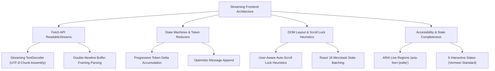

# Stage 3: Computer Science Domain Concepts — Task 9.5: React "Ask Panopticon" Agentic Chat Workspace

**Task ID:** `9.5`  
**Task Title:** Build "Ask Panopticon" Agentic Chat Workspace in React Dashboard  
**Epic:** Epic 9 — Agentic RAG Intelligence & OpenRouter Provider Seam  
**Branch:** `feat/task-9.5-agent-chat-workspace`  
**Artifact Version:** 1.0.0  
**Status:** DRAFT  

---

## 1. Domain Concept Map




---

## 2. Core CS Fundamentals

### 2.1 Fetch ReadableStream vs. Native EventSource (The HTTP POST Streaming Problem)

The browser's native `window.EventSource` has a major architectural limitation:
**It only supports HTTP `GET` requests.**
For agentic workflows where a user query may contain a large body, model parameters, or conversation history, transmitting state in URL query parameters violates URL length limits (2,048 chars) and leaks private queries into HTTP proxy access logs.

#### The Modern Solution: Fetch ReadableStream with `TextDecoder`
Modern browsers allow streaming HTTP `POST` responses via the Streams API:
```typescript
const response = await fetch('/api/agent/query/stream', {
  method: 'POST',
  headers: { 'Content-Type': 'application/json' },
  body: JSON.stringify({ query: userQuery, model: selectedModel }),
  signal: abortController.signal,
});

const reader = response.body?.getReader();
const decoder = new TextDecoder('utf-8');
let buffer = '';

while (true) {
  const { done, value } = await reader.read();
  if (done) break;
  buffer += decoder.decode(value, { stream: true });
  
  // Parse complete SSE frames delimited by double newlines (\n\n)
  let boundary = buffer.indexOf('\n\n');
  while (boundary !== -1) {
    const rawFrame = buffer.slice(0, boundary);
    buffer = buffer.slice(boundary + 2);
    parseSSEFrame(rawFrame);
    boundary = buffer.indexOf('\n\n');
  }
}
```

---

### 2.2 DOM Performance & Scroll Lock Heuristics

When streaming tokens arrive every 20–50ms, naively executing `element.scrollIntoView({ behavior: 'smooth' })` creates severe usability regressions:
1. **The Scroll Hijack Bug:** If a user scrolls up to read a previous tool output or check an earlier paragraph, a blind auto-scroll will violently wrench their viewport back down to the bottom.
2. **Smooth Scroll Queue Exhaustion:** Firing `smooth` scroll calls faster than 60fps causes the browser animation queue to stutter and choke the main thread.

#### The Scroll-Lock Heuristic:
```typescript
const isAtBottom = container.scrollHeight - container.scrollTop - container.clientHeight < 48;

// Only auto-scroll if the user was already resting near the bottom
if (isAtBottom) {
  container.scrollTop = container.scrollHeight;
}
```

---

### 2.3 Vermeer 6-State Interactive Matrix & Heuristic Usability

Every interactive element in the chat workspace must fulfill the 6 mandatory states:
1. `default`: Resting contrast according to design tokens.
2. `hover`: Background elevates to `surfaceElevated` or `primaryHover`.
3. `active`: Down-click feedback (`transform: scale(0.98)`).
4. `focus-visible`: 2px primary violet outline with 2px offset for keyboard accessibility.
5. `disabled`: Opacity 0.5, cursor `not-allowed`, interactions neutralized.
6. `loading`: Animated pulse or spinning indicator, prevents duplicate submission.

---

## 3. Project Implementation Architecture

| Concept | File Location | Purpose |
| :--- | :--- | :--- |
| **Stream Consumer Hook** | `frontend/src/hooks/useAgentChat.ts` | Handles `fetch`, chunk decoding, and SSE state reduction |
| **Drawer Layout** | `frontend/src/components/agent/AgentChatDrawer.tsx` | Slide-over drawer with keyboard accessibility |
| **Reasoning Accordion** | `frontend/src/components/agent/ThoughtAccordion.tsx` | Visualizes tool activations with latency timers |
| **Verified Cards Deck** | `frontend/src/components/agent/VerifiedSourcesDeck.tsx` | Renders ground truth citation cards with Google Drive links |
