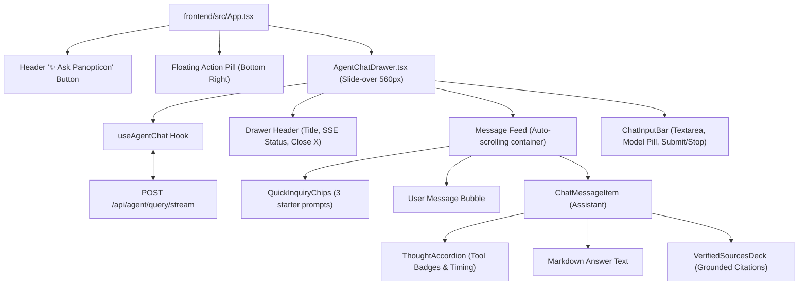

# Stage 2: Codebase Design — Task 9.5: React "Ask Panopticon" Agentic Chat Workspace

**Task ID:** `9.5`  
**Task Title:** Build "Ask Panopticon" Agentic Chat Workspace in React Dashboard  
**Epic:** Epic 9 — Agentic RAG Intelligence & OpenRouter Provider Seam  
**Branch:** `feat/task-9.5-agent-chat-workspace`  
**Artifact Version:** 1.0.0  
**Status:** DESIGN APPROVED (READY FOR IMPLEMENTATION)  

---

## 1. Current State Snapshot

The React dashboard (`frontend/src/App.tsx`) currently features:
- Top Navigation: Panopticon Observatory title, Live SSE badge, SyncControls, Settings button.
- Search & Filter Controls: `SearchBar`, `ModeSelector`, `FilterBar`, `ViewToggle`.
- Content Area: `ResultsList` or `DenseDocumentTable` + `PaginationBar`.
- Drawers/Modals: `SyncProgressDrawer`, `SettingsDrawer`, `VersionHistoryModal`.

The agentic intelligence layer exists exclusively on the backend (`/api/agent/query` and `/api/agent/query/stream`), with no user interface for conversation or thought-chain exploration.

---

## 2. Target Architecture & Component Topology

---

## 3. File-Level Modification Plan

### 3.1 `[NEW]` [`frontend/src/types/agent.ts`](file:///c:/Users/Mubashar/Desktop/Panopticon/frontend/src/types/agent.ts)
- TypeScript interfaces matching backend schemas:
  - `AgentStepTraceItem`: `{ step: number; tool_name: string; arguments: Record<string, any>; output_summary: string }`
  - `VerifiedCitationItem`: `{ file_id: string; document_name: string; web_view_link: string; mime_type: string; matched_snippet?: string; confidence_score: number; verification_status: string }`
  - `ChatMessage`: `{ id: string; role: 'user' | 'assistant'; content: string; timestamp: Date; isLoading?: boolean; trace?: AgentStepTraceItem[]; citations?: VerifiedCitationItem[]; latencyMs?: number; model?: string; error?: string }`

### 3.2 `[NEW]` [`frontend/src/hooks/useAgentChat.ts`](file:///c:/Users/Mubashar/Desktop/Panopticon/frontend/src/hooks/useAgentChat.ts)
- State management:
  - `messages: ChatMessage[]`
  - `isStreaming: boolean`
  - `selectedModel: string | null`
  - `sendMessage(query: string)`
  - `cancelStreaming()`
  - `clearChat()`
- Consumes `fetch('/api/agent/query/stream')` using `ReadableStream` reader and `TextDecoder`.
- Accumulates `token` deltas and updates live assistant message in real time.

### 3.3 `[NEW]` [`frontend/src/components/agent/ThoughtAccordion.tsx`](file:///c:/Users/Mubashar/Desktop/Panopticon/frontend/src/components/agent/ThoughtAccordion.tsx)
- Renders collapsible reasoning steps:
  - Header: `🧠 Thought for {latencyMs / 1000}s ({trace.length} tools executed) ▾`
  - Expanded body: sequential tool badges (`search_index`, `get_document_diff`, `semantic_chunk_search`, `get_file_metadata`) with argument chips and preview output summaries.

### 3.4 `[NEW]` [`frontend/src/components/agent/VerifiedSourcesDeck.tsx`](file:///c:/Users/Mubashar/Desktop/Panopticon/frontend/src/components/agent/VerifiedSourcesDeck.tsx)
- Renders verified citation cards:
  - Document Title with Google Docs / Sheets icon.
  - Confidence pill: `100% Grounded` (`var(--color-success)`) or `Unverified` (`var(--color-warning)`).
  - Matched snippet excerpt with quotation marks.
  - Direct action button: `Open in Google Drive ↗` (rel="noopener noreferrer").

### 3.5 `[NEW]` [`frontend/src/components/agent/QuickInquiryChips.tsx`](file:///c:/Users/Mubashar/Desktop/Panopticon/frontend/src/components/agent/QuickInquiryChips.tsx)
- 3 one-click starter pills for empty chat states:
  - *"What changed in our technical specifications recently?"*
  - *"Find all spreadsheets tracking project budgets or metrics."*
  - *"Compare authentication requirements across active projects."*

### 3.6 `[NEW]` [`frontend/src/components/agent/ChatMessageItem.tsx`](file:///c:/Users/Mubashar/Desktop/Panopticon/frontend/src/components/agent/ChatMessageItem.tsx)
- Message bubble container handling user vs. assistant layouts.
- Integrates `ThoughtAccordion`, streaming text, and `VerifiedSourcesDeck`.

### 3.7 `[NEW]` [`frontend/src/components/agent/ChatInputBar.tsx`](file:///c:/Users/Mubashar/Desktop/Panopticon/frontend/src/components/agent/ChatInputBar.tsx)
- Auto-resizing textarea with `Enter` to send, `Shift+Enter` for newline.
- Model selector pill showing active model.
- Send button (submits) and Stop button (aborts streaming).

### 3.8 `[NEW]` [`frontend/src/components/agent/AgentChatDrawer.tsx`](file:///c:/Users/Mubashar/Desktop/Panopticon/frontend/src/components/agent/AgentChatDrawer.tsx)
- Right-hand slide-over drawer (560px width).
- Backdrop blur, ESC key dismiss, and scroll-lock auto-scroll heuristic.

### 3.9 `[MODIFY]` [`frontend/src/App.tsx`](file:///c:/Users/Mubashar/Desktop/Panopticon/frontend/src/App.tsx)
- Add `agentChatOpen: boolean` state.
- Mount top navigation button: `✨ Ask Panopticon`.
- Mount floating launcher pill in bottom-right corner.
- Mount `<AgentChatDrawer isOpen={agentChatOpen} onClose={() => setAgentChatOpen(false)} />`.

---

## 4. The Muses Discipline & Heuristic Enforcement

### 4.1 Token Discipline (Picasso & Vermeer)
- **Zero Raw Hex Codes:**
  - Backgrounds: `bg-[var(--color-bg-surface)]`, `bg-[var(--color-bg-surface-elevated)]`, `bg-[var(--color-bg-canvas)]`
  - Text: `text-[var(--color-text-primary)]`, `text-[var(--color-text-secondary)]`
  - Accents: `text-[var(--color-primary)]`, `bg-[var(--color-primary)]`, `bg-[var(--color-drive)]`, `text-[var(--color-success)]`
  - Borders: `border-[var(--color-border)]`
- **Zero Arbitrary Pixels:**
  - Spacing: `p-[var(--space-4)]`, `gap-[var(--space-2)]`, `mb-[var(--space-6)]`
  - Radius: `rounded-[var(--radius-md)]`, `rounded-[var(--radius-lg)]`, `rounded-[var(--radius-full)]`

### 4.2 The 10 Nielsen Norman Usability Heuristics
1. **Visibility of System Status:** Live tool badges and streaming tokens provide continuous real-time progress.
2. **Match Between System and Real World:** Familiar chat bubbles, Google Drive icons, and document titles.
3. **User Control and Freedom:** Stop generation button, clear chat, and close drawer via button or ESC key.
4. **Consistency and Standards:** Matches existing `SyncProgressDrawer` and `SettingsDrawer` aesthetic.
5. **Error Prevention:** Submit button disabled when input is empty or when already streaming.
6. **Recognition Rather Than Recall:** Quick inquiry chips present starting prompts upfront.
7. **Flexibility and Efficiency of Use:** Keyboard shortcuts (`Enter` to submit, `Shift+Enter` for newline, `Esc` to close).
8. **Aesthetic and Minimalist Design:** Reasoning details collapse into accordion; content is prioritized.
9. **Help Users Recognize and Recover from Errors:** Clear error alerts with retry suggestions.
10. **Help and Documentation:** Clear explanation of Panopticon agent capabilities in the empty state.

### 4.3 6 Interactive States on Every Control
- `default`: Resting contrast according to tokens.
- `hover`: `hover:bg-[var(--color-bg-surface-elevated)]` or `hover:bg-[var(--color-primary-hover)]`.
- `active`: Tactile feedback with `active:scale-95`.
- `focus-visible`: `focus-visible:outline-2 focus-visible:outline-[var(--color-primary)]`.
- `disabled`: `disabled:opacity-50 disabled:cursor-not-allowed`.
- `loading`: Pulsing dots / spinner during streaming.

---

## 5. Rollback Plan

- Work is completely isolated on `feat/task-9.5-agent-chat-workspace`.
- If issues occur, revert to `main` with zero impact on search, directory, diffs, or crawler.
