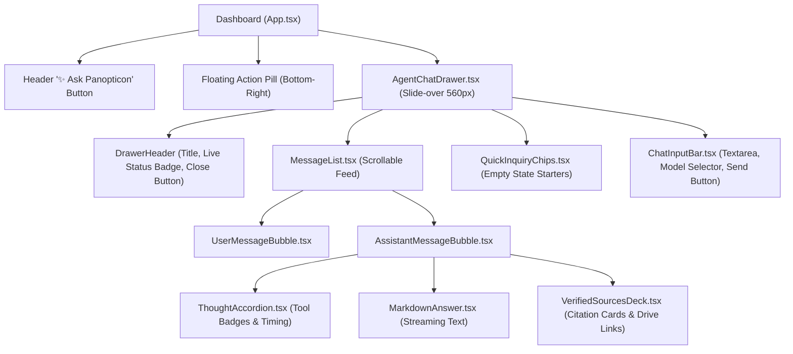
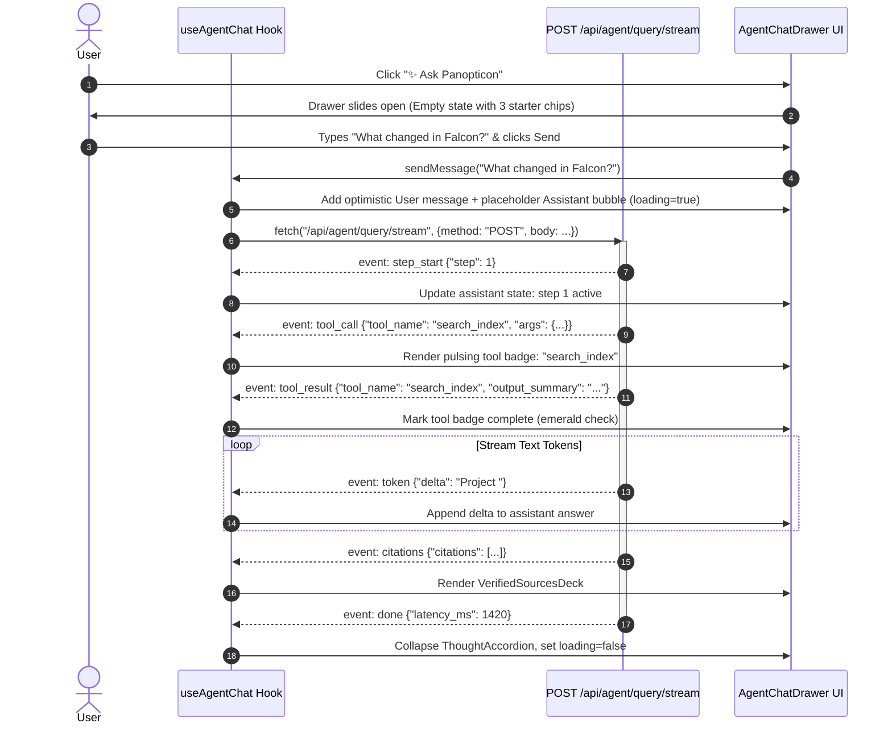

# Stage 1: Conceptual Understanding — Task 9.5: React "Ask Panopticon" Agentic Chat Workspace

**Task ID:** `9.5`  
**Task Title:** Build "Ask Panopticon" Agentic Chat Workspace in React Dashboard  
**Epic:** Epic 9 — Agentic RAG Intelligence & OpenRouter Provider Seam  
**Branch:** `feat/task-9.5-agent-chat-workspace`  
**Artifact Version:** 1.0.0  
**Status:** DRAFT  

---

## 1. Visual Architecture & Design Mockup




---

## 2. The Physical Analogy: The Mission Control Flight Telemetry Screen

Imagine sitting in Mission Control during an orbital launch:
- **Traditional Chatbots (The Blind Audio Call):** You say something into a headset and wait in complete silence for 10 seconds. You have no idea if the rocket fired its thrusters, if guidance sensors are working, or if the connection dropped.
- **Panopticon Agentic Chat Workspace (The Telemetry Screen):** 
  1. The moment you ask a question, the telemetry lights up:
     - `T+0.2s`: *Sensor active: querying document index...* (A pulsating cyan badge appears)
     - `T+0.8s`: *Data retrieved: 3 matching records found.*
     - `T+1.4s`: *Subsystem inspection: pulling version diff for doc_falcon_01...*
  2. Once the facts are confirmed, the telemetry panel minimizes to a green status light (*"Thought for 2.1s (2 tools executed)"*), and the synthesized debrief streams onto your console word by word.
  3. Underneath the debrief, certified flight logs (Verified Citation Cards) appear with clickable links directly into the original flight recordings in Google Drive.

---

## 3. Why & What

### Why Are We Doing This Task?
1. **Unlocking Agent Intelligence for End Users:** Tasks 9.1 through 9.4b built the chunking, embeddings, tool-calling engine, citation guardrail, and SSE streaming endpoint. Task 9.5 puts this power into the hands of users via a fluid, reactive UI.
2. **Eliminating the Black-Box AI Problem:** By rendering tool activations (`search_index`, `get_document_diff`, `get_file_metadata`, `semantic_chunk_search`) in real time, users can see *how* the agent deduced the answer from real company files.
3. **100% Grounded Link Exploration:** Every cited document provides a direct pointer card to open the authoritative file in Google Drive.

### What Is the Component Structure?
A slide-over drawer (`AgentChatDrawer.tsx`) rendered alongside the dashboard canvas. It consumes `POST /api/agent/query/stream` via a custom React hook `useAgentChat.ts`:
- Maintains message history: `ChatMessage[]` (user query, assistant answer, active streaming flags, tool traces, citations).
- Progressive text rendering: Appends incoming `token` event deltas in real time.
- State machines: Implements all 6 interactive states (`default, hover, active, focus, disabled, loading`).
- Zero style drift: Strictly adheres to `design-system/tokens.json` CSS variables (`var(--color-bg-canvas)`, `var(--color-primary)`, `var(--space-4)`).

---

## 4. Component Hierarchy & File Mapping

```text
frontend/src/
├── components/
│   └── agent/
│       ├── AgentChatDrawer.tsx          # Main slide-over drawer container
│       ├── ChatMessageItem.tsx          # Message bubble renderer (user / assistant)
│       ├── ThoughtAccordion.tsx         # Collapsible tool execution trace
│       ├── VerifiedSourcesDeck.tsx      # Grounded source citation cards
│       ├── QuickInquiryChips.tsx        # Empty-state prompt suggestion pills
│       └── ChatInputBar.tsx             # Text input, model override pill, submit button
├── hooks/
│   └── useAgentChat.ts                  # SSE streaming consumer & state reducer
└── types/
    └── agent.ts                         # TypeScript interfaces for trace, citations, events
```

---

## 5. Sequence Diagram: Streaming Chat Interaction Flow



---

## 6. The Muses Compliance Check

- **Picasso (Tokens First):**
  - Background: `var(--color-bg-surface)` (`#150E24`) & `var(--color-bg-surface-elevated)` (`#1E1B3A`).
  - Text: `var(--color-text-primary)` (`#F1F5F9`) & `var(--color-text-secondary)` (`#94A3B8`).
  - Brand accents: `var(--color-primary)` (`#8B5CF6`) & `var(--color-drive)` (`#4285F4`).
  - Radii & Spacing: strictly using `--radius-md`, `--radius-lg`, `--space-2`, `--space-4`.
  - Zero raw hex or arbitrary px.
- **Escher (Backend Contracts):**
  - Consumes exact wire schemas from `POST /api/agent/query/stream` documented in `design-system/backend-requirements.md`.
- **Vermeer (10 Heuristics & 6 Interactive States):**
  - **Heuristic 1 (Visibility of System Status):** Live streaming badges and tokens show the user exactly what is occurring at each millisecond.
  - **Heuristic 3 (User Control & Freedom):** Close button, Esc key shortcut, and stop/clear conversation buttons.
  - **Heuristic 8 (Aesthetic & Minimalist Design):** Thought details collapse into an accordion so primary synthesized text is prominent.
  - **6 Interactive States:** Every button and input implements `default, hover, active, focus, disabled, loading`.
