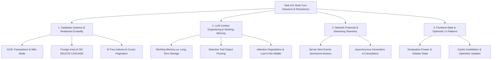

# Stage 3: CS Domain Learning Extraction — Task 9.8

**Task ID:** `9.8`  
**Task Title:** Multi-Turn Chat Sessions, SQLite Thread Persistence & UI Drawer History (RFC-0002)  
**Epic:** Epic 9 — Agentic RAG Intelligence & OpenRouter Provider Seam  
**Branch:** `feat/task-9.8-multi-turn-threads-history`  
**Status:** COMPLETE  
**Date:** 2026-09-02  

---

## 1. Domain Discovery Map

Task 9.8 bridges backend relational durability, large language model (LLM) context engineering, real-time HTTP streaming, and declarative UI state synchronization.

---

## 2. Domain Deep Dives

### Domain 1: Relational Schema Design & ACID Cascaded Durability in SQLite

#### What Is It (Plain English)?
SQLite is an embedded relational database that runs inside the Python process rather than as a separate network daemon. It organizes data into structured tables with strict column types and foreign key relationships. Cascaded deletion guarantees that when a parent entity (like a chat thread) is deleted, all dependent child entities (like its 20 individual messages) are automatically and atomically erased without leaving orphaned rows.

#### Physical Analogy: The Accordion Filing System with Self-Shredding Folders
Imagine an office filing cabinet. Each conversation is a labeled folder (`agent_threads`). Inside the folder are individual timestamped memo sheets (`agent_messages`). If you decide to decommission the entire project and throw the folder into the shredder, all memo sheets clipped inside the folder are instantly shredded along with it (`ON DELETE CASCADE`). You never have loose, unreferenced memo sheets cluttering the cabinet drawers.

#### How It Works Under the Hood:
1. **Write-Ahead Logging (WAL Mode):**
   - SQLite writes changes sequentially to a `-wal` file instead of directly overwriting the main database page file.
   - This unlocks single-writer / concurrent-readers concurrency: background crawlers reading file records do not block user chat threads from saving new messages.
2. **Foreign Key Enforcement (`PRAGMA foreign_keys = ON`):**
   - In SQLite, foreign keys are disabled by default for legacy backward compatibility. In `CrawlStorage.get_connection()`, `PRAGMA foreign_keys = ON;` is explicitly executed on every connection.
   - When `DELETE FROM agent_threads WHERE id = ?` runs, the SQLite B-Tree engine automatically traverses the foreign key index `idx_messages_thread_id` and removes all child records in the same atomic transaction.

---

### Domain 2: LLM Context Engineering, Working Memory vs. Long-Term Storage

#### What Is It (Plain English)?
Large Language Models are inherently stateless functions: they have no internal biological memory between API calls. To give the illusion of an ongoing conversation, the software application must re-feed previous dialog turns into the model's prompt on every single turn. However, because LLMs have strict context window limits and charge fees per token, passing thousands of lines of raw search results from past turns causes severe latency, cost spikes, and attention confusion ("lost-in-the-middle"). Context engineering selectively prunes raw technical telemetry while preserving synthesized human facts.

#### Physical Analogy: The Detective's Pocket Notebook vs. The Evidence Locker
When a detective is interviewing a suspect on Day 3 of an investigation:
- **The Evidence Locker (SQLite Database):** Stores 500 pages of DNA chromatography readouts, bank statements, and telephone logs.
- **The Pocket Notebook (LLM Working Context):** The detective does **not** carry 500 pounds of paper into the interrogation room. Their notebook simply says: *"Day 1: Suspect claimed they were in Boston. Day 2: Bank records showed ATM withdrawal in Chicago at 10 PM."*
The facts are kept; the massive raw data sheets remain in the locker.

#### Mathematical / Computational Principle:
Let prompt token length for turn $N$ be $T(N)$.
In naive full-history retention with average tool output size $S_{\text{tool}} \approx 1,500$ tokens:
$$T_{\text{naive}}(N) = T_{\text{system}} + \sum_{i=1}^{N} \left( T_{\text{user}, i} + T_{\text{assistant}, i} + K_i \cdot S_{\text{tool}} \right) \sim O(N \cdot S_{\text{tool}})$$
By Turn 5 with $K = 2$ tools per turn:
$$T_{\text{naive}}(5) \approx 500 + 5 \times (50 + 300 + 3000) \approx 17,250 \text{ tokens}$$
Under Panopticon's **Two-Tier Pruning Invariant**, raw tool outputs are pruned for all past turns ($i < N$):
$$T_{\text{pruned}}(N) = T_{\text{system}} + \left[\sum_{i=1}^{N-1} (T_{\text{user}, i} + T_{\text{assistant}, i})\right] + T_{\text{user}, N} + K_N \cdot S_{\text{tool}}$$
For Turn 5:
$$T_{\text{pruned}}(5) \approx 500 + 4 \times (50 + 300) + 50 + 3000 \approx 4,950 \text{ tokens}$$
**Token savings: >71% reduction in prompt tokens**, cutting latency and completely preventing rate-limit saturation.

---

### Domain 3: Server-Sent Events (SSE) & Transport Lifecycle

#### What Is It (Plain English)?
Server-Sent Events (SSE) is a standardized HTTP technology (`text/event-stream`) where a client opens a standard persistent HTTP connection, and the server continuously pushes textual events to the client as they occur, without the client needing to poll.

#### Physical Analogy: The Live Sports Ticker
Instead of repeatedly texting your friend every 2 seconds: *"What's the score now? What's the score now?"*, you tune in to a live radio broadcast. The radio announcer speaks whenever a play happens: *"Tool running: searching index"*, *"Token: The"*, *"Token: project"*, *"Event: Done"*.

#### How It Works Under the Hood:
- **MIME Type:** `text/event-stream`.
- **Chunk Delimiters:** Each frame ends with two newline characters (`\n\n`).
- **Connection Header:** `Cache-Control: no-cache`, `Connection: keep-alive`, `X-Accel-Buffering: no` (to prevent reverse proxies like Nginx from buffering partial tokens).
- **Asynchronous Generators in Python:** FastAPI consumes a Python `AsyncIterator[str]`. When an SSE event is yielded, ASGI pushes the chunk down the TCP socket immediately.

---

### Domain 4: Declarative Frontend State & Optimistic UI Updates

#### What Is It (Plain English)?
In modern web applications, the UI is a pure function of state ($UI = f(\text{state})$). In a multi-turn chat interface, when the user clicks "Send", the application immediately renders the user's message bubble on screen (optimistic update) before the backend finishes processing. While the backend streams response tokens, the assistant bubble updates in real time.

#### Physical Analogy: Instant Digital Messaging Read-Receipts
When you press "Send" on your phone, the text bubble instantly pops up on your screen with a light gray clock icon. You don't freeze the whole screen waiting for the server to reply. Once the server confirms, the clock turns into a checkmark.

---

## 3. Cross-Domain Synergy & Trade-off Matrix

| Architecture Dimension | Naive Chat Ingestion | Pure Vector Memory (Mem0) | Relational SQLite + Selective Pruning (Panopticon) |
|---|---|---|---|
| **Durability Guarantee** | None (Lost on reload) | Cloud / Hosted Vector Store | 100% Local ACID Durability |
| **Token Cost Efficiency** | Degrades exponentially ($O(N^2)$) | High (Retrieval-only) | High (Constant bounded overhead) |
| **Operational Overhead** | Zero | High (External service / DB) | Zero (Built-in SQLite file) |
| **Debugging / Auditability** | Poor | Black-box embeddings | Complete (Full traces preserved in DB) |

---

## 4. Mastery Self-Assessment

1. **Why does `PRAGMA foreign_keys = ON;` have to be executed on every SQLite connection in Python?**  
   *Answer:* SQLite's C-library defaults foreign key constraints to OFF for legacy compatibility with SQLite 2/3 databases created decades ago. SQLite connections in Python are thread-local, so connection factories must explicitly turn foreign keys on.
2. **Why is it safe to prune raw tool output JSON for prior turns ($t > 0$)?**  
   *Answer:* The assistant's verified natural language answer at turn $t$ already synthesizes the factual truth extracted from the tool outputs, and the citations deck retains the verified Google Drive URLs. Feeding thousands of characters of raw JSON back into the LLM on subsequent turns is redundant and actively degrades attention focus.
3. **What is the consequence of omitting `thread_id` in a request?**  
   *Answer:* The engine executes statelessly, preserving complete backward compatibility with older clients or automated scripts.
