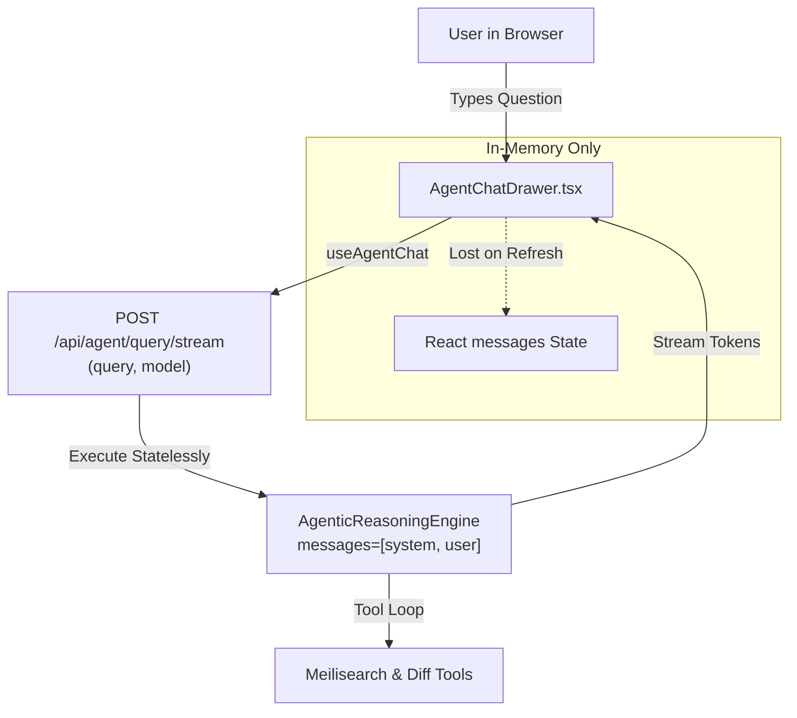
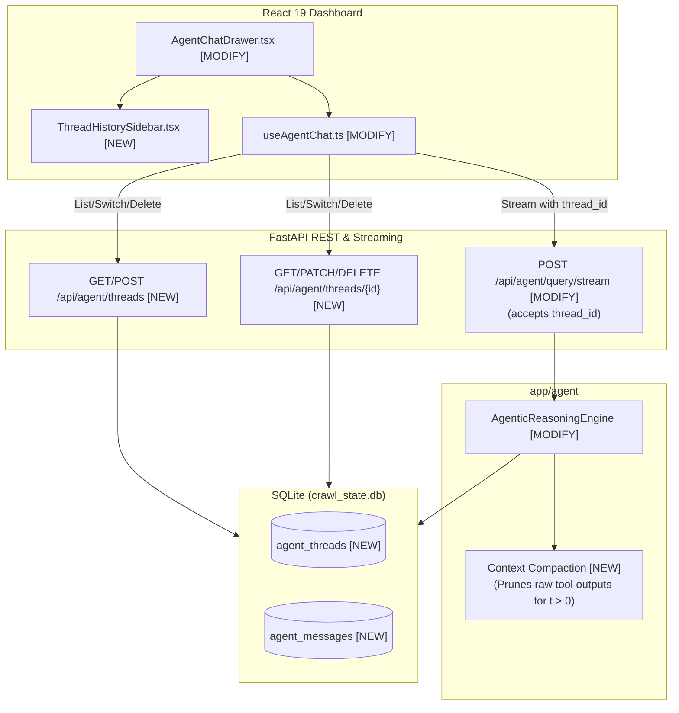
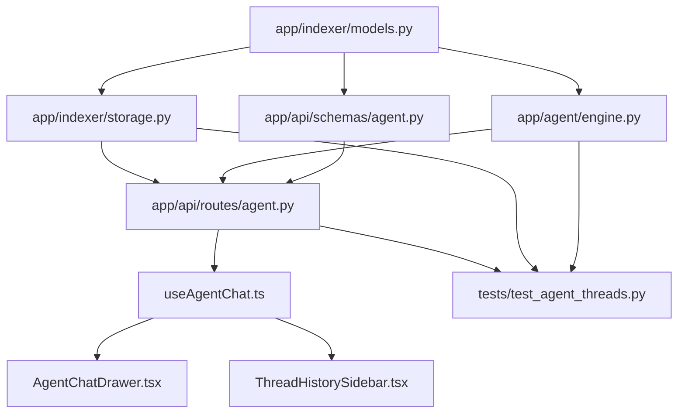

# Stage 2: Codebase Design — Task 9.8: Multi-Turn Chat Sessions, SQLite Thread Persistence & UI Drawer History (RFC-0002)

**Task ID:** `9.8`  
**Task Title:** Multi-Turn Chat Sessions, SQLite Thread Persistence & UI Drawer History  
**Epic:** Epic 9 — Agentic RAG Intelligence & OpenRouter Provider Seam  
**Branch:** `feat/task-9.8-multi-turn-threads-history`  
**Status:** DESIGN COMPLETE  
**Date:** 2026-09-02  

---

## 1. Current State Snapshot

Currently, the Agentic RAG assistant operates in a stateless, single-turn mode:
- **`app/agent/engine.py`**:
  - `run(query, user_instructions)` and `run_stream(query, user_instructions)` initialize `messages = [LLMMessage(role="system", content=...), LLMMessage(role="user", content=clean_query)]`.
  - Prior conversation history is not accepted as a parameter.
  - When tool execution completes, the final answer is streamed, but neither the conversation nor the traces are persisted to SQLite.
- **`app/indexer/storage.py`**:
  - Contains tables for `sync_state`, `file_records`, `document_versions`, `document_diffs`, and `document_chunks`.
  - No tables exist for conversation threads or chat messages.
- **`app/api/routes/agent.py`**:
  - `POST /api/agent/query` and `POST /api/agent/query/stream` receive `AgentQueryRequest(query, model, user_instructions)` and execute statelessly.
- **`frontend/src/components/agent/AgentChatDrawer.tsx` & `useAgentChat.ts`**:
  - The frontend keeps an in-memory `ChatMessage[]` array in React state.
  - Refreshing the browser or clearing the drawer permanently discards all chat turns.
  - Users cannot switch between multiple distinct inquiry threads or review historical answers.

### Current Architecture Diagram

---

## 2. Proposed State

The proposed architecture introduces persistent multi-turn thread management across the entire stack:
1. **SQLite Storage Layer (`app/indexer/storage.py`, `app/indexer/models.py`)**:
   - `agent_threads`: Thread ID, title, model, timestamps.
   - `agent_messages`: Message ID, foreign key to thread, role (`user` | `assistant`), text content, JSON-serialized reasoning trace, JSON-serialized citations, latency, timestamp.
2. **Agentic Reasoning Engine Context Compactor (`app/agent/engine.py`)**:
   - Accepts prior conversation messages (`history: list[AgentMessage] | None`).
   - Implements the RFC-0002 pruning invariant: for all turns $t > 0$, raw multi-kilobyte tool JSON outputs are omitted; the LLM context receives clean `user` $\rightarrow$ `assistant` dialog. Tools remain active only for the immediate query ($t = 0$).
3. **REST & Streaming API Routes (`app/api/routes/agent.py`, `app/api/schemas/agent.py`)**:
   - `GET /api/agent/threads`: List all threads.
   - `POST /api/agent/threads`: Create a thread.
   - `GET /api/agent/threads/{thread_id}`: Get thread with chronological messages.
   - `PATCH /api/agent/threads/{thread_id}`: Rename thread title.
   - `DELETE /api/agent/threads/{thread_id}`: Delete thread and all its messages.
   - `POST /api/agent/query/stream`: Accepts optional `thread_id`; automatically appends the user prompt, executes within thread context, streams SSE frames, and commits assistant message + citations on completion.
4. **React UI Drawer History (`AgentChatDrawer.tsx`, `useAgentChat.ts`, `ThreadHistorySidebar.tsx`)**:
   - Collapsible thread history sidebar.
   - "+ New Chat" button, thread switching, thread renaming, thread deletion.
   - 100% tokenized styling and 6 interactive states.

### Target Architecture Diagram

---

## 3. File-Level Impact Analysis

### 1. `app/indexer/models.py`
- **What changes:** Add Pydantic domain models `AgentThread` and `AgentMessage`.
- **Why:** Provide clean, immutable, validated representations for thread metadata and message turns.
- **Approximate lines:** Lines 461–515.
- **Upstream dependencies:** `pydantic`, `datetime`, `uuid`.
- **Downstream dependents:** `app/indexer/storage.py`, `app/api/schemas/agent.py`, `app/agent/engine.py`.

### 2. `app/indexer/storage.py`
- **What changes:**
  - In `init_db()`, execute DDL for `agent_threads` and `agent_messages` tables and indices.
  - Implement repository methods: `create_thread()`, `get_thread()`, `list_threads()`, `update_thread_title()`, `delete_thread()`, `save_message()`, `get_thread_messages()`, `delete_thread_messages()`.
- **Why:** Provide ACID relational persistence for multi-turn sessions across server restarts.
- **Approximate lines:** Lines 140–160 (DDL), Lines 850–980 (CRUD methods).
- **Upstream dependencies:** `sqlite3`, `app/indexer/models.py`.
- **Downstream dependents:** `app/api/routes/agent.py`, `app/agent/engine.py`.

### 3. `app/agent/engine.py`
- **What changes:**
  - Update `run()` and `run_stream()` to accept `history: list[AgentMessage] | None = None`.
  - Implement two-tier context compaction:
    - Prepend historical turns to `messages: list[LLMMessage]` as clean `user` and `assistant` entries.
    - Prune raw multi-kilobyte tool JSON outputs from prior turns ($t > 0$).
    - Feed full active tool declarations only for the active turn ($t = 0$).
- **Why:** RFC-0002 pruning invariant to prevent context rot and rate-limit exhaustion during multi-turn chats.
- **Approximate lines:** Lines 90–260.
- **Upstream dependencies:** `app/core/llm.py`, `app/indexer/models.py`.
- **Downstream dependents:** `app/api/routes/agent.py`.

### 4. `app/api/schemas/agent.py`
- **What changes:**
  - Add `thread_id: str | None = None` to `AgentQueryRequest`.
  - Add schemas: `AgentThreadItem`, `AgentThreadDetail`, `CreateThreadRequest`, `UpdateThreadRequest`.
- **Why:** Establish wire contracts for thread REST operations.
- **Approximate lines:** Lines 20–80.
- **Upstream dependencies:** `pydantic`.
- **Downstream dependents:** `app/api/routes/agent.py`.

### 5. `app/api/routes/agent.py`
- **What changes:**
  - Add route handlers: `list_threads`, `create_thread`, `get_thread`, `update_thread`, `delete_thread`.
  - In `stream_agent_query`: if `payload.thread_id` is supplied, load prior messages from storage, pass them into `engine.run_stream()`, persist the user message, and persist the assistant message upon stream completion (`done` event).
- **Why:** Provide end-to-end multi-turn chat persistence over REST and SSE.
- **Approximate lines:** Lines 25–180.
- **Upstream dependencies:** `FastAPI`, `CrawlStorageDep`, schemas, engine.
- **Downstream dependents:** Frontend API client.

### 6. `frontend/src/types/agent.ts`
- **What changes:**
  - Add `AgentThread` interface (`id`, `title`, `model`, `created_at`, `updated_at`, `message_count`).
  - Add `thread_id` optional field to message submission parameters.
- **Why:** Type safety across React components and hooks.

### 7. `frontend/src/hooks/useAgentChat.ts`
- **What changes:**
  - Maintain `threads: AgentThread[]`, `activeThreadId: string | null`, `isHistoryOpen: boolean`.
  - Implement `loadThreads()`, `selectThread(threadId)`, `createNewThread()`, `deleteThread(threadId)`, `renameThread(threadId, title)`.
  - Include `thread_id` in `fetch(getApiUrl('/api/agent/query/stream'))` payload.
  - When selecting a thread, populate `messages` from `GET /api/agent/threads/{id}`.
- **Why:** Orchestrate multi-turn state, thread switching, and message hydration.

### 8. `frontend/src/components/agent/AgentChatDrawer.tsx` & `ThreadHistorySidebar.tsx`
- **What changes:**
  - Add toggle button in drawer header to show/hide the conversation history sidebar.
  - Implement `ThreadHistorySidebar.tsx` with list of threads, active selection indicator, "+ New Chat" button, delete thread button with confirmation, and inline rename.
  - 100% tokenized styling using `tokens.json`.

### 9. `tests/test_agent_threads.py` [NEW]
- **What changes:** Comprehensive tests for:
  - SQLite storage thread CRUD and message cascade deletion.
  - Engine multi-turn context compaction (pruning check).
  - API thread lifecycle endpoints (`GET`, `POST`, `PATCH`, `DELETE`).
  - Thread-scoped streaming query persistence.

---

## 4. Dependency Graph & Blast Radius

---

## 5. Risk & Regression Matrix

| Risk Factor | Level | Potential Impact | Mitigation Strategy |
|---|---|---|---|
| **SQLite Lock Contention** | 🟢 Low | Concurrent writes during background crawl | SQLite WAL mode (`PRAGMA journal_mode=WAL`) already configured with 5000ms timeout; writes are sub-1ms. |
| **Context Window Bloat** | 🟢 Low | Multi-turn queries exceeding model token limit | Strict RFC-0002 pruning invariant: raw tool JSON is never passed for prior turns $t > 0$; only concise answers and citations are retained. |
| **Stateless Client Breakage** | 🟢 Low | Legacy or stateless queries failing | `thread_id` is optional; omitting it executes the exact stateless single-turn code path without changes. |
| **Frontend Style Drift** | 🟢 Low | Inconsistent styling in sidebar | Strictly use CSS variables from `tokens.json` (`--color-bg-surface`, `--color-brand-primary`, etc.); zero hardcoded hex or px. |

---

## 6. Rollback Plan

- **Uncommitted Changes:** `git reset --hard HEAD` and `git clean -fd`.
- **Committed Changes:** `git revert <commit-hash>`.
- **Database Reversibility:** SQLite tables `agent_threads` and `agent_messages` are purely additive. Dropping them (`DROP TABLE IF EXISTS agent_messages; DROP TABLE IF EXISTS agent_threads;`) leaves existing sync and search tables 100% intact.

---

## 7. Test Strategy

1. **Unit Tests:**
   - Thread CRUD in `CrawlStorage` (creation, duplicate prevention, retrieval, sorting, update title, deletion cascade).
   - Context compaction in `AgenticReasoningEngine` (verifying prior turns are included without raw tool outputs).
2. **Integration Tests:**
   - REST endpoints (`/api/agent/threads` lifecycle).
   - Multi-turn streaming with `thread_id`: send turn 1, verify thread and message saved; send turn 2 with same `thread_id`, verify context continuity.
3. **Frontend TypeScript Build:**
   - `cd frontend && npm run build` to verify 0 compiler errors.
   - Audit for 0 stray hex codes or un-tokenized px.
