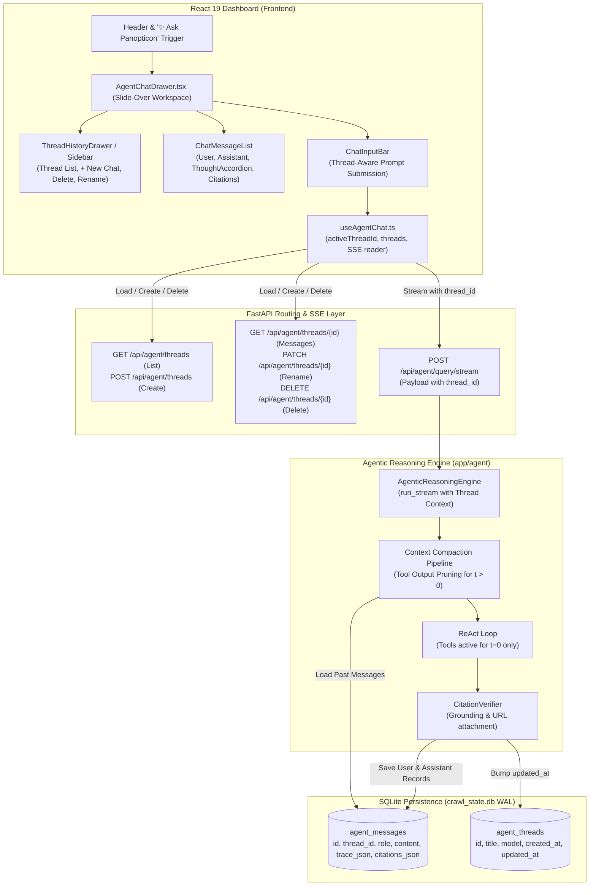
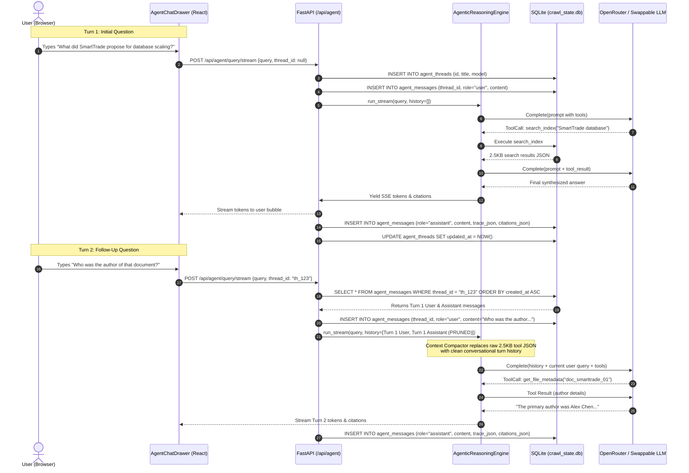

# Stage 1: Conceptual Understanding — Task 9.8: Multi-Turn Chat Sessions, SQLite Thread Persistence & UI Drawer History (RFC-0002)

**Task ID:** `9.8`  
**Task Title:** Multi-Turn Chat Sessions, SQLite Thread Persistence & UI Drawer History  
**Epic:** Epic 9 — Agentic RAG Intelligence & OpenRouter Provider Seam  
**Branch:** `feat/task-9.8-multi-turn-threads-history`  
**Artifact Version:** 1.0.0  
**Status:** DRAFT  

---

## 1. Visual Architecture & Component Topology

---

## 2. The Physical Analogy: The Flight Investigation Case Binder

Imagine a senior flight accident investigator working in an incident room:

- **The Stateless Single-Turn Mode (The Amnesic Consultant):** Every time you ask the consultant a question, they step out of the room, have their memory wiped with an amnesiac pill, and step back in. If you first ask, *"Inspect the flight data recorder of Flight 402,"* they run to the vault, read the black box, and tell you it experienced hydraulic failure. If you follow up with, *"Who was the pilot in command during that failure?"*, they stare blankly: *"What failure? What flight? Who are you?"* You have to explain the entire investigation from scratch every single time.
- **The Panopticon Multi-Turn Session (The Case Binder with Executive Summaries):**
  1. **The Long-Term Case Binder (`agent_threads` in SQLite):** Every investigation gets a labeled, physical binder stored in the secure filing cabinet. Even if the building loses power or the investigator goes home for the night, the binder remains intact.
  2. **The Active Turn Desk Space (`t=0` Working Memory):** When investigating the immediate question, the investigator spreads out the detailed radar plots, engine telemetry printouts, and technical maintenance logs on their desk.
  3. **The Executive Pruning Rule (`t > 0` Compaction):** Once a question is answered and logged, the investigator does **not** leave thousands of pages of raw radar printouts piled on their desk. They file away the raw telemetry in the binder's historical pouch, keeping only the **1-paragraph signed findings and cited document numbers** in their working view. The desk never overflows, attention never wanders, and follow-up questions build seamlessly on past conclusions.

---

## 3. Why & What

### Why Are We Doing This Task?
1. **Conversational Continuity (RFC-0002):** Real enterprise document exploration is naturally multi-step. Users ask:
   - Turn 1: *"Which documents define the Falcon auth architecture?"*
   - Turn 2: *"What OAuth scopes are required according to those docs?"*
   - Turn 3: *"Did anyone change those scopes recently?"*
   Without multi-turn thread context, the user is forced to copy-paste prior answers and re-specify file names repeatedly.
2. **Context Window Protection & Latency Control:** In Panopticon, tools return rich data: Meilisearch snippets, unified git diff patches, and chunk vectors. Retaining raw tool outputs across 5 turns can easily reach 15,000–25,000 tokens. By deterministically pruning raw tool outputs for past turns while preserving natural language answers and citations, we keep prompt sizes bounded at ~1,000–2,500 tokens regardless of conversation length.
3. **Session Durability across Refreshes:** Currently, closing the drawer or refreshing the React SPA loses all chat bubbles. Persisting threads and messages in SQLite enables persistent history drawers, thread renaming, and historical review.

### What Is Being Built?
- **Backend Schema:** `agent_threads` and `agent_messages` in SQLite (`app/indexer/storage.py`) with foreign keys, indexes, and ACID CRUD repository methods.
- **Context Compaction Engine:** `app/agent/engine.py` enhancements to load prior messages for a given `thread_id`, prune raw tool payloads for $t > 0$, inject clean conversational history into the LLM prompt, and automatically save user/assistant turns.
- **REST & SSE Endpoints:** `app/api/routes/agent.py` endpoints for listing, creating, retrieving, renaming, and deleting threads, plus thread-scoped streaming on `POST /api/agent/query/stream`.
- **Frontend UI Drawer History:** `AgentChatDrawer.tsx` sidebar toggle, thread selector list, "+ New Chat" button, delete thread modal/action, inline title renaming, and `useAgentChat.ts` hook thread orchestration.

---

## 4. Abstraction Level Map

| Level | What Lives Here | Current Project Example | Touched by Task 9.8? |
|---|---|---|---|
| **Product / UX** | Thread history sidebar, "+ New Chat", thread switching, inline renaming | `AgentChatDrawer.tsx`, `ChatMessageItem.tsx` | **YES** |
| **Application State** | `useAgentChat.ts` hook state, active thread tracking, message hydration | `frontend/src/hooks/useAgentChat.ts` | **YES** |
| **API / Transport** | Thread CRUD endpoints, SSE streaming with `thread_id` parameter | `app/api/routes/agent.py`, `schemas/agent.py` | **YES** |
| **Domain Logic** | Context compaction invariant, tool output pruning, conversation assembly | `app/agent/engine.py` | **YES** |
| **Data / Storage** | Relational `agent_threads` and `agent_messages` schema, WAL transactions | `app/indexer/storage.py`, `app/indexer/models.py` | **YES** |
| **Infrastructure / Runtime** | SQLite database file, FastAPI ASGI server, React 19 SPA | `crawl_state.db`, Python 3.12, Vite | Preserved |

---

## 5. Sequence Diagram: Multi-Turn Turn Execution with Context Compaction

---

## 6. Detailed Data Flow Trace-Through

1. **Thread Creation / Retrieval:**
   - When the user opens the Agent Chat Drawer, `useAgentChat.ts` checks if any threads exist via `GET /api/agent/threads`.
   - If threads exist, it can restore the most recent thread or start a fresh session.
   - When the user submits their first question in a fresh session, the backend generates a thread (e.g. `th_9a8b7c`), derives an initial title from the query (first 40 characters or semantic summary), and saves it to `agent_threads`.
2. **User Message Persistence:**
   - The user's query is stored in `agent_messages` with `role='user'` before LLM reasoning initiates.
3. **Context Assembly & Compaction:**
   - The engine loads historical messages for `thread_id` from SQLite.
   - For all prior turns ($t > 0$):
     - User messages are passed as `LLMMessage(role="user", content=msg.content)`.
     - Assistant messages are passed as `LLMMessage(role="assistant", content=msg.content)`.
     - Raw multi-kilobyte tool calls and intermediate tool outputs are **omitted or compacted**: the assistant's synthesized text already contains the grounded facts and citations.
   - The current turn ($t = 0$) begins: `LLMMessage(role="user", content=active_query)` is appended, and tools are provided.
4. **Tool Execution & Streaming ($t = 0$):**
   - The model reasons and executes tools (`search_index`, `get_document_diff`, etc.).
   - Tool execution badges and previews stream in real time over SSE (`tool_call`, `tool_result`).
   - Tokens stream into the UI (`token`).
5. **Assistant Persistence & Thread Update:**
   - The final verified answer, complete `trace_json` (for UI accordion inspection), and `citations_json` are stored in `agent_messages`.
   - `agent_threads.updated_at` is updated to the current timestamp.
   - A `done` SSE frame closes the stream.
6. **Thread History UI Updates:**
   - The UI thread list automatically shows the updated thread with its title and "Just now" timestamp.
   - Clicking a prior thread loads its messages from SQLite via `GET /api/agent/threads/{id}` without re-running any LLM generation.
