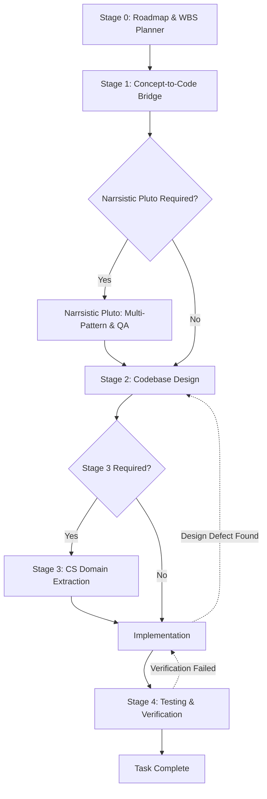

# Rule 02: WBS-First Execution and Stage Lifecycle

This rule strictly enforces the development lifecycle for Panopticon. Agents are prohibited from spontaneously writing code without following the Work Breakdown Structure (WBS) and completing the required lifecycle stages.

## WBS-First Execution

The WBS (`.agents/state/roadmap_wbs.md` and root `roadmap_wbs.md`) is the absolute source of truth for **what gets built**.

**Agents MUST:**
1. Work only from an active WBS leaf task.
2. Identify the specific WBS Task ID before beginning any design or implementation.
3. Validate dependencies and blockers before starting.
4. Ensure the scope matches exactly what is described in the WBS.

### Scope Expansion Protocol
If a user request or discovered bug is larger than the current leaf task:
1. **STOP** current execution.
2. Identify the scope expansion and document the findings.
3. Update/revise the WBS to reflect the new realities.
4. Select the appropriate updated leaf task.
5. Resume the lifecycle for that task.

## Mandatory Stage Lifecycle

Development must strictly follow this stage-gated process:

### Stage Gates & Artifact Requirements

- **Stage 0 (WBS):**
  - Required Artifact: `roadmap_wbs.md` update.
  - Required content: Objective, scope, dependencies, acceptance criteria. No implementation.
- **Stage 1 (Conceptual Understanding):**
  - Required Artifact: `task_X_Y_understanding.md`.
  - Goal: Align mental model, architecture, and data flow.
- **Narrsistic Pluto (Architecture / QA / Incident RCA):**
  - Triggered when: Multi-pattern evaluation is needed, complex bugs arise, or the user explicitly asks for "Principal Architect" review.
  - Required Artifact: `task_X_Y_architect_analysis.md`.
  - Goal: 3-5 researched solutions, blast radius mapping, rollback matrices.
- **Stage 2 (Codebase Design):**
  - Required Artifact: `task_X_Y_design.md`.
  - Goal: File-level impact analysis (`[NEW]`, `[MODIFY]`), exact dependency changes. **No code changes yet.**
- **Stage 3 (CS Domain Extraction):**
  - Triggered for: Search ranking/relevance tuning, Google Drive API pagination and auth flows, incremental sync algorithms, Meilisearch schema/config optimization, or when requested.
  - Required Artifact: `task_X_Y_cs_concepts.md`.
  - Goal: First-principles breakdown before writing code.
- **Implementation:**
  - Execute only according to approved Stage 2/3 designs.
- **Stage 4 (Testing & Verification):**
  - Required Artifact: `task_X_Y_testing.md`.
  - Goal: Test commands, regression verification, code-quality audit.

### Re-Entering Stages (Defect Protocol)
If implementation reveals a design defect or unexpected complexity:
**DO NOT SILENTLY REDESIGN WHILE CODING.**
1. **STOP** coding immediately.
2. Document the defect in the issue register.
3. Re-enter Stage 2 (or Narrsistic Pluto if architectural).
4. Revise the design artifact and gain approval.
5. Resume implementation based on the newly approved design.
