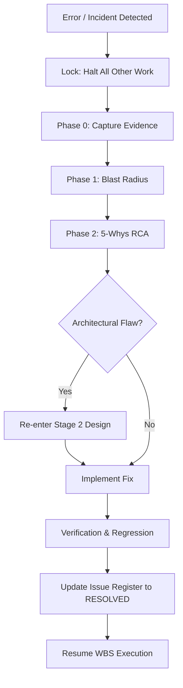

# Rule 05: Terminal Error Lock & Incident Protocol

This rule defines how the agent must respond to any failure, exception, or error encountered during the development lifecycle. Errors are treated as first-class engineering work, not temporary annoyances.

## The Terminal Command Error Lock

**ANY error in the terminal** (including build failures, test failures, lint errors, script errors, runtime exceptions, import errors, type errors) triggers the Error Lock:

1. **Immediate Halt:** The agent IMMEDIATELY HALTS all other work.
2. **Strict Prohibition:** The agent is STRICTLY FORBIDDEN from proceeding to next steps, building new features, or switching to different WBS tasks until the error is fully resolved or formally blocked.
3. **No Blind Patching:** The agent must not apply the "smallest visible patch" just to make an error go away.

## Mandatory Narrsistic Pluto RCA Protocol

For non-trivial errors, the agent MUST load the Narrsistic Pluto skill and execute the Root Cause Analysis (RCA) protocol:

- **Phase 0 (Capture):** Capture complete error evidence, full terminal outputs, and file contexts.
- **Phase 1 (Blast Radius Mapping):** Map out what other modules, components, or tests could be affected by the error and potential fixes.
- **Phase 2 (Fault Activation Chain):** Perform a 5-Whys or Fishbone root cause identification. Find the *mechanism*, not just the *symptom*.
- **Phase 3 (Web-Researched Approaches):** (If architectural/systemic) Provide 3-5 researched fix patterns with honest trade-offs.
- **Phase 4 (Targeted Fix & Verification):** Implement the chosen fix, verify directly, and execute regression checks across the mapped blast radius.

## Issue Register Protocol

Every error must be logged in the central issue register at `.agents/state/issues.md`.

### Issue Lifecycle
`OPEN` → `INVESTIGATING` → `FIXED_PENDING_VERIFICATION` → `RESOLVED`

- **Never** mark an issue `RESOLVED` without executing explicit verification commands (e.g., tests, linters).
- A disappearing error (e.g., restarting a server and it "just works") is **NOT** automatically resolved. It is a latent bug.

### Issue Template
Use this exact template when adding to `issues.md`:

```markdown
## ISSUE-XXXX — Short title

Status: OPEN | INVESTIGATING | BLOCKED | FIXED_PENDING_VERIFICATION | RESOLVED | WONT_FIX
Severity: LOW | MEDIUM | HIGH | CRITICAL
Detected: YYYY-MM-DD
Detected During: WBS task / stage
Architectural Domain: (one of the PRD §28 domains, or "workspace")
Component: component/path
Symptom:
Reproduction:
Evidence:
Root Cause:
Contributing Factors:
Affected Scope:
Regression Risk: LOW | MEDIUM | HIGH
Related WBS:
Related Artifacts:
Fix:
Verification:
Regression Verification:
Resolution:
Remaining Risk:
Resolved On: YYYY-MM-DD
```

## Re-Entry Protocol

If an error reveals a fundamental design defect, the agent must:
1. Log the issue.
2. Re-enter **Stage 2 (Codebase Design)** to refactor the architecture.
3. Obtain user approval for the new design.
4. Resume implementation and testing.


