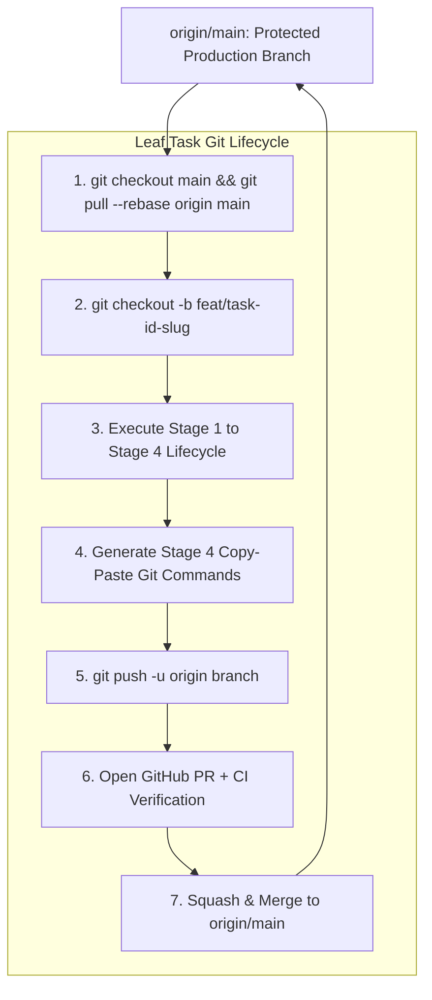

# Rule 06: Git and GitHub Protocol

This rule governs all version control and GitHub operations for Panopticon. It ensures clean branching, task traceability, and zero-defect git hygiene for the project.

---

## 1. Non-Negotiable Git Rules

Every AI agent and human engineer working on this repository MUST strictly adhere to the following six non-negotiable Git rules:



### Rule 1: Never Commit Directly to `main`
- The `main` branch is strictly protected and represents deployable, verified production state.
- All code changes MUST originate from a dedicated task branch and merge to `main` via PR.

### Rule 2: Branch per WBS Leaf Task
- Every Git branch must map 1:1 to an active leaf task in `roadmap_wbs.md`.
- Format: `feat/task-X.Y-<slug>` (e.g., `feat/task-1.2-drive-auth-provider`).

### Rule 3: Always Rebase Before Starting Work
- Before branching off `main`, ensure local `main` is up-to-date:
  ```bash
  git checkout main
  git pull --rebase origin main
  ```

### Rule 4: Clean Working Tree and Zero Committed Garbage
- Never commit virtual environments (`.venv/`), `node_modules/`, Python bytecode (`__pycache__/`), `.env` secrets, token cache files (`token.json`), or credentials (`credentials.json`, `service_account.json`).
- Avoid blind `git add .`. Always stage specific, targeted paths.

### Rule 5: Task-Based Conventional Commits
- Commit using format: `<type>(<scope>): [Task-X.Y] <summary>`
- Allowed scopes: `(auth)`, `(crawler)`, `(indexer)`, `(search)`, `(api)`, `(dashboard)`, `(config)`, `(adr)`, `(wbs)`, `(deps)`.

### Rule 6: Mandatory Stage 4 Git Command Output
- At the conclusion of Stage 4 (Testing & Verification), the agent MUST output an exact, copy-pasteable command block for staging, committing, and pushing.
