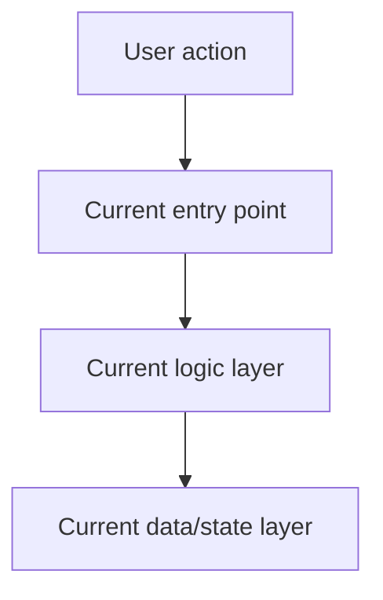
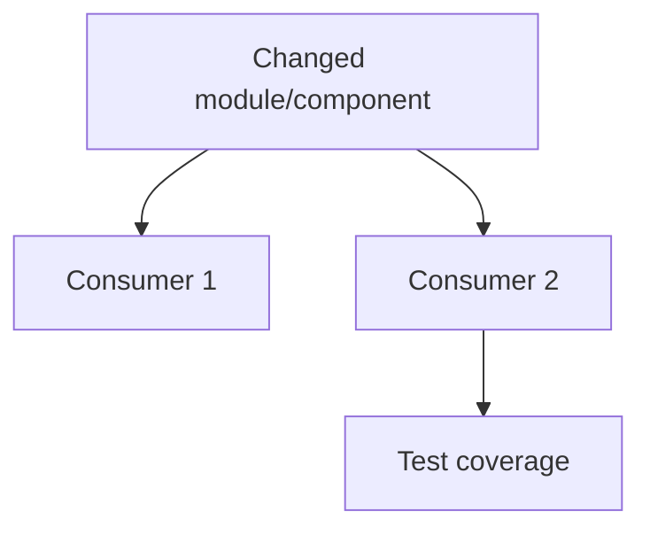

# Codebase Design Skill

This is **Stage 2** of the generic task lifecycle. It maps the Stage 1 concept onto the actual codebase, identifying every file that may change, every feature that could break, and the architectural shape of the solution.

This skill is **stack-adaptive**. Use the repository's real language, framework, package manager, build tools, routes, components, tests, and deployment style.

---

## Core Principles (Non-Negotiable)

1. **Search aggressively.** Use available search tools to find imports, exports, call sites, routes, components, tests, configs, schemas, and documentation related to the change. Do not rely on memory.
2. **Show the blast radius visually.** Include a Mermaid dependency graph showing what depends on the files/modules/components being changed.
3. **Score every risk.** Every regression risk must be tagged as 🔴 High, 🟡 Medium, or 🟢 Low.
4. **Plan for failure.** Include rollback instructions for uncommitted and committed changes.
5. **No code writing.** This stage designs the change only.

---

## Required Document Structure

Save as `task_X_Y_design.md` in the artifact directory.

### Section 1: Current State Snapshot

Document the current architecture before proposing changes:

- Which files are involved?
- Which routes/components/functions/classes/services/configs are involved?
- How do they connect today?
- What assumptions are verified by reading the code?

Include a **Before** Mermaid diagram:



Use real project names instead of placeholders in the final artifact.

### Section 2: Proposed State

Explain the desired architecture after the change:

- What gets added?
- What gets modified?
- What gets removed, if anything?
- What stays intentionally unchanged?

Include an **After** Mermaid diagram. Mermaid theming is editor-controlled, so prefer labels like `[NEW]`, `[MODIFY]`, `[DELETE]` over hardcoded colors if color styling is not necessary.

### Section 3: File-Level Impact Analysis

For every affected file, create an entry:

```markdown
#### [MODIFY] `path/to/file.ext`
- **What changes:** Specific modification.
- **Why:** Motivation.
- **Approximate lines/symbols:** Line range, function, component, class, or config key.
- **Upstream dependencies:** What this file imports/uses.
- **Downstream dependents:** What imports/uses this file.

#### [NEW] `path/to/file.ext`
- **Purpose:** What this file will own.
- **Exports/Public API:** Functions, classes, components, types, endpoints, or config.
- **Consumers:** Who will import/use it.

#### [DELETE] `path/to/file.ext`
- **Reason:** Why removal is safe.
- **Replaced by:** New owner/location.
- **Migration impact:** What must update.
```

### Section 4: Dependency Graph / Blast Radius

Use search results to identify:

- Imports/exports.
- Function or component call sites.
- Route usage.
- Schema/model usage.
- Tests that should be updated.
- Documentation/config references.

Render the blast radius as Mermaid:



### Section 5: Regression Risk Matrix

```markdown
| Risk ID | Risk Description | Severity | Affected Area | Mitigation Strategy |
|---------|------------------|----------|---------------|---------------------|
| R-01 | Public response shape could change | 🔴 High | API clients | Contract test before/after |
| R-02 | Loading state may flicker | 🟡 Medium | UI | Add skeleton/consistent query state |
| R-03 | Unused import after refactor | 🟢 Low | Build/lint | Run lint/typecheck |
```

Severity definitions:

- 🔴 **High:** Could cause data loss, auth/security failure, production crash, broken public API, inaccessible critical UI, or migration failure.
- 🟡 **Medium:** Could cause failed tests, degraded UX, incorrect non-critical behavior, or performance regression.
- 🟢 **Low:** Cosmetic issue, warning, formatting, naming, dead code, or minor maintainability concern.

### Section 6: Contract Stability Check

Adapt this section to the task:

- **Backend/API:** Endpoint path, method, request body, response shape, auth/roles, status codes.
- **Frontend/UI:** Route path, component props, URL params, query keys, form fields, accessibility behavior.
- **Library/module:** Public exports, function signatures, types/interfaces, events/callbacks.
- **Database:** Tables, columns, constraints, migrations, seed data.

```markdown
| Contract | Current Shape | Proposed Shape | Changed? | Breaking? |
|----------|---------------|----------------|----------|-----------|
| ... | ... | ... | No | No |
```

Flag breaking changes clearly and provide a migration path.

### Section 7: Performance, Security, and Accessibility Impact

Include relevant rows only, based on the stack and task:

```markdown
| Area | Before | After | Impact | Mitigation/Check |
|------|--------|-------|--------|------------------|
| Performance | ... | ... | ... | ... |
| Security | ... | ... | ... | ... |
| Accessibility | ... | ... | ... | ... |
| Developer Experience | ... | ... | ... | ... |
```

Examples:

- Frontend: bundle size, re-renders, query caching, form latency, keyboard navigation, ARIA labels.
- Backend: query count, connection usage, validation, authorization, error handling.
- Database: indexes, migrations, locking, data integrity.

### Section 8: Stack-Specific Quality Metrics

Adapt the checklist to the project.

Possible areas:

- **Type safety:** TypeScript, Pydantic, dataclasses, Rust types, Go structs, etc.
- **Error handling:** Exceptions, `Result`, promises, HTTP errors, validation errors.
- **State management:** React state/query cache/store, backend transactions, shared state.
- **Coupling:** Does the change increase or reduce module coupling?
- **Security:** Auth checks, role checks, secrets, injection, XSS/CSRF, dependency risk.
- **Accessibility:** Semantic HTML, focus order, labels, keyboard support.
- **Testing:** Existing tests affected and new tests required.
- **Dead code:** Any unused functions, imports, components, routes, or configs.

### Section 9: Rollback Plan

Provide safe rollback steps:

```markdown
## Rollback Strategy

### If changes are uncommitted
1. Inspect changes: `git diff --stat`
2. Revert selected files: `git checkout -- path/to/file`
3. Or revert all uncommitted changes: `git checkout -- .`

### If changes are committed
1. Revert the commit: `git revert <commit-hash>`
2. Re-run the project-specific build/test command.
3. Verify the old behavior still works.

Estimated rollback time: ~N minutes.
```

Adapt commands to the repository and avoid destructive commands unless the user explicitly wants them.

---

## Workflow Checklist

Before marking the Design Artifact as complete, verify:

- [ ] Current-state snapshot written.
- [ ] Before architecture diagram included.
- [ ] Proposed-state description written.
- [ ] After architecture diagram included.
- [ ] Every affected file listed.
- [ ] Search tools used to discover imports/call sites/tests/configs.
- [ ] Blast-radius graph included.
- [ ] Regression risks scored as 🔴 / 🟡 / 🟢.
- [ ] Contract stability checked.
- [ ] Performance/security/accessibility impacts considered where relevant.
- [ ] Stack-specific quality metrics documented.
- [ ] Rollback plan provided.
- [ ] No code written.
